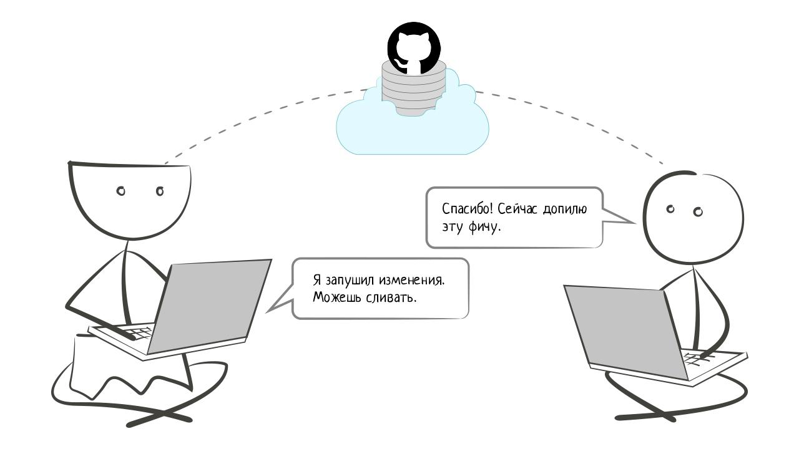

# Введение

Независимо от выбранного языка или направления разработки, написанный код всегда остается обычным текстом, записанным во множестве файлов. Эти файлы регулярно добавляются, удаляются и изменяются. И в процессе работы над ними возникает множество вопросов:
- Как не потерять файлы с исходным кодом?
- Как вспомнить, что и где менялось недавно?
- Как защититься от случайных исправлений и удалений?
- Как отменить изменения, если они оказались некорректными?
- Как работать над кодом одновременно двум и более программистам?

Представьте, что ваш проект состоит из сотни файлов и десятков тысяч строк кода. Вы делаете какую-то задачу, в процессе меняете 15 файлов и 300 строк кода — и вдруг выясняется, что эта задача больше неактуальна. На этом моменте нужно вернуться к состоянию исходного кода, которое было до изменений.

Другой пример — в процессе работы над одной задачей вы понимаете, что нужно срочно внести какое-то другое исправление в текущий проект. Первую задачу в нерабочем состоянии выкладывать на сайт нельзя. Значит, что исправление нужно вносить в ту версию кода, которая была до начала работы над первой задачей.

Совместная разработка — это отдельная головная боль. Представим, что два программиста работают над задачами и вносят исправления кода в одни и те же файлы. Как им выполнить эту работу так, чтобы не повредить и не перезаписать изменения другого разработчика?

Для решения всех этих и многих других задач, программисты используют [Git](https://git-scm.com) — систему контроля версий. Это программа, позволяющая контролировать изменения файлов проекта для одиночной и совместной разработки кода.

В этом уроке мы начнем свое знакомство с Git.

## Что такое Git

В современном мире Git стал универсальным инструментом, с которого начинается практически любой проект в разработке. Кстати, этот курс тоже делался с помощью Git.

К базовым возможностям Git относятся:

- Возврат к любой прошлой версии кода
- Просмотр истории изменений
- Восстановление любых данных
- Совместная работа без риска потерять данные или перезаписать чужую работу

Git интегрирован во все редакторы кода. Вся существующая экосистема инструментов построена именно вокруг Git и онлайн-сервисов, которые с ним интегрированы — например, [GitHub](https://github.com) или [GitLab](https://gitlab.com).

Как правило, код проектов хранится именно на этих сайтах, обеспечивая команду и совместным доступом и копией на случай поломки компьютеров.

Git – довольно сложная система с большим количеством команд и способов работы. Даже опытные разработчики часто обращаются к документации и не знают многих ее возможностей. Помимо официальной документации, есть еще один ключевой источник для освоения Git — книга [Pro Git](https://git-scm.com/book/ru/v2).

С другой стороны, начать пользоваться Git довольно просто. Дело в том, что у Git есть ядро, которого хватает в подавляющем большинстве случаев. Оно касается не только команд для работы с ним, но и некоторых идей, которые лежат в его основе.

Именно с ними мы и будем разбираться на протяжении этого курса. Однако всегда нужно держать в голове одну деталь. Git — такая штука, понять которую можно только непрерывно практикуясь и совершая ошибки. Еще никто не научился использовать Git, прочитав документацию или просмотрев курс.

В этом курсе мы установим Git и научимся работать с его основными командами. Мы создадим свой первый репозиторий и отработаем на нем типичные задачи, возникающие в разработке: добавление, изменение или удаление файлов, анализ истории проекта. Также мы познакомимся с онлайн-сервисами для хранения кода и движением открытого кода.

Задача данного курса – дать основы и показать направления, а дальше осваивать эту тему помогут только эксперименты.

Как правило, Git активно изучается в первые месяцы после трудоустройства, и этот процесс проходит болезненно. Так происходит, потому что во время обучения сложно смоделировать проблемы, возникающие в совместной разработке.

В таком случае выигрывают те разработчики, которые во время обучения активно вовлекаются в работу над открытыми проектами. Это самый верный способ по-настоящему разобраться и научиться виртуозно владеть Git.

Перед началом курса мы рекомендуем установить и настроить Git по [инструкции](https://github.com/Hexlet/ru-instructions/blob/main/git.md).

### Дополнительные материалы
- [Зачем нужен git](https://guides.hexlet.io/ru/git-guide/?_gl=1*yh21mz*_ga*MTExOTQzMTcyNC4xNzAwNTc4NDA3*_ga_PM3R85EKHN*MTcwMDU3ODQwNy4xLjEuMTcwMDU3ODkxNy4wLjAuMA..*_ga_WWGZ6EVHEY*MTcwMDU3ODQwNy4xLjEuMTcwMDU3ODYxOC41OS4wLjA).