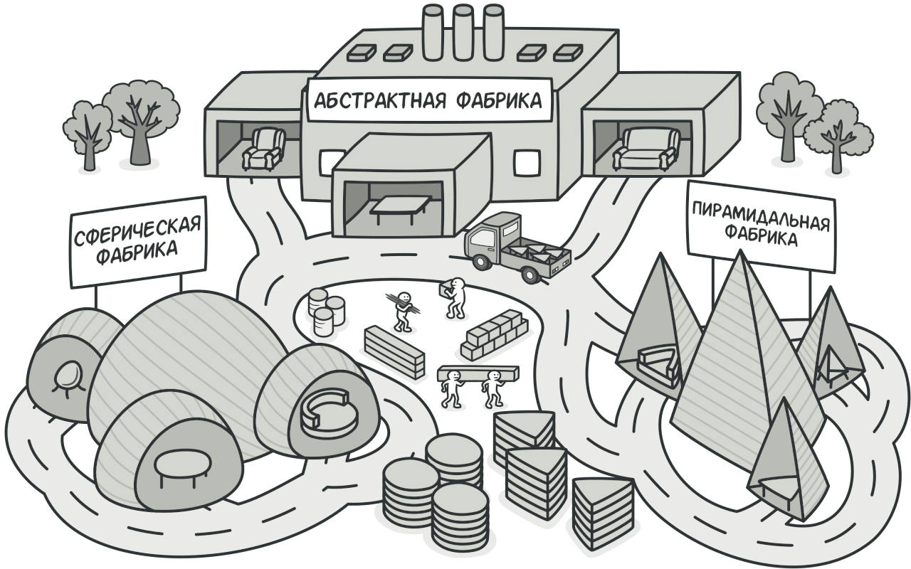
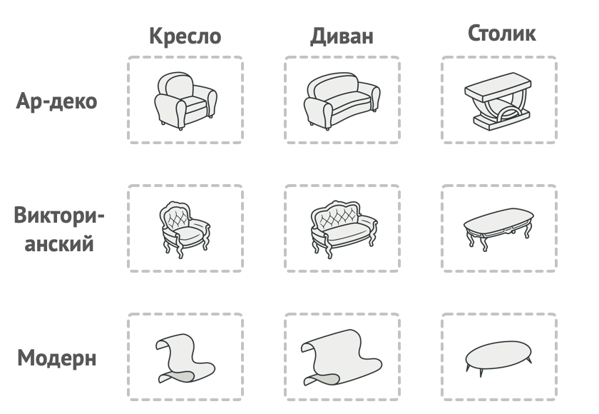

# Абстрактная фабрика

> Также известен как: Abstract Factory

## Суть паттерна

**Абстрактная фабрика** — это порождающий паттерн проектирования, который позволяет создавать семейства связанных объектов, не привязываясь к конкретным классам создаваемых объектов.



## Проблема

Представьте, что вы пишете симулятор мебельного магазина. Ваш код содержит:

Семейство зависимых продуктов. Скажем, `Кресло` + `Диван` + `Столик`.

Несколько вариаций этого семейства. Например, продукты `Кресло`, `Диван` и `Столик` представлены в трёх разных стилях: `Ар-деко`, `Викторианском` и `Модерне`.



*Семейства продуктов и их вариации*

Вам нужен такой способ создавать объекты продуктов, чтобы они сочетались с другими продуктами того же семейства. Это важно, так как клиенты расстраиваются, если получают несочетающуюся мебель.


*Клиенты расстраиваются, если получают несочетающиеся продукты.*

Кроме того, вы не хотите вносить изменения в существующий код при добавлении новых продуктов или семейcтв в программу. Поставщики часто обновляют свои каталоги, и вы бы не хотели менять уже написанный код каждый раз при получении новых моделей мебели.

## Решение

Для начала паттерн **Абстрактная фабрика** предлагает выделить общие интерфейсы для отдельных продуктов, составляющих семейства. Так, все вариации кресел получат общий интерфейс `Кресло`, все диваны реализуют интерфейс `Диван` и так далее.


*Все вариации одного и того же объекта должны жить в одной иерархии классов.*

Далее вы создаёте **абстрактную фабрику** — общий интерфейс, который содержит методы создания всех продуктов семейства (например, `создатьКресло`, `создатьДиван` и `создатьСтолик`). Эти операции должны возвращать **абстрактные** типы продуктов, представленные интерфейсами, которые мы выделили ранее — `Кресла`, `Диваны` и `Столики`.


*Конкретные фабрики соответствуют определённой вариации семейства продуктов.*

Как насчёт вариаций продуктов? Для каждой вариации семейства продуктов мы должны создать свою собственную фабрику, реализовав абстрактный интерфейс. Фабрики создают продукты одной вариации. Например, `ФабрикаМодерн` будет возвращать только `КреслаМодерн`, `ДиваныМодерн` и `СтоликиМодерн`.

Клиентский код должен работать как с фабриками, так и с продуктами только через их общие интерфейсы. Это позволит подавать в ваши классы любой тип фабрики и производить любые продукты, ничего не ломая.


*Для клиентского кода должно быть безразлично, с какой фабрикой работать.*

Например, клиентский код просит фабрику сделать стул. Он не знает, какого типа была эта фабрика. Он не знает, получит викторианский или модерновый стул. Для него важно, чтобы на стуле можно было сидеть и чтобы этот стул отлично смотрелся с диваном той же фабрики.

Осталось прояснить последний момент: кто создаёт объекты конкретных фабрик, если клиентский код работает только с интерфейсами фабрик? Обычно программа создаёт конкретный объект фабрики при запуске, причём тип фабрики выбирается, исходя из параметров окружения или конфигурации.

## Структура


1. **Абстрактные продукты** объявляют интерфейсы продуктов, которые связаны друг с другом по смыслу, но выполняют разные функции.
2. **Конкретные продукты** — большой набор классов, которые относятся к различным абстрактным продуктам (кресло/столик), но имеют одни и те же вариации (Викторианский/Модерн).
3. **Абстрактная фабрика** объявляет методы создания различных абстрактных продуктов (кресло/столик).
4. **Конкретные фабрики** относятся каждая к своей вариации продуктов (Викторианский/Модерн) и реализуют методы абстрактной фабрики, позволяя создавать все продукты определённой вариации.
5. Несмотря на то, что конкретные фабрики порождают конкретные продукты, сигнатуры их методов должны возвращать соответствующие абстрактные продукты. Это позволит клиентскому коду, использующему фабрику, не привязываться к конкретным классам продуктов. Клиент сможет работать с любыми вариациями продуктов через абстрактные интерфейсы.

## Псевдокод

В этом примере **Абстрактная фабрика** создаёт кросс-платформенные элементы интерфейса и следит за тем, чтобы они соответствовали выбранной операционной системе.


Пример кросс-платформенного графического интерфейса пользователя.*

Кросс-платформенная программа может показывать одни и те же элементы интерфейса, выглядящие чуточку по-другому в различных операционных системах. В такой программе важно, чтобы все создаваемые элементы всегда соответствовали текущей операционной системе. Вы бы не хотели, чтобы программа, запущенная на Windows, вдруг начала показывать чекбоксы в стиле macOS.

Абстрактная фабрика объявляет список создающих методов, которые клиентский код может использовать для получения тех или иных разновидностей элементов интерфейса. Конкретные фабрики относятся к различным операционным системам и создают элементы, совместимые с этой системой.

В самом начале программа определяет, какая из фабрик соответствует текущей операционке. Затем создаёт эту фабрику и отдаёт её клиентскому коду. В дальнейшем клиент будет работать только с этой фабрикой, чтобы исключить несовместимость возвращаемых продуктов.

Клиентский код не зависит от конкретных классов фабрик и элементов интерфейса. Он общается с ними через абстрактные интерфейсы. Благодаря этому клиент может работать с любой разновидностью фабрик и элементов интерфейса.

Чтобы добавить в программу новую вариацию элементов (например, для поддержки Linux), вам не нужно трогать клиентский код. Достаточно создать ещё одну фабрику, производящую эти элементы.

```c
// Этот паттерн предполагает, что у вас есть несколько семейств
// продуктов, находящихся в отдельных иерархиях классов
// (Button/Checkbox). Продукты одного семейства должны иметь
// общий интерфейс.
interface Button is
    method paint()

// Семейства продуктов имеют те же вариации (macOS/Windows).
class WinButton implements Button is
    method paint() is
        // Отрисовать кнопку в стиле Windows.

class MacButton implements Button is
    method paint() is
        // Отрисовать кнопку в стиле macOS.


interface Checkbox is
    method paint()

class WinCheckbox implements Checkbox is
    method paint() is
        // Отрисовать чекбокс в стиле Windows.

class MacCheckbox implements Checkbox is
    method paint() is
        // Отрисовать чекбокс в стиле macOS.


// Абстрактная фабрика знает обо всех абстрактных типах
// продуктов.
interface GUIFactory is
    method createButton():Button
    method createCheckbox():Checkbox


// Каждая конкретная фабрика знает и создаёт только продукты
// своей вариации.
class WinFactory implements GUIFactory is
    method createButton():Button is
        return new WinButton()
    method createCheckbox():Checkbox is
        return new WinCheckbox()

// Несмотря на то, что фабрики оперируют конкретными классами,
// их методы возвращают абстрактные типы продуктов. Благодаря
// этому фабрики можно взаимозаменять, не изменяя клиентский
// код.
class MacFactory implements GUIFactory is
    method createButton():Button is
        return new MacButton()
    method createCheckbox():Checkbox is
        return new MacCheckbox()


// Для кода, использующего фабрику, не важно, с какой конкретно
// фабрикой он работает. Все получатели продуктов работают с
// ними через общие интерфейсы.
class Application is
    private field factory: GUIFactory
    private field button: Button
    constructor Application(factory: GUIFactory) is
        this.factory = factory
    method createUI()
        this.button = factory.createButton()
    method paint()
        button.paint()


// Приложение выбирает тип конкретной фабрики и создаёт её
// динамически, исходя из конфигурации или окружения.
class ApplicationConfigurator is
    method main() is
        config = readApplicationConfigFile()

        if (config.OS == "Windows") then
            factory = new WinFactory()
        else if (config.OS == "Mac") then
            factory = new MacFactory()
        else
            throw new Exception("Error! Unknown operating system.")

        Application app = new Application(factory)
```

## Применимость

**Когда бизнес-логика программы должна работать с разными видами связанных друг с другом продуктов, не завися от конкретных классов продуктов.**

Абстрактная фабрика скрывает от клиентского кода подробности того, как и какие конкретно объекты будут созданы. Но при этом клиентский код может работать со всеми типами создаваемых продуктов, поскольку их общий интерфейс был заранее определён.

---

**Когда в программе уже используется [Фабричный метод](factory-method.md), но очередные изменения предполагают введение новых типов продуктов.**

В хорошей программе каждый **класс отвечает только за одну вещь**. Если класс имеет слишком много фабричных методов, они способны затуманить его основную функцию. Поэтому имеет смысл вынести всю логику создания продуктов в отдельную иерархию классов, применив абстрактную фабрику.

## Шаги реализации

1. Создайте таблицу соотношений типов продуктов к вариациям семейств продуктов.
2. Сведите все вариации продуктов к общим интерфейсам. 
3. Определите интерфейс абстрактной фабрики. Он должен иметь фабричные методы для создания каждого из типов продуктов. 
4. Создайте классы конкретных фабрик, реализовав интерфейс абстрактной фабрики. Этих классов должно быть столько же, сколько и вариаций семейств продуктов. 
5. Измените код инициализации программы так, чтобы она создавала определённую фабрику и передавала её в клиентский код. 
6. Замените в клиентском коде участки создания продуктов через конструктор вызовами соответствующих методов фабрики.

## Преимущества и недостатки

**Преимущества**

- Гарантирует сочетаемость создаваемых продуктов.
- Избавляет клиентский код от привязки к конкретным классам продуктов. 
- Выделяет код производства продуктов в одно место, упрощая поддержку кода. 
- Упрощает добавление новых продуктов в программу. 
- Реализует принцип **[открытости/закрытости](open_close_principle.md)**.

**Недостатки**

- Усложняет код программы из-за введения множества дополнительных классов. 
- Требует наличия всех типов продуктов в каждой вариации.

## Примеры

### Python

- **Сложность**: 2/3
- **Популярность**: 3/3
- **Применимость**: Паттерн можно часто встретить в Python-коде, особенно там, где требуется создание семейств продуктов (например, внутри фреймворков).
- **Признаки применения паттерна**: Паттерн можно определить по методам, возвращающим фабрику, которая, в свою очередь, используется для создания конкретных продуктов, возвращая их через абстрактные типы или интерфейсы.

Этот пример показывает структуру паттерна **Абстрактная фабрика**, а именно — из каких классов он состоит, какие роли эти классы выполняют и как они взаимодействуют друг с другом.

**main.py: Пример структуры паттерна**

```python
from __future__ import annotations
from abc import ABC, abstractmethod


class AbstractFactory(ABC):
    """
    Интерфейс Абстрактной Фабрики объявляет набор методов, которые возвращают
    различные абстрактные продукты. Эти продукты называются семейством и связаны
    темой или концепцией высокого уровня. Продукты одного семейства обычно могут
    взаимодействовать между собой. Семейство продуктов может иметь несколько
    вариаций, но продукты одной вариации несовместимы с продуктами другой.
    """
    @abstractmethod
    def create_product_a(self) -> AbstractProductA:
        pass

    @abstractmethod
    def create_product_b(self) -> AbstractProductB:
        pass


class ConcreteFactory1(AbstractFactory):
    """
    Конкретная Фабрика производит семейство продуктов одной вариации. Фабрика
    гарантирует совместимость полученных продуктов. Обратите внимание, что
    сигнатуры методов Конкретной Фабрики возвращают абстрактный продукт, в то
    время как внутри метода создается экземпляр конкретного продукта.
    """

    def create_product_a(self) -> AbstractProductA:
        return ConcreteProductA1()

    def create_product_b(self) -> AbstractProductB:
        return ConcreteProductB1()


class ConcreteFactory2(AbstractFactory):
    """
    Каждая Конкретная Фабрика имеет соответствующую вариацию продукта.
    """

    def create_product_a(self) -> AbstractProductA:
        return ConcreteProductA2()

    def create_product_b(self) -> AbstractProductB:
        return ConcreteProductB2()


class AbstractProductA(ABC):
    """
    Каждый отдельный продукт семейства продуктов должен иметь базовый интерфейс.
    Все вариации продукта должны реализовывать этот интерфейс.
    """

    @abstractmethod
    def useful_function_a(self) -> str:
        pass


"""
Конкретные продукты создаются соответствующими Конкретными Фабриками.
"""


class ConcreteProductA1(AbstractProductA):
    def useful_function_a(self) -> str:
        return "The result of the product A1."


class ConcreteProductA2(AbstractProductA):
    def useful_function_a(self) -> str:
        return "The result of the product A2."


class AbstractProductB(ABC):
    """
    Базовый интерфейс другого продукта. Все продукты могут взаимодействовать
    друг с другом, но правильное взаимодействие возможно только между продуктами
    одной и той же конкретной вариации.
    """
    @abstractmethod
    def useful_function_b(self) -> None:
        """
        Продукт B способен работать самостоятельно...
        """
        pass

    @abstractmethod
    def another_useful_function_b(self, collaborator: AbstractProductA) -> None:
        """
        ...а также взаимодействовать с Продуктами A той же вариации.

        Абстрактная Фабрика гарантирует, что все продукты, которые она создает,
        имеют одинаковую вариацию и, следовательно, совместимы.
        """
        pass


"""
Конкретные Продукты создаются соответствующими Конкретными Фабриками.
"""


class ConcreteProductB1(AbstractProductB):
    def useful_function_b(self) -> str:
        return "The result of the product B1."

    """
    Продукт B1 может корректно работать только с Продуктом A1. Тем не менее, он
    принимает любой экземпляр Абстрактного Продукта А в качестве аргумента.
    """

    def another_useful_function_b(self, collaborator: AbstractProductA) -> str:
        result = collaborator.useful_function_a()
        return f"The result of the B1 collaborating with the ({result})"


class ConcreteProductB2(AbstractProductB):
    def useful_function_b(self) -> str:
        return "The result of the product B2."

    def another_useful_function_b(self, collaborator: AbstractProductA):
        """
        Продукт B2 может корректно работать только с Продуктом A2. Тем не менее,
        он принимает любой экземпляр Абстрактного Продукта А в качестве
        аргумента.
        """
        result = collaborator.useful_function_a()
        return f"The result of the B2 collaborating with the ({result})"


def client_code(factory: AbstractFactory) -> None:
    """
    Клиентский код работает с фабриками и продуктами только через абстрактные
    типы: Абстрактная Фабрика и Абстрактный Продукт. Это позволяет передавать
    любой подкласс фабрики или продукта клиентскому коду, не нарушая его.
    """
    product_a = factory.create_product_a()
    product_b = factory.create_product_b()

    print(f"{product_b.useful_function_b()}")
    print(f"{product_b.another_useful_function_b(product_a)}", end="")


if __name__ == "__main__":
    """
    Клиентский код может работать с любым конкретным классом фабрики.
    """
    print("Client: Testing client code with the first factory type:")
    client_code(ConcreteFactory1())

    print("\n")

    print("Client: Testing the same client code with the second factory type:")
    client_code(ConcreteFactory2())
```

**Output.txt: Результат выполнения**

```bash
Client: Testing client code with the first factory type:
The result of the product B1.
The result of the B1 collaborating with the (The result of the product A1.)

Client: Testing the same client code with the second factory type:
The result of the product B2.
The result of the B2 collaborating with the (The result of the product A2.)
```

### PHP

- **Сложность**: 2/3
- **Популярность**: 3/3
- **Применимость**: Паттерн можно часто встретить в PHP-коде, особенно там, где требуется создание семейств продуктов (например, во всевозможных фреймворках).
- **Признаки применения паттерна**: Паттерн можно определить по методам, возвращающим фабрику, которая, в свою очередь, используется для создания конкретных продуктов, возвращая их через абстрактные типы или интерфейсы.

<tabs>
<tab title="Концептуальный пример">
<p>Этот пример показывает структуру паттерна <b>Абстрактная фабрика</b>, а именно — из каких классов он состоит, какие роли эти классы выполняют и как они взаимодействуют друг с другом.</p>
<p>После ознакомления со структурой, вам будет легче воспринимать второй пример, который рассматривает реальный случай использования паттерна в мире PHP.</p>
<p><b>index.php</b>: Пример структуры паттерна</p>
<code-block lang="php">
<![CDATA[

namespace RefactoringGuru\AbstractFactory\Conceptual;

/**
* Интерфейс Абстрактной Фабрики объявляет набор методов, которые возвращают
* различные абстрактные продукты. Эти продукты называются семейством и связаны
* темой или концепцией высокого уровня. Продукты одного семейства обычно могут
* взаимодействовать между собой. Семейство продуктов может иметь несколько
* вариаций, но продукты одной вариации несовместимы с продуктами другой.
*/ 

interface AbstractFactory
{ 
    public function createProductA(): AbstractProductA; 
    public function createProductB(): AbstractProductB;
}

/**
* Конкретная Фабрика производит семейство продуктов одной вариации. Фабрика
* гарантирует совместимость полученных продуктов. Обратите внимание, что
* сигнатуры методов Конкретной Фабрики возвращают абстрактный продукт, в то
* время как внутри метода создается экземпляр конкретного продукта.
*/

class ConcreteFactory1 implements AbstractFactory
{
    public function createProductA(): AbstractProductA
    {
        return new ConcreteProductA1();
    }

    public function createProductB(): AbstractProductB
    {
        return new ConcreteProductB1();
    }
}

/**
* Каждая Конкретная Фабрика имеет соответствующую вариацию продукта.
*/

class ConcreteFactory2 implements AbstractFactory
{
    public function createProductA(): AbstractProductA
    {
        return new ConcreteProductA2();
    }

    public function createProductB(): AbstractProductB
    {
        return new ConcreteProductB2();
    }
}

/**
* Каждый отдельный продукт семейства продуктов должен иметь базовый интерфейс.
* Все вариации продукта должны реализовывать этот интерфейс.
*/ 

interface AbstractProductA
{
    public function usefulFunctionA(): string;
}

/**
* Конкретные продукты создаются соответствующими Конкретными Фабриками.
*/

class ConcreteProductA1 implements AbstractProductA
{
    public function usefulFunctionA(): string
    {
        return "The result of the product A1.";
    }
}

class ConcreteProductA2 implements AbstractProductA
{
    public function usefulFunctionA(): string
    {
        return "The result of the product A2.";
    }
}

/**
* Базовый интерфейс другого продукта. Все продукты могут взаимодействовать друг
* с другом, но правильное взаимодействие возможно только между продуктами одной
* и той же конкретной вариации.
*/

interface AbstractProductB
{
    /**
    * Продукт B способен работать самостоятельно...
    */
    public function usefulFunctionB(): string;

    /**
    * ...а также взаимодействовать с Продуктами A той же вариации.
    *
    * Абстрактная Фабрика гарантирует, что все продукты, которые она создает,
    * имеют одинаковую вариацию и, следовательно, совместимы.
    */
    public function anotherUsefulFunctionB(AbstractProductA $collaborator): string;
}

/**
* Конкретные Продукты создаются соответствующими Конкретными Фабриками.
*/

class ConcreteProductB1 implements AbstractProductB
{
    public function usefulFunctionB(): string
    {
        return "The result of the product B1.";
    }

    /**
    * Продукт B1 может корректно работать только с Продуктом A1. Тем не менее,
    * он принимает любой экземпляр Абстрактного Продукта А в качестве
    * аргумента.
    */
    public function anotherUsefulFunctionB(AbstractProductA $collaborator): string
    {
        $result = $collaborator->usefulFunctionA();
        return "The result of the B1 collaborating with the ({$result})";
    }
}

class ConcreteProductB2 implements AbstractProductB
{
    public function usefulFunctionB(): string
    {
        return "The result of the product B2.";
    }

    /**
     * Продукт B2 может корректно работать только с Продуктом A2. Тем не менее,
     * он принимает любой экземпляр Абстрактного Продукта А в качестве
     * аргумента.
     */
    public function anotherUsefulFunctionB(AbstractProductA $collaborator): string
    {
        $result = $collaborator->usefulFunctionA();
        return "The result of the B2 collaborating with the ({$result})";
    }
}

/**
* Клиентский код работает с фабриками и продуктами только через абстрактные
* типы: Абстрактная Фабрика и Абстрактный Продукт. Это позволяет передавать
* любой подкласс фабрики или продукта клиентскому коду, не нарушая его.
*/

function clientCode(AbstractFactory $factory)
{
    $productA = $factory->createProductA();
    $productB = $factory->createProductB();

    echo $productB->usefulFunctionB() . "\n";
    echo $productB->anotherUsefulFunctionB($productA) . "\n";
}

/**
* Клиентский код может работать с любым конкретным классом фабрики.
*/
echo "Client: Testing client code with the first factory type:\n";
clientCode(new ConcreteFactory1());
echo "\n";
echo "Client: Testing the same client code with the second factory type:\n";
clientCode(new ConcreteFactory2());

]]>
</code-block>
<p><b>Output.txt</b>: Результат выполнения</p>
<code-block lang="bash">
<![CDATA[
Client: Testing client code with the first factory type:
The result of the product B1.
The result of the B1 collaborating with the (The result of the product A1.)

Client: Testing the same client code with the second factory type:
The result of the product B2.
The result of the B2 collaborating with the (The result of the product A2.)

]]>
</code-block>
</tab>
<tab title="Пример из реальной жизни">
<p>В этом примере паттерн <b>Абстрактная фабрика</b> предоставляет инфраструктуру для создания нескольких разновидностей шаблонов для одних и тех же элементов веб-страницы.</p>
<p>Чтобы веб-приложение могло поддерживать сразу несколько разных движков рендеринга страниц, его классы должны работать с шаблонами только через интерфейсы, не привязываясь к конкретным классам. Чтобы этого достичь, объекты приложения не должны создавать шаблоны напрямую, а поручать создание специальным объектам-фабрикам, с которыми тоже надо работать через абстрактный интерфейс.</p>
<p>Благодаря этому, вы можете подать в приложение фабрику, соответствующую одному из движков рендеринга, зная, что с этого момента, все шаблоны будут порождаться именно этой фабрикой, и будут соответствовать движку рендеринга этой фабрики. Если вы захотите сменить движок рендеринга, то всё что нужно будет сделать — это подать в приложение объект фабрики другого типа и ничего при этом не сломается.</p>
<p><b>index.php</b>: Пример из реальной жизни</p>
<code-block lang="php" validate="false" ignore-vars="true" noinject="true">
<![CDATA[
namespace RefactoringGuru\AbstractFactory\RealWorld;

/**
* Интерфейс Абстрактной фабрики объявляет создающие методы для каждого
* определённого типа продукта.
*/

interface TemplateFactory
{
    public function createTitleTemplate(): TitleTemplate;
    public function createPageTemplate(): PageTemplate;
    public function getRenderer(): TemplateRenderer;
}

/**
* Каждая Конкретная Фабрика соответствует определённому варианту (или
* семейству) продуктов.
*
* Эта Конкретная Фабрика создает шаблоны Twig.
*/

class TwigTemplateFactory implements TemplateFactory
{
    public function createTitleTemplate(): TitleTemplate
    {
        return new TwigTitleTemplate();
    }

    public function createPageTemplate(): PageTemplate
    {
        return new TwigPageTemplate($this->createTitleTemplate());
    }

    public function getRenderer(): TemplateRenderer
    {
        return new TwigRenderer();
    }
}

/**
* А эта Конкретная Фабрика создает шаблоны PHPTemplate.
*/

class PHPTemplateFactory implements TemplateFactory
{
    public function createTitleTemplate(): TitleTemplate
    {
        return new PHPTemplateTitleTemplate();
    }

    public function createPageTemplate(): PageTemplate
    {
        return new PHPTemplatePageTemplate($this->createTitleTemplate());
    }

    public function getRenderer(): TemplateRenderer
    {
        return new PHPTemplateRenderer();
    }
}

/**
* Каждый отдельный тип продукта должен иметь отдельный интерфейс. Все варианты
* продукта должны соответствовать одному интерфейсу.
*
* Например, этот интерфейс Абстрактного Продукта описывает поведение шаблонов
* заголовков страниц.
*/

interface TitleTemplate
{
    public function getTemplateString(): string;
}

/**
* Этот Конкретный Продукт предоставляет шаблоны заголовков страниц Twig.
*/

class TwigTitleTemplate implements TitleTemplate
{
    public function getTemplateString(): string
    {
        return "<h1>{{ title }}</h1>";
    }
}

/**
* А этот Конкретный Продукт предоставляет шаблоны заголовков страниц
* PHPTemplate.
*/

class PHPTemplateTitleTemplate implements TitleTemplate
{
    public function getTemplateString(): string
    {
        return "<h1>{$title}</h1>";
    }
}

/**
* Это еще один тип Абстрактного Продукта, который описывает шаблоны целых
* страниц.
*/
  
interface PageTemplate
{
    public function getTemplateString(): string;
}

/**
* Шаблон страниц использует под-шаблон заголовков, поэтому мы должны
* предоставить способ установить объект для этого под-шаблона. Абстрактная
* фабрика позаботится о том, чтобы подать сюда под-шаблон подходящего типа.
*/

abstract class BasePageTemplate implements PageTemplate
{
    protected $titleTemplate;

    public function __construct(TitleTemplate $titleTemplate)
    {
        $this->titleTemplate = $titleTemplate;
    }
}

/**
* Вариант шаблонов страниц Twig.
*/

class TwigPageTemplate extends BasePageTemplate
{
    public function getTemplateString(): string
    {
        $renderedTitle = $this->titleTemplate->getTemplateString();
        return <<<HTML
            <div class="page">
                $renderedTitle
                <article class="content">{{ content }}</article>
            </div>
        HTML;
    }
}

/**
* Вариант шаблонов страниц PHPTemplate.
*/

class PHPTemplatePageTemplate extends BasePageTemplate
{
    public function getTemplateString(): string
    {
        $renderedTitle = $this->titleTemplate->getTemplateString();
        return <<<HTML
            <div class="page">
                $renderedTitle
                <article class="content">{$content}</article>
            </div>
        HTML;
    }
}

/**
* Классы отрисовки отвечают за преобразовании строк шаблонов в конечный HTML
* код. Каждый такой класс устроен по-раному и ожидает на входе шаблоны только
* своего типа. Работа с шаблонами через фабрику позволяет вам избавиться от
* риска подать в отрисовщик шаблон не того типа.
*/

interface TemplateRenderer
{
    public function render(string $templateString, array $arguments = []): string;
}

/**
* Отрисовщик шаблонов Twig.
*/

class TwigRenderer implements TemplateRenderer
{
    public function render(string $templateString, array $arguments = []): string
    {
        return \Twig::render($templateString, $arguments);
    }
}

/**
* Отрисовщик шаблонов PHPTemplate. Оговорюсь, что эта реализация очень простая,
* если не примитивная. В реальных проектах используйте `eval` с
* осмотрительностью, т.к. неправильное использование этой функции может
* привести к дырам безопасности.
*/

class PHPTemplateRenderer implements TemplateRenderer
{
    public function render(string $templateString, array $arguments = []): string
    {
        extract($arguments);
        ob_start();
        eval(' ?' . htmlspecialchars_decode('&lt;') . $templateString . htmlspecialchars_decode('&gt;') . '?php ');
        $result = ob_get_contents();
        ob_end_clean();
        return $result;
    }
}

/**
* Клиентский код. Обратите внимание, что он принимает класс Абстрактной Фабрики
* в качестве параметра, что позволяет клиенту работать с любым типом конкретной
* фабрики.
*/

class Page
{
    public $title;
    public $content;

    public function __construct($title, $content)
    {
        $this->title = $title;
        $this->content = $content;
    }

    // Вот как вы бы использовали этот шаблон в дальнейшем. Обратите внимание,
    // что класс страницы не зависит ни от классов шаблонов, ни от классов
    // отрисовки.
    public function render(TemplateFactory $factory): string
    {
        $pageTemplate = $factory->createPageTemplate();
        $renderer = $factory->getRenderer();

        return $renderer->render($pageTemplate->getTemplateString(), [
            'title' => $this->title,
            'content' => $this->content
        ]);
    }
}

/**
* Теперь в других частях приложения клиентский код может принимать фабричные
* объекты любого типа.
*/

$page = new Page('Sample page', 'This is the body.');

echo "Testing actual rendering with the PHPTemplate factory:\n";
echo $page->render(new PHPTemplateFactory());


// Можете убрать комментарии, если у вас установлен Twig.

// echo "Testing rendering with the Twig factory:\n"; echo $page->render(new
// TwigTemplateFactory());


]]>
</code-block>
<p><b>Output.txt</b>: Результат выполнения</p>
<code-block lang="html">
<![CDATA[
Testing actual rendering with the PHPTemplate factory:
<div class="page">
    <h1>Sample page</h1>
    <article class="content">This it the body.</article>
</div>

]]>
</code-block>
</tab>
</tabs>