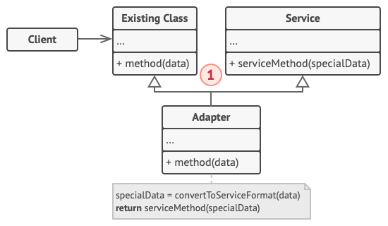

# Адаптер

> Также известен как: Wrapper, Обёртка, Adapter

## Суть паттерна

**Адаптер** — это структурный паттерн проектирования, который позволяет объектам с несовместимыми интерфейсами работать вместе.


## Проблема

Представьте, что вы делаете приложение для торговли на бирже. Ваше приложение скачивает биржевые котировки из нескольких источников в XML, а затем рисует красивые графики.

В какой-то момент вы решаете улучшить приложение, применив стороннюю библиотеку аналитики. Но вот беда — библиотека поддерживает только формат данных JSON, несовместимый с вашим приложением.


*Подключить стороннюю библиотеку не выйдет из-за несовместимых форматов данных.*

Вы смогли бы переписать библиотеку, чтобы та поддерживала формат XML. Но, во-первых, это может нарушить работу существующего кода, который уже зависит от библиотеки. А во-вторых, у вас может просто не быть доступа к её исходному коду.

## Решение

Вы можете создать **адаптер**. Это объект-переводчик, который трансформирует интерфейс или данные одного объекта в такой вид, чтобы он стал понятен другому объекту.

При этом адаптер оборачивает один из объектов, так что другой объект даже не знает о наличии первого. Например, вы можете обернуть объект, работающий в метрах, адаптером, который бы конвертировал данные в футы.

Адаптеры могут не только переводить данные из одного формата в другой, но и помогать объектам с разными интерфейсами работать сообща. Это работает так:

1. Адаптер имеет интерфейс, который совместим с одним из объектов.
2. Поэтому этот объект может свободно вызывать методы адаптера.
3. Адаптер получает эти вызовы и перенаправляет их второму объекту, но уже в том формате и последовательности, которые понятны второму объекту.

Иногда возможно создать даже **двухсторонний адаптер**, который работал бы в обе стороны.


*Программа может работать со сторонней библиотекой через адаптер.*

Таким образом, в приложении биржевых котировок вы могли бы создать класс `XML_To_JSON_Adapter`, который бы оборачивал объект того или иного класса библиотеки аналитики. Ваш код посылал бы адаптеру запросы в формате XML, а адаптер сначала транслировал входящие данные в формат JSON, а затем передавал бы их методам обёрнутого объекта аналитики.

## Аналогия из жизни


*Содержимое чемоданов до и после поездки за границу.*

Когда вы в первый раз летите за границу, вас может ждать сюрприз при попытке зарядить ноутбук. Стандарты розеток в разных странах отличаются. Ваша европейская зарядка будет бесполезна в США без специального адаптера, позволяющего подключиться к розетке другого типа.

## Структура

### Адаптер объектов

Эта реализация использует агрегацию: объект адаптера «оборачивает», то есть содержит ссылку на служебный объект. Такой подход работает во всех языках программирования.


1. **Клиент** — это класс, который содержит существующую бизнес-логику программы.
2. **Клиентский интерфейс** описывает протокол, через который клиент может работать с другими классами.
3. **Сервис** — это какой-то полезный класс, обычно сторонний. Клиент не может использовать этот класс напрямую, так как сервис имеет непонятный ему интерфейс.
4. **Адаптер** — это класс, который может одновременно работать и с клиентом, и с сервисом. Он реализует клиентский интерфейс и содержит ссылку на объект сервиса. Адаптер получает вызовы от клиента через методы клиентского интерфейса, а затем переводит их в вызовы методов обёрнутого объекта в правильном формате.
5. Работая с адаптером через интерфейс, клиент не привязывается к конкретному классу адаптера. Благодаря этому, вы можете добавлять в программу новые виды адаптеров, независимо от клиентского кода. Это может пригодиться, если интерфейс сервиса вдруг изменится, например, после выхода новой версии сторонней библиотеки.

### Адаптер классов
Эта реализация базируется на наследовании: адаптер наследует оба интерфейса одновременно. Такой подход возможен только в языках, поддерживающих множественное наследование, например, C++.



1. **Адаптер классов** не нуждается во вложенном объекте, так как он может одновременно наследовать и часть существующего класса, и часть сервиса.

##  Псевдокод
В этом шуточном примере **Адаптер** преобразует один интерфейс в другой, позволяя совместить квадратные колышки и круглые отверстия.


*Пример адаптации квадратных колышков и круглых отверстий.*

Адаптер вычисляет наименьший радиус окружности, в которую можно вписать квадратный колышек, и представляет его как круглый колышек с этим радиусом.

```c
// Классы с совместимыми интерфейсами: КруглоеОтверстие и
// КруглыйКолышек.
class RoundHole is
    constructor RoundHole(radius) { ... }

    method getRadius() is
        // Вернуть радиус отверстия.

    method fits(peg: RoundPeg) is
        return this.getRadius() >= peg.getRadius()

class RoundPeg is
    constructor RoundPeg(radius) { ... }

    method getRadius() is
        // Вернуть радиус круглого колышка.


// Устаревший, несовместимый класс: КвадратныйКолышек.
class SquarePeg is
    constructor SquarePeg(width) { ... }

    method getWidth() is
        // Вернуть ширину квадратного колышка.


// Адаптер позволяет использовать квадратные колышки и круглые
// отверстия вместе.
class SquarePegAdapter extends RoundPeg is
    private field peg: SquarePeg

    constructor SquarePegAdapter(peg: SquarePeg) is
        this.peg = peg

    method getRadius() is
        // Вычислить половину диагонали квадратного колышка по
        // теореме Пифагора.
        return peg.getWidth() * Math.sqrt(2) / 2


// Где-то в клиентском коде.
hole = new RoundHole(5)
rpeg = new RoundPeg(5)
hole.fits(rpeg) // TRUE

small_sqpeg = new SquarePeg(5)
large_sqpeg = new SquarePeg(10)
hole.fits(small_sqpeg) // Ошибка компиляции, несовместимые типы

small_sqpeg_adapter = new SquarePegAdapter(small_sqpeg)
large_sqpeg_adapter = new SquarePegAdapter(large_sqpeg)
hole.fits(small_sqpeg_adapter) // TRUE
hole.fits(large_sqpeg_adapter) // FALSE
```

## Применимость

**Когда вы хотите использовать сторонний класс, но его интерфейс не соответствует остальному коду приложения.**

Адаптер позволяет создать объект-прокладку, который будет превращать вызовы приложения в формат, понятный стороннему классу.

---

**Когда вам нужно использовать несколько существующих подклассов, но в них не хватает какой-то общей функциональности, причём расширить суперкласс вы не можете.**

Вы могли бы создать ещё один уровень подклассов и добавить в них недостающую функциональность. Но при этом придётся дублировать один и тот же код в обеих ветках подклассов.

Более элегантным решением было бы поместить недостающую функциональность в адаптер и приспособить его для работы с суперклассом. Такой адаптер сможет работать со всеми подклассами иерархии. Это решение будет сильно напоминать паттерн **Декоратор**.

## Шаги реализации

1. Убедитесь, что у вас есть два класса с несовместимыми интерфейсами:
   - полезный **сервис** — служебный класс, который вы не можете изменять (он либо сторонний, либо от него зависит другой код);
   - один или несколько **клиентов** — существующих классов приложения, несовместимых с сервисом из-за неудобного или несовпадающего интерфейса.
2. Опишите клиентский интерфейс, через который классы приложения смогли бы использовать класс сервиса.
3. Создайте класс адаптера, реализовав этот интерфейс.
4. Поместите в адаптер поле, которое будет хранить ссылку на объект сервиса. Обычно это поле заполняют объектом, переданным в конструктор адаптера. В случае простой адаптации этот объект можно передавать через параметры методов адаптера.
5. Реализуйте все методы клиентского интерфейса в адаптере. Адаптер должен делегировать основную работу сервису.
6. Приложение должно использовать адаптер только через клиентский интерфейс. Это позволит легко изменять и добавлять адаптеры в будущем.

## Преимущества и недостатки

**Преимущества**
    
- Отделяет и скрывает от клиента подробности преобразования различных интерфейсов.

**Недостатки**

- Усложняет код программы из-за введения дополнительных классов.

## Примеры реализации паттерна

- **Сложность**: 1/3
- **Популярность**: 3/3
- **Применимость**: Паттерн можно часто встретить в Python-коде, особенно там, где требуется конвертация разных типов данных или совместная работа классов с разными интерфейсами.
- **Признаки применения паттерна**: Адаптер получает конвертируемый объект в конструкторе или через параметры своих методов. Методы Адаптера обычно совместимы с интерфейсом одного объекта. Они делегируют вызовы вложенному объекту, превратив перед этим параметры вызова в формат, поддерживаемый вложенным объектом.

### Python

<tabs>
<tab title="Концептуальный пример (наследование)">
<h4 id="parent_adapter">Концептуальный пример (наследование)</h4>
<p>Этот пример показывает структуру паттерна <b>Адаптер</b>, а именно — из каких классов он состоит, какие роли эти классы выполняют и как они взаимодействуют друг с другом.</p>
<p><b>main.py</b>: Пример структуры паттерна</p>
<code-block lang="python">
<![CDATA[
class Target:
    """
    Целевой класс объявляет интерфейс, с которым может работать клиентский код.
    """

    def request(self) -> str:
        return "Target: The default target's behavior."


class Adaptee:
"""
Адаптируемый класс содержит некоторое полезное поведение, но его интерфейс
несовместим с существующим клиентским кодом. Адаптируемый класс нуждается в
некоторой доработке, прежде чем клиентский код сможет его использовать.
"""
    def specific_request(self) -> str:
        return ".eetpadA eht fo roivaheb laicepS"


class Adapter(Target, Adaptee):
"""
Адаптер делает интерфейс Адаптируемого класса совместимым с целевым
интерфейсом благодаря множественному наследованию.
"""

    def request(self) -> str:
        return f"Adapter: (TRANSLATED) {self.specific_request()[::-1]}"


def client_code(target: "Target") -> None:
"""
Клиентский код поддерживает все классы, использующие интерфейс Target.
"""
    print(target.request(), end="")


if __name__ == "__main__":
    print("Client: I can work just fine with the Target objects:")
    target = Target()
    client_code(target)
    print("\n")

    adaptee = Adaptee()
    print("Client: The Adaptee class has a weird interface. "
          "See, I don't understand it:")
    print(f"Adaptee: {adaptee.specific_request()}", end="\n\n")

    print("Client: But I can work with it via the Adapter:")
    adapter = Adapter()
    client_code(adapter)
]]>
</code-block>
<p><b>Output.txt</b>: Результат выполнения</p>
<code-block lang="bash">
<![CDATA[
Client: I can work just fine with the Target objects:
Target: The default target's behavior.

Client: The Adaptee class has a weird interface. See, I don't understand it:
Adaptee: .eetpadA eht fo roivaheb laicepS

Client: But I can work with it via the Adapter:
Adapter: (TRANSLATED) Special behavior of the Adaptee.
]]>
</code-block>
</tab>
<tab title="Концептуальный пример (композиция)">
<h4 id="composite_adapter">Концептуальный пример (композиция)</h4>
<p>Этот пример показывает структуру паттерна <b>Адаптер</b>, а именно — из каких классов он состоит, какие роли эти классы выполняют и как они взаимодействуют друг с другом.</p>
<p><b>main.py</b>: Пример структуры паттерна</p>
<code-block lang="python">
<![CDATA[
class Target:
    """
    Целевой класс объявляет интерфейс, с которым может работать клиентский код.
    """

    def request(self) -> str:
        return "Target: The default target's behavior."


class Adaptee:
"""
Адаптируемый класс содержит некоторое полезное поведение, но его интерфейс
несовместим с существующим клиентским кодом. Адаптируемый класс нуждается в
некоторой доработке, прежде чем клиентский код сможет его использовать.
"""

    def specific_request(self) -> str:
        return ".eetpadA eht fo roivaheb laicepS"


class Adapter(Target):
"""
Адаптер делает интерфейс Адаптируемого класса совместимым с целевым
интерфейсом благодаря агрегации.
"""

    def __init__(self, adaptee: Adaptee) -> None:
        self.adaptee = adaptee

    def request(self) -> str:
        return f"Adapter: (TRANSLATED) {self.adaptee.specific_request()[::-1]}"


def client_code(target: Target) -> None:
"""
Клиентский код поддерживает все классы, использующие интерфейс Target.
"""

    print(target.request(), end="")


if __name__ == "__main__":
print("Client: I can work just fine with the Target objects:")
target = Target()
client_code(target)
print("\n")

    adaptee = Adaptee()
    print("Client: The Adaptee class has a weird interface. "
          "See, I don't understand it:")
    print(f"Adaptee: {adaptee.specific_request()}", end="\n\n")

    print("Client: But I can work with it via the Adapter:")
    adapter = Adapter(adaptee)
    client_code(adapter)
]]>
</code-block>
<p><b>Output.txt</b>: Результат выполнения</p>
<code-block lang="bash">
<![CDATA[
Client: I can work just fine with the Target objects:
Target: The default target's behavior.

Client: The Adaptee class has a weird interface. See, I don't understand it:
Adaptee: .eetpadA eht fo roivaheb laicepS

Client: But I can work with it via the Adapter:
Adapter: (TRANSLATED) Special behavior of the Adaptee.
]]>
</code-block>
</tab>
</tabs>

### PHP

<tabs>
<tab title="Концептуальный пример">
<h4 id="concept_adapter_php">Концептуальный пример</h4>
<p>Этот пример показывает структуру паттерна <b>Адаптер</b>, а именно — из каких классов он состоит, какие роли эти классы выполняют и как они взаимодействуют друг с другом.</p>
<p>После ознакомления со структурой, вам будет легче воспринимать второй пример, который рассматривает реальный случай использования паттерна в мире PHP.</p>
<p><b>index.php</b>: Пример структуры паттерна</p>
<code-block lang="php">
<![CDATA[
namespace RefactoringGuru\Adapter\Conceptual;

/**
* Целевой класс объявляет интерфейс, с которым может работать клиентский код.
  */

class Target
{
    public function request(): string
    {
        return "Target: The default target's behavior.";
    }
}

/**
* Адаптируемый класс содержит некоторое полезное поведение, но его интерфейс
* несовместим с существующим клиентским кодом. Адаптируемый класс нуждается в
* некоторой доработке, прежде чем клиентский код сможет его использовать.
  */

class Adaptee
{
    public function specificRequest(): string
    {
        return ".eetpadA eht fo roivaheb laicepS";
    }
}

/**
* Адаптер делает интерфейс Адаптируемого класса совместимым с целевым
* интерфейсом.
  */

class Adapter extends Target
{
private $adaptee;

    public function __construct(Adaptee $adaptee)
    {
        $this->adaptee = $adaptee;
    }
    
    public function request(): string
    {
        return "Adapter: (TRANSLATED) " . strrev($this->adaptee->specificRequest());
    }
}

/**
* Клиентский код поддерживает все классы, использующие целевой интерфейс.
*/

function clientCode(Target $target)
{
    echo $target->request();
}

echo "Client: I can work just fine with the Target objects:\n";
$target = new Target();
clientCode($target);
echo "\n\n";

$adaptee = new Adaptee();
echo "Client: The Adaptee class has a weird interface. See, I don't understand it:\n";
echo "Adaptee: " . $adaptee->specificRequest();
echo "\n\n";

echo "Client: But I can work with it via the Adapter:\n";
$adapter = new Adapter($adaptee);
clientCode($adapter);
]]>
</code-block>
<p><b>Output.txt</b>: Результат выполнения</p>
<code-block lang="bash">
<![CDATA[
Client: I can work just fine with the Target objects:
Target: The default target's behavior.

Client: The Adaptee class has a weird interface. See, I don't understand it:
Adaptee: .eetpadA eht fo roivaheb laicepS

Client: But I can work with it via the Adapter:
Adapter: (TRANSLATED) Special behavior of the Adaptee.
]]>
</code-block>
</tab>
<tab title="Пример из реальной жизни">
<h4 id="real_adapter_php">Пример из реальной жизни</h4>
<p>Паттерн <b>Адаптер</b> позволяет использовать сторонние или устаревшие классы, даже если они несовместимы с основной частью кода. Например, вместо того, чтобы переписывать интерфейс уведомлений вашего приложения для поддержки каждого стороннего сервиса вроде Slack, Facebook, SMS и прочих, вы создаёте под эти сервисы набор специальных обёрток, которые приводят вызовы из приложения к требуемым сторонними классами интерфейсу и формату.</p>
<p>index.php: Пример из реальной жизни</p>
<code-block lang="php">
<![CDATA[
namespace RefactoringGuru\Adapter\RealWorld;

/**
* Целевой интерфейс предоставляет интерфейс, которому следуют классы вашего
* приложения.
*/

interface Notification
{
    public function send(string $title, string $message);
}

/**
* Вот пример существующего класса, который следует за целевым интерфейсом.
*
* Дело в том, что у большинства приложений нет чётко определённого интерфейса.
* В этом случае лучше было бы расширить Адаптер за счёт существующего класса
* приложения. Если это неудобно (например, SlackNotification не похож на
* подкласс EmailNotification), тогда первым шагом должно быть извлечение
* интерфейса.
  */

class EmailNotification implements Notification
{
    private $adminEmail;

    public function __construct(string $adminEmail)
    {
        $this->adminEmail = $adminEmail;
    }

    public function send(string $title, string $message): void
    {
        mail($this->adminEmail, $title, $message);
        echo "Sent email with title '$title' to '{$this->adminEmail}' that says '$message'.";
    }
}

/**
* Адаптируемый класс – некий полезный класс, несовместимый с целевым
* интерфейсом. Нельзя просто войти и изменить код класса так, чтобы следовать
* целевому интерфейсу, так как код может предоставляться сторонней библиотекой.
  */

class SlackApi
{
    private $login;
    private $apiKey;

    public function __construct(string $login, string $apiKey)
    {
        $this->login = $login;
        $this->apiKey = $apiKey;
    }

    public function logIn(): void
    {
        // Send authentication request to Slack web service.
        echo "Logged in to a slack account '{$this->login}'.\n";
    }
    
    public function sendMessage(string $chatId, string $message): void
    {
        // Send message post request to Slack web service.
        echo "Posted following message into the '$chatId' chat: '$message'.\n";
    }
}

/**
* Адаптер – класс, который связывает Целевой интерфейс и Адаптируемый класс.
* Это позволяет приложению использовать Slack API для отправки уведомлений.
  */

class SlackNotification implements Notification
{
    private $slack;
    private $chatId;

    public function __construct(SlackApi $slack, string $chatId)
    {
        $this->slack = $slack;
        $this->chatId = $chatId;
    }

    /**
    * Адаптер способен адаптировать интерфейсы и преобразовывать входные данные
    * в формат, необходимый Адаптируемому классу.
    */
    public function send(string $title, string $message): void
    {
        $slackMessage = "#" . $title . "# " . strip_tags($message);
        $this->slack->logIn();
        $this->slack->sendMessage($this->chatId, $slackMessage);
    }
}

/**
* Клиентский код работает с классами, которые следуют Целевому интерфейсу.
  */

function clientCode(Notification $notification)
{
// ...

    echo $notification->send("Website is down!",
    "<strong style='color:red;font-size: 50px;'>Alert!</strong> " .
    "Our website is not responding. Call admins and bring it up!");

    // ...
}

echo "Client code is designed correctly and works with email notifications:\n";
$notification = new EmailNotification("developers@example.com");
clientCode($notification);
echo "\n\n";

echo "The same client code can work with other classes via adapter:\n";
$slackApi = new SlackApi("example.com", "XXXXXXXX");
$notification = new SlackNotification($slackApi, "Example.com Developers");
clientCode($notification);
]]>
</code-block>
<p><b>Output.txt</b>: Результат выполнения</p>
<code-block lang="bash">
<![CDATA[
Client code is designed correctly and works with email notifications:
Sent email with title 'Website is down!' to 'developers@example.com' that says '<strong style='color:red;font-size: 50px;'>Alert!</strong> Our website is not responding. Call admins and bring it up!'.

The same client code can work with other classes via adapter:
Logged in to a slack account 'example.com'.
Posted following message into the 'Example.com Developers' chat: '#Website is down!# Alert! Our website is not responding. Call admins and bring it up!'.
]]>
</code-block>
</tab>
</tabs>