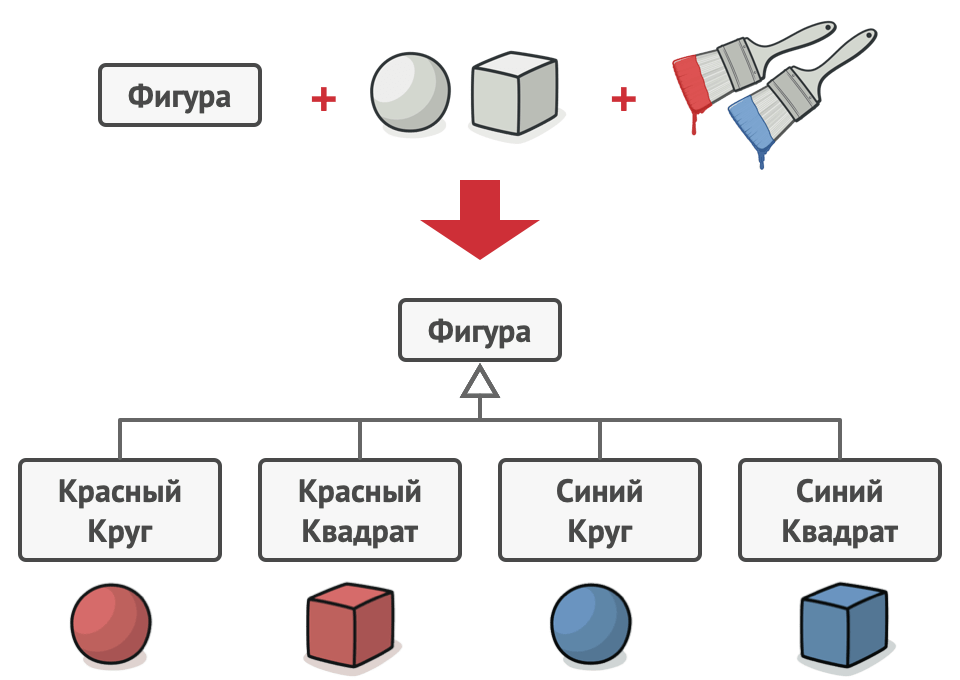
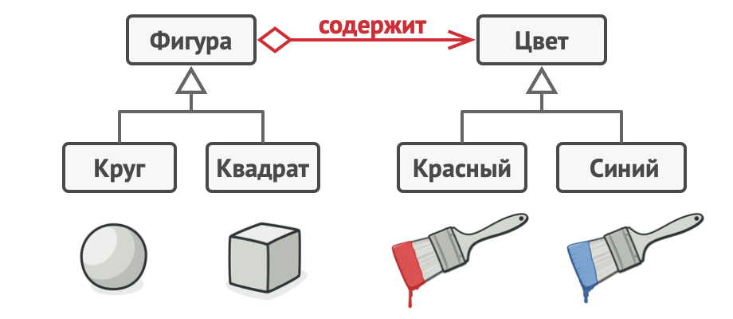
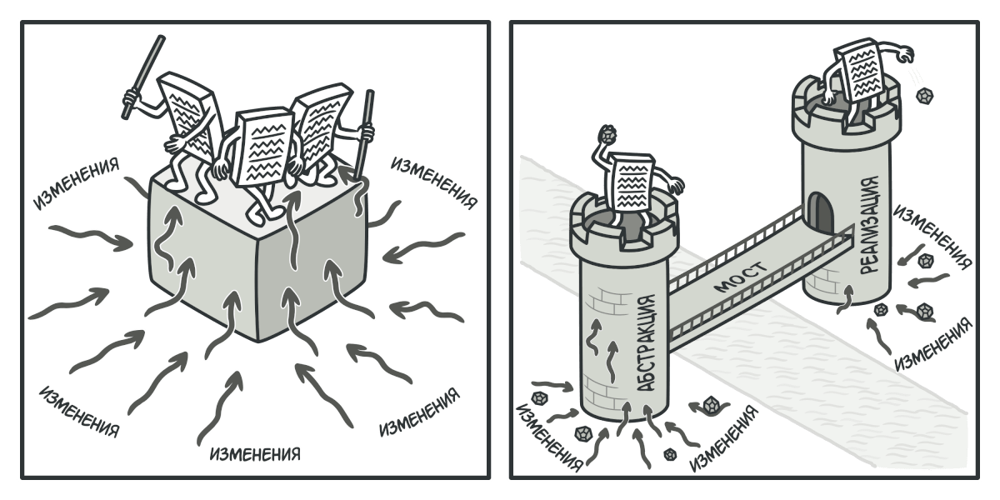
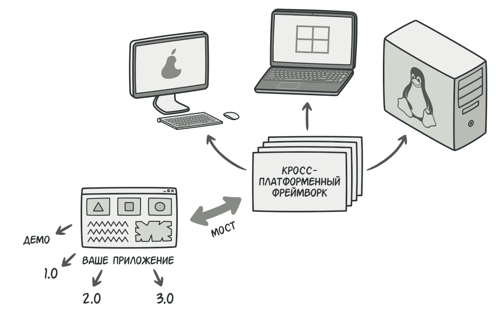
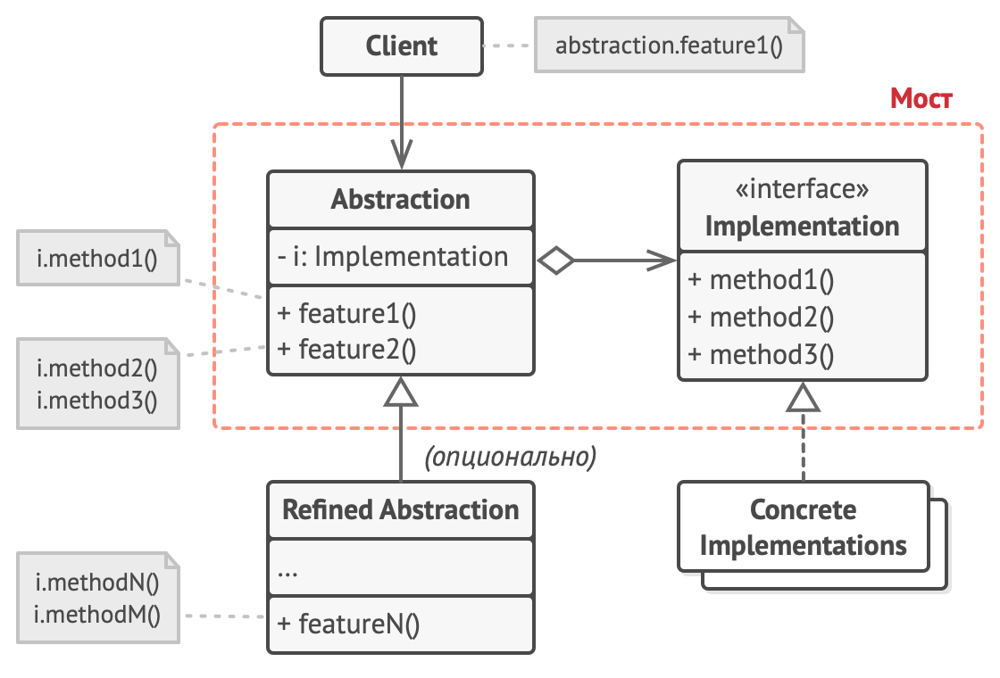
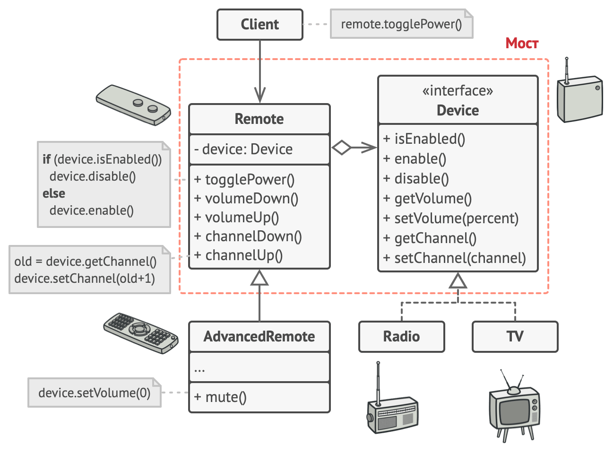

# Мост

> Также известен как: Bridge

## Суть паттерна

**Мост** — это структурный паттерн проектирования, который разделяет один или несколько классов на две отдельные иерархии — абстракцию и реализацию, позволяя изменять их независимо друг от друга.


## Проблема

*Абстракция*? *Реализация*?! Звучит пугающе! Чтобы понять, о чём идёт речь, давайте разберём очень простой пример.

У вас есть класс геометрических `Фигур`, который имеет подклассы `Круг` и `Квадрат`. Вы хотите расширить иерархию фигур по цвету, то есть иметь `Красные` и `Синие` фигуры. Но чтобы всё это объединить, вам придётся создать 4 комбинации подклассов, вроде `СиниеКруги` и `КрасныеКвадраты`.



*Количество подклассов растёт в геометрической прогрессии.*

При добавлении новых видов фигур и цветов количество комбинаций будет расти в геометрической прогрессии. Например, чтобы ввести в программу фигуры треугольников, придётся создать сразу два новых подкласса треугольников под каждый цвет. После этого новый цвет потребует создания уже трёх классов для всех видов фигур. Чем дальше, тем хуже.

## Решение

Корень проблемы заключается в том, что мы пытаемся расширить классы фигур сразу в двух независимых плоскостях — по виду и по цвету. Именно это приводит к разрастанию дерева классов.

Паттерн Мост предлагает заменить наследование агрегацией или композицией. Для этого нужно выделить одну из таких «плоскостей» в отдельную иерархию и ссылаться на объект этой иерархии, вместо хранения его состояния и поведения внутри одного класса.



*Размножение подклассов можно остановить, разбив классы на несколько иерархий.*

Таким образом, мы можем сделать `Цвет` отдельным классом с подклассами `Красный` и `Синий`. Класс `Фигур` получит ссылку на объект `Цвета` и сможет делегировать ему работу, если потребуется. Такая связь и станет мостом между `Фигурами` и `Цветом`. При добавлении новых классов цветов не потребуется трогать классы фигур и наоборот.

**Абстракция и Реализация**

Эти термины были введены в книге <tooltip term="gof">GoF</tooltip> при описании **Моста**. На мой взгляд, они выглядят слишком академичными, делая описание паттерна сложнее, чем он есть на самом деле. Помня о примере с фигурами и цветами, давайте все же разберёмся, что имели в виду авторы паттерна.

Итак, *абстракция* (или *интерфейс*) — это образный слой управления чем-либо. Он не делает работу самостоятельно, а делегирует её слою реализации (иногда называемому платформой).

> Только не путайте эти термины с интерфейсами или абстрактными классами из вашего языка программирования, это не одно и то же.
> {style="note"}

Если говорить о реальных программах, то абстракцией может выступать графический интерфейс программы (GUI), а реализацией — низкоуровневый код операционной системы (API), к которому графический интерфейс обращается по реакции на действия пользователя.

Вы можете развивать программу в двух разных направлениях:

- иметь несколько видов GUI (например, для простых пользователей и администраторов);
- поддерживать много видов API (например, работать под Windows, Linux и macOS).

Такая программа может выглядеть как один большой клубок кода, в котором намешаны условные операторы слоёв GUI и API.



*Когда изменения «осаждают» проект, вам легче отбиваться, если разделить монолитный код на части.*

Вы можете попытаться структурировать этот хаос, создав для каждой вариации интерфейса-платформы свои подклассы. Но такой подход приведёт к росту классов комбинаций, и с каждой новой платформой их будет всё больше.

Мы можем решить эту проблему, применив Мост. Паттерн предлагает распутать этот код, разделив его на две части:

- Абстракцию: слой графического интерфейса приложения.
- Реализацию: слой взаимодействия с операционной системой.



*Один из вариантов кросс-платформенной архитектуры.*

Абстракция будет делегировать работу одному из объектов реализаций. Причём, реализации можно будет взаимозаменять, но только при условии, что все они будут следовать общему интерфейсу.

Таким образом, вы сможете изменять графический интерфейс приложения, не трогая низкоуровневый код работы с операционной системой. И наоборот, вы сможете добавлять поддержку новых операционных систем, создавая подклассы реализации, без необходимости менять классы графического интерфейса.

## Структура



1. **Абстракция** содержит управляющую логику. Код абстракции делегирует реальную работу связанному объекту реализации.
2. **Реализация** задаёт общий интерфейс для всех реализаций. Все методы, которые здесь описаны, будут доступны из класса абстракции и его подклассов.<br/>Интерфейсы абстракции и реализации могут как совпадать, так и быть совершенно разными. Но обычно в реализации живут базовые операции, на которых строятся сложные операции абстракции.
3. **Конкретные реализации** содержат платформо-зависимый код.
4. **Расширенные абстракции** содержат различные вариации управляющей логики. Как и родитель, работает с реализациями только через общий интерфейс реализации.
5. **Клиент** работает только с объектами абстракции. Не считая начального связывания абстракции с одной из реализаций, клиентский код не имеет прямого доступа к объектам реализации.

## Псевдокод

В этом примере **Мост** разделяет монолитный код приборов и пультов на две части: приборы (выступают реализацией) и пульты управления ими (выступают абстракцией).



*Пример разделения двух иерархий классов — приборов и пультов управления.*

Класс пульта имеет ссылку на объект прибора, которым он управляет. Пульты работают с приборами через общий интерфейс. Это даёт возможность связать пульты с различными приборами.

Сами пульты можно развивать независимо от приборов. Для этого достаточно создать новый подкласс абстракции. Вы можете создать как простой пульт с двумя кнопками, так и более сложный пульт с тач-интерфейсом.

Клиентскому коду остаётся выбрать версию абстракции и реализации, с которым он хочет работать, и связать их между собой.

```c
// Класс пультов имеет ссылку на устройство, которым управляет.
// Методы этого класса делегируют работу методам связанного
// устройства.
class Remote is
    protected field device: Device
    constructor Remote(device: Device) is
        this.device = device
    method togglePower() is
        if (device.isEnabled()) then
            device.disable()
        else
            device.enable()
    method volumeDown() is
        device.setVolume(device.getVolume() - 10)
    method volumeUp() is
        device.setVolume(device.getVolume() + 10)
    method channelDown() is
        device.setChannel(device.getChannel() - 1)
    method channelUp() is
        device.setChannel(device.getChannel() + 1)


// Вы можете расширять класс пультов, не трогая код устройств.
class AdvancedRemote extends Remote is
    method mute() is
        device.setVolume(0)


// Все устройства имеют общий интерфейс. Поэтому с ними может
// работать любой пульт.
interface Device is
    method isEnabled()
    method enable()
    method disable()
    method getVolume()
    method setVolume(percent)
    method getChannel()
    method setChannel(channel)


// Но каждое устройство имеет особую реализацию.
class Tv implements Device is
    // ...

class Radio implements Device is
    // ...


// Где-то в клиентском коде.
tv = new Tv()
remote = new Remote(tv)
remote.togglePower()

radio = new Radio()
remote = new AdvancedRemote(radio)
```

## Применимость

**Когда вы хотите разделить монолитный класс, который содержит несколько различных реализаций какой-то функциональности (например, если класс может работать с разными системами баз данных).**

Чем больше класс, тем тяжелее разобраться в его коде, и тем больше это затягивает разработку. Кроме того, изменения, вносимые в одну из реализаций, приводят к редактированию всего класса, что может привести к внесению случайных ошибок в код.

Мост позволяет разделить монолитный класс на несколько отдельных иерархий. После этого вы можете менять их код независимо друг от друга. Это упрощает работу над кодом и уменьшает вероятность внесения ошибок.

---

**Когда класс нужно расширять в двух независимых плоскостях.**

Мост предлагает выделить одну из таких плоскостей в отдельную иерархию классов, храня ссылку на один из её объектов в первоначальном классе.

---

**Когда вы хотите, чтобы реализацию можно было бы изменять во время выполнения программы.**

Мост позволяет заменять реализацию даже во время выполнения программы, так как конкретная реализация не «вшита» в класс абстракции.

> Кстати, из-за этого пункта **Мост** часто путают со **Стратегией**. Обратите внимание, что у Моста этот пункт стоит на последнем месте по значимости, поскольку его главная задача — структурная.

## Шаги реализации

1. Определите, существует ли в ваших классах два непересекающихся измерения. Это может быть функциональность/платформа, предметная-область/инфраструктура, фронт-энд/бэк-энд или интерфейс/реализация.
2. Продумайте, какие операции будут нужны клиентам, и опишите их в базовом классе абстракции.
3. Определите поведения, доступные на всех платформах, и выделите из них ту часть, которая нужна абстракции. На основании этого опишите общий интерфейс **реализации**.
4. Для каждой платформы создайте свой класс конкретной реализации. Все они должны следовать общему интерфейсу, который мы выделили перед этим.
5. Добавьте в класс абстракции ссылку на объект реализации. Реализуйте методы абстракции, делегируя основную работу связанному объекту реализации.
6. Если у вас есть несколько вариаций абстракции, создайте для каждой из них свой подкласс.
7. Клиент должен подать объект реализации в конструктор абстракции, чтобы связать их воедино. После этого он может свободно использовать объект абстракции, забыв о реализации.

## Преимущества и недостатки

**Преимущества**

- Позволяет строить платформо-независимые программы.
- Скрывает лишние или опасные детали реализации от клиентского кода.
- Реализует [принцип открытости/закрытости](open_close_principle.md).

**Недостатки**

- Усложняет код программы из-за введения дополнительных классов.

## Примеры реализации паттерна

- **Сложность**: 3/3
- **Популярность**: 1/3
- **Применимость**: Паттерн Мост особенно полезен когда вам приходится делать кросс-платформенные приложения, поддерживать несколько типов баз данных или работать с разными поставщиками похожего API (например, cloud-сервисы, социальные сети и т. д.)
- **Признаки применения паттерна**: Если в программе чётко выделены классы «управления» и несколько видов классов «платформ», причём управляющие объекты делегируют выполнение платформам, то можно сказать, что у вас используется Мост.

### Python

Этот пример показывает структуру паттерна **Мост**, а именно — из каких классов он состоит, какие роли эти классы выполняют и как они взаимодействуют друг с другом.

**main.py**: Пример структуры паттерна

```python
from __future__ import annotations
from abc import ABC, abstractmethod


class Abstraction:
    """
    Абстракция устанавливает интерфейс для «управляющей» части двух иерархий
    классов. Она содержит ссылку на объект из иерархии Реализации и делегирует
    ему всю настоящую работу.
    """

    def __init__(self, implementation: Implementation) -> None:
        self.implementation = implementation

    def operation(self) -> str:
        return (f"Abstraction: Base operation with:\n"
                f"{self.implementation.operation_implementation()}")


class ExtendedAbstraction(Abstraction):
    """
    Можно расширить Абстракцию без изменения классов Реализации.
    """

    def operation(self) -> str:
        return (f"ExtendedAbstraction: Extended operation with:\n"
                f"{self.implementation.operation_implementation()}")


class Implementation(ABC):
    """
    Реализация устанавливает интерфейс для всех классов реализации. Он не должен
    соответствовать интерфейсу Абстракции. На практике оба интерфейса могут быть
    совершенно разными. Как правило, интерфейс Реализации предоставляет только
    примитивные операции, в то время как Абстракция определяет операции более
    высокого уровня, основанные на этих примитивах.
    """

    @abstractmethod
    def operation_implementation(self) -> str:
        pass


"""
Каждая Конкретная Реализация соответствует определённой платформе и реализует
интерфейс Реализации с использованием API этой платформы.
"""


class ConcreteImplementationA(Implementation):
    def operation_implementation(self) -> str:
        return "ConcreteImplementationA: Here's the result on the platform A."


class ConcreteImplementationB(Implementation):
    def operation_implementation(self) -> str:
        return "ConcreteImplementationB: Here's the result on the platform B."


def client_code(abstraction: Abstraction) -> None:
    """
    За исключением этапа инициализации, когда объект Абстракции связывается с
    определённым объектом Реализации, клиентский код должен зависеть только от
    класса Абстракции. Таким образом, клиентский код может поддерживать любую
    комбинацию абстракции и реализации.
    """

    # ...

    print(abstraction.operation(), end="")

    # ...


if __name__ == "__main__":
    """
    Клиентский код должен работать с любой предварительно сконфигурированной
    комбинацией абстракции и реализации.
    """

    implementation = ConcreteImplementationA()
    abstraction = Abstraction(implementation)
    client_code(abstraction)

    print("\n")

    implementation = ConcreteImplementationB()
    abstraction = ExtendedAbstraction(implementation)
    client_code(abstraction)
```

**Output.txt**: Результат выполнения

```bash
Abstraction: Base operation with:
ConcreteImplementationA: Here's the result on the platform A.

ExtendedAbstraction: Extended operation with:
ConcreteImplementationB: Here's the result on the platform B.
```

### PHP

<tabs>
<tab title="Концептуальный пример">
<h4 id="bridge_php_concept">Концептуальный пример</h4>
<p>Этот пример показывает структуру паттерна <b>Мост</b>, а именно — из каких классов он состоит, какие роли эти классы выполняют и как они взаимодействуют друг с другом.</p>
<p>После ознакомления со структурой, вам будет легче воспринимать второй пример, который рассматривает реальный случай использования паттерна в мире PHP.</p>
<p><b>index.php</b>: Пример структуры паттерна</p>
<code-block lang="php">
<![CDATA[
namespace RefactoringGuru\Bridge\Conceptual;

/**
* Абстракция устанавливает интерфейс для «управляющей» части двух иерархий
* классов. Она содержит ссылку на объект из иерархии Реализации и делегирует
* ему всю настоящую работу.
*/ 

class Abstraction
{
    /**
    * @var Implementation
    */
    protected $implementation;

    public function __construct(Implementation $implementation)
    {
        $this->implementation = $implementation;
    }

    public function operation(): string
    {
        return "Abstraction: Base operation with:\n" .
            $this->implementation->operationImplementation();
    }
}

/**
* Можно расширить Абстракцию без изменения классов Реализации.
*/ 

class ExtendedAbstraction extends Abstraction
{
    public function operation(): string
    {
        return "ExtendedAbstraction: Extended operation with:\n" .
            $this->implementation->operationImplementation();
    }
}

/**
* Реализация устанавливает интерфейс для всех классов реализации. Он не должен
* соответствовать интерфейсу Абстракции. На практике оба интерфейса могут быть
* совершенно разными. Как правило, интерфейс Реализации предоставляет только
* примитивные операции, в то время как Абстракция определяет операции более
* высокого уровня, основанные на этих примитивах.
*/ 

interface Implementation
{
    public function operationImplementation(): string;
}

/**
* Каждая Конкретная Реализация соответствует определённой платформе и реализует
* интерфейс Реализации с использованием API этой платформы.
*/ 

class ConcreteImplementationA implements Implementation
{
    public function operationImplementation(): string
    {
        return "ConcreteImplementationA: Here's the result on the platform A.\n";
    }
}

class ConcreteImplementationB implements Implementation
{
    public function operationImplementation(): string
    {
        return "ConcreteImplementationB: Here's the result on the platform B.\n";
    }
}

/**
* За исключением этапа инициализации, когда объект Абстракции связывается с
* определённым объектом Реализации, клиентский код должен зависеть только от
* класса Абстракции. Таким образом, клиентский код может поддерживать любую
* комбинацию абстракции и реализации.
*/

function clientCode(Abstraction $abstraction)
{
    // ...

    echo $abstraction->operation();

    // ...
}

/**
* Клиентский код должен работать с любой предварительно сконфигурированной
* комбинацией абстракции и реализации.
*/
$implementation = new ConcreteImplementationA();
$abstraction = new Abstraction($implementation);
clientCode($abstraction);

echo "\n";

$implementation = new ConcreteImplementationB();
$abstraction = new ExtendedAbstraction($implementation);
clientCode($abstraction);
]]>
</code-block>    
<p><b>Output.txt</b>: Результат выполнения</p>
<code-block lang="bash">
<![CDATA[
Abstraction: Base operation with:
ConcreteImplementationA: Here's the result on the platform A.

ExtendedAbstraction: Extended operation with:
ConcreteImplementationB: Here's the result on the platform B.
]]>
</code-block>
</tab>
<tab title="Пример из реальной жизни">
<h4 id="bridge-php-real">Пример из реальной жизни</h4>
<p>В этом примере иерархия Страницы выступает как Абстракция, а иерархия Рендера как Реализация. Объекты класса Страница монтируют веб-страницы определённого типа, используя базовые элементы, которые предоставляются объектом Рендер, прикреплённым к этой странице. Обе иерархии классов разделены, поэтому можно добавить новый класс Рендер без изменения классов страниц и наоборот.</p>
<p><b>index.php</b>: Пример из реальной жизни</p>
<code-block lang="php">
<![CDATA[
namespace RefactoringGuru\Bridge\RealWorld;

/**
* Абстракция.
*/

abstract class Page
{
    /**
    * @var Renderer
    */
    protected $renderer;

    /**
    * Обычно Абстракция инициализируется одним из объектов Реализации.
    */
    public function __construct(Renderer $renderer)
    {
        $this->renderer = $renderer;
    }

    /**
    * Паттерн Мост позволяет динамически заменять присоединённый объект
    * Реализации.
    */
    public function changeRenderer(Renderer $renderer): void
    {
        $this->renderer = $renderer;
    }

    /**
    * Поведение «вида» остаётся абстрактным, так как оно предоставляется только
    * классами Конкретной Абстракции.
    */
    abstract public function view(): string;
}

/**
* Эта Конкретная Абстракция создаёт простую страницу.
*/

class SimplePage extends Page
{
    protected $title;
    protected $content;

    public function __construct(Renderer $renderer, string $title, string $content)
    {
        parent::__construct($renderer);
        $this->title = $title;
        $this->content = $content;
    }

    public function view(): string
    {
        return $this->renderer->renderParts([
            $this->renderer->renderHeader(),
            $this->renderer->renderTitle($this->title),
            $this->renderer->renderTextBlock($this->content),
            $this->renderer->renderFooter()
        ]);
    }
}

/**
* Эта Конкретная Абстракция создаёт более сложную страницу.
*/

class ProductPage extends Page
{
    protected $product;

    public function __construct(Renderer $renderer, Product $product)
    {
        parent::__construct($renderer);
        $this->product = $product;
    }
    
    public function view(): string
    {
        return $this->renderer->renderParts([
            $this->renderer->renderHeader(),
            $this->renderer->renderTitle($this->product->getTitle()),
            $this->renderer->renderTextBlock($this->product->getDescription()),
            $this->renderer->renderImage($this->product->getImage()),
            $this->renderer->renderLink("/cart/add/" . $this->product->getId(), "Add to cart"),
            $this->renderer->renderFooter()
        ]);
    }
}

/**
* Вспомогательный класс для класса ProductPage.
*/

class Product
{
    private $id, $title, $description, $image, $price;

    public function __construct(
        string $id,
        string $title,
        string $description,
        string $image,
        float $price
    ) {
        $this->id = $id;
        $this->title = $title;
        $this->description = $description;
        $this->image = $image;
        $this->price = $price;
    }

    public function getId(): string { return $this->id; }
    
    public function getTitle(): string { return $this->title; }
    
    public function getDescription(): string { return $this->description; }
    
    public function getImage(): string { return $this->image; }
    
    public function getPrice(): float { return $this->price; }
}


/**
* Реализация объявляет набор «реальных», «под капотом», «платформенных»
* методов.
*
* В этом случае Реализация перечисляет методы рендеринга, которые используются
* для создания веб-страниц. Разные Абстракции могут использовать разные методы
* Реализации.
*/

interface Renderer
{
    public function renderTitle(string $title): string;
    
    public function renderTextBlock(string $text): string;
    
    public function renderImage(string $url): string;
    
    public function renderLink(string $url, string $title): string;
    
    public function renderHeader(): string;
    
    public function renderFooter(): string;
    
    public function renderParts(array $parts): string;
}

/**
* Эта Конкретная Реализация отображает веб-страницу в виде HTML.
*/ 

class HTMLRenderer implements Renderer
{
    public function renderTitle(string $title): string
    {
        return "<h1>$title</h1>";
    }

    public function renderTextBlock(string $text): string
    {
        return "<div class='text'>$text</div>";
    }
    
    public function renderImage(string $url): string
    {
        return "";
    }
    
    public function renderLink(string $url, string $title): string
    {
        return "<a href='$url'>$title</a>";
    }
    
    public function renderHeader(): string
    {
        return "<html><body>";
    }
    
    public function renderFooter(): string
    {
        return "</body></html>";
    }
    
    public function renderParts(array $parts): string
    {
        return implode("\n", $parts);
    }
}

/**
* Эта Конкретная Реализация отображает веб-страницу в виде строк JSON.
*/ 

class JsonRenderer implements Renderer
{
    public function renderTitle(string $title): string
    {
        return '"title": "' . $title . '"';
    }
    
    public function renderTextBlock(string $text): string
    {
        return '"text": "' . $text . '"';
    }
    
    public function renderImage(string $url): string
    {
        return '"img": "' . $url . '"';
    }
    
    public function renderLink(string $url, string $title): string
    {
        return '"link": {"href": "' . $url . '", "title": "' . $title . '"}';
    }
    
    public function renderHeader(): string
    {
        return '';
    }
    
    public function renderFooter(): string
    {
        return '';
    }
    
    public function renderParts(array $parts): string
    {
        return "{\n" . implode(",\n", array_filter($parts)) . "\n}";
    }
}

/**
* Клиентский код имеет дело только с объектами Абстракции.
*/
function clientCode(Page $page)
{
    // ...

    echo $page->view();

    // ...
}

/**
* Клиентский код может выполняться с любой предварительно сконфигурированной
* комбинацией Абстракция+Реализация.
*/
$HTMLRenderer = new HTMLRenderer();
$JSONRenderer = new JsonRenderer();

$page = new SimplePage($HTMLRenderer, "Home", "Welcome to our website!");
echo "HTML view of a simple content page:\n";
clientCode($page);
echo "\n\n";

/**
* При необходимости Абстракция может заменить связанную Реализацию во время
* выполнения.
*/
$page->changeRenderer($JSONRenderer);
echo "JSON view of a simple content page, rendered with the same client code:\n";
clientCode($page);
echo "\n\n";


$product = new Product("123", "Star Wars, episode1",
    "A long time ago in a galaxy far, far away...",
    "/images/star-wars.jpeg", 39.95);

$page = new ProductPage($HTMLRenderer, $product);
echo "HTML view of a product page, same client code:\n";
clientCode($page);
echo "\n\n";

$page->changeRenderer($JSONRenderer);
echo "JSON view of a simple content page, with the same client code:\n";
clientCode($page);
]]>
</code-block>
<p><b>Output.txt</b>: Результат выполнения</p>
<code-block lang="bash">
<![CDATA[
HTML view of a simple content page:
<html><body>
<h1>Home</h1>
<div class='text'>Welcome to our website!</div>
</body></html>

JSON view of a simple content page, rendered with the same client code:
{
    "title": "Home",
    "text": "Welcome to our website!"
}

HTML view of a product page, same client code:
<html><body>
<h1>Star Wars, episode1</h1>
<div class='text'>A long time ago in a galaxy far, far away...</div>

<a href='/cart/add/123'>Add to cart</a>
</body></html>

JSON view of a simple content page, with the same client code:
{
    "title": "Star Wars, episode1",
    "text": "A long time ago in a galaxy far, far away...",
    "img": "/images/star-wars.jpeg",
    "link": {"href": "/cart/add/123", "title": "Add to cart"}
}
]]>
</code-block>
</tab>
</tabs>