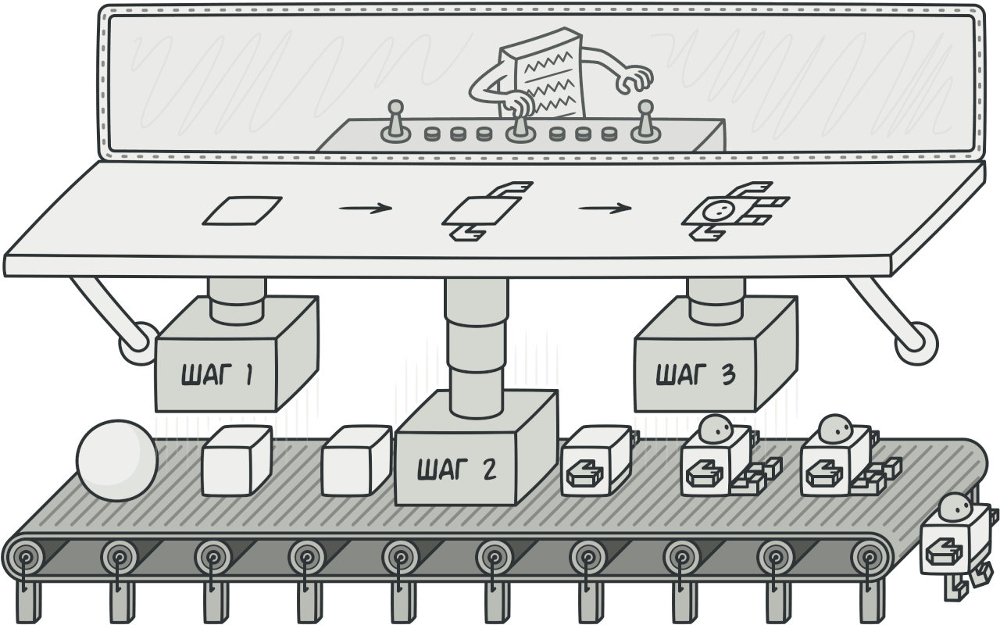
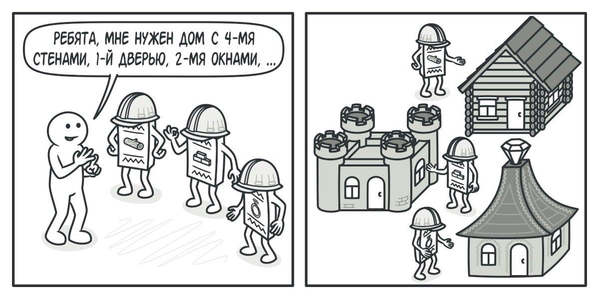
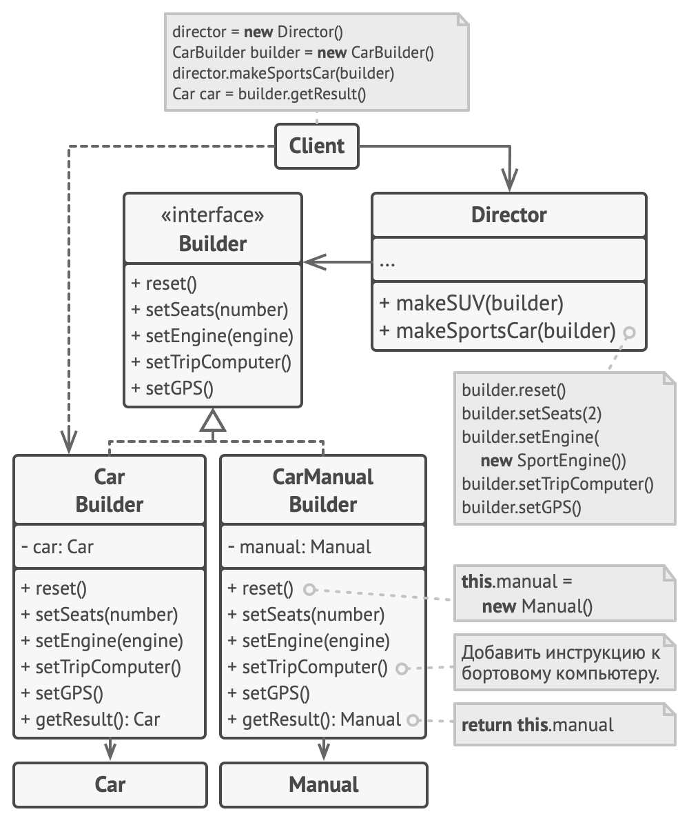

# Строитель

> Также известен как: **Builder**

## Суть паттерна

**Строитель** — это порождающий паттерн проектирования, который позволяет создавать сложные объекты пошагово. Строитель даёт возможность использовать один и тот же код строительства для получения разных представлений объектов.



## Проблема

Представьте сложный объект, требующий кропотливой пошаговой инициализации множества полей и вложенных объектов. Код инициализации таких объектов обычно спрятан внутри монструозного конструктора с десятком параметров. Либо ещё хуже — распылён по всему клиентскому коду.


*Создав кучу подклассов для всех конфигураций объектов, вы можете излишне усложнить программу.*

Например, давайте подумаем о том, как создать объект `Дом`. Чтобы построить стандартный дом, нужно поставить 4 стены, установить двери, вставить пару окон и положить крышу. Но что, если вы хотите дом побольше да посветлее, имеющий сад, бассейн и прочее добро?

Самое простое решение — расширить класс `Дом`, создав подклассы для всех комбинаций параметров дома. Проблема такого подхода — это громадное количество классов, которые вам придётся создать. Каждый новый параметр, вроде цвета обоев или материала кровли, заставит вас создавать всё больше и больше классов для перечисления всех возможных вариантов.

Чтобы не плодить подклассы, вы можете подойти к решению с другой стороны. Вы можете создать гигантский конструктор `Дома`, принимающий уйму параметров для контроля над создаваемым продуктом. Действительно, это избавит вас от подклассов, но приведёт к другой проблеме.


*Конструктор со множеством параметров имеет свой недостаток: не все параметры нужны большую часть времени.*

Большая часть этих параметров будет простаивать, а вызовы конструктора будут выглядеть монструозно из-за длинного списка параметров. К примеру, далеко не каждый дом имеет бассейн, поэтому параметры, связанные с бассейнами, будут простаивать бесполезно в 99% случаев.

## Решение

Паттерн **Строитель** предлагает вынести конструирование объекта за пределы его собственного класса, поручив это дело отдельным объектам, называемым **строителями**.


*Строитель позволяет создавать сложные объекты пошагово. Промежуточный результат всегда остаётся защищён.*

Паттерн предлагает разбить процесс конструирования объекта на отдельные шаги (например, `построитьСтены`, `вставитьДвери` и другие). Чтобы создать объект, вам нужно поочерёдно вызывать методы строителя. Причём не нужно запускать все шаги, а только те, что нужны для производства объекта определённой конфигурации.

Зачастую один и тот же шаг строительства может отличаться для разных вариаций производимых объектов. Например, деревянный дом потребует строительства стен из дерева, а каменный — из камня.

В этом случае вы можете создать несколько классов строителей, выполняющих одни и те же шаги по-разному. Используя этих строителей в одном и том же строительном процессе, вы сможете получать на выходе различные объекты.



*Разные строители выполнят одну и ту же задачу по-разному.*

Например, один строитель делает стены из дерева и стекла, другой из камня и железа, третий из золота и бриллиантов. Вызвав одни и те же шаги строительства, в первом случае вы получите обычный жилой дом, во втором — маленькую крепость, а в третьем — роскошное жилище. Замечу, что код, который вызывает шаги строительства, должен работать со строителями через общий интерфейс, чтобы их можно было свободно взаимозаменять. 

Вы можете пойти дальше и выделить вызовы методов строителя в отдельный класс, называемый <tooltip term="oop_builder_director">директором</tooltip>. В этом случае директор будет задавать порядок шагов строительства, а строитель — выполнять их.


*Директор знает, какие шаги должен выполнить объект-строитель, чтобы произвести продукт.*

Отдельный класс директора не является строго обязательным. Вы можете вызывать методы строителя и напрямую из клиентского кода. Тем не менее, директор полезен, если у вас есть несколько способов конструирования продуктов, отличающихся порядком и наличием шагов конструирования. В этом случае вы сможете объединить всю эту логику в одном классе.

Такая структура классов полностью скроет от клиентского кода процесс конструирования объектов. Клиенту останется только привязать желаемого строителя к директору, а затем получить у строителя готовый результат.

## Структура


1. **Интерфейс строителя** объявляет шаги конструирования продуктов, общие для всех видов строителей.
2. **Конкретные строители** реализуют строительные шаги, каждый по-своему. Конкретные строители могут производить разнородные объекты, не имеющие общего интерфейса.
3. **Продукт** — создаваемый объект. Продукты, сделанные разными строителями, не обязаны иметь общий интерфейс.
4. **Директор** определяет порядок вызова строительных шагов для производства той или иной конфигурации продуктов.
5. Обычно **Клиент** подаёт в конструктор директора уже готовый объект-строитель, и в дальнейшем данный директор использует только его. Но возможен и другой вариант, когда клиент передаёт строителя через параметр строительного метода директора. В этом случае можно каждый раз применять разных строителей для производства различных представлений объектов.

## Псевдокод

В этом примере **Строитель** используется для пошагового конструирования автомобилей, а также технических руководств к ним.



*Пример пошагового конструирования автомобилей и инструкций к ним.*

Автомобиль — это сложный объект, который может быть сконфигурирован сотней разных способов. Вместо того, чтобы настраивать автомобиль через конструктор, мы вынесем его сборку в отдельный класс-строитель, предусмотрев методы для конфигурации всех частей автомобиля.

Клиент может собирать автомобили, работая со строителем напрямую. Но, с другой стороны, он может поручить это дело директору. Это объект, который знает, какие шаги строителя нужно вызвать, чтобы получить несколько самых популярных конфигураций автомобилей.

Но к каждому автомобилю нужно ещё и руководство, совпадающее с его конфигурацией. Для этого мы создадим ещё один класс строителя, который вместо конструирования автомобиля, будет печатать страницы руководства к той детали, которую мы встраиваем в продукт. Теперь, пропустив оба типа строителей через одни и те же шаги, мы получим автомобиль и подходящее к нему руководство пользователя.

Очевидно, что бумажное руководство и железный автомобиль — это две разных вещи, не имеющих ничего общего. По этой причине мы должны получать результат напрямую от строителей, а не от директора. Иначе нам пришлось бы жёстко привязать директора к конкретным классам автомобилей и руководств.

```c
// Строитель может создавать различные продукты, используя один
// и тот же процесс строительства.
class Car is
    // Автомобили могут отличаться комплектацией: типом
    // двигателя, количеством сидений, могут иметь или не иметь
    // GPS и систему навигации и т. д. Кроме того, автомобили
    // могут быть городскими, спортивными или внедорожниками.

class Manual is
    // Руководство пользователя для данной конфигурации
    // автомобиля.


// Интерфейс строителя объявляет все возможные этапы и шаги
// конфигурации продукта.
interface Builder is
    method reset()
    method setSeats(...)
    method setEngine(...)
    method setTripComputer(...)
    method setGPS(...)

// Все конкретные строители реализуют общий интерфейс по-своему.
class CarBuilder implements Builder is
    private field car:Car
    method reset()
        // Поместить новый объект Car в поле "car".
    method setSeats(...) is
        // Установить указанное количество сидений.
    method setEngine(...) is
        // Установить поданный двигатель.
    method setTripComputer(...) is
        // Установить поданную систему навигации.
    method setGPS(...) is
        // Установить или снять GPS.
    method getResult():Car is
        // Вернуть текущий объект автомобиля.

// В отличие от других порождающих паттернов, где продукты
// должны быть частью одной иерархии классов или следовать
// общему интерфейсу, строители могут создавать совершенно
// разные продукты, которые не имеют общего предка.
class CarManualBuilder implements Builder is
    private field manual:Manual
    method reset()
        // Поместить новый объект Manual в поле "manual".
    method setSeats(...) is
        // Описать, сколько мест в машине.
    method setEngine(...) is
        // Добавить в руководство описание двигателя.
    method setTripComputer(...) is
        // Добавить в руководство описание системы навигации.
    method setGPS(...) is
        // Добавить в инструкцию инструкцию GPS.
    method getResult():Manual is
        // Вернуть текущий объект руководства.


// Директор знает, в какой последовательности нужно заставлять
// работать строителя, чтобы получить ту или иную версию
// продукта. Заметьте, что директор работает со строителем через
// общий интерфейс, благодаря чему он не знает тип продукта,
// который изготовляет строитель.
class Director is
    method constructSportsCar(builder: Builder) is
        builder.reset()
        builder.setSeats(2)
        builder.setEngine(new SportEngine())
        builder.setTripComputer(true)
        builder.setGPS(true)


// Директор получает объект конкретного строителя от клиента
// (приложения). Приложение само знает, какого строителя нужно
// использовать, чтобы получить определённый продукт.
class Application is
    method makeCar() is
        director = new Director()

        CarBuilder builder = new CarBuilder()
        director.constructSportsCar(builder)
        Car car = builder.getResult()

        CarManualBuilder builder = new CarManualBuilder()
        director.constructSportsCar(builder)

        // Готовый продукт возвращает строитель, так как
        // директор чаще всего не знает и не зависит от
        // конкретных классов строителей и продуктов.
        Manual manual = builder.getResult()
```

## Применимость

**Когда вы хотите избавиться от «телескопического конструктора».**

Допустим, у вас есть один конструктор с десятью опциональными параметрами. Его неудобно вызывать, поэтому вы создали ещё десять конструкторов с меньшим количеством параметров. Всё, что они делают — это переадресуют вызов к базовому конструктору, подавая какие-то значения по умолчанию в параметры, которые пропущены в них самих.

```c
class Pizza {
    Pizza(int size) { ... }
    Pizza(int size, boolean cheese) { ... }
    Pizza(int size, boolean cheese, boolean pepperoni) { ... }
    // ...
```

*Такого монстра можно создать только в языках, имеющих механизм перегрузки методов, например, C# или Java.*

Паттерн **Строитель** позволяет собирать объекты пошагово, вызывая только те шаги, которые вам нужны. А значит, больше не нужно пытаться «запихнуть» в конструктор все возможные опции продукта.

---

**Когда ваш код должен создавать разные представления какого-то объекта. Например, деревянные и железобетонные дома.**

Строитель можно применить, если создание нескольких представлений объекта состоит из одинаковых этапов, которые отличаются в деталях.

Интерфейс строителей определит все возможные этапы конструирования. Каждому представлению будет соответствовать собственный класс-строитель. А порядок этапов строительства будет задавать класс-директор.

---

**Когда вам нужно собирать сложные составные объекты, например, деревья Компоновщика.**

Строитель конструирует объекты пошагово, а не за один проход. Более того, шаги строительства можно выполнять рекурсивно. А без этого не построить древовидную структуру, вроде Компоновщика.

Заметьте, что Строитель не позволяет посторонним объектам иметь доступ к конструируемому объекту, пока тот не будет полностью готов. Это предохраняет клиентский код от получения незаконченных «битых» объектов.

## Шаги реализации

1. Убедитесь в том, что создание разных представлений объекта можно свести к общим шагам. 
2. Опишите эти шаги в общем интерфейсе строителей. 
3. Для каждого из представлений объекта-продукта создайте по одному классу-строителю и реализуйте их методы строительства. Не забудьте про метод получения результата. Обычно конкретные строители определяют собственные методы получения результата строительства. Вы не можете описать эти методы в интерфейсе строителей, поскольку продукты не обязательно должны иметь общий базовый класс или интерфейс. Но вы всегда сможете добавить метод получения результата в общий интерфейс, если ваши строители производят однородные продукты с общим предком. 
4. Подумайте о создании класса директора. Его методы будут создавать различные конфигурации продуктов, вызывая разные шаги одного и того же строителя. 
5. Клиентский код должен будет создавать и объекты строителей, и объект директора. Перед началом строительства клиент должен связать определённого строителя с директором. Это можно сделать либо через конструктор, либо через сеттер, либо подав строителя напрямую в строительный метод директора. 
6. Результат строительства можно вернуть из директора, но только если метод возврата продукта удалось поместить в общий интерфейс строителей. Иначе вы жёстко привяжете директора к конкретным классам строителей.

## Преимущества и недостатки

**Преимущества**

- Позволяет создавать продукты пошагово. 
- Позволяет использовать один и тот же код для создания различных продуктов. 
- Изолирует сложный код сборки продукта от его основной бизнес-логики.

**Недостатки**

- Усложняет код программы из-за введения дополнительных классов. 
- Клиент будет привязан к конкретным классам строителей, так как в интерфейсе директора может не быть метода получения результата.

## Примеры

### Python

- **Сложность**: 2/3
- **Популярность**: 3/3
- **Применимость**: Паттерн можно часто встретить в Python-коде, особенно там, где требуется пошаговое создание продуктов или конфигурация сложных объектов.
- **Признаки применения паттерна**: Строителя можно узнать в классе, который имеет один создающий метод и несколько методов настройки создаваемого продукта. Обычно, методы настройки вызывают для удобства цепочкой (например, `someBuilder.setValueA(1).setValueB(2).create())`.

Этот пример показывает структуру паттерна **Строитель**, а именно — из каких классов он состоит, какие роли эти классы выполняют и как они взаимодействуют друг с другом.

**main.py: Пример структуры паттерна**

```python
from __future__ import annotations
from abc import ABC, abstractmethod
from typing import Any


class Builder(ABC):
    """
    Интерфейс Строителя объявляет создающие методы для различных
    частей объектов Продуктов.
    """

    @property
    @abstractmethod
    def product(self) -> None:
        pass

    @abstractmethod
    def produce_part_a(self) -> None:
        pass

    @abstractmethod
    def produce_part_b(self) -> None:
        pass

    @abstractmethod
    def produce_part_c(self) -> None:
        pass


class ConcreteBuilder1(Builder):
    """
    Классы Конкретного Строителя следуют интерфейсу Строителя и
    предоставляют конкретные реализации шагов построения. Ваша
    программа может иметь несколько вариантов Строителей,
    реализованных по-разному.
    """

    def __init__(self) -> None:
        """
        Новый экземпляр строителя должен содержать пустой объект
        продукта, который используется в дальнейшей сборке.
        """
        self.reset()

    def reset(self) -> None:
        self._product = Product1()

    @property
    def product(self) -> Product1:
        """
        Конкретные Строители должны предоставить свои собственные
        методы получения результатов. Это связано с тем, что различные
        типы строителей могут создавать совершенно разные продукты с
        разными интерфейсами.
        Поэтому такие методы не могут быть объявлены в базовом
        интерфейсе Строителя (по крайней мере, в статически
        типизированном языке программирования).

        Как правило, после возвращения конечного результата клиенту,
        экземпляр строителя должен быть готов к началу производства
        следующего продукта.
        Поэтому обычной практикой является вызов метода сброса в конце
        тела метода getProduct. Однако такое поведение не является
        обязательным, вы можете заставить своих строителей ждать
        явного запроса на сброс из кода клиента, прежде чем избавиться
        от предыдущего результата.
        """
        product = self._product
        self.reset()
        return product

    def produce_part_a(self) -> None:
        self._product.add("PartA1")

    def produce_part_b(self) -> None:
        self._product.add("PartB1")

    def produce_part_c(self) -> None:
        self._product.add("PartC1")


class Product1():
    """
    Имеет смысл использовать паттерн Строитель только тогда, когда
    ваши продукты достаточно сложны и требуют обширной конфигурации.

    В отличие от других порождающих паттернов, различные конкретные
    строители могут производить несвязанные продукты. Другими словами,
    результаты различных строителей могут не всегда следовать одному и
    тому же интерфейсу.
    """

    def __init__(self) -> None:
        self.parts = []

    def add(self, part: Any) -> None:
        self.parts.append(part)

    def list_parts(self) -> None:
        print(f"Product parts: {', '.join(self.parts)}", end="")


class Director:
    """
    Директор отвечает только за выполнение шагов построения в
    определённой последовательности. Это полезно при производстве
    продуктов в определённом порядке или особой конфигурации. Строго
    говоря, класс Директор необязателен, так как клиент может напрямую
    управлять строителями.
    """

    def __init__(self) -> None:
        self._builder = None

    @property
    def builder(self) -> Builder:
        return self._builder

    @builder.setter
    def builder(self, builder: Builder) -> None:
        """
        Директор работает с любым экземпляром строителя, который
        передаётся ему клиентским кодом. Таким образом, клиентский код
        может изменить конечный тип вновь собираемого продукта.
        """
        self._builder = builder

    """
    Директор может строить несколько вариаций продукта, используя
    одинаковые шаги построения.
    """

    def build_minimal_viable_product(self) -> None:
        self.builder.produce_part_a()

    def build_full_featured_product(self) -> None:
        self.builder.produce_part_a()
        self.builder.produce_part_b()
        self.builder.produce_part_c()


if __name__ == "__main__":
    """
    Клиентский код создаёт объект-строитель, передаёт его директору,
    а затем инициирует процесс построения. Конечный результат
    извлекается из объекта-строителя.
    """

    director = Director()
    builder = ConcreteBuilder1()
    director.builder = builder

    print("Standard basic product: ")
    director.build_minimal_viable_product()
    builder.product.list_parts()

    print("\n")

    print("Standard full featured product: ")
    director.build_full_featured_product()
    builder.product.list_parts()

    print("\n")

    # Помните, что паттерн Строитель можно использовать без класса
    # Директор.
    print("Custom product: ")
    builder.produce_part_a()
    builder.produce_part_b()
    builder.product.list_parts()
```

**Output.txt: Результат выполнения**

```text
Standard basic product: 
Product parts: PartA1

Standard full featured product: 
Product parts: PartA1, PartB1, PartC1

Custom product: 
Product parts: PartA1, PartB1
```

### PHP

- **Сложность**: 2/3
- **Популярность**: 3/3
- **Применимость**: Паттерн можно часто встретить в PHP-коде, особенно там, где требуется пошаговое создание продуктов или конфигурация сложных объектов.
- **Признаки применения паттерна**: Строителя можно узнать в классе, который имеет один создающий метод и несколько методов настройки создаваемого продукта. Обычно, методы настройки вызывают для удобства цепочкой (например, `someBuilder->setValueA(1)->setValueB(2)->create()`).

<tabs>
<tab title="Концептуальный пример">
<p>Этот пример показывает структуру паттерна <b>Строитель</b>, а именно — из каких классов он состоит, какие роли эти классы выполняют и как они взаимодействуют друг с другом.</p>
<p>После ознакомления со структурой, вам будет легче воспринимать второй пример, который рассматривает реальный случай использования паттерна в мире PHP.</p>
<p><b>index.php</b>: Пример структуры паттерна</p>
<code-block lang="php">
<![CDATA[
namespace RefactoringGuru\Builder\Conceptual;

/**
* Интерфейс Строителя объявляет создающие методы для различных частей объектов
* Продуктов.
*/

interface Builder
{
    public function producePartA(): void;
    public function producePartB(): void;
    public function producePartC(): void;
}

/**
* Классы Конкретного Строителя следуют интерфейсу Строителя и предоставляют
* конкретные реализации шагов построения. Ваша программа может иметь несколько
* вариантов Строителей, реализованных по-разному.
*/

class ConcreteBuilder1 implements Builder
{
    private $product;

    /**
    * Новый экземпляр строителя должен содержать пустой объект продукта,
    * который используется в дальнейшей сборке.
    */
    public function __construct()
    {
        $this->reset();
    }

    public function reset(): void
    {
        $this->product = new Product1();
    }

    /**
    * Все этапы производства работают с одним и тем же экземпляром продукта.
    */
    public function producePartA(): void
    {
        $this->product->parts[] = "PartA1";
    }

    public function producePartB(): void
    {
        $this->product->parts[] = "PartB1";
    }

    public function producePartC(): void
    {
        $this->product->parts[] = "PartC1";
    }

    /**
    * Конкретные Строители должны предоставить свои собственные методы
    * получения результатов. Это связано с тем, что различные типы строителей
    * могут создавать совершенно разные продукты с разными интерфейсами.
    * Поэтому такие методы не могут быть объявлены в базовом интерфейсе
    * Строителя (по крайней мере, в статически типизированном языке
    * программирования). Обратите внимание, что PHP является динамически
    * типизированным языком, и этот метод может быть в базовом интерфейсе.
    * Однако мы не будем объявлять его здесь для ясности.
    *
    * Как правило, после возвращения конечного результата клиенту, экземпляр
    * строителя должен быть готов к началу производства следующего продукта.
    * Поэтому обычной практикой является вызов метода сброса в конце тела
    * метода getProduct. Однако такое поведение не является обязательным, вы
    * можете заставить своих строителей ждать явного запроса на сброс из кода
    * клиента, прежде чем избавиться от предыдущего результата.
    */
    public function getProduct(): Product1
    {
        $result = $this->product;
        $this->reset();
        return $result;
    }
}

/**
* Имеет смысл использовать паттерн Строитель только тогда, когда ваши продукты
* достаточно сложны и требуют обширной конфигурации.
*
* В отличие от других порождающих паттернов, различные конкретные строители
* могут производить несвязанные продукты. Другими словами, результаты различных
* строителей могут не всегда следовать одному и тому же интерфейсу.
*/ 

class Product1
{
    public $parts = [];

    public function listParts(): void
    {
        echo "Product parts: " . implode(', ', $this->parts) . "\n\n";
    }
}

/**
* Директор отвечает только за выполнение шагов построения в определённой
* последовательности. Это полезно при производстве продуктов в определённом
* порядке или особой конфигурации. Строго говоря, класс Директор необязателен,
* так как клиент может напрямую управлять строителями.
*/ 

class Director
{
    /**
    * @var Builder
    */
    private $builder;

    /**
    * Директор работает с любым экземпляром строителя, который передаётся ему
    * клиентским кодом. Таким образом, клиентский код может изменить конечный
    * тип вновь собираемого продукта.
    */
    public function setBuilder(Builder $builder): void
    {
        $this->builder = $builder;
    }

    /**
    * Директор может строить несколько вариаций продукта, используя одинаковые
    * шаги построения.
    */
    public function buildMinimalViableProduct(): void
    {
        $this->builder->producePartA();
    }

    public function buildFullFeaturedProduct(): void
    {
        $this->builder->producePartA();
        $this->builder->producePartB();
        $this->builder->producePartC();
    }
}

/**
* Клиентский код создаёт объект-строитель, передаёт его директору, а затем
* инициирует процесс построения. Конечный результат извлекается из объекта-
* строителя.
*/

function clientCode(Director $director)
{
    $builder = new ConcreteBuilder1();
    $director->setBuilder($builder);
    
    echo "Standard basic product:\n";
    $director->buildMinimalViableProduct();
    $builder->getProduct()->listParts();
    
    echo "Standard full featured product:\n";
    $director->buildFullFeaturedProduct();
    $builder->getProduct()->listParts();
    
    // Помните, что паттерн Строитель можно использовать без класса Директор.
    echo "Custom product:\n";
    $builder->producePartA();
    $builder->producePartC();
    $builder->getProduct()->listParts();
}

$director = new Director();
clientCode($director);

]]>
</code-block>
<p><b>Output.txt</b>: Результат выполнения</p>
<code-block lang="text">
<![CDATA[
Standard basic product:
Product parts: PartA1

Standard full featured product:
Product parts: PartA1, PartB1, PartC1

Custom product:
Product parts: PartA1, PartC1

]]>
</code-block>
</tab>
<tab title="Пример из реальной жизни">
<p>Одним из лучших применений паттерна <b>Строитель</b> является конструктор запросов SQL. Интерфейс Строителя определяет общие шаги, необходимые для построения основного SQL-запроса. В тоже время Конкретные Строители, соответствующие различным диалектам SQL, реализуют эти шаги, возвращая части SQL-запросов, которые могут быть выполнены в данном движке базы данных.</p>
<p><b>index.php</b>: Пример из реальной жизни</p>
<code-block lang="php" validate="false" ignore-vars="true" noinject="true">
<![CDATA[
namespace RefactoringGuru\Builder\RealWorld;

/**
* Интерфейс Строителя объявляет набор методов для сборки SQL-запроса.
*
* Все шаги построения возвращают текущий объект строителя, чтобы обеспечить
* цепочку: $builder->select(...)->where(...)
*/ 

interface SQLQueryBuilder
{
    public function select(string $table, array $fields): SQLQueryBuilder;
    
    public function where(string $field, string $value, string $operator = '='): SQLQueryBuilder;
    
    public function limit(int $start, int $offset): SQLQueryBuilder;
    
    // +100 других методов синтаксиса SQL...
    
    public function getSQL(): string;
}

/**
* Каждый Конкретный Строитель соответствует определённому диалекту SQL и может
* реализовать шаги построения немного иначе, чем остальные.
*
* Этот Конкретный Строитель может создавать SQL-запросы, совместимые с MySQL.
*/ 

class MysqlQueryBuilder implements SQLQueryBuilder
{
    protected $query;
    
    protected function reset(): void
    {
        $this->query = new \stdClass();
    }
    
    /**
    * Построение базового запроса SELECT.
    */
    public function select(string $table, array $fields): SQLQueryBuilder
    {
        $this->reset();
        $this->query->base = "SELECT " . implode(", ", $fields) . " FROM " . $table;
        $this->query->type = 'select';
        return $this;
    }
    
    /**
    * Добавление условия WHERE.
    */
    public function where(string $field, string $value, string $operator = '='): SQLQueryBuilder
    {
        if (!in_array($this->query->type, ['select', 'update', 'delete'])) {
            throw new \Exception("WHERE can only be added to SELECT, UPDATE OR DELETE");
        }
        $this->query->where[] = "$field $operator '$value'";
    
        return $this;
    }
    
    /**
    * Добавление ограничения LIMIT.
    */
    public function limit(int $start, int $offset): SQLQueryBuilder
    {
        if (!in_array($this->query->type, ['select'])) {
            throw new \Exception("LIMIT can only be added to SELECT");
        }
        $this->query->limit = " LIMIT " . $start . ", " . $offset;
        
        return $this;
    }
    
    /**
    * Получение окончательной строки запроса.
    */
    public function getSQL(): string
    {
        $query = $this->query;
        $sql = $query->base;
        if (!empty($query->where)) {
            $sql .= " WHERE " . implode(' AND ', $query->where);
        }
        if (isset($query->limit)) {
            $sql .= $query->limit;
        }
        $sql .= ";";
        return $sql;
    }
}
    
/**
* Этот Конкретный Строитель совместим с PostgreSQL. Хотя Postgres очень похож
* на Mysql, в нем всё же есть ряд отличий. Чтобы повторно использовать общий
* код, мы расширяем его от строителя MySQL, переопределяя некоторые шаги
* построения.
*/

class PostgresQueryBuilder extends MysqlQueryBuilder
{
    /**
    * Помимо прочего, PostgreSQL имеет несколько иной синтаксис LIMIT.
    */

    public function limit(int $start, int $offset): SQLQueryBuilder
    {
        parent::limit($start, $offset);
        $this->query->limit = " LIMIT " . $start . " OFFSET " . $offset;
        return $this;
    }
    
    // + тонны других переопределений...
}


/**
* Обратите внимание, что клиентский код непосредственно использует объект
* строителя. Назначенный класс Директора в этом случае не нужен, потому что
* клиентский код практически всегда нуждается в различных запросах, поэтому
* последовательность шагов конструирования непросто повторно использовать.
*
* Поскольку все наши строители запросов создают продукты одного типа (это
* строка), мы можем взаимодействовать со всеми строителями, используя их общий
* интерфейс. Позднее, если мы реализуем новый класс Строителя, мы сможем
* передать его экземпляр существующему клиентскому коду, не нарушая его,
* благодаря интерфейсу SQLQueryBuilder.
*/

function clientCode(SQLQueryBuilder $queryBuilder)
{
    // ...
    
    $query = $queryBuilder
        ->select("users", ["name", "email", "password"])
        ->where("age", 18, ">")
        ->where("age", 30, "<")
        ->limit(10, 20)
        ->getSQL();

    echo $query;
    
    // ...
}


/**
* Приложение выбирает подходящий тип строителя запроса в зависимости от текущей
* конфигурации или настроек среды.
*/
// if ($_ENV['database_type'] == 'postgres') {
//     $builder = new PostgresQueryBuilder(); } else {
//     $builder = new MysqlQueryBuilder(); }
//
// clientCode($builder);


echo "Testing MySQL query builder:\n";
clientCode(new MysqlQueryBuilder());

echo "\n\n";

echo "Testing PostgresSQL query builder:\n";
clientCode(new PostgresQueryBuilder());

]]>
</code-block>
<p><b>Output.txt</b>: Результат выполнения</p>
<code-block lang="sql">
<![CDATA[
Testing MySQL query builder:
SELECT name, email, password FROM users WHERE age > '18' AND
age < '30' LIMIT 10, 20;

Testing PostgresSQL query builder:
SELECT name, email, password FROM users WHERE age > '18' AND 
age < '30' LIMIT 10 OFFSET 20;

]]>
</code-block>
</tab>
</tabs>