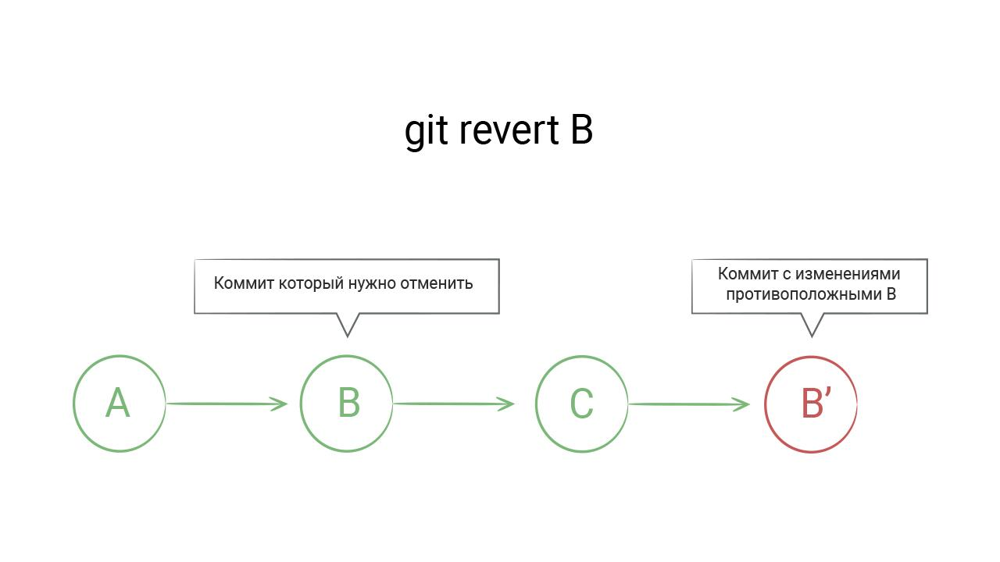
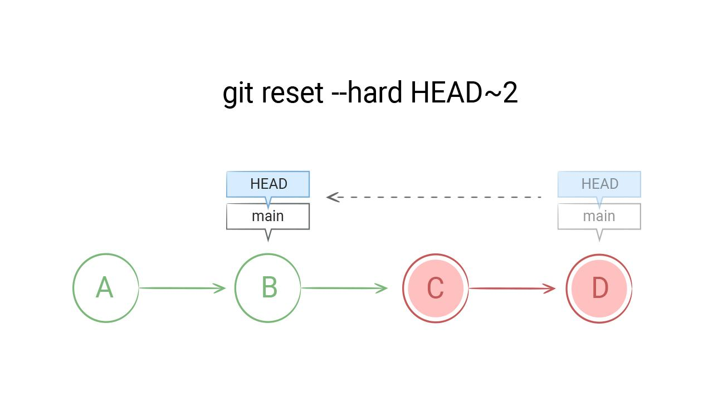

# Отмена коммитов

Git — система, в которой не нужно бояться совершать ошибки. Можно сказать, что ошибки — это единственный способ научиться им пользоваться. В Git практически всегда есть способ восстановить или изменить любые коммиты. На крайний случай спасет повторный ```git clone```.

Что делать, если коммит уже сделан, но он нас по каким-то причинам не устраивает? Ситуаций может быть много, и все они возникают регулярно даже у профессиональных разработчиков:

- Забыли добавить в коммит нужные файлы
- Изменения нужно «откатить», чтобы доработать
- Изменения больше не актуальны, и их нужно удалить
- Изменения были сделаны по ошибке, и их нужно отменить
- По большей части Git движется «только вперед». Правильный подход при работе с ним — это создавать новое, а не изменять старое.

Все ситуации, описанные выше, можно решить новым коммитом, изменяющим код в нужном направлении. Это не только удобно, но и безопасно. Изменение истории коммитов — опасная операция, которая чревата проблемами при синхронизации с удаленными репозиториями. Об этом мы поговорим позже.

Несмотря на сказанное выше, внутри Git существуют специальные команды, позволяющие упростить отмену, либо изменение коммита. С их помощью можно сделать историю коммитов понятной, а сам процесс отката — быстрым. Эти команды мы изучим в этом уроке.

## Git revert

Самая простая ситуация — отмена изменений. Фактически она сводится к созданию еще одного коммита, который выполняет изменения, противоположные тому коммиту, который отменяется:



Руками создавать подобный коммит довольно сложно, поэтому в Git добавили команду, автоматизирующую откат. Эта команда называется ```git revert```:

```bash
# Этой команде нужен идентификатор коммита
# Это коммит, которым мы удалили файл PEOPLE.md
git revert aa600a43cb164408e4ad87d216bc679d097f1a6c
# После этой команды откроется редактор, ожидающий ввода описания коммита
# Обычно сообщение revert не меняют, поэтому достаточно просто закрыть редактор
[main 65a8ef7] Revert "remove PEOPLE.md"
 1 file changed, 1 insertion(+)
 create mode 100644 PEOPLE.md
# В проект вернулся файл PEOPLE.md

git log -p

commit 65a8ef7fd56c7356dcee35c2d05b4400f4467ca8
Author: tirion <tirion@got.com>
Date:   Sat Sep 26 15:32:46 2020 -0400

    Revert "remove PEOPLE.md"

    This reverts commit aa600a43cb164408e4ad87d216bc679d097f1a6c.

diff --git a/PEOPLE.md b/PEOPLE.md
new file mode 100644
index 0000000..4b34ba8
--- /dev/null
+++ b/PEOPLE.md
@@ -0,0 +1 @@
+Haskell Curry
```

Команда ```revert``` может отменять не только последний коммит, но и любой другой коммит из истории проекта. Согласитесь, это очень круто. Без системы контроля версий о таком нельзя было и мечтать.

## Команда ```git reset```

Представьте, что вам нужно удалить только что сделанный по ошибке коммит. Конечно, и в этом случае подходит ```git revert```, но так история становится менее читаемой. Если этот коммит сделан был только сейчас и еще не отправлялся на GitHub, то лучше сделать так, как будто бы этого коммита не существовало в принципе.

Git позволяет удалять коммиты. Это опасная операция, которую нужно делать только в том случае, если речь идет про новые коммиты, которых нет ни у кого, кроме вас.

Если коммит был отправлен во внешний репозиторий, например, на GitHub, то менять историю ни в коем случае нельзя. Это сломает работу у тех, кто работает с вами над проектом.

Для удаления коммита используется команда ```git reset```

```bash
# Добавляем новый коммит, который мы сразу же удалим
echo 'test' >> INFO.md
git add INFO.md
git commit -m 'update INFO.md'

[main 17a77cb] update INFO.md
 1 file changed, 1 insertion(+)
 # Важно, что мы не делаем git push

git reset --hard HEAD~

HEAD is now at 65a8ef7 Revert "remove PEOPLE.md"

# Если посмотреть `git log`, то последнего коммита там больше нет
```

У команды ```git reset``` есть множество различных флагов и способов работы. С ее помощью можно удалять коммиты, отменять их без удаления, восстанавливать файлы из истории и так далее. Работа с ней относится к продвинутому использованию Git, но здесь мы затрагиваем только самую базу.

Флаг ```--hard``` означает полное удаление. Без него ```git reset``` отменит коммит, но не удалит его, а поместит все изменения этого коммита в рабочую директорию, так что с ними можно будет продолжить работать.

Флаг ```HEAD~``` означает «один коммит от последнего коммита». Если бы мы хотели удалить два последних коммита, то могли бы написать ```HEAD~2```:



```HEAD``` (переводится как «голова») — так обозначается последний сделанный коммит. Подробнее эту терминологию мы разберем в уроке, посвященном внутреннему устройству Git.

Если не указывать флаг ```--hard```, то по умолчанию подразумевается флаг ```--mixed```. В таком варианте ```git reset``` отправляет изменения последнего коммита в рабочую директорию. Затем их можно исправить или отменить и выполнить новый коммит:

```bash
echo 'no code no pain' > README.md
git add README.md
git commit -m 'update README.md'

[main f85e3a6] update README.md
 1 file changed, 1 insertion(+)

# Теперь откатываем последний коммит
git reset HEAD~

Unstaged changes after reset:
M   README.md

git status

On branch main
Your branch is up to date with 'origin/main'.

Changes not staged for commit:
  (use "git add <file>..." to update what will be committed)
  (use "git restore <file>..." to discard changes in working directory)
    modified:   README.md
```

Последнего коммита больше не существует. При этом сделанные в нем изменения не пропали. Они находятся в рабочей директории для дальнейшей доработки.

### Самостоятельная работа
1. Выполните все шаги из урока
2. Измените добавленный текст на *No code No pain*
3. Закоммитьте изменения с сообщением update *README.md*
4. Залейте изменения на GitHub