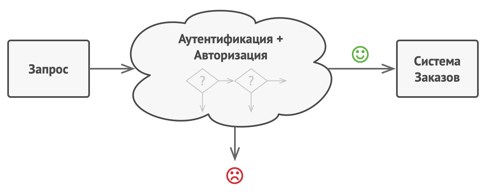
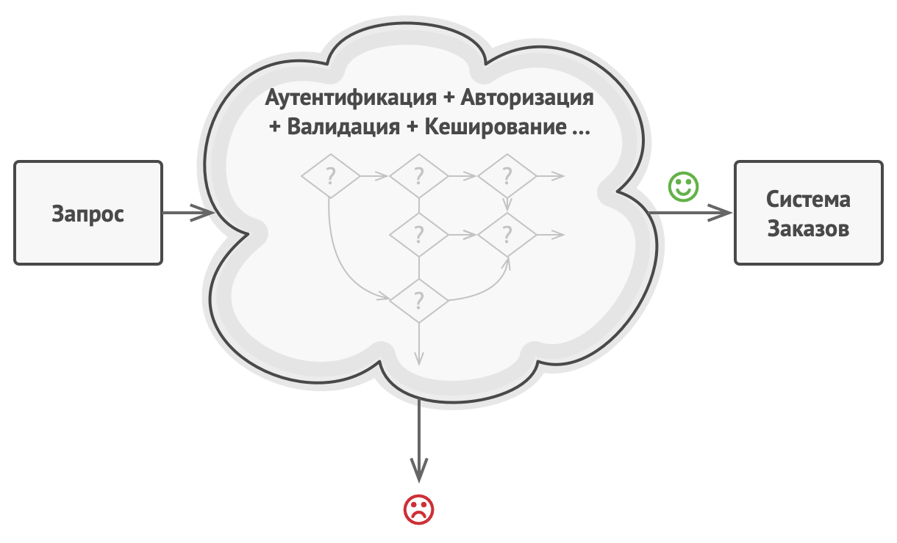
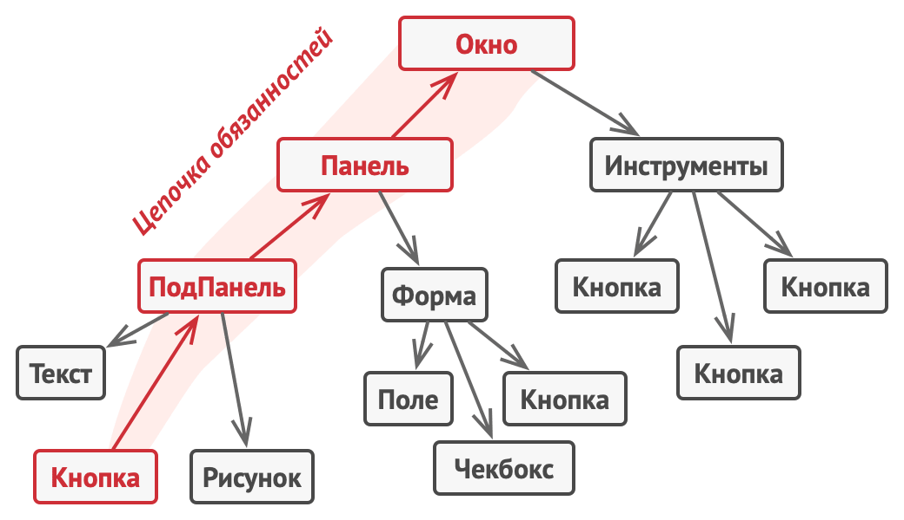
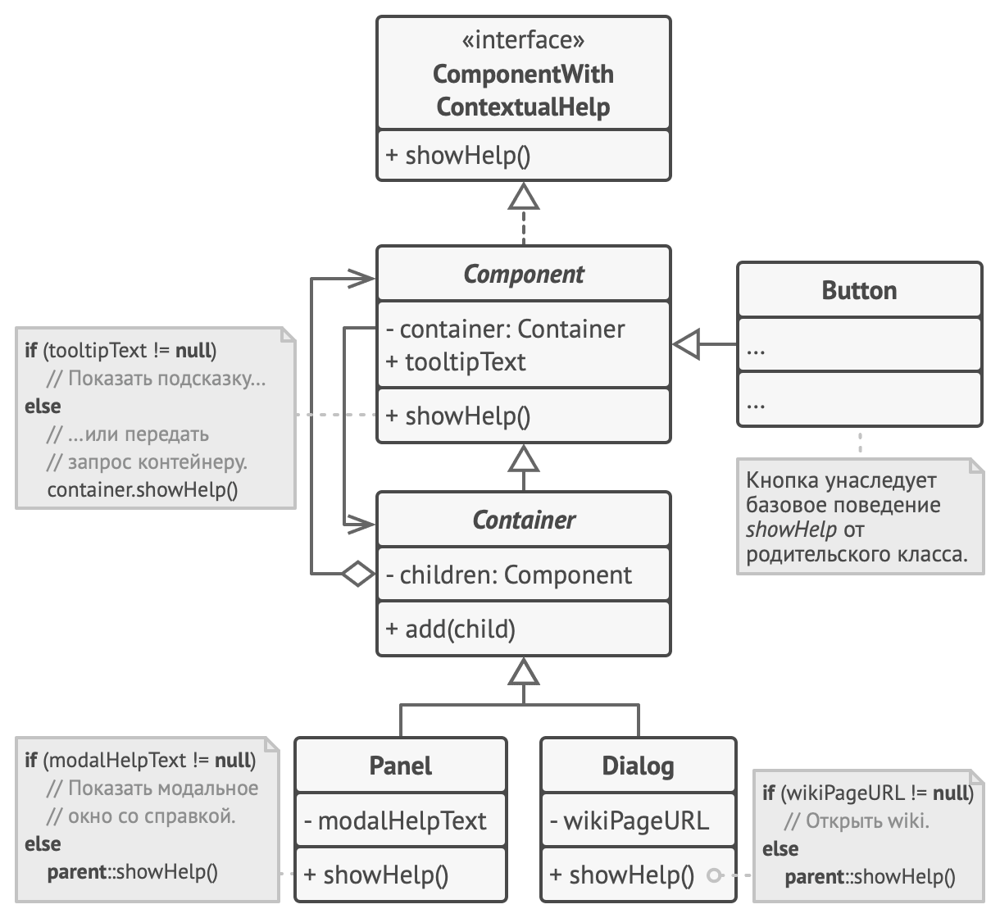
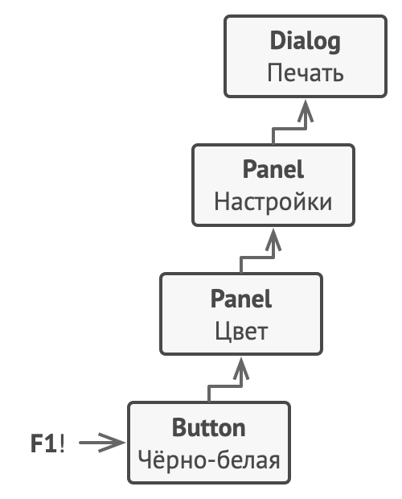

# Цепочка обязанностей

> Также известен как: CoR, Chain of Command, Chain of Responsibility

## Суть паттерна

**Цепочка обязанностей** — это поведенческий паттерн проектирования, который позволяет передавать запросы последовательно по цепочке обработчиков. Каждый последующий обработчик решает, может ли он обработать запрос сам и стоит ли передавать запрос дальше по цепи.


## Проблема

Представьте, что вы делаете систему приёма онлайн-заказов. Вы хотите ограничить к ней доступ так, чтобы только авторизованные пользователи могли создавать заказы. Кроме того, определённые пользователи, владеющие правами администратора, должны иметь полный доступ к заказам.

Вы быстро сообразили, что эти проверки нужно выполнять последовательно. Ведь пользователя можно попытаться «залогинить» в систему, если его запрос содержит логин и пароль. Но если такая попытка не удалась, то проверять расширенные права доступа попросту не имеет смысла.



*Запрос проходит ряд проверок перед доступом в систему заказов.*

На протяжении следующих нескольких месяцев вам пришлось добавить ещё несколько таких последовательных проверок.
- Кто-то резонно заметил, что неплохо бы проверять данные, передаваемые в запросе перед тем, как вносить их в систему — вдруг запрос содержит данные о покупке несуществующих продуктов.
- Кто-то предложил блокировать массовые отправки формы с одним и тем же логином, чтобы предотвратить подбор паролей ботами.
- Кто-то заметил, что форму заказа неплохо бы доставать из кеша, если она уже была однажды показана.



*Со временем код проверок становится всё более запутанным.*

С каждой новой «фичей» код проверок, выглядящий как большой клубок условных операторов, всё больше и больше раздувался. При изменении одного правила приходилось трогать код всех проверок. А для того, чтобы применить проверки к другим ресурсам, пришлось продублировать их код в других классах.

Поддерживать такой код стало не только очень хлопотно, но и затратно. И вот в один прекрасный день вы получаете задачу рефакторинга...

## Решение

Как и многие другие поведенческие паттерны, Цепочка обязанностей базируется на том, чтобы превратить отдельные поведения в объекты. В нашем случае каждая проверка переедет в отдельный класс с единственным методом выполнения. Данные запроса, над которым происходит проверка, будут передаваться в метод как аргументы.

А теперь по-настоящему важный этап. Паттерн предлагает связать объекты обработчиков в одну цепь. Каждый из них будет иметь ссылку на следующий обработчик в цепи. Таким образом, при получении запроса обработчик сможет не только сам что-то с ним сделать, но и передать обработку следующему объекту в цепочке.

Передавая запросы в первый обработчик цепочки, вы можете быть уверены, что все объекты в цепи смогут его обработать. При этом длина цепочки не имеет никакого значения.

И последний штрих. Обработчик не обязательно должен передавать запрос дальше, причём эта особенность может быть использована по-разному.

В примере с фильтрацией доступа обработчики прерывают дальнейшие проверки, если текущая проверка не прошла. Ведь нет смысла тратить попусту ресурсы, если и так понятно, что с запросом что-то не так.


*Обработчики следуют в цепочке один за другим.*

Но есть и другой подход, при котором обработчики прерывают цепь только когда они могут обработать запрос. В этом случае запрос движется по цепи, пока не найдётся обработчик, который может его обработать. Очень часто такой подход используется для передачи событий, создаваемых классами графического интерфейса в результате взаимодействия с пользователем.

Например, когда пользователь кликает по кнопке, программа выстраивает цепочку из объекта этой кнопки, всех её родительских элементов и общего окна приложения на конце. Событие клика передаётся по этой цепи до тех пор, пока не найдётся объект, способный его обработать. Этот пример примечателен ещё и тем, что цепочку всегда можно выделить из древовидной структуры объектов, в которую обычно и свёрнуты элементы пользовательского интерфейса.



*Цепочку можно выделить даже из дерева объектов.*

Очень важно, чтобы все объекты цепочки имели общий интерфейс. Обычно каждому конкретному обработчику достаточно знать только то, что следующий объект в цепи имеет метод `выполнить`. Благодаря этому связи между объектами цепочки будут более гибкими. Кроме того, вы сможете формировать цепочки на лету из разнообразных объектов, не привязываясь к конкретным классам.

## Аналогия из жизни


*Пример общения с поддержкой.*

Вы купили новую видеокарту. Она автоматически определилась и заработала под Windows, но в вашей любимой Ubuntu «завести» её не удалось. Со слабой надеждой вы звоните в службу поддержки.

Первым вы слышите голос автоответчика, предлагающий выбор из десятка стандартных решений. Ни один из вариантов не подходит, и робот соединяет вас с живым оператором.

Увы, но рядовой оператор поддержки умеет общаться только заученными фразами и давать шаблонные ответы. После очередного предложения «выключить и включить компьютер» вы просите связать вас с настоящими инженерами.

Оператор перебрасывает звонок дежурному инженеру, изнывающему от скуки в своей каморке. Уж он-то знает, как вам помочь! Инженер рассказывает вам, где скачать подходящие драйвера и как настроить их под Ubuntu. Запрос удовлетворён. Вы кладёте трубку.

## Структура


1. **Обработчик** определяет общий для всех конкретных обработчиков интерфейс. Обычно достаточно описать единственный метод обработки запросов, но иногда здесь может быть объявлен и метод выставления следующего обработчика.
2. **Базовый обработчик** — опциональный класс, который позволяет избавиться от дублирования одного и того же кода во всех конкретных обработчиках.<br/>
Обычно этот класс имеет поле для хранения ссылки на следующий обработчик в цепочке. Клиент связывает обработчики в цепь, подавая ссылку на следующий обработчик через конструктор или сеттер поля. Также здесь можно реализовать базовый метод обработки, который бы просто перенаправлял запрос следующему обработчику, проверив его наличие.
3. **Конкретные обработчики** содержат код обработки запросов. При получении запроса каждый обработчик решает, может ли он обработать запрос, а также стоит ли передать его следующему объекту.<br/>
В большинстве случаев обработчики могут работать сами по себе и быть неизменяемыми, получив все нужные детали через параметры конструктора.
4. **Клиент** может либо сформировать цепочку обработчиков единожды, либо перестраивать её динамически, в зависимости от логики программы. Клиент может отправлять запросы любому из объектов цепочки, не обязательно первому из них.

## Псевдокод

В этом примере **Цепочка** обязанностей отвечает за показ контекстной помощи для активных элементов пользовательского интерфейса.



*Графический интерфейс построен с помощью компоновщика, где у каждого элемента есть ссылка на свой элемент-контейнер. Цепочку можно выстроить, пройдясь по всем контейнерам, в которые вложен элемент.*

Графический интерфейс приложения обычно структурирован в виде дерева. Класс `Диалог`, отображающий всё окно приложения — это корень дерева. Диалог содержит `Панели`, которые, в свою очередь, могут содержать либо другие вложенные панели, либо простые элементы, вроде `Кнопок`.

Простые элементы могут показывать небольшие подсказки, если для них указан текст помощи. Но есть и более сложные компоненты, для которых этот способ демонстрации помощи слишком прост. Они определяют собственный способ отображения контекстной помощи.



*Пример вызова контекстной помощи в цепочке объектов UI.*

Когда пользователь наводит указатель мыши на элемент и жмёт клавишу <shortcut>F1</shortcut>, приложение шлёт этому элементу запрос на показ помощи. Если он не содержит никакой справочной информации, запрос путешествует далее по списку контейнера элемента, пока не находится тот, который способен отобразить помощь.

```c
// Интерфейс обработчиков.
interface ComponentWithContextualHelp is
    method showHelp()


// Базовый класс простых компонентов.
abstract class Component implements ComponentWithContextualHelp is
    field tooltipText: string

    // Контейнер, содержащий компонент, служит в качестве
    // следующего звена цепочки.
    protected field container: Container

    // Базовое поведение компонента заключается в том, чтобы
    // показать всплывающую подсказку, если для неё задан текст.
    // В обратном случае — перенаправить запрос своему
    // контейнеру, если тот существует.
    method showHelp() is
        if (tooltipText != null)
            // Показать подсказку.
        else
            container.showHelp()


// Контейнеры могут включать в себя как простые компоненты, так
// и другие контейнеры. Здесь формируются связи цепочки. Класс
// контейнера унаследует метод showHelp от своего родителя —
// базового компонента.
abstract class Container extends Component is
    protected field children: array of Component

    method add(child) is
        children.add(child)
        child.container = this


// Большинство примитивных компонентов устроит базовое поведение
// показа помощи через подсказку, которое они унаследуют из
// класса Component.
class Button extends Component is
    // ...

// Но сложные компоненты могут переопределять метод показа
// помощи по-своему. Но и в этом случае они всегда могут
// вернуться к базовой реализации, вызвав метод родителя.
class Panel extends Container is
    field modalHelpText: string

    method showHelp() is
        if (modalHelpText != null)
            // Показать модальное окно с помощью.
        else
            super.showHelp()

// ...то же, что и выше...
class Dialog extends Container is
    field wikiPageURL: string

    method showHelp() is
        if (wikiPageURL != null)
            // Открыть страницу Wiki в браузере.
        else
            super.showHelp()


// Клиентский код.
class Application is
    // Каждое приложение конфигурирует цепочку по-своему.
    method createUI() is
        dialog = new Dialog("Budget Reports")
        dialog.wikiPageURL = "http://..."
        panel = new Panel(0, 0, 400, 800)
        panel.modalHelpText = "This panel does..."
        ok = new Button(250, 760, 50, 20, "OK")
        ok.tooltipText = "This is an OK button that..."
        cancel = new Button(320, 760, 50, 20, "Cancel")
        // ...
        panel.add(ok)
        panel.add(cancel)
        dialog.add(panel)

    // Представьте, что здесь произойдёт.
    method onF1KeyPress() is
        component = this.getComponentAtMouseCoords()
        component.showHelp()
```
## Применимость

**Когда программа должна обрабатывать разнообразные запросы несколькими способами, но заранее неизвестно, какие конкретно запросы будут приходить и какие обработчики для них понадобятся.**

С помощью Цепочки обязанностей вы можете связать потенциальных обработчиков в одну цепь и при получении запроса поочерёдно спрашивать каждого из них, не хочет ли он обработать запрос.

--- 

**Когда важно, чтобы обработчики выполнялись один за другим в строгом порядке.**

Цепочка обязанностей позволяет запускать обработчиков последовательно один за другим в том порядке, в котором они находятся в цепочке.

---

**Когда набор объектов, способных обработать запрос, должен задаваться динамически.**

В любой момент вы можете вмешаться в существующую цепочку и переназначить связи так, чтобы убрать или добавить новое звено.

## Шаги реализации

1. Создайте интерфейс обработчика и опишите в нём основной метод обработки.<br/>
Продумайте, в каком виде клиент должен передавать данные запроса в обработчик. Самый гибкий способ — превратить данные запроса в объект и передавать его целиком через параметры метода обработчика.

2. Имеет смысл создать абстрактный базовый класс обработчиков, чтобы не дублировать реализацию метода получения следующего обработчика во всех конкретных обработчиках.<br/>
Добавьте в базовый обработчик поле для хранения ссылки на следующий объект цепочки. Устанавливайте начальное значение этого поля через конструктор. Это сделает объекты обработчиков неизменяемыми. Но если программа предполагает динамическую перестройку цепочек, можете добавить и сеттер для поля.<br/>
Реализуйте базовый метод обработки так, чтобы он перенаправлял запрос следующему объекту, проверив его наличие. Это позволит полностью скрыть поле-ссылку от подклассов, дав им возможность передавать запросы дальше по цепи, обращаясь к родительской реализации метода.
3. Один за другим создайте классы конкретных обработчиков и реализуйте в них методы обработки запросов. При получении запроса каждый обработчик должен решить:
    - Может ли он обработать запрос или нет?
    - Следует ли передать запрос следующему обработчику или нет?
4. Клиент может собирать цепочку обработчиков самостоятельно, опираясь на свою бизнес-логику, либо получать уже готовые цепочки извне. В последнем случае цепочки собираются фабричными объектами, опираясь на конфигурацию приложения или параметры окружения.
5. Клиент может посылать запросы любому обработчику в цепи, а не только первому. Запрос будет передаваться по цепочке до тех пор, пока какой-то обработчик не откажется передавать его дальше, либо когда будет достигнут конец цепи.
6. Клиент должен знать о динамической природе цепочки и быть готов к таким случаям:
    - Цепочка может состоять из единственного объекта.
    - Запросы могут не достигать конца цепи.
    - Запросы могут достигать конца, оставаясь необработанными.

## Преимущества и недостатки

**Преимущества**

- Уменьшает зависимость между клиентом и обработчиками.
- Реализует [принцип единственной обязанности](single_responsibility_principle.md).
- Реализует [принцип открытости/закрытости](open_close_principle.md).

**Недостатки**

- Запрос может остаться никем не обработанным.

## Примеры реализации паттерна

### Python

- **Сложность**: 2/3
- **Популярность**: 1/3
- **Применимость**: Паттерн встречается в Python не так уж часто, так как для его применения нужна цепь объектов, например, связанный список.
- **Признаки применения паттерна**: Цепочку обязанностей можно определить по спискам обработчиков или проверок, через которые пропускаются запросы. Особенно если порядок следования обработчиков важен.

Этот пример показывает структуру паттерна `Цепочка обязанностей`, а именно — из каких классов он состоит, какие роли эти классы выполняют и как они взаимодействуют друг с другом.

**main.py**: Пример структуры паттерна
```python
from __future__ import annotations
from abc import ABC, abstractmethod
from typing import Any, Optional


class Handler(ABC):
    """
    Интерфейс Обработчика объявляет метод построения цепочки
    обработчиков. Он также объявляет метод для выполнения запроса.
    """

    @abstractmethod
    def set_next(self, handler: Handler) -> Handler:
        pass

    @abstractmethod
    def handle(self, request) -> Optional[str]:
        pass


class AbstractHandler(Handler):
    """
    Поведение цепочки по умолчанию может быть реализовано внутри
    базового класса обработчика.
    """

    _next_handler: Handler = None

    def set_next(self, handler: Handler) -> Handler:
        self._next_handler = handler
        # Возврат обработчика отсюда позволит связать обработчики
        # простым способом, вот так:
        # monkey.set_next(squirrel).set_next(dog)
        return handler

    @abstractmethod
    def handle(self, request: Any) -> str:
        if self._next_handler:
            return self._next_handler.handle(request)

        return None


"""
Все Конкретные Обработчики либо обрабатывают запрос, либо передают его
следующему обработчику в цепочке.
"""


class MonkeyHandler(AbstractHandler):
    def handle(self, request: Any) -> str:
        if request == "Banana":
            return f"Monkey: I'll eat the {request}"
        else:
            return super().handle(request)


class SquirrelHandler(AbstractHandler):
    def handle(self, request: Any) -> str:
        if request == "Nut":
            return f"Squirrel: I'll eat the {request}"
        else:
            return super().handle(request)


class DogHandler(AbstractHandler):
    def handle(self, request: Any) -> str:
        if request == "MeatBall":
            return f"Dog: I'll eat the {request}"
        else:
            return super().handle(request)


def client_code(handler: Handler) -> None:
    """
    Обычно клиентский код приспособлен для работы с единственным
    обработчиком. В большинстве случаев клиенту даже неизвестно, что
    этот обработчик является частью цепочки.
    """

    for food in ["Nut", "Banana", "Cup of coffee"]:
        print(f"\nClient: Who wants a {food}?")
        result = handler.handle(food)
        if result:
            print(f"  {result}", end="")
        else:
            print(f"  {food} was left untouched.", end="")


if __name__ == "__main__":
    monkey = MonkeyHandler()
    squirrel = SquirrelHandler()
    dog = DogHandler()

    monkey.set_next(squirrel).set_next(dog)

    # Клиент должен иметь возможность отправлять запрос любому
    # обработчику, а не только первому в цепочке.
    print("Chain: Monkey > Squirrel > Dog")
    client_code(monkey)
    print("\n")

    print("Subchain: Squirrel > Dog")
    client_code(squirrel)
```

**Output.txt**: Результат выполнения

```bash
Chain: Monkey > Squirrel > Dog

Client: Who wants a Nut?
  Squirrel: I'll eat the Nut
Client: Who wants a Banana?
  Monkey: I'll eat the Banana
Client: Who wants a Cup of coffee?
  Cup of coffee was left untouched.

Subchain: Squirrel > Dog

Client: Who wants a Nut?
  Squirrel: I'll eat the Nut
Client: Who wants a Banana?
  Banana was left untouched.
Client: Who wants a Cup of coffee?
  Cup of coffee was left untouched.
```

### PHP

- **Сложность**: 2/3
- **Популярность**: 2/3
- **Применимость**: Паттерн встречается в PHP не так уж часто, так как для его применения нужно, чтобы в программе были цепи объектов. Пожалуй, самым известным примером использования этого паттерна в PHP является концепция HTTP Request Middleware, описанная в PSR-15. Это обработчики запросов, которые программа запускает перед тем, как выполнить основной обработчик запроса. Если их собрать в одну цепь (что чаще всего и происходит в реальных приложениях), то получится конструкция, очень схожая с паттерном Цепочка Обязанностей.
- **Признаки применения паттерна**: Цепочку обязанностей можно определить по спискам обработчиков или проверок, через которые пропускаются запросы. Особенно если порядок следования обработчиков важен.

<tabs>
<tab title="Концептуальный пример">
<h4 id="chain-php-concept">Концептуальный пример</h4>
<p>Этот пример показывает структуру паттерна <b>Цепочка обязанностей</b>, а именно — из каких классов он состоит, какие роли эти классы выполняют и как они взаимодействуют друг с другом.</p>
<p>После ознакомления со структурой, вам будет легче воспринимать второй пример, который рассматривает реальный случай использования паттерна в мире PHP.</p>
<p><b>index.php</b>: Пример структуры паттерна</p>
<code-block lang="php">
<![CDATA[
namespace RefactoringGuru\ChainOfResponsibility\Conceptual;

/**
* Интерфейс Обработчика объявляет метод построения цепочки обработчиков. Он
* также объявляет метод для выполнения запроса.
*/

interface Handler
{
    public function setNext(Handler $handler): Handler;

    public function handle(string $request): ?string;
}

/**
* Поведение цепочки по умолчанию может быть реализовано внутри базового класса
* обработчика.
*/

abstract class AbstractHandler implements Handler
{
    /**
    * @var Handler
    */
    private $nextHandler;

    public function setNext(Handler $handler): Handler
    {
        $this->nextHandler = $handler;
        // Возврат обработчика отсюда позволит связать обработчики простым
        // способом, вот так:
        // $monkey->setNext($squirrel)->setNext($dog);
        return $handler;
    }

    public function handle(string $request): ?string
    {
        if ($this->nextHandler) {
            return $this->nextHandler->handle($request);
        }
        return null;
    }
}

/**
* Все Конкретные Обработчики либо обрабатывают запрос, либо передают его
* следующему обработчику в цепочке.
*/

class MonkeyHandler extends AbstractHandler
{
    public function handle(string $request): ?string
    {
        if ($request === "Banana") {
            return "Monkey: I'll eat the " . $request . ".\n";
        } else {
            return parent::handle($request);
        }
    }
}

class SquirrelHandler extends AbstractHandler
{
    public function handle(string $request): ?string
    {
        if ($request === "Nut") {
            return "Squirrel: I'll eat the " . $request . ".\n";
        } else {
            return parent::handle($request);
        }
    }
}

class DogHandler extends AbstractHandler
{
    public function handle(string $request): ?string
    {
        if ($request === "MeatBall") {
            return "Dog: I'll eat the " . $request . ".\n";
        } else {
            return parent::handle($request);
        }
    }
}

/**
* Обычно клиентский код приспособлен для работы с единственным обработчиком. В
* большинстве случаев клиенту даже неизвестно, что этот обработчик является
* частью цепочки.
*/
  
function clientCode(Handler $handler)
{
    foreach (["Nut", "Banana", "Cup of coffee"] as $food) {
        echo "Client: Who wants a " . $food . "?\n";
        $result = $handler->handle($food);
        if ($result) {
            echo "  " . $result;
        } else {
            echo "  " . $food . " was left untouched.\n";
        }
    }
}

/**
* Другая часть клиентского кода создает саму цепочку.
*/

$monkey = new MonkeyHandler();
$squirrel = new SquirrelHandler();
$dog = new DogHandler();

$monkey->setNext($squirrel)->setNext($dog);

/**
* Клиент должен иметь возможность отправлять запрос любому обработчику, а не
* только первому в цепочке.
*/

echo "Chain: Monkey > Squirrel > Dog\n\n";
clientCode($monkey);
echo "\n";

echo "Subchain: Squirrel > Dog\n\n";
clientCode($squirrel);

]]>
</code-block>
<p><b>Output.txt</b>: Результат выполнения</p>
<code-block lang="text">
<![CDATA[
Chain: Monkey > Squirrel > Dog

Client: Who wants a Nut?
Squirrel: I'll eat the Nut.
Client: Who wants a Banana?
Monkey: I'll eat the Banana.
Client: Who wants a Cup of coffee?
Cup of coffee was left untouched.

Subchain: Squirrel > Dog

Client: Who wants a Nut?
Squirrel: I'll eat the Nut.
Client: Who wants a Banana?
Banana was left untouched.
Client: Who wants a Cup of coffee?
Cup of coffee was left untouched.

]]>
</code-block>
</tab>
<tab title="Пример из реальной жизни">
<h4 id="chain-php-real">Пример из реальной жизни</h4>
<p>Позволяет избежать привязки отправителя запроса к его получателю, предоставляя возможность обработать запрос нескольким объектам. Связывает в цепочку объекты-получатели, а затем передаёт запрос по цепочке, пока некий получатель не обработает его.</p>
<p>Пример: Пожалуй, самым известным применением паттерна Цепочка обязанностей (CoR) в мире PHP являются промежуточные обработчики HTTP-запросов, называемые <b>middleware</b>. Они стали настолько популярными, что были реализованы в самом языке как часть <b>PSR-15</b>.</p>
<p>Всё это работает следующим образом: HTTP-запрос должен пройти через стек объектов middleware, прежде чем приложение его обработает. Каждое middleware может либо отклонить дальнейшую обработку запроса, либо передать его следующему middleware. Как только запрос успешно пройдёт все middleware, основной обработчик приложения сможет окончательно его обработать.</p>
<p>Можно отметить, что такой подход — своего рода инверсия первоначального замысла паттерна. Действительно, в стандартной реализации запрос передаётся по цепочке только в том случае, если текущий обработчик НЕ МОЖЕТ его обработать, тогда как middleware передаёт запрос дальше по цепочке, когда считает, что приложение МОЖЕТ обработать запрос. Тем не менее, поскольку middleware соединены цепочкой, вся концепция по-прежнему считается примером паттерна CoR.</p>
<p><b>index.php</b>: Пример из реальной жизни</p>
<code-block lang="php">
<![CDATA[
namespace RefactoringGuru\ChainOfResponsibility\RealWorld;

/**
* Классический паттерн CoR объявляет для объектов, составляющих цепочку,
* единственную роль – Обработчик. В нашем примере давайте проводить различие
* между middleware и конечным обработчиком приложения, который выполняется,
* когда запрос проходит через все объекты middleware.
*
* Базовый класс Middleware объявляет интерфейс для связывания объектов
* middleware в цепочку.
*/

abstract class Middleware
{
    /**
    * @var Middleware
    */
    private $next;

    /**
    * Этот метод можно использовать для построения цепочки объектов middleware.
    */
    public function linkWith(Middleware $next): Middleware
    {
        $this->next = $next;
        return $next;
    }

    /**
    * Подклассы должны переопределить этот метод, чтобы предоставить свои
    * собственные проверки. Подкласс может обратиться к родительской реализации
    * проверки, если сам не в состоянии обработать запрос.
    */
    public function check(string $email, string $password): bool
    {
        if (!$this->next) {
            return true;
        }
        return $this->next->check($email, $password);
    }
}

/**
* Это Конкретное Middleware проверяет, существует ли пользователь с указанными
* учётными данными.
*/

class UserExistsMiddleware extends Middleware
{
    private $server;

    public function __construct(Server $server)
    {
        $this->server = $server;
    }

    public function check(string $email, string $password): bool
    {
        if (!$this->server->hasEmail($email)) {
            echo "UserExistsMiddleware: This email is not registered!\n";
            return false;
        }
        if (!$this->server->isValidPassword($email, $password)) {
            echo "UserExistsMiddleware: Wrong password!\n";
            return false;
        }
        return parent::check($email, $password);
    }
}

/**
* Это Конкретное Middleware проверяет, имеет ли пользователь, связанный с
* запросом, достаточные права доступа.
*/

class RoleCheckMiddleware extends Middleware
{
    public function check(string $email, string $password): bool
    {
        if ($email === "admin@example.com") {
            echo "RoleCheckMiddleware: Hello, admin!\n";
            return true;
        }
        echo "RoleCheckMiddleware: Hello, user!\n";
        return parent::check($email, $password);
    } 
}

/**
* Это Конкретное Middleware проверяет, не было ли превышено максимальное число
* неудачных запросов авторизации.
*/

class ThrottlingMiddleware extends Middleware
{
    private $requestPerMinute;

    private $request;

    private $currentTime;

    public function __construct(int $requestPerMinute)
    {
        $this->requestPerMinute = $requestPerMinute;
        $this->currentTime = time();
    }

    /**
    * Обратите внимание, что вызов parent::check можно вставить как в начале
    * этого метода, так и в конце.
    *
    * Это даёт значительно большую свободу действий, чем простой цикл по всем
    * объектам middleware. Например, middleware может изменить порядок
    * проверок, запустив свою проверку после всех остальных.
    */

    public function check(string $email, string $password): bool
    {
        if (time() > $this->currentTime + 60) {
            $this->request = 0;
            $this->currentTime = time();
        }

        $this->request++;

        if ($this->request > $this->requestPerMinute) {
            echo "ThrottlingMiddleware: Request limit exceeded!\n";
            die();
        }
        return parent::check($email, $password);
    }
}

/**
* Это класс приложения, который осуществляет реальную обработку запроса. Класс
* Сервер использует паттерн CoR для выполнения набора различных промежуточных
* проверок перед запуском некоторой бизнес-логики, связанной с запросом.
*/

class Server
{
    private $users = [];

    /**
    * @var Middleware
    */
    private $middleware;

    /**
    * Клиент может настроить сервер с помощью цепочки объектов middleware.
    */
    public function setMiddleware(Middleware $middleware): void
    {
        $this->middleware = $middleware;
    }

    /**
    * Сервер получает email и пароль от клиента и отправляет запрос авторизации
    * в middleware.
    */
    public function logIn(string $email, string $password): bool
    {
        if ($this->middleware->check($email, $password)) {
            echo "Server: Authorization has been successful!\n";
            // Выполняем что-нибудь полезное для авторизованных пользователей.
            return true;
        }
        return false;
    }

    public function register(string $email, string $password): void
    {
        $this->users[$email] = $password;
    }

    public function hasEmail(string $email): bool
    {
        return isset($this->users[$email]);
    }

    public function isValidPassword(string $email, string $password): bool
    {
        return $this->users[$email] === $password;
    }
}

/**
* Клиентский код.
*/
$server = new Server();
$server->register("admin@example.com", "admin_pass");
$server->register("user@example.com", "user_pass");

// Все middleware соединены в цепочки. Клиент может построить различные
// конфигурации цепочек в зависимости от своих потребностей.
$middleware = new ThrottlingMiddleware(2);
$middleware
    ->linkWith(new UserExistsMiddleware($server))
    ->linkWith(new RoleCheckMiddleware());

// Сервер получает цепочку из клиентского кода.
$server->setMiddleware($middleware);
// ...

do {
    echo "\nEnter your email:\n";
    $email = readline();
    echo "Enter your password:\n";
    $password = readline();
    $success = $server->logIn($email, $password);
} while (!$success);

]]>
</code-block>
<p><b>Output.txt</b>: Результат выполнения</p>
<code-block lang="plain text">
<![CDATA[
Enter your email:
asd
Enter your password:
123
UserExistsMiddleware: This email is not registered!

Enter your email:
admin@example.com
Enter your password:
wrong
UserExistsMiddleware: Wrong password!

Enter your email:
admin@example.com
Enter your password:
letmein
ThrottlingMiddleware: Request limit exceeded!


Enter your email:
admin@example.com
Enter your password:
admin_pass
RoleCheckMiddleware: Hello, admin!
Server: Authorization has been successful!

]]>
</code-block>
</tab>
</tabs>