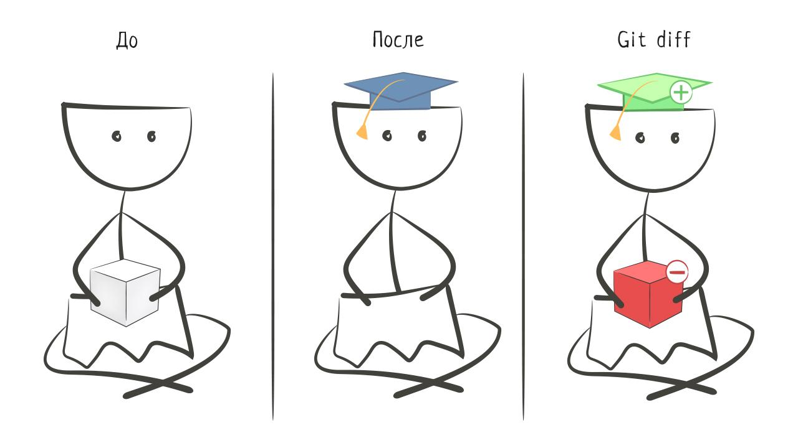

# Анализ сделанных изменений



Во время разработки программистам часто приходится останавливаться и анализировать изменения, которые они сделали с последнего коммита.

Потребность смотреть изменения становится очевидной, если представить себе, что такое работа над реальным проектом. Как правило, это тысячи строк кода, сотни файлов, десятки часов работы над одной задачей.

Потратив даже несколько часов в таком проекте, очень сложно вспомнить, что и где менялось, а что еще осталось поменять. Чтобы было проще, нужно анализировать изменения, о чем мы поговорим в этом уроке.

## Как анализировать изменения

Анализировать изменения важно даже в небольших проектах. Прямо сейчас во время разработки этого курса изменилось несколько файлов и ```git status``` выглядит так:

```bash
git status

Changes to be committed:
  (use "git restore --staged <file>..." to unstage)
    modified:   300-working-directory/README.md

Changes not staged for commit:
  (use "git add <file>..." to update what will be committed)
  (use "git restore <file>..." to discard changes in working directory)
    modified:   100-intro/README.md
    modified:   250-github/README.md
    modified:   300-working-directory/README.md
    modified:   300-working-directory/spec.yml
    modified:   350-changes/README.md
```

Попробуем воспроизвести подобную ситуацию в нашем проекте. Выполним следующий код в репозитории *my-git*:

```bash
echo 'new line' >> INFO.md
echo 'Hello, Friend! How are you?' > README.md

git status

Changes not staged for commit:
  (use "git add <file>..." to update what will be committed)
  (use "git restore <file>..." to discard changes in working directory)
    modified:   INFO.md
    modified:   README.md

no changes added to commit (use "git add" and/or "git commit -a")
```

Изменились оба файла. В один файл мы добавили строчку, в другом — заменили. Как теперь посмотреть эти изменения?

Для этого в Git есть команда ```git diff```, которая показывает разницу между тем, что было и что стало:

```bash
git diff

diff --git a/INFO.md b/INFO.md
index d5225f8..40f51f1 100644
--- a/INFO.md
+++ b/INFO.md
@@ -1 +1,2 @@

 git is awesome!
+new line

diff --git a/README.md b/README.md
index ffe7ece..00fd294 100644
--- a/README.md
+++ b/README.md
@@ -1 +1 @@

-Hello, my dear Friend!!
+Hello, Friend! How are you?
```

Вывод команды поначалу может смутить. Здесь довольно много служебных данных, за которыми уже идут изменения.

Вывод ```git diff``` содержит не файлы целиком, а именно те строки, которые изменились — и иногда строки вокруг измененных для удобства анализа.

Слева от строк ставится:

- Знак ```-```, если строка была удалена
- Знак ```+```, если строка была добавлена

Сама команда не просто выводит на экран разницу между файлами, но и запускает пейджер — специальную программу, которая позволяет перемещаться по выводу и искать внутри него нужные данные. Для этого используются клавиши:

- <shortcut>f</shortcut> — перемещение вниз
- <shortcut>b</shortcut> или <shortcut>u</shortcut> — перемещение вверх
- <shortcut>q</shortcut> — или выход из режима просмотра

По умолчанию команда ```git diff``` показывает изменения только для тех модифицированных файлов, которые еще не были добавлены в индекс. Подразумевается, что добавленные в индекс файлы смотреть не нужно, ведь мы их уже подготовили к коммиту. Но лучше еще раз увидеть эти изменения и все проверить. Для этого нужно запустить команду ```git diff``` с флагом ```--staged```:

```bash
# Выведет все изменения, сделанные в рабочей директории
# которые были добавлены в индекс
git diff --staged
```

В целом, ```git diff``` — команда, которую нужно обязательно запускать перед каждым коммитом. С ее помощью можно проанализировать добавляемые изменения и исправить возможные ошибки, ведь иногда программисты случайно добавляют в коммит то, что туда не должно попасть.

### Самостоятельная работа
1. Выполните все шаги из урока
2. Сделайте коммит с сообщением *add new content*
3. Залейте изменения на GitHub