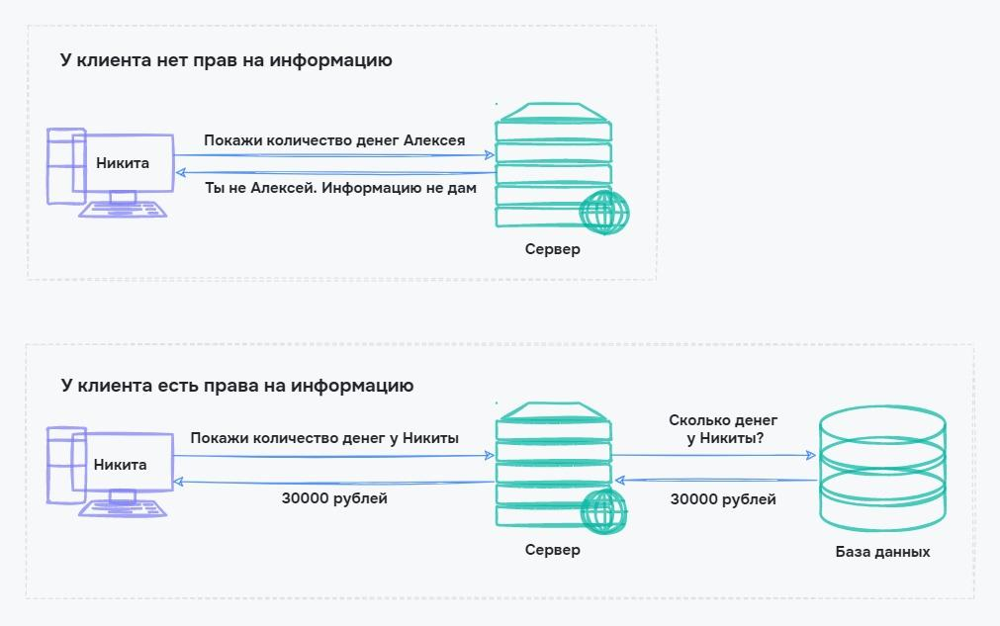

# Клиент-серверная архитектура

Представьте, что вы хотите заказать продукты домой через сайт магазина. Для этого вы заходите на сайт, выбираете товары, кладете их в корзину, заполняете данные о доставке, оплачиваете и ждете продукты.

Данные о вашей покупке посылаются на сайт магазина, который находится на специальном компьютере — сервере, а вы являетесь клиентом.

В этом уроке мы узнаем о клиент-серверной архитектуре — кто такой сервер и клиент и где лежат все сайты в интернете. Также разберемся, почему приложения дублируются на нескольких серверах сразу и кто такой балансировщик.

## Клиент-серверная архитектура и ее компоненты

Приложениями и сайтами одновременно могут пользоваться сотни и даже миллионы человек. Все они обращаются к одному компьютеру, который должен уметь обрабатывать запросы и присылать ответы. Такой подход называется **клиент-серверной архитектурой**. Она описывает, как происходит работа с пользователями, где хранятся данные и как обеспечивается их защита.

В клиент-серверной архитектуре используется три компонента:

- Клиент — программа, которую мы используем в интернете. Чаще всего это браузер, но может быть и другая отдельная программа
- Сервер — компьютер, на котором хранится сайт или приложение. Когда мы заходим на сайт магазина, мы обращаемся к серверу, на котором находится сайт
- База данных — программа, в которой хранятся все данные приложения. Для магазина это будет база клиентов, товаров и заказов

Разберем подробнее особенности каждого компонента клиент-серверной архитектуры и их взаимодействие друг с другом.

## Особенности клиента

Клиент — это всегда программа. Ее назначение — дать пользователю удобный способ взаимодействия с сервером.

С точки зрения сервера, выбрать товар — это послать запрос на специальном языке запросов, например SQL. Но для простого пользователя это сложно. Поэтому клиент дает удобный способ взаимодействия, чтобы не писать код своими руками.

В следующих уроках мы познакомимся с работой сайтов и узнаем, что зайти на сайт — это не просто ввести его адрес в браузер. За этим действием скрываются специальные запросы, ответы и их расшифровка. Для пользователя — это лишнее, и клиент в виде браузера делает эту работу за нас.

## Особенности сервера

Сервер — компьютер, такой же как у нас, только намного мощнее. Основная задача сервера — бесперебойная работа и возможность обрабатывать миллионы запросов от пользователей.

Сервер позволяет не дублировать приложения. Без него для заказа продуктов пришлось бы скачать весь сайт к себе на компьютер, выбрать товары, записать их и отправить на компьютер магазина. Так как сайт находится на сервере, то тысячи человек могут обращаться к одному серверу и получать от него нужную информацию.

Если сервер выполняет функции приложения и базы данных, то такая архитектура называется **двухуровневой**. Такой подход используют для небольших приложений, где нет большого количества клиентов. Хоть такой способ и проще, но его надежность небольшая. Если сервер взломают, то злоумышленники получат все данные.

Чтобы решить проблему безопасности в клиент-серверной архитектуре, используют базу данных. Она хранится отдельно от сервера. Сервер в этом случае выполняет роль логической машины, которая обрабатывает данные, но не хранит их.

## Особенности базы данных

В клиент-серверной архитектуре сервер — это не только компьютер, на котором находится приложение или сайт. Еще это база, где хранятся все данные приложения. У клиентов нет прямого доступа к базе данных, так как это нарушило бы их приватность. Например, частность личной информации других пользователей в социальных сетях.

Клиенты запрашивают информацию у сервера. Если сервер считает, что у клиента есть права на получение информации, то он ее предоставляет. Благодаря этому мы не можем пользоваться учетными записями своих друзей в социальных сетях или получать информацию о банковских переводах незнакомых нам людей.

При такой схеме работы архитектура называется **трехуровневой**, так как состоит из трех компонентов.

Как и у любого решения, у клиент-сервера есть плюсы и минусы. Разберем частые случаи.

## Плюсы и минусы клиент-серверной архитектуры

В большинстве случаев минусы клиент-серверной архитектуры связаны с работоспособностью сервера или базы данных. Разработчики умеют решать большинство минусов, но не все так просто. Решение одних минусов приводит к другим, чаще всего к росту стоимости разработки и поддержки.

Рассмотрим плюсы и минусы клиент-серверной архитектуры и начнем с хороших сторон.

### Плюсы
- Отсутствие дублирования. Весь сайт или приложение хранится на одном компьютере-сервере. Это позволяет использовать его с разных устройств, будь то компьютер или мобильный телефон
- Минимальные требования к пользователю. От него требуется только наличие программы-клиента. Для работы с сайтами достаточно иметь браузер
- Безопасность. Данные хранятся в базе данных и пользователи не могут их просматривать. Это обеспечивает безопасность для персональных данных
- Производительность. Серверы обычно производительнее, чем компьютеры пользователей. Это позволяет обрабатывать тысячи запросов от сотни разных пользователей одновременно. Например, этот урок на Хекслете может читать одновременно сотня человек и вы этого не заметите

### Минусы
- Перегрузка сервера. Популярные порталы могут получать большое количество запросов одновременно. Например, при десятке миллионов запросов в секунду сервер может не выдержать и отключиться. Этим пользуются хакеры при использовании DDoS-атаки. Подробнее виды атак рассмотрим в следующих уроках
- Выход из строя сервера или базы данных. Это сделает сервис недоступным для всех пользователей
- Высокая стоимость оборудования. Сервер похож на простой компьютер, но его комплектующие должны быть рассчитаны на бесперебойную работу 24/7. Такая надежность обеспечивается компонентами со специальными функциями, из-за чего стоимость оборудования повышается
- Затраты на поддержку. Обычно недостаточно просто получить сервер и забыть про его существование. Должен быть специалист, который будет обслуживать сервер и быстро реагировать в случае поломок
- Чтобы избавиться от большинства перечисленных минусов, разработчики используют кластеры серверов.

## Кластеры серверов и балансировщики

Чтобы избежать проблем с клиент-серверной архитектурой, разработчики применяют **кластеры серверов** — когда приложение находится не на одном, а сразу на нескольких серверах. Информация на таких серверах дублируется:

Если один сервер вышел из строя, то его подменяет другой. Это дает время, чтобы устранить неисправности сервера так, что пользователи и не заметят.

Еще кластеры используются, чтобы распределять нагрузку. Мы уже говорили, что сервер может отключиться от десятка миллионов одновременных запросов. Кластеры можно настроить так, чтобы при десяти миллионах запросов они ушли не на один сервер, а на разные.

Чтобы определить, на какой сервер послать запрос, используется **балансировщик** — сервис, который пропускает все запросы через себя и следит, чтобы серверы не перегружались:

Балансировщики и кластеры могут использоваться не только для серверов с приложением, но и для баз данных. Так можно получить независимые кластеры всего приложения, которые смогут подменять друг друга и помогать в обработке запросов от пользователей.

Такие решения повышают надежность приложения, но сильно возрастает стоимость оборудования и поддержки. Поэтому небольшие компании и частные сайты не используют их. В этом случае ответственность за работоспособность берут хостинги — компании, которые предоставляют услугу аренды серверов для приложений. Подробнее о них поговорим в следующих уроках.

### Выводы

В этом уроке мы узнали о клиент-серверной архитектуре, а также кто такой сервер и клиент и где лежат все сайты в интернете. Еще мы разобрались, почему приложения дублируются на нескольких серверах сразу и кто такой балансировщик. Повторим важные моменты урока:

- Сайты и приложения в интернете работают по клиент-серверной архитектуре
- Клиент — приложение, которое обеспечивает связь с сервером и доступно пользователям без технических знаний
- Сервер — компьютер, на котором хранится сайт или приложение. Серверы общаются с клиентами и базами данных
- Для обеспечения надежности используются кластеры серверов и баз данных
- В кластерах для управления потоком запросов используются балансировщики — сервисы, распределяющие нагрузку

### Вопросы для самопроверки

**Три компонента в клиент-серверной архитектуре:**

- База клиентов
- Клиент
- База данных
- Сервер
- Сетевая карта

**Кто такой клиент?**

- Тот, кто всегда прав
- Приложение для взаимодействия с базой данных
- Приложение для взаимодействия с сервером

**Как обеспечивается бесперебойность работы приложения?**

- С помощью кластеров
- С помощью балансировщиков
- С помощью полиции
- С помощью ограничений клиентов

**Какой сервис позволяет распределить нагрузки в кластере?**

- Уравнитель
- Распределитель
- Балансировщик