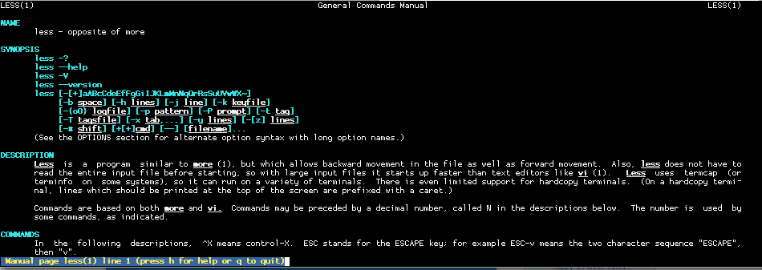
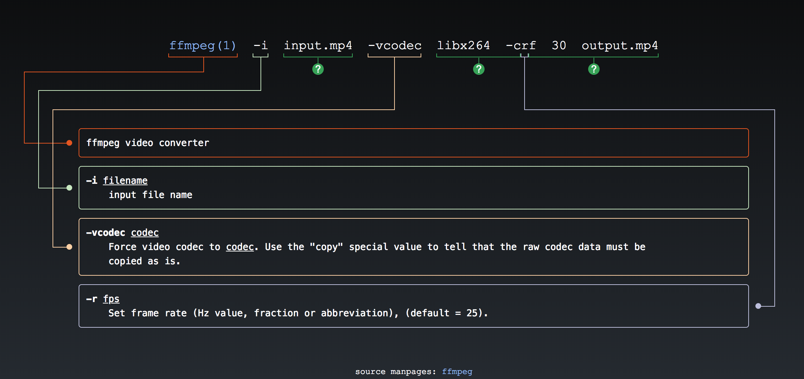

# Интерфейс командной строки

Представьте, что вы изучаете новую для себя программу. Вы запускаете ее, читаете названия пунктов меню, нажимаете на разные кнопки и получаете какой-нибудь результат. В этот момент вы взаимодействуете с **графическим интерфейсом** — так же его называют *GUI* или *Graphical User Interface*.

Но GUI — это не единственный существующий интерфейс. В этом уроке мы изучим **интерфейс командной строки** (*CLI* или *Command Line Interface*). Такой интерфейс может показаться непривычным, ведь в нем нет ничего, кроме названия программы.

## Аргументы и опции

Чем чаще вы будете использовать командную строку, тем больше различных программ вам встретится. Многие из них станут повседневными инструментами. Например, вы часто будете пользоваться программой `ls`, которая выводит на экран список файлов и директорий.

Здесь все просто. Достаточно набрать название программы и нажать <shortcut>Enter</shortcut>:

```bash
ls

Desktop Documents Downloads Library Movies Music Pictures Public
```

Еще мы можем посмотреть скрытые файлы и директории. В *nix-системах они начинаются с точки: `.profile.`

Тогда необходимо набрать `ls -a`:

```bash
ls -a

.  .CFUserTextEncoding Desktop   Downloads Movies Pictures
.. .localized          Documents Library   Music  Public
```

А если захотим посмотреть содержимое каталога Public? Тогда мы воспользуемся командой `ls` с аргументом:

```bash
ls Public

Drop Box
```

Некоторые программы сложно конфигурируются, поэтому их бывает трудно использовать. Посмотрим на такой неочевидный пример:

```bash
ffmpeg -i input.mp4 -vcodec libx264 -crf 30 output.mp4
```

В этом уроке нам пока не нужно детально разбираться во всех подробностях таких сложных примеров. Главное — увидеть закономерности в использовании консольных программ.

Хорошая новость в том, что закономерности есть. Плохая новость — не все четко следуют им.

Практически любую команду можно дополнить двумя способами:

Способ 1 — это **аргументы**. Для примера рассмотрим команду `ls Music`, которая содержит аргумент `Music`

Способ 2 — это **опции**, еще их иногда называют флагами. Например, команда `ls -a` содержит в себе опцию `-a`

## Опции

Поговорим подробнее об опциях. Они всегда начинаются с одного или двух дефисов. Одна из часто используемых опций для просмотра списка файлов — `-l`. Она выводит дополнительную информацию по каждому файлу:

```bash
ls -l

total 0
drwx------+  3 Guest  _guest   96 Nov 21  2017 Desktop
drwx------+  3 Guest  _guest   96 Nov 21  2017 Documents
drwx------+  3 Guest  _guest   96 Nov 21  2017 Downloads
drwx------+ 26 Guest  _guest  832 Nov 21  2017 Library
drwx------+  3 Guest  _guest   96 Nov 21  2017 Movies
drwx------+  3 Guest  _guest   96 Nov 21  2017 Music
drwx------+  3 Guest  _guest   96 Nov 21  2017 Pictures
drwxr-xr-x+  4 Guest  _guest  128 Nov 21  2017 Public
```

Опции можно комбинировать. Представим, что мы хотим увидеть список всех файлов, включая скрытые, причем с подробным описанием. В таком случае нужно набрать команду `ls -a -l`. Можно объединить эти опции и записать ту же команду вот так:

```bash
ls -al
ls -la
```

При работе с опциями не забывайте ставить `-`. Без него вы получите команду `ls la` в которой `la` — это аргумент, а не опция. В таком случае командная оболочка покажет содержимое директории `la`.

Еще мы можем использовать опции и аргументы одновременно, хотя все зависит от программы. В случае с `ls` можно использовать одновременно и то, и другое. Чтобы просмотреть полное содержимое директории `Music` с информацией о каждом файле, можно набрать команду `ls -la Music`:

```bash
ls -la Music

total 0
drwx------+  4 Guest  _guest   128 Nov 21  2017 .
drwxr-xr-x+ 89 Guest  _guest  2848 Aug 24 14:06 ..
-rw-r--r--   1 Guest  _guest     0 Nov 21  2017 .localized
drwxr-xr-x   9 Guest  _guest   288 Aug 26 17:25 iTunes
```

[](https://asciinema.org/a/D23SJ0OEyOdNlRAl0Pl91rjvw/iframe?preload=1&cols=120&rows=17)

Как видно из примера выше, опции указываются слева от аргументов. Но иногда бывают ситуации, когда они используются справа, такое чаще встречается в сложных утилитах со вложенными командами. Их мы сейчас не рассматриваем.

Иногда сложно понять подобные записи: `-tupa`. Не совсем понятно, что это:

- Одна опция `tupa`
- Четыре опции `t`, `u`, `p` и `a`, объединенные в одну цепочку

В таких ситуациях нужно смотреть документацию соответствующей программы. Это можно сделать с помощью команды `man` (сокращение от *manual*). Достаточно набрать `man <имя команды>` — и мы попадем в режим чтения документации.

В мануале содержится описание утилиты в целом, формат ее вызова, все возможные опции, примеры вызовов и много другой полезной информации:



Попробуйте прямо сейчас посмотреть мануал программы `ls`, набрав в терминале `man ls`. Перемещаться внутри мануала можно так:

- Промотать вперед — <shortcut>f</shortcut> (forward)
- Промотать назад — <shortcut>b</shortcut> (backward)
- Выход из режима просмотра — <shortcut>q</shortcut> (quit)

Еще полезен сайт [explainshell](https://explainshell.com). На нем можно вбить любую команду и посмотреть удобное интерактивное описание:



## Варианты опций

У большинства утилит есть два варианта одной и той же опции — длинная и короткая версия. Например, в PHP есть `-v` и `--version`:

```bash
php -v

PHP 7.2.7 (cli) (built: Jun 22 2018 06:27:50) ( NTS )
Copyright (c) 1997-2018 The PHP Group
Zend Engine v3.2.0, Copyright (c) 1998-2018 Zend Technologies

php --version

PHP 7.2.7 (cli) (built: Jun 22 2018 06:27:50) ( NTS )
Copyright (c) 1997-2018 The PHP Group
Zend Engine v3.2.0, Copyright (c) 1998-2018 Zend Technologies
```

[](https://asciinema.org/a/pMP3RNIkrIyBMmVxe6rqUWueB/iframe?preload=1&cols=160&rows=20)

Длинные и короткие версии опций используются в разных ситуациях:

- Когда мы работаем в терминале, важно набирать быстро — там удобны короткие опции
- Когда мы пишем скрипт из разных команд, важно писать понятно — лучше использовать длинные опции. Так с первого взгляда очевидно, что означает каждая опция

Надо отметить, что обычно длинные опции предваряются двумя дефисами, но некоторые программы нарушают это правило и используют один, что вносит путаницу.

Опции, которые мы рассматривали выше, не имеют параметров. Но нередко встречаются опции, которые недостаточно просто указать.

Например, в macOS есть встроенная утилита `say`. Если просто передать ей какой-то текст, то она его произнесет. Можно пойти дальше и записать произнесенный текст в файл.

Чтобы это сделать, надо указать опцию `-o` и записать путь до файла:

```bash
# Вместо -o можно написать --output-file
say -o hi.aac 'Hello, World.'
```

В этом примере путь до файла — это **значение опции**, обычно оно указывается через пробел от самой опции.

Если значение опции содержит в себе специальные или пробельные символы, то его нужно оборачивать в кавычки, двойные или одинарные:

```bash
say -o 'hi.aac' 'Hello, World.'
```

Некоторые программы допускают использование знака = вместо пробела:

```bash
# Команда say такое не позволяет, но зато видно принцип
say -o=hi.aac 'Hello, World.'
```

Кроме того, `say` позволяет указать входной файл, который нужно прочитать. Если он указан, то `say` проигнорирует передаваемый текст как аргумент:

```bash
# Здесь мы указали входной файл, который нужно прочитать — hello_world.txt
# Еще здесь указано, каким голосом надо читать и в какой файл записывать прочитанное
say -v Alex -o hi -f hello_world.txt
```
Теперь посмотрим на документацию программы `say`, а именно в раздел **SYNOPSIS**. Там мы увидим все доступные возможности:

```bash
say [-v voice] [-r rate] [-o outfile [audio format options] | -n name:port | -a device] [-f file | string ...]
```

Такое подробное описание есть практически у любой утилиты. Описания построены по одному и тому же принципу:

- Квадратные скобки `[]` обозначают необязательность. Например, опция `-v` необязательна, то же самое касается и любых других опций этой программы
- Вертикальная черта `|` обозначает операцию «исключающее или». Посмотрите на последний блок `[-f file | string ...]`. Он означает, что `say` может либо произносить текст из файла, либо произносить строчку, переданную как аргумент. Сделать оба варианта одновременно не получится

Бывают и другие вариации описания способов вызова: значение по умолчанию, выбор из конкретных элементов, отрицание.

Здесь мы разобрали только самые базовые моменты, с которыми вам предстоит столкнуться. Не стоит переживать, если вы не чувствуете, что все это запомнили. Опции требуют практики и опыта, а не заучивания теории. Теперь вы понимаете общие принципы и можете смотреть документацию, далее дело за экспериментами.

### Дополнительные материалы

- [Построение приложений командной строки (CLI)](https://habr.com/post/150950/)
- [Справочник по командной оболочке](https://explainshell.com/)


### Вопросы для самопроверки

**Какой флаг использован в команде `ls -lt`?**

- `-l`
- `-t`
- `-lt`
- `ls`

**Как еще можно записать команду `ls -lta` так, чтобы не изменился смысл?**

- `ls -l -t -a`
- `ls -la -t`
- `ls --lta`
- `lslta`
- `ls lta`
- `ls -atl`
- `ls -l ta`

**Сколько аргументов использовано в команде `ls -lt /home`?**

- 1
- 0
- 2
- 3