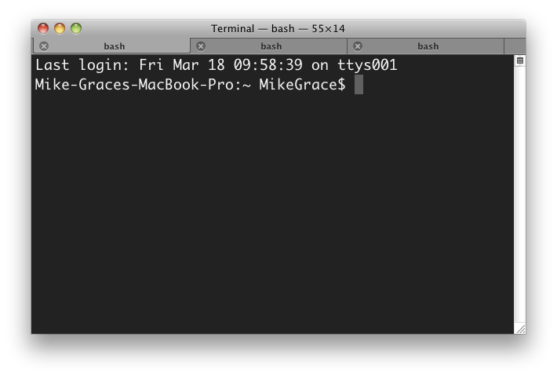
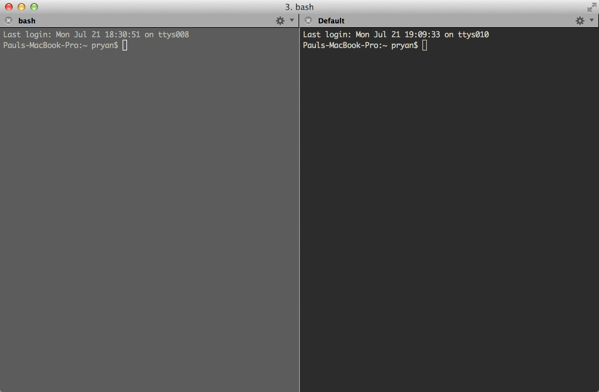
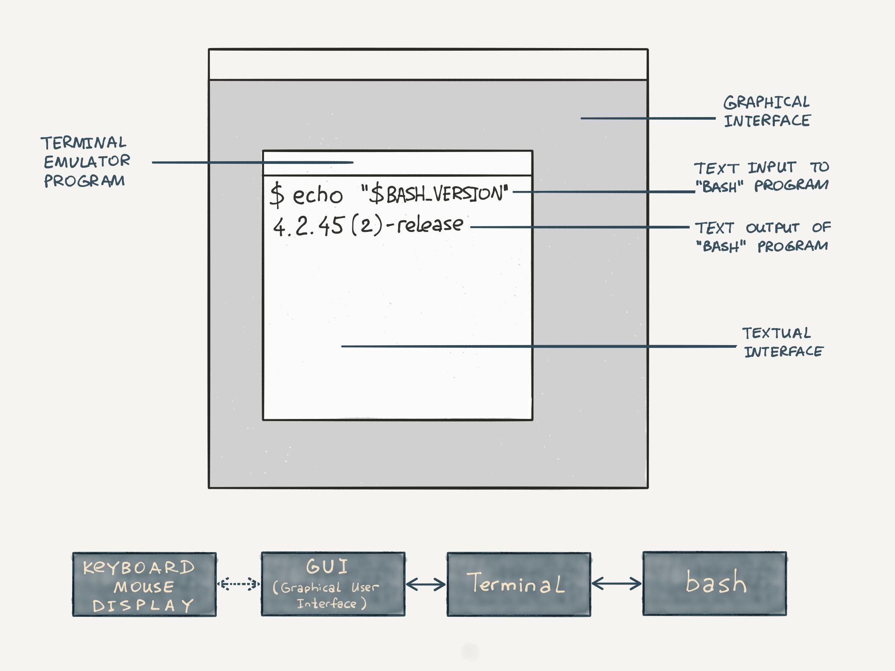
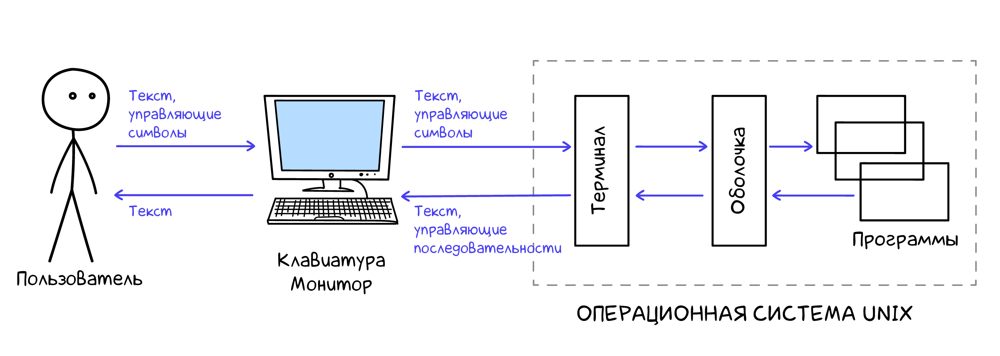

# Командная строка

Для работы с командной строкой понадобятся две вещи: **терминал** и **командная оболочка**. В этом уроке вы узнаете, как они работают и чем отличаются друг от друга.

## Терминал

Терминалом называют программу, которая эмулирует поведение железного терминала, состоящего из клавиатуры и монитора. В простейшем случае — это просто окошко с командной строкой внутри:



Хороший терминал все же не ограничивается одним окном, а позволяет открывать новые терминалы в **табах** — по такому же принципу, как работают вкладки в браузере.

Некоторые терминалы позволяют делать **сплиты**, то есть разделять окно на части. Этот довольно удобный механизм есть, например, в [iterm2](https://iterm2.com):



Хорошие терминалы также умеют восстанавливать завершенную сессию, создавать профили под разные задачи и многое другое.

## Командная оболочка

**Командная оболочка** — программа, через которую пользователь или администратор управляет операционной системой и установленными программами, используя командную строку. У этого понятия множество синонимов — shell, командный интерпретатор и командный процессор.

Оболочка — это лишь средство для выполнения определенных задач, а не сама задача. Этим она отличается от многих других программ.

Внутри терминала пользователь передает системе строки:



Каждая строка — это команда, которую система должна выполнить. После ввода команды обязательно нажать <shortcut>Enter</shortcut>, только в этом случае команда отправится на исполнение. После нажатия <shortcut>Enter</shortcut> отредактировать команду уже нельзя.

Оболочка запускается внутри терминала и приглашает ко вводу команд:

```bash
~$ █
```

Рассмотрим фрагмент кода подробнее. Мы видим:

- Символ `$` — он используется как разделитель
- Слева от `$` — настраиваемое сообщение для вывода, обычно это текущая директория
- Справа от `$` — команда, которую вводит пользователь

Все примеры в дальнейшем будут демонстрироваться без этого сообщения и символа. Рассмотрим для примера команду `date`, которая выводит текущую дату:

```bash
date

Sun Aug 26 14:02:59 CEST 2018
█
```

[](https://asciinema.org/a/X0rfaJunasjGlEVeG10Zkpwek/iframe?preload=1&cols=120&rows=13)

Другой пример команды — комментарии. Как и в любых языках программирования, они ни на что не влияют. С их помощью мы просто описываем происходящее:

```bash
# Комментарий

█
```
Командная оболочка позволяет запускать на выполнение установленные программы. Но это далеко не все, на что она способна. Для комфортной работы полезно иметь:

- Автоматическое завершение имен программ и файлов
- Историю введенных команд
- Возможность перемещаться по файловой системе
- Удобные горячие клавиши
- Поддержку скриптов 

Далее в курсе мы раскроем многие из этих аспектов.

Командные оболочки и терминалы бывают разные, хотя по умолчанию в большинстве операционных систем стоит [Bash](https://ru.wikipedia.org/wiki/Bash).

Отдельно скажем, что командная оболочка и терминал — не одно и то же. Терминал — это программа, которая запускает командную оболочку внутри себя:



Как вы увидите далее, командная оболочка — это полноценная среда программирования. Многие команды являются стандартными конструкциями любого языка программирования: переменными, циклами или условиями. Кроме того, некоторые команды являются программами, а некоторые — нет. В ближайших уроках для простоты мы будем говорить слово «команда», но потом объясним разницу.

Командную оболочку нередко называют **реплом** от английского *REPL (Read-Eval-Print-Loop)*. Это сокращение отражает способ взаимодействия командной оболочки с пользователем:

- *Read* — оболочка ждет ввода команды от пользователя
- *Eval* — исполняет введенную команду
- *Print* — выводит результат
- *Loop* — возвращаемся к первому пункту

Этот процесс называется **интерактивной сессией**: после загрузки командная оболочка ждет ввода команды, исполняет ее, выводит результат и снова ждет ввода команды. Так происходит до тех пор, пока не будет дана команда на выход из терминала или выключение компьютера.

REPL — широко распространенный способ взаимодействия с пользователем. В следующих курсах вы увидите, что он есть и у баз данных, и у языков программирования.

Чтобы вам было удобнее выполнять задания к урокам, в среде Хекслета сразу запущено два терминала. Терминалы доступны в нижних вкладках под именами Terminal 1 и Terminal 2.

Во время изучения и экспериментов достаточно легко допустить ошибки. Всегда внимательно читайте вывод, в случае паники переоткройте терминал. Это позволит начать все с чистого листа.

### Самостоятельная работа

Чтобы научиться работать в командной строке, нужно как можно больше практиковаться в терминале на вашем компьютере.

Сначала нужно установить терминал. Установка зависит от вашей операционной системы:

- Если вы используете Linux или MacOS, в вашей операционной системе уже есть установленный терминал. Можете использовать его или скачать более продвинутую версию — например, [iTerm2](https://iterm2.com) для MacOS и [Tilix](https://gnunn1.github.io/tilix-web/) для Linux

- Если вы работаете с ОС Windows, вам потребуется использовать [WSL](https://learn.microsoft.com/ru-ru/windows/wsl/install)

Далее убедитесь, что внутри терминала можно запустить bash-сессию. Откройте терминал и введите такой текст:

```bash
echo $SHELL

/bin/bash # Это вывод команды, которую вы ввели выше
```

[](https://asciinema.org/a/Il9wwLbctBekEJ6UV8MccLMz7/iframe?preload=1&cols=120&rows=13)

### Дополнительные материалы

1. [Как работать с Linux, используя Windows](https://guides.hexlet.io/ru/ubuntu-linux-in-windows/?_gl=1*1wvvdxh*_ga*MTExOTQzMTcyNC4xNzAwNTc4NDA3*_ga_PM3R85EKHN*MTcwMTM0ODI2My44LjEuMTcwMTM1MDUzNy4wLjAuMA..*_ga_WWGZ6EVHEY*MTcwMTM0ODY5My4xMC4xLjE3MDEzNTA0NzcuNjAuMC4w)

### Вопросы для самопроверки

**Может ли терминал быть устройством?**

- Нет, терминал — это всегда программа
- Да, он может быть устройством — например, есть терминал для приема оплаты

**Выберите верное утверждение:**

- Терминал запускается командным интерпретатором
- Командный интерпретатор запускается терминалом
- Терминал и командный интерпретатор — это синонимы

**Какие возможности обычно есть у командной оболочки?**

- Автозавершение вводимых команд
- История введенных команд
- Восстановление вкладок после закрытия программы
- Поддержка вкладок