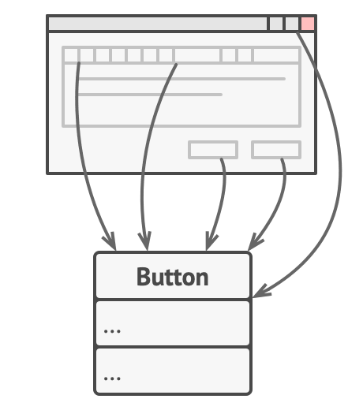
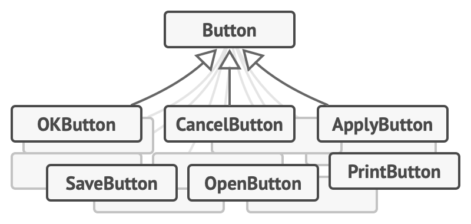
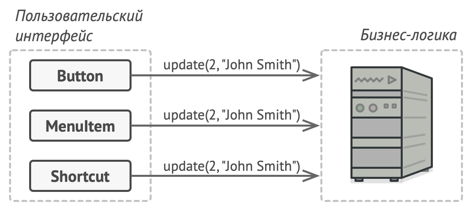
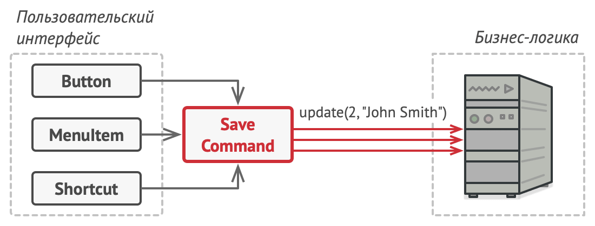
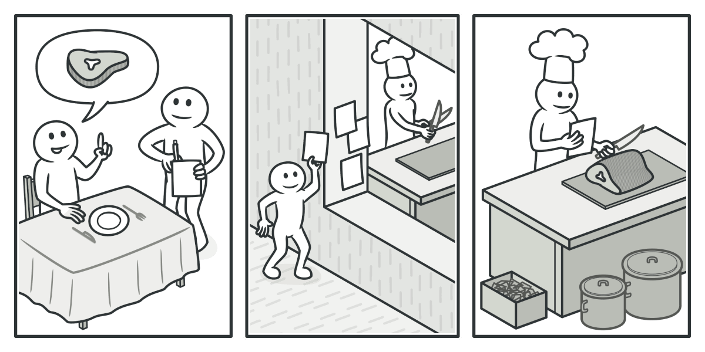
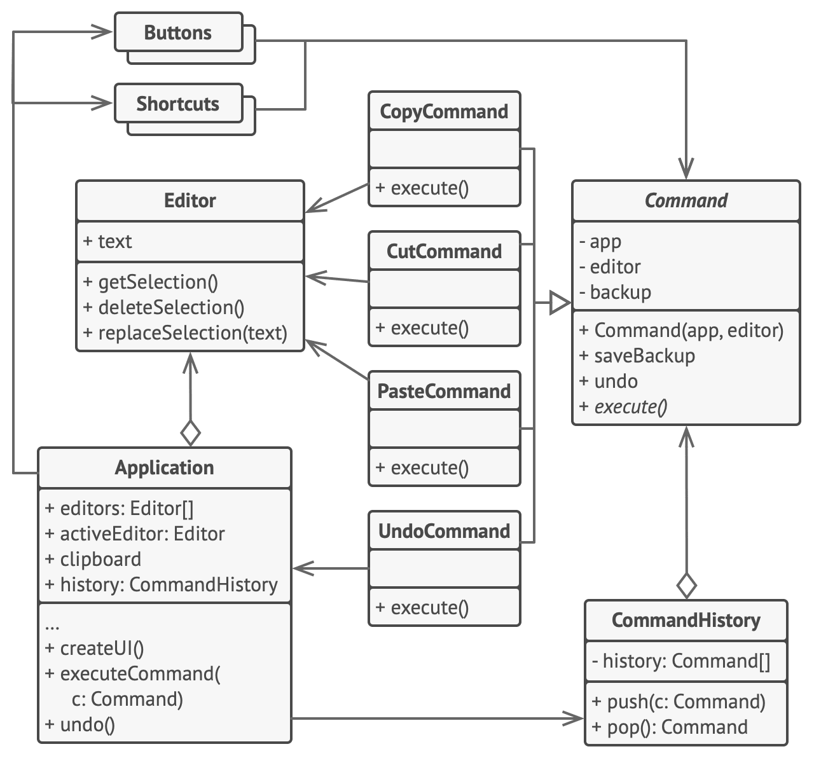

# Команда

> Также известен как: Действие, Транзакция, Action, Command

## Суть паттерна

**Команда** — это поведенческий паттерн проектирования, который превращает запросы в объекты, позволяя передавать их как аргументы при вызове методов, ставить запросы в очередь, логировать их, а также поддерживать отмену операций.


## Проблема

Представьте, что вы работаете над программой текстового редактора. Дело как раз подошло к разработке панели управления. Вы создали класс красивых Кнопок и хотите использовать его для всех кнопок приложения, начиная от панели управления, заканчивая простыми кнопками в диалогах.



*Все кнопки приложения унаследованы от одного класса.*

Все эти кнопки, хоть и выглядят схоже, но делают разные вещи. Поэтому возникает вопрос: куда поместить код обработчиков кликов по этим кнопкам? Самым простым решением было бы создать подклассы для каждой кнопки и переопределить в них метод действия под разные задачи.



*Множество подклассов кнопок.*

Но скоро стало понятно, что такой подход никуда не годится. Во-первых, получается очень много подклассов. Во-вторых, код кнопок, относящийся к графическому интерфейсу, начинает зависеть от классов бизнес-логики, которая довольно часто меняется.


*Несколько классов дублируют одну и ту же функциональность.*

Но самое обидное ещё впереди. Ведь некоторые операции, например, «сохранить», можно вызывать из нескольких мест: нажав кнопку на панели управления, вызвав контекстное меню или просто нажав клавиши <shortcut>Ctrl+S</shortcut>. Когда в программе были только кнопки, код сохранения имелся только в подклассе `SaveButton`. Но теперь его придётся продублировать ещё в два класса.

## Решение

Хорошие программы обычно структурированы в виде слоёв. Самый распространённый пример — слои пользовательского интерфейса и бизнес-логики. Первый всего лишь рисует красивую картинку для пользователя. Но когда нужно сделать что-то важное, интерфейс «просит» слой бизнес-логики заняться этим.

В реальности это выглядит так: один из объектов интерфейса напрямую вызывает метод одного из объектов бизнес-логики, передавая в него какие-то параметры.



*Прямой доступ из UI в бизнес-логику.*

Паттерн Команда предлагает больше не отправлять такие вызовы напрямую. Вместо этого каждый вызов, отличающийся от других, следует завернуть в собственный класс с единственным методом, который и будет осуществлять вызов. Такие объекты называют **командами**.

К объекту интерфейса можно будет привязать объект команды, который знает, кому и в каком виде следует отправлять запросы. Когда объект интерфейса будет готов передать запрос, он вызовет метод команды, а та — позаботится обо всём остальном.



*Доступ из UI в бизнес-логику через команду.*

Классы команд можно объединить под общим интерфейсом c единственным методом запуска. После этого одни и те же отправители смогут работать с различными командами, не привязываясь к их классам. Даже больше: команды можно будет взаимозаменять на лету, изменяя итоговое поведение отправителей.

Параметры, с которыми должен быть вызван метод объекта получателя, можно загодя сохранить в полях объекта-команды. Благодаря этому, объекты, отправляющие запросы, могут не беспокоиться о том, чтобы собрать необходимые для получателя данные. Более того, они теперь вообще не знают, кто будет получателем запроса. Вся эта информация скрыта внутри команды.


*Классы UI делегируют работу командам.*

После применения Команды в нашем примере с текстовым редактором вам больше не потребуется создавать уйму подклассов кнопок под разные действия. Будет достаточно единственного класса с полем для хранения объекта команды.

Используя общий интерфейс команд, объекты кнопок будут ссылаться на объекты команд различных типов. При нажатии кнопки будут делегировать работу связанным командам, а команды — перенаправлять вызовы тем или иным объектам бизнес-логики.

Так же можно поступить и с контекстным меню, и с горячими клавишами. Они будут привязаны к тем же объектам команд, что и кнопки, избавляя классы от дублирования.

Таким образом, команды станут гибкой прослойкой между пользовательским интерфейсом и бизнес-логикой. И это лишь малая доля пользы, которую может принести паттерн Команда!

## Аналогия из жизни



*Пример заказа в ресторане.*

Вы заходите в ресторан и садитесь у окна. К вам подходит вежливый официант и принимает заказ, записывая все пожелания в блокнот. Откланявшись, он уходит на кухню, где вырывает лист из блокнота и клеит на стену. Далее лист оказывается в руках повара, который читает содержание заказа и готовит заказанные блюда.

В этом примере вы являетесь **отправителем**, официант с блокнотом — **командой**, а повар — **получателем**. Как и в паттерне, вы не соприкасаетесь напрямую с поваром. Вместо этого вы отправляете заказ с официантом, который самостоятельно «настраивает» повара на работу. С другой стороны, повар не знает, кто конкретно послал ему заказ. Но это ему безразлично, так как вся необходимая информация есть в листе заказа.

## Структура


1. **Отправитель** хранит ссылку на объект команды и обращается к нему, когда нужно выполнить какое-то действие. Отправитель работает с командами только через их общий интерфейс. Он не знает, какую конкретно команду использует, так как получает готовый объект команды от клиента.
2. **Команда** описывает общий для всех конкретных команд интерфейс. Обычно здесь описан всего один метод для запуска команды.
3. **Конкретные команды** реализуют различные запросы, следуя общему интерфейсу команд. Обычно команда не делает всю работу самостоятельно, а лишь передаёт вызов получателю, которым является один из объектов бизнес-логики. <br/>Параметры, с которыми команда обращается к получателю, следует хранить в виде полей. В большинстве случаев объекты команд можно сделать неизменяемыми, передавая в них все необходимые параметры только через конструктор.
4. **Получатель** содержит бизнес-логику программы. В этой роли может выступать практически любой объект. Обычно команды перенаправляют вызовы получателям. Но иногда, чтобы упростить программу, вы можете избавиться от получателей, «слив» их код в классы команд.
5. **Клиент** создаёт объекты конкретных команд, передавая в них все необходимые параметры, среди которых могут быть и ссылки на объекты получателей. После этого клиент связывает объекты отправителей с созданными командами.

## Псевдокод
В этом примере паттерн **Команда** служит для ведения истории выполненных операций, позволяя отменять их, если потребуется.



*Пример реализации отмены в текстовом редакторе.*

Команды, которые меняют состояние редактора (например, команда вставки текста из буфера обмена), сохраняют копию состояния редактора перед выполнением действия. Копии выполненных команд помещаются в историю команд, откуда они могут быть получены, если нужно будет сделать отмену операции.

Классы элементов интерфейса, истории команд и прочие не зависят от конкретных классов команд, так как работают с ними через общий интерфейс. Это позволяет добавлять в приложение новые команды, не изменяя существующий код.

```c
// Абстрактная команда задаёт общий интерфейс для конкретных
// классов команд и содержит базовое поведение отмены операции.
abstract class Command is
    protected field app: Application
    protected field editor: Editor
    protected field backup: text

    constructor Command(app: Application, editor: Editor) is
        this.app = app
        this.editor = editor

    // Сохраняем состояние редактора.
    method saveBackup() is
        backup = editor.text

    // Восстанавливаем состояние редактора.
    method undo() is
        editor.text = backup

    // Главный метод команды остаётся абстрактным, чтобы каждая
    // конкретная команда определила его по-своему. Метод должен
    // возвратить true или false в зависимости о того, изменила
    // ли команда состояние редактора, а значит, нужно ли её
    // сохранить в истории.
    abstract method execute()


// Конкретные команды.
class CopyCommand extends Command is
    // Команда копирования не записывается в историю, так как
    // она не меняет состояние редактора.
    method execute() is
        app.clipboard = editor.getSelection()
        return false

class CutCommand extends Command is
    // Команды, меняющие состояние редактора, сохраняют
    // состояние редактора перед своим действием и сигнализируют
    // об изменении, возвращая true.
    method execute() is
        saveBackup()
        app.clipboard = editor.getSelection()
        editor.deleteSelection()
        return true

class PasteCommand extends Command is
    method execute() is
        saveBackup()
        editor.replaceSelection(app.clipboard)
        return true

// Отмена — это тоже команда.
class UndoCommand extends Command is
    method execute() is
        app.undo()
        return false


// Глобальная история команд — это стек.
class CommandHistory is
    private field history: array of Command

    // Последний зашедший...
    method push(c: Command) is
        // Добавить команду в конец массива-истории.

    // ...выходит первым.
    method pop():Command is
        // Достать последнюю команду из массива-истории.


// Класс редактора содержит непосредственные операции над
// текстом. Он отыгрывает роль получателя — команды делегируют
// ему свои действия.
class Editor is
    field text: string

    method getSelection() is
        // Вернуть выбранный текст.

    method deleteSelection() is
        // Удалить выбранный текст.

    method replaceSelection(text) is
        // Вставить текст из буфера обмена в текущей позиции.


// Класс приложения настраивает объекты для совместной работы.
// Он выступает в роли отправителя — создаёт команды, чтобы
// выполнить какие-то действия.
class Application is
    field clipboard: string
    field editors: array of Editors
    field activeEditor: Editor
    field history: CommandHistory

    // Код, привязывающий команды к элементам интерфейса, может
    // выглядеть примерно так.
    method createUI() is
        // ...
        copy = function() {executeCommand(
            new CopyCommand(this, activeEditor)) }
        copyButton.setCommand(copy)
        shortcuts.onKeyPress("Ctrl+C", copy)

        cut = function() { executeCommand(
            new CutCommand(this, activeEditor)) }
        cutButton.setCommand(cut)
        shortcuts.onKeyPress("Ctrl+X", cut)

        paste = function() { executeCommand(
            new PasteCommand(this, activeEditor)) }
        pasteButton.setCommand(paste)
        shortcuts.onKeyPress("Ctrl+V", paste)

        undo = function() { executeCommand(
            new UndoCommand(this, activeEditor)) }
        undoButton.setCommand(undo)
        shortcuts.onKeyPress("Ctrl+Z", undo)

    // Запускаем команду и проверяем, надо ли добавить её в
    // историю.
    method executeCommand(command) is
        if (command.execute())
            history.push(command)

    // Берём последнюю команду из истории и заставляем её все
    // отменить. Мы не знаем конкретный тип команды, но это и не
    // важно, так как каждая команда знает, как отменить своё
    // действие.
    method undo() is
        command = history.pop()
        if (command != null)
            command.undo()
```

## Применимость

**Когда вы хотите параметризовать объекты выполняемым действием.**

Команда превращает операции в объекты. А объекты можно передавать, хранить и взаимозаменять внутри других объектов.

Скажем, вы разрабатываете библиотеку графического меню и хотите, чтобы пользователи могли использовать меню в разных приложениях, не меняя каждый раз код ваших классов. Применив паттерн, пользователям не придётся изменять классы меню, вместо этого они будут конфигурировать объекты меню различными командами.

---

**Когда вы хотите ставить операции в очередь, выполнять их по расписанию или передавать по сети.**

Как и любые другие объекты, команды можно сериализовать, то есть превратить в строку, чтобы потом сохранить в файл или базу данных. Затем в любой удобный момент её можно достать обратно, снова превратить в объект команды и выполнить. Таким же образом команды можно передавать по сети, логировать или выполнять на удалённом сервере.

---

**Когда вам нужна операция отмены.**

Главная вещь, которая вам нужна, чтобы иметь возможность отмены операций, — это хранение истории. Среди многих способов, которыми можно это сделать, паттерн Команда является, пожалуй, самым популярным.

История команд выглядит как стек, в который попадают все выполненные объекты команд. Каждая команда перед выполнением операции сохраняет текущее состояние объекта, с которым она будет работать. После выполнения операции копия команды попадает в стек истории, все ещё неся в себе сохранённое состояние объекта. Если потребуется отмена, программа возьмёт последнюю команду из истории и возобновит сохранённое в ней состояние.

Этот способ имеет две особенности. Во-первых, точное состояние объектов не так-то просто сохранить, ведь часть его может быть приватным. Но с этим может помочь справиться паттерн **Снимок**.

Во-вторых, копии состояния могут занимать довольно много оперативной памяти. Поэтому иногда можно прибегнуть к альтернативной реализации, когда вместо восстановления старого состояния команда выполняет обратное действие. Недостаток этого способа в сложности (а иногда и невозможности) реализации обратного действия.

## Шаги реализации

1. Создайте общий интерфейс команд и определите в нём метод запуска.
2. Один за другим создайте классы конкретных команд. В каждом классе должно быть поле для хранения ссылки на один или несколько объектов-получателей, которым команда будет перенаправлять основную работу.<br/>Кроме этого, команда должна иметь поля для хранения параметров, которые нужны при вызове методов получателя. Значения всех этих полей команда должна получать через конструктор. <br/>И, наконец, реализуйте основной метод команды, вызывая в нём те или иные методы получателя.
3. Добавьте в классы отправителей поля для хранения команд. Обычно объекты-отправители принимают готовые объекты команд извне — через конструктор либо через сеттер поля команды.
4. Измените основной код отправителей так, чтобы они делегировали выполнение действия команде.
5. Порядок инициализации объектов должен выглядеть так:
    - Создаём объекты получателей.
    - Создаём объекты команд, связав их с получателями.
    - Создаём объекты отправителей, связав их с командами.

## Преимущества и недостатки

**Преимущества**

- Убирает прямую зависимость между объектами, вызывающими операции, и объектами, которые их непосредственно выполняют.
- Позволяет реализовать простую отмену и повтор операций.
- Позволяет реализовать отложенный запуск операций.
- Позволяет собирать сложные команды из простых.
- Реализует [принцип открытости/закрытости](open_close_principle.md).

**Недостатки**

-Усложняет код программы из-за введения множества дополнительных классов.

## Примеры реализации паттерна

### Python

- **Сложность**: 2/3
- **Популярность**: 2/3
- **Применимость**: Паттерн встречается в Python не так уж часто, так как для его применения нужна цепь объектов, например, связанный список.
- **Признаки применения паттерна**: Классы команд построены вокруг одного действия и имеют очень узкий контекст. Объекты команд часто подаются в обработчики событий элементов GUI. Практически любая реализация отмены использует принципа команд.

Этот пример показывает структуру паттерна `Команда`, а именно — из каких классов он состоит, какие роли эти классы выполняют и как они взаимодействуют друг с другом.

**main.py**: Пример структуры паттерна

```python
from __future__ import annotations
from abc import ABC, abstractmethod


class Command(ABC):
    """
    Интерфейс Команды объявляет метод для выполнения команд.
    """

    @abstractmethod
    def execute(self) -> None:
        pass


class SimpleCommand(Command):
    """
    Некоторые команды способны выполнять простые операции самостоятельно.
    """

    def __init__(self, payload: str) -> None:
        self._payload = payload

    def execute(self) -> None:
        print(f"SimpleCommand: See, I can do simple things like printing"
              f"({self._payload})")


class ComplexCommand(Command):
    """
    Но есть и команды, которые делегируют более сложные операции другим
    объектам, называемым «получателями».
    """

    def __init__(self, receiver: Receiver, a: str, b: str) -> None:
        """
        Сложные команды могут принимать один или несколько объектов-получателей
        вместе с любыми данными о контексте через конструктор.
        """

        self._receiver = receiver
        self._a = a
        self._b = b

    def execute(self) -> None:
        """
        Команды могут делегировать выполнение любым методам получателя.
        """

        print("ComplexCommand: Complex stuff should be done by a receiver object", end="")
        self._receiver.do_something(self._a)
        self._receiver.do_something_else(self._b)


class Receiver:
    """
    Классы Получателей содержат некую важную бизнес-логику. Они умеют выполнять
    все виды операций, связанных с выполнением запроса. Фактически, любой класс
    может выступать Получателем.
    """

    def do_something(self, a: str) -> None:
        print(f"\nReceiver: Working on ({a}.)", end="")

    def do_something_else(self, b: str) -> None:
        print(f"\nReceiver: Also working on ({b}.)", end="")


class Invoker:
    """
    Отправитель связан с одной или несколькими командами. Он отправляет запрос
    команде.
    """

    _on_start = None
    _on_finish = None

    """
    Инициализация команд.
    """

    def set_on_start(self, command: Command):
        self._on_start = command

    def set_on_finish(self, command: Command):
        self._on_finish = command

    def do_something_important(self) -> None:
        """
        Отправитель не зависит от классов конкретных команд и получателей.
        Отправитель передаёт запрос получателю косвенно, выполняя команду.
        """

        print("Invoker: Does anybody want something done before I begin?")
        if isinstance(self._on_start, Command):
            self._on_start.execute()

        print("Invoker: ...doing something really important...")

        print("Invoker: Does anybody want something done after I finish?")
        if isinstance(self._on_finish, Command):
            self._on_finish.execute()


if __name__ == "__main__":
    """
    Клиентский код может параметризовать отправителя любыми командами.
    """

    invoker = Invoker()
    invoker.set_on_start(SimpleCommand("Say Hi!"))
    receiver = Receiver()
    invoker.set_on_finish(ComplexCommand(
        receiver, "Send email", "Save report"))

    invoker.do_something_important()
```

**Output.txt**: Результат выполнения

```text
Invoker: Does anybody want something done before I begin?
SimpleCommand: See, I can do simple things like printing (Say Hi!)
Invoker: ...doing something really important...
Invoker: Does anybody want something done after I finish?
ComplexCommand: Complex stuff should be done by a receiver object
Receiver: Working on (Send email.)
Receiver: Also working on (Save report.)
```

### PHP

- **Сложность**: 2/3
- **Популярность**: 2/3
- **Применимость**: Паттерн можно часто встретить в PHP-коде, особенно когда нужно откладывать выполнение команд, выстраивать их в очереди, а также хранить историю и делать отмену.
- **Признаки применения паттерна**: Классы команд построены вокруг одного действия и имеют очень узкий контекст. Объекты команд часто подаются в обработчики событий элементов GUI. Практически любая реализация отмены использует принципа команд.

<tabs>
<tab title="Концептуальный пример">
<h4 id="command-php-concept">Концептуальный пример</h4>
<p>Этот пример показывает структуру паттерна <b>Команда</b>, а именно — из каких классов он состоит, какие роли эти классы выполняют и как они взаимодействуют друг с другом.</p>
<p>После ознакомления со структурой, вам будет легче воспринимать второй пример, который рассматривает реальный случай использования паттерна в мире PHP.</p>
<p><b>index.php</b>: Пример структуры паттерна</p>
<code-block lang="php">
<![CDATA[
namespace RefactoringGuru\Command\Conceptual;

/**
* Интерфейс Команды объявляет метод для выполнения команд.
*/

interface Command
{
    public function execute(): void;
}

/**
* Некоторые команды способны выполнять простые операции самостоятельно.
*/
class SimpleCommand implements Command
{
    private $payload;

    public function __construct(string $payload)
    {
        $this->payload = $payload;
    }

    public function execute(): void
    {
        echo "SimpleCommand: See, I can do simple things like printing (" . $this->payload . ")\n";
    }
}

/**
* Но есть и команды, которые делегируют более сложные операции другим объектам,
* называемым «получателями».
*/

class ComplexCommand implements Command
{
    /**
    * @var Receiver
    */
    private $receiver;

    /**
    * Данные о контексте, необходимые для запуска методов получателя.
    */
    private $a;

    private $b;

    /**
    * Сложные команды могут принимать один или несколько объектов-получателей
    * вместе с любыми данными о контексте через конструктор.
    */
    public function __construct(Receiver $receiver, string $a, string $b)
    {
        $this->receiver = $receiver;
        $this->a = $a;
        $this->b = $b;
    }

    /**
    * Команды могут делегировать выполнение любым методам получателя.
    */
    public function execute(): void
    {
        echo "ComplexCommand: Complex stuff should be done by a receiver object.\n";
        $this->receiver->doSomething($this->a);
        $this->receiver->doSomethingElse($this->b);
    }
}

/**
* Классы Получателей содержат некую важную бизнес-логику. Они умеют выполнять
* все виды операций, связанных с выполнением запроса. Фактически, любой класс
* может выступать Получателем.
*/

class Receiver
{
    public function doSomething(string $a): void
    {
        echo "Receiver: Working on (" . $a . ".)\n";
    }

    public function doSomethingElse(string $b): void
    {
        echo "Receiver: Also working on (" . $b . ".)\n";
    }
}

/**
* Отправитель связан с одной или несколькими командами. Он отправляет запрос
* команде.
*/

class Invoker
{
    /**
    * @var Command
    */
    private $onStart;

    /**
    * @var Command
    */
    private $onFinish;

    /**
    * Инициализация команд.
    */
    public function setOnStart(Command $command): void
    {
        $this->onStart = $command;
    }

    public function setOnFinish(Command $command): void
    {
        $this->onFinish = $command;
    }

    /**
    * Отправитель не зависит от классов конкретных команд и получателей.
    * Отправитель передаёт запрос получателю косвенно, выполняя команду.
    */
    public function doSomethingImportant(): void
    {
        echo "Invoker: Does anybody want something done before I begin?\n";
        if ($this->onStart instanceof Command) {
            $this->onStart->execute();
        }
        echo "Invoker: ...doing something really important...\n";
        echo "Invoker: Does anybody want something done after I finish?\n";
        if ($this->onFinish instanceof Command) {
            $this->onFinish->execute();
        }
    }
}

/**
* Клиентский код может параметризовать отправителя любыми командами.
*/
$invoker = new Invoker();
$invoker->setOnStart(new SimpleCommand("Say Hi!"));
$receiver = new Receiver();
$invoker->setOnFinish(new ComplexCommand($receiver, "Send email", "Save report"));

$invoker->doSomethingImportant();

]]>
</code-block>
<p><b>Output.txt</b>: Результат выполнения</p>
<code-block lang="text">
<![CDATA[
Invoker: Does anybody want something done before I begin?
SimpleCommand: See, I can do simple things like printing (Say Hi!)
Invoker: ...doing something really important...
Invoker: Does anybody want something done after I finish?
ComplexCommand: Complex stuff should be done by a receiver object.
Receiver: Working on (Send email.)
Receiver: Also working on (Save report.)

]]>
</code-block>
</tab>
<tab title="Пример из реальной жизни">
<h4 id="command-php-real">Пример из реальной жизни</h4>
<p>В этом примере паттерн <b>Команда</b> применяется для построения очереди из вызовов скрейпинга (скачивания) отдельных страниц сайта IMDB и выполнения их один за другим. Сама очередь хранится в базе данных, которая помогает не терять команды между запусками скрипта.</p>
<p><b>index.php</b>: Пример из реальной жизни</p>
<code-block lang="php">
<![CDATA[
namespace RefactoringGuru\Command\RealWorld;

/**
* Интерфейс Команды объявляет основной метод выполнения, а также несколько
* вспомогательных методов для получения метаданных команды.
*/

interface Command
{
    public function execute(): void;

    public function getId(): int;

    public function getStatus(): int;
}

/**
* Базовая Команда скрейпинга устанавливает базовую инфраструктуру загрузки,
* общую для всех конкретных команд скрейпинга.
*/

abstract class WebScrapingCommand implements Command
{
    public $id;

    public $status = 0;

    /**
    * @var string URL для скрейпинга.
    */
    public $url;

    public function __construct(string $url)
    {
        $this->url = $url;
    }

    public function getId(): int
    {
        return $this->id;
    }

    public function getStatus(): int
    {
        return $this->status;
    }

    public function getURL(): string
    {
        return $this->url;
    }

    /**
    * Поскольку методы выполнения для всех команд скрейпинга очень похожи, мы
    * можем предоставить реализацию по умолчанию, позволив подклассам
    * переопределить её при необходимости.
    *
    * Шш! Наблюдательный читатель может обнаружить здесь другой поведенческий
    * паттерн в действии.
    */
    public function execute(): void
    {
        $html = $this->download();
        $this->parse($html);
        $this->complete();
    }

    public function download(): string
    {
        $html = file_get_contents($this->getURL());
        echo "WebScrapingCommand: Downloaded {$this->url}\n";
        return $html;
    }

    abstract public function parse(string $html): void;

    public function complete(): void
    {
        $this->status = 1;
        Queue::get()->completeCommand($this);
    }
}

/**
* Конкретная Команда для извлечения списка жанров фильма.
*/
class IMDBGenresScrapingCommand extends WebScrapingCommand
{
    public function __construct()
    {
        $this->url = "https://www.imdb.com/feature/genre/";
    }

    /**
    * Извлечение всех жанров и их поисковых URL со страницы:
    * https://www.imdb.com/feature/genre/
    */

    public function parse($html): void
    {
        preg_match_all("|href=\"(https://www.imdb.com/search/title\?genres=.*?)\"|", $html, $matches);
        echo "IMDBGenresScrapingCommand: Discovered " . count($matches[1]) . " genres.\n";
        foreach ($matches[1] as $genre) {
            Queue::get()->add(new IMDBGenrePageScrapingCommand($genre));
        }
    }
}

/**
* Конкретная Команда для извлечения списка фильмов определённого жанра.
*/

class IMDBGenrePageScrapingCommand extends WebScrapingCommand
{
    private $page;

    public function __construct(string $url, int $page = 1)
    {
        parent::__construct($url);
        $this->page = $page;
    }

    public function getURL(): string
    {
        return $this->url . '?page=' . $this->page;
    }

    /**
    * Извлечение всех фильмов со страницы вроде этой:
    * https://www.imdb.com/search/title?genres=sci-fi&explore=title_type,genres
    */
    
    public function parse(string $html): void
    {
        preg_match_all("|href=\"(/title/.*?/)\?ref_=adv_li_tt\"|", $html, $matches);
        echo "IMDBGenrePageScrapingCommand: Discovered " . count($matches[1]) . " movies.\n";
        foreach ($matches[1] as $moviePath) {
            $url = "https://www.imdb.com" . $moviePath;
            Queue::get()->add(new IMDBMovieScrapingCommand($url));
        }

        // Извлечение URL следующей страницы.
        if (preg_match("|Next &#187;</a>|", $html)) {
            Queue::get()->add(new IMDBGenrePageScrapingCommand($this->url, $this->page + 1));
        }
    }
}

/**
* Конкретная Команда для извлечения подробных сведений о фильме.
*/

class IMDBMovieScrapingCommand extends WebScrapingCommand
{
    /**
    * Получить информацию о фильме с подобной страницы:
    * https://www.imdb.com/title/tt4154756/
    */
    
    public function parse(string $html): void
    {
        if (preg_match("|<h1 itemprop=\"name\" class=\"\">(.*?)</h1>|", $html, $matches)) {
            $title = $matches[1];
        }
        echo "IMDBMovieScrapingCommand: Parsed movie $title.\n";
    }
}

/**
* Класс Очередь действует как Отправитель. Он складывает объекты команд в стек
* и выполняет их поочерёдно. Если выполнение скрипта внезапно завершится,
* очередь и все её команды можно будет легко восстановить, и вам не придётся
* повторять все выполненные команды.
*
* Обратите внимание, что это очень примитивная реализация очереди команд,
* которая хранит команды в локальной базе данных SQLite. Существуют десятки
* надёжных реализаций очереди, доступных для использования в реальных
* приложениях.
*/

class Queue
{
    private $db;

    public function __construct()
    {
        $this->db = new \SQLite3(__DIR__ . '/commands.sqlite',
            SQLITE3_OPEN_CREATE | SQLITE3_OPEN_READWRITE);
        $this->db->query('CREATE TABLE IF NOT EXISTS "commands" (
            "id" INTEGER PRIMARY KEY AUTO_INCREMENT NOT NULL,
            "command" TEXT,
            "status" INTEGER
        )');
    }

    public function isEmpty(): bool
    {
        $query = 'SELECT COUNT("id") FROM "commands" WHERE status = 0';
        return $this->db->querySingle($query) === 0;
    }

    public function add(Command $command): void
    {
        $query = 'INSERT INTO commands (command, status) VALUES (:command, :status)';
        $statement = $this->db->prepare($query);
        $statement->bindValue(':command', base64_encode(serialize($command)));
        $statement->bindValue(':status', $command->getStatus());
        $statement->execute();
    }

    public function getCommand(): Command
    {
        $query = 'SELECT * FROM "commands" WHERE "status" = 0 LIMIT 1';
        $record = $this->db->querySingle($query, true);
        $command = unserialize(base64_decode($record["command"]));
        $command->id = $record['id'];
        return $command;
    }

    public function completeCommand(Command $command): void
    {
        $query = 'UPDATE commands SET status = :status WHERE id = :id';
        $statement = $this->db->prepare($query);
        $statement->bindValue(':status', $command->getStatus());
        $statement->bindValue(':id', $command->getId());
        $statement->execute();
    }

    public function work(): void
    {
        while (!$this->isEmpty()) {
            $command = $this->getCommand();
            $command->execute();
        }
    }

    /**
    * Для удобства объект Очереди является Одиночкой.
    */
    public static function get(): Queue
    {
        static $instance;
        if (!$instance) {
            $instance = new Queue();
        }
        return $instance;
    }
}

/**
* Клиентский код.
*/

$queue = Queue::get();

if ($queue->isEmpty()) {
    $queue->add(new IMDBGenresScrapingCommand());
}

$queue->work();

]]>
</code-block>
<p><b>Output.txt</b>: Результат выполнения</p>
<code-block lang="plain text">
WebScrapingCommand: Downloaded https://www.imdb.com/feature/genre/
IMDBGenresScrapingCommand: Discovered 14 genres.
WebScrapingCommand: Downloaded https://www.imdb.com/search/title?genres=comedy
IMDBGenrePageScrapingCommand: Discovered 50 movies.
WebScrapingCommand: Downloaded https://www.imdb.com/search/title?genres=sci-fi
IMDBGenrePageScrapingCommand: Discovered 50 movies.
WebScrapingCommand: Downloaded https://www.imdb.com/search/title?genres=horror
IMDBGenrePageScrapingCommand: Discovered 50 movies.
WebScrapingCommand: Downloaded https://www.imdb.com/search/title?genres=romance
IMDBGenrePageScrapingCommand: Discovered 50 movies.
...

]]>
</code-block>
</tab>
</tabs>