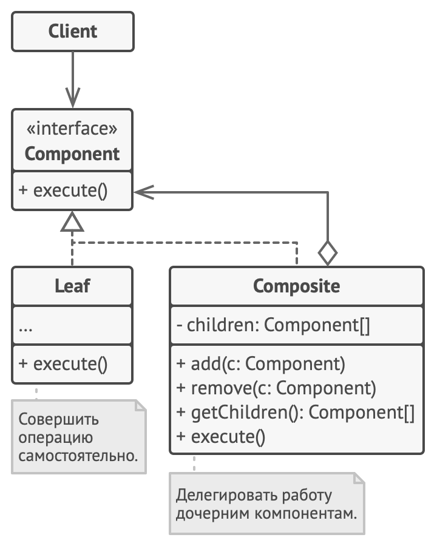

# Компоновщик

> Также известен как: **Дерево**, **Composite**

## Суть паттерна
**Компоновщик** — это структурный паттерн проектирования, который позволяет сгруппировать множество объектов в древовидную структуру, а затем работать с ней так, как будто это единичный объект.


## Проблема

Паттерн Компоновщик имеет смысл только тогда, когда основная модель вашей программы может быть структурирована в виде дерева.

Например, есть два объекта: `Продукт` и `Коробка`. `Коробка` может содержать несколько `Продуктов` и других `Коробок` поменьше. Те, в свою очередь, тоже содержат либо `Продукты`, либо `Коробки` и так далее.

Теперь предположим, ваши `Продукты` и `Коробки` могут быть частью заказов. Каждый заказ может содержать как простые `Продукты` без упаковки, так и составные `Коробки`. Ваша задача состоит в том, чтобы узнать цену всего заказа.


*Заказ может состоять из различных продуктов, упакованных в собственные коробки.*

Если решать задачу в лоб, то вам потребуется открыть все коробки заказа, перебрать все продукты и посчитать их суммарную стоимость. Но это слишком хлопотно, так как типы коробок и их содержимое могут быть вам неизвестны. Кроме того, наперёд неизвестно и количество уровней вложенности коробок, поэтому перебрать коробки простым циклом не выйдет.

## Решение
Компоновщик предлагает рассматривать `Продукт` и `Коробку` через единый интерфейс с общим методом получения стоимости.

`Продукт` просто вернёт свою цену. `Коробка` спросит цену каждого предмета внутри себя и вернёт сумму результатов. Если одним из внутренних предметов окажется коробка поменьше, она тоже будет перебирать своё содержимое, и так далее, пока не будут посчитаны все составные части.


*Компоновщик рекурсивно запускает действие по всем элементам дерева — от корня к листьям.*

Для вас, клиента, главное, что теперь не нужно ничего знать о структуре заказов. Вы вызываете метод получения цены, он возвращает цифру, а вы не тонете в горах картона и скотча.

## Аналогия из жизни


*Пример армейской структуры.*

Армии большинства государств могут быть представлены в виде перевёрнутых деревьев. На нижнем уровне у вас есть солдаты, затем взводы, затем полки, а затем целые армии. Приказы отдаются сверху и спускаются вниз по структуре командования, пока не доходят до конкретного солдата.

## Структура



1. **Компонент** определяет общий интерфейс для простых и составных компонентов дерева.
2. **Лист** — это простой компонент дерева, не имеющий ответвлений. <br/>Из-за того, что им некому больше передавать выполнение, классы листьев будут содержать большую часть полезного кода.
3. **Контейнер** (или композит) — это составной компонент дерева. Он содержит набор дочерних компонентов, но ничего не знает об их типах. Это могут быть как простые компоненты-листья, так и другие компоненты-контейнеры. Но это не является проблемой, если все дочерние компоненты следуют единому интерфейсу.<br/>Методы контейнера переадресуют основную работу своим дочерним компонентам, хотя и могут добавлять что-то своё к результату.
4, **Клиент** работает с деревом через общий интерфейс компонентов.

Благодаря этому, клиенту не важно, что перед ним находится — простой или составной компонент дерева.

## Псевдокод
В этом примере **Компоновщик** помогает реализовать вложенные геометрические фигуры.


*Пример редактора геометрических фигур.*

Класс `CompoundGraphic` может содержать любое количество подфигур, включая такие же контейнеры, как он сам. Контейнер реализует те же методы, что и простые фигуры. Но, вместо непосредственного действия, он передаёт вызовы всем вложенным компонентам, используя рекурсию. Затем он как бы «суммирует» результаты всех вложенных фигур.

Клиентский код работает со всеми фигурами через общий интерфейс фигур и не знает, что перед ним — простая фигура или составная. Это позволяет клиентскому коду работать с деревьями объектов любой сложности, не привязываясь к конкретным классам объектов, формирующих дерево.

```c
// Общий интерфейс компонентов.
interface Graphic is
    method move(x, y)
    method draw()

// Простой компонент.
class Dot implements Graphic is
    field x, y

    constructor Dot(x, y) { ... }

    method move(x, y) is
        this.x += x, this.y += y

    method draw() is
        // Нарисовать точку в координате X, Y.

// Компоненты могут расширять другие компоненты.
class Circle extends Dot is
    field radius

    constructor Circle(x, y, radius) { ... }

    method draw() is
        // Нарисовать окружность в координате X, Y и радиусом R.

// Контейнер содержит операции добавления/удаления дочерних
// компонентов. Все стандартные операции интерфейса компонентов
// он делегирует каждому из дочерних компонентов.
class CompoundGraphic implements Graphic is
    field children: array of Graphic

    method add(child: Graphic) is
        // Добавить компонент в список дочерних.

    method remove(child: Graphic) is
        // Убрать компонент из списка дочерних.

    method move(x, y) is
        foreach (child in children) do
            child.move(x, y)

    method draw() is
        // 1. Для каждого дочернего компонента:
        //     - Отрисовать компонент.
        //     - Определить координаты максимальной границы.
        // 2. Нарисовать пунктирную границу вокруг всей области.


// Приложение работает единообразно как с единичными
// компонентами, так и с целыми группами компонентов.
class ImageEditor is
    field all: CompoundGraphic

    method load() is
        all = new CompoundGraphic()
        all.add(new Dot(1, 2))
        all.add(new Circle(5, 3, 10))
        // ...

    // Группировка выбранных компонентов в один сложный
    // компонент.
    method groupSelected(components: array of Graphic) is
        group = new CompoundGraphic()
        foreach (component in components) do
            group.add(component)
            all.remove(component)
        all.add(group)
        // Все компоненты будут отрисованы.
        all.draw()
```

## Применимость

**Когда вам нужно представить древовидную структуру объектов.**

Паттерн Компоновщик предлагает хранить в составных объектах ссылки на другие простые или составные объекты. Те, в свою очередь, тоже могут хранить свои вложенные объекты и так далее. В итоге вы можете строить сложную древовидную структуру данных, используя всего две основные разновидности объектов.

---

**Когда клиенты должны единообразно трактовать простые и составные объекты.**

Благодаря тому, что простые и составные объекты реализуют общий интерфейс, клиенту безразлично, с каким именно объектом ему предстоит работать.

## Шаги реализации

1. Убедитесь, что вашу бизнес-логику можно представить как древовидную структуру. Попытайтесь разбить её на простые компоненты и контейнеры. Помните, что контейнеры могут содержать как простые компоненты, так и другие вложенные контейнеры.
2. Создайте общий интерфейс компонентов, который объединит операции контейнеров и простых компонентов дерева. Интерфейс будет удачным, если вы сможете использовать его, чтобы взаимозаменять простые и составные компоненты без потери смысла.
3. Создайте класс компонентов-листьев, не имеющих дальнейших ответвлений. Имейте в виду, что программа может содержать несколько таких классов.
4. Создайте класс компонентов-контейнеров и добавьте в него массив для хранения ссылок на вложенные компоненты. Этот массив должен быть способен содержать как простые, так и составные компоненты, поэтому убедитесь, что он объявлен с типом интерфейса компонентов.<br/>Реализуйте в контейнере методы интерфейса компонентов, помня о том, что контейнеры должны делегировать основную работу своим дочерним компонентам.
5. Добавьте операции добавления и удаления дочерних компонентов в класс контейнеров.  <br/>Имейте в виду, что методы добавления/удаления дочерних компонентов можно поместить и в интерфейс компонентов. Да, это нарушит [принцип разделения интерфейса](interface_segregation_principle.md), так как реализации методов будут пустыми в компонентах-листьях. Но зато все компоненты дерева станут действительно одинаковыми для клиента.

## Преимущества и недостатки

**Преимущества**

- Упрощает архитектуру клиента при работе со сложным деревом компонентов.
- Облегчает добавление новых видов компонентов.

**Недостатки**

- Создаёт слишком общий дизайн классов.

## Примеры реализации паттерна

### Python

- **Сложность**: 2/3
- **Популярность**: 1/3
- **Применимость**: Паттерн Компоновщик встречается в любых задачах, которые связаны с построением дерева. Самый простой пример — составные элементы GUI, которые тоже можно рассматривать как дерево.
- **Признаки применения паттерна**: Если из объектов строится древовидная структура, и со всеми объектами дерева, как и с самим деревом работают через общий интерфейс.

Этот пример показывает структуру паттерна **Компоновщик**, а именно — из каких классов он состоит, какие роли эти классы выполняют и как они взаимодействуют друг с другом.

**main.py**: Пример структуры паттерна

```python
from __future__ import annotations
from abc import ABC, abstractmethod
from typing import List


class Component(ABC):
    """
    Базовый класс Компонент объявляет общие операции как для простых,
    так и для сложных объектов структуры.
    """

    @property
    def parent(self) -> Component:
        return self._parent

    @parent.setter
    def parent(self, parent: Component):
        """
        При необходимости базовый Компонент может объявить интерфейс
        для установки и получения родителя компонента в древовидной
        структуре. Он также может предоставить некоторую реализацию по
        умолчанию для этих методов.
        """

        self._parent = parent

    """
    В некоторых случаях целесообразно определить операции управления
    потомками прямо в базовом классе Компонент. Таким образом, вам не
    нужно будет предоставлять конкретные классы компонентов
    клиентскому коду, даже во время сборки дерева объектов. Недостаток
    такого подхода в том, что эти методы будут пустыми для компонентов
    уровня листа.
    """

    def add(self, component: Component) -> None:
        pass

    def remove(self, component: Component) -> None:
        pass

    def is_composite(self) -> bool:
        """
        Вы можете предоставить метод, который позволит клиентскому
        коду понять, может ли компонент иметь вложенные объекты.
        """

        return False

    @abstractmethod
    def operation(self) -> str:
        """
        Базовый Компонент может сам реализовать некоторое поведение по
        умолчанию или поручить это конкретным классам, объявив метод,
        содержащий поведение абстрактным.
        """

        pass


class Leaf(Component):
    """
    Класс Лист представляет собой конечные объекты структуры. Лист не
    может иметь вложенных компонентов.

    Обычно объекты Листьев выполняют фактическую работу, тогда как
    объекты Контейнера лишь делегируют работу своим подкомпонентам.
    """

    def operation(self) -> str:
        return "Leaf"


class Composite(Component):
    """
    Класс Контейнер содержит сложные компоненты, которые могут иметь
    вложенные компоненты. Обычно объекты Контейнеры делегируют
    фактическую работу своим детям, а затем «суммируют» результат.
    """

    def __init__(self) -> None:
        self._children: List[Component] = []

    """
    Объект контейнера может как добавлять компоненты в свой список 
    вложенных компонентов, так и удалять их, как простые, так и
    сложные.
    """

    def add(self, component: Component) -> None:
        self._children.append(component)
        component.parent = self

    def remove(self, component: Component) -> None:
        self._children.remove(component)
        component.parent = None

    def is_composite(self) -> bool:
        return True

    def operation(self) -> str:
        """
        Контейнер выполняет свою основную логику особым образом. Он
        проходит рекурсивно через всех своих детей, собирая и суммируя
        их результаты.
        Поскольку потомки контейнера передают эти вызовы своим
        потомкам и так далее, в результате обходится всё дерево
        объектов.
        """

        results = []
        for child in self._children:
            results.append(child.operation())
        return f"Branch({'+'.join(results)})"


def client_code(component: Component) -> None:
    """
    Клиентский код работает со всеми компонентами через базовый
    интерфейс.
    """

    print(f"RESULT: {component.operation()}", end="")


def client_code2(component1: Component,
  component2: Component) -> None:
    """
    Благодаря тому, что операции управления потомками объявлены в
    базовом классе Компонента, клиентский код может работать как с
    простыми, так и со сложными компонентами, вне зависимости от их
    конкретных классов.
    """

    if component1.is_composite():
        component1.add(component2)

    print(f"RESULT: {component1.operation()}", end="")


if __name__ == "__main__":
    # Таким образом, клиентский код может поддерживать простые
    # компоненты-листья...
    simple = Leaf()
    print("Client: I've got a simple component:")
    client_code(simple)
    print("\n")

    # ...а также сложные контейнеры.
    tree = Composite()

    branch1 = Composite()
    branch1.add(Leaf())
    branch1.add(Leaf())

    branch2 = Composite()
    branch2.add(Leaf())

    tree.add(branch1)
    tree.add(branch2)

    print("Client: Now I've got a composite tree:")
    client_code(tree)
    print("\n")

    print("Client: I don't need to check the components classes even "
      + "when managing the tree:")
    client_code2(tree, simple)
```

**Output.txt**: Результат выполнения

```text
Client: I've got a simple component:
RESULT: Leaf

Client: Now I've got a composite tree:
RESULT: Branch(Branch(Leaf+Leaf)+Branch(Leaf))

Client: I don't need to check the components classes even when
managing the tree:
RESULT: Branch(Branch(Leaf+Leaf)+Branch(Leaf)+Leaf)
```

### PHP

- **Сложность**: 2/3
- **Популярность**: 2/3
- **Применимость**: Паттерн Компоновщик встречается в любых задачах, которые связаны с построением дерева. Самый простой пример — составные элементы DOM-дерева, которые тоже можно рассматривать как поддерево.
- **Признаки применения паттерна**: Если из объектов строится древовидная структура, и со всеми объектами дерева, как и с самим деревом работают через общий интерфейс.

<tabs>
<tab title="Концептуальный пример">
<h4 id="composite-php-concept">Концептуальный пример</h4>
<p>Этот пример показывает структуру паттерна <b>Компоновщик</b>, а именно — из каких классов он состоит, какие роли эти классы выполняют и как они взаимодействуют друг с другом.</p>
<p>После ознакомления со структурой, вам будет легче воспринимать второй пример, который рассматривает реальный случай использования паттерна в мире PHP.</p>
<p><b>index.php</b>: Пример структуры паттерна</p>
<code-block lang="php">
<![CDATA[
namespace RefactoringGuru\Composite\Conceptual;

/**
* Базовый класс Компонент объявляет общие операции как для простых, так и для
* сложных объектов структуры.
*/

abstract class Component
{
    /**
    * @var Component|null
    */
    protected $parent;

    /**
    * При необходимости базовый Компонент может объявить интерфейс для
    * установки и получения родителя компонента в древовидной структуре. Он
    * также может предоставить некоторую реализацию по умолчанию для этих
    * методов.
    */
    public function setParent(?Component $parent)
    {
        $this->parent = $parent;
    }

    public function getParent(): Component
    {
        return $this->parent;
    }

    /**
    * В некоторых случаях целесообразно определить операции управления
    * потомками прямо в базовом классе Компонент. Таким образом, вам не нужно
    * будет предоставлять конкретные классы компонентов клиентскому коду, даже
    * во время сборки дерева объектов. Недостаток такого подхода в том, что эти
    * методы будут пустыми для компонентов уровня листа.
    */
    public function add(Component $component): void { }

    public function remove(Component $component): void { }

    /**
    * Вы можете предоставить метод, который позволит клиентскому коду понять,
    * может ли компонент иметь вложенные объекты.
    */
    public function isComposite(): bool
    {
        return false;
    }

    /**
    * Базовый Компонент может сам реализовать некоторое поведение по умолчанию
    * или поручить это конкретным классам, объявив метод, содержащий поведение
    * абстрактным.
    */
    abstract public function operation(): string;
}

/**
* Класс Лист представляет собой конечные объекты структуры. Лист не может иметь
* вложенных компонентов.
*
* Обычно объекты Листьев выполняют фактическую работу, тогда как объекты
* Контейнера лишь делегируют работу своим подкомпонентам.
*/

class Leaf extends Component
{
    public function operation(): string
    {
        return "Leaf";
    }
}

/**
* Класс Контейнер содержит сложные компоненты, которые могут иметь вложенные
* компоненты. Обычно объекты Контейнеры делегируют фактическую работу своим
* детям, а затем «суммируют» результат.
*/

class Composite extends Component
{
    /**
    * @var \SplObjectStorage
    */
    protected $children;

    public function __construct()
    {
        $this->children = new \SplObjectStorage();
    }

    /**
    * Объект контейнера может как добавлять компоненты в свой список вложенных
    * компонентов, так и удалять их, как простые, так и сложные.
    */
    public function add(Component $component): void
    {
        $this->children->attach($component);
        $component->setParent($this);
    }

    public function remove(Component $component): void
    {
        $this->children->detach($component);
        $component->setParent(null);
    }

    public function isComposite(): bool
    {
        return true;
    }

    /**
    * Контейнер выполняет свою основную логику особым образом. Он проходит
    * рекурсивно через всех своих детей, собирая и суммируя их результаты.
    * Поскольку потомки контейнера передают эти вызовы своим потомкам и так
    * далее, в результате обходится всё дерево объектов.
    */
    public function operation(): string
    {
        $results = [];
        foreach ($this->children as $child) {
            $results[] = $child->operation();
        }
        return "Branch(" . implode("+", $results) . ")";
    }
}

/**
* Клиентский код работает со всеми компонентами через базовый интерфейс.
*/

function clientCode(Component $component)
{
    // ...
    echo "RESULT: " . $component->operation();
    // ...
}

/**
* Таким образом, клиентский код может поддерживать простые компоненты-листья...
*/
$simple = new Leaf();
echo "Client: I've got a simple component:\n";
clientCode($simple);
echo "\n\n";

/**
* ...а также сложные контейнеры.
*/
$tree = new Composite();
$branch1 = new Composite();
$branch1->add(new Leaf());
$branch1->add(new Leaf());
$branch2 = new Composite();
$branch2->add(new Leaf());
$tree->add($branch1);
$tree->add($branch2);
echo "Client: Now I've got a composite tree:\n";
clientCode($tree);
echo "\n\n";

/**
* Благодаря тому, что операции управления потомками объявлены в базовом классе
* Компонента, клиентский код может работать как с простыми, так и со сложными
* компонентами, вне зависимости от их конкретных классов.
*/

function clientCode2(Component $component1, Component $component2)
{
    // ...
    if ($component1->isComposite()) {
        $component1->add($component2);
    }
    echo "RESULT: " . $component1->operation();
    // ...
}

echo "Client: I don't need to check the components classes even when managing the tree:\n";
clientCode2($tree, $simple);

]]>
</code-block>
<p><b>Output.txt</b>: Результат выполнения</p>
<code-block lang="text">
<![CDATA[
Client: I get a simple component:
RESULT: Leaf

Client: Now I get a composite tree:
RESULT: Branch(Branch(Leaf+Leaf)+Branch(Leaf))

Client: I don't need to check the components classes even when managing the tree::
RESULT: Branch(Branch(Leaf+Leaf)+Branch(Leaf)+Leaf)

]]>
</code-block>
</tab>
<tab title="Пример из реальной жизни">
<h4 id="composite-php-real">Пример из реальной жизни</h4>
<p>Паттерн <b>Компоновщик</b> может упростить работу с любыми древовидными рекурсивными структурами. Примером такой структуры является DOM-дерево HTML. Например, в то время как различные входные элементы могут служить листьями, сложные элементы, такие как формы и наборы полей, играют роль контейнеров.</p>
<p>Имея это в виду, вы можете использовать паттерн Компоновщик для применения различных типов поведения ко всему дереву HTML точно так же, как и к его внутренним элементам, не привязывая ваш код к конкретным классам дерева DOM. Примерами такого поведения может быть рендеринг элементов DOM, их экспорт в различные форматы, проверка достоверности их частей и т. д.</p>
<p>С паттерном Компоновщик вам не нужно проверять, является ли тип элемента простым или сложным, перед реализацией поведения. В зависимости от типа элемента, оно либо сразу же выполняется, либо передаётся всем дочерним элементам.</p>
<p><b>index.php</b>: Пример из реальной жизни</p>
<code-block lang="php">
<![CDATA[
namespace RefactoringGuru\Composite\RealWorld;

/**
* Базовый класс Компонент объявляет интерфейс для всех конкретных компонентов,
* как простых, так и сложных.
*
* В нашем примере мы сосредоточимся на поведении рендеринга элементов DOM.
*/

abstract class FormElement
{
    /**
    * Можно предположить, что всем элементам DOM будут нужны эти 3 поля.
    */
    protected $name;
    protected $title;
    protected $data;

    public function __construct(string $name, string $title)
    {
        $this->name = $name;
        $this->title = $title;
    }

    public function getName(): string
    {
        return $this->name;
    }

    public function setData($data): void
    {
        $this->data = $data;
    }

    public function getData(): array
    {
        return $this->data;
    }

    /**
    * Каждый конкретный элемент DOM должен предоставить свою реализацию
    * рендеринга, но мы можем с уверенностью предположить, что все они будут
    * возвращать строки.
    */
    abstract public function render(): string;
}

/**
* Это компонент-Лист. Как и все Листья, он не может иметь вложенных
* компонентов.
*/

class Input extends FormElement
{
    private $type;

    public function __construct(string $name, string $title, string $type)
    {
        parent::__construct($name, $title);
        $this->type = $type;
    }

    /**
    * Поскольку у компонентов-Листьев нет вложенных компонентов, которые могут
    * выполнять за них основную часть работы, обычно Листья делают большую
    * часть тяжёлой работы внутри паттерна Компоновщик.
    */
    public function render(): string
    {
        return "<label for=\"{$this->name}\">{$this->title}</label>\n" .
            "<input name=\"{$this->name}\" type=\"{$this->type}\" value=\"{$this->data}\">\n";
    }
}

/**
* Базовый класс Контейнер реализует инфраструктуру для управления дочерними
* объектами, повторно используемую всеми Конкретными Контейнерами.
*/ 

abstract class FieldComposite extends FormElement
{
    /**
    * @var FormElement[]
    */
    protected $fields = [];

    /**
    * Методы добавления/удаления подобъектов.
    */
    public function add(FormElement $field): void
    {
        $name = $field->getName();
        $this->fields[$name] = $field;
    }

    public function remove(FormElement $component): void
    {
        $this->fields = array_filter($this->fields, function ($child) use ($component) {
            return $child != $component;
        });
    }

    /**
    * В то время как метод Листа просто выполняет эту работу, метод Контейнера
    * почти всегда должен учитывать его подобъекты.
    *
    * В этом случае контейнер может принимать структурированные данные.
    *
    * @param array $data
    */
    public function setData($data): void
    {
        foreach ($this->fields as $name => $field) {
            if (isset($data[$name])) {
                $field->setData($data[$name]);
            }
        }
    }

    /**
    * Та же логика применима и к получателю. Он возвращает структурированные
    * данные самого контейнера (если они есть), а также все дочерние данные.
    */
    public function getData(): array
    {
        $data = [];
        foreach ($this->fields as $name => $field) {
            $data[$name] = $field->getData();
        }
        return $data;
    }

    /**
    * Базовая реализация рендеринга Контейнера просто объединяет результаты
    * всех дочерних элементов. Конкретные Контейнеры смогут повторно
    * использовать эту реализацию в своих реальных реализациях рендеринга.
    */
    public function render(): string
    {
        $output = "";
        foreach ($this->fields as $name => $field) {
            $output .= $field->render();
        }
        return $output;
    }
}

/**
* Элемент fieldset представляет собой Конкретный Контейнер.
*/ 

class Fieldset extends FieldComposite
{
    public function render(): string
    {
        // Обратите внимание, как комбинированный результат рендеринга потомков
        // включается в тег fieldset.
        $output = parent::render();
        return "<fieldset><legend>{$this->title}</legend>\n$output</fieldset>\n";
    }
}

/**
* Так же как и элемент формы.
*/

class Form extends FieldComposite
{
    protected $url;

    public function __construct(string $name, string $title, string $url)
    {
        parent::__construct($name, $title);
        $this->url = $url;
    }

    public function render(): string
    {
        $output = parent::render();
        return "<form action=\"{$this->url}\">\n<h3>{$this->title}</h3>\n$output</form>\n";
    }
}

/**
* Клиентский код получает удобный интерфейс для построения сложных древовидных
* структур.
*/

function getProductForm(): FormElement
{
    $form = new Form('product', "Add product", "/product/add");
    $form->add(new Input('name', "Name", 'text'));
    $form->add(new Input('description', "Description", 'text'));
    
    $picture = new Fieldset('photo', "Product photo");
    $picture->add(new Input('caption', "Caption", 'text'));
    $picture->add(new Input('image', "Image", 'file'));
    $form->add($picture);
    
    return $form;
}

/**
* Структура формы может быть заполнена данными из разных источников. Клиент не
* должен проходить через все поля формы, чтобы назначить данные различным
* полям, так как форма сама может справиться с этим.
*/

function loadProductData(FormElement $form)
{
    $data = [
        'name' => 'Apple MacBook',
        'description' => 'A decent laptop.',
        'photo' => [
            'caption' => 'Front photo.',
            'image' => 'photo1.png',
        ],
    ];
    $form->setData($data);
}

/**
* Клиентский код может работать с элементами формы, используя абстрактный
* интерфейс. Таким образом, не имеет значения, работает ли клиент с простым
* компонентом или сложным составным деревом.
*/

function renderProduct(FormElement $form)
{
    // ..
    echo $form->render();
    // ..
}

$form = getProductForm();
loadProductData($form);
renderProduct($form);
]]>
</code-block>
<p><b>Output.txt</b>: Результат выполнения</p>
<code-block lang="html">
<![CDATA[
<form action="/product/add">
<h3>Add product</h3>
<label for="name">Name</label>
<input name="name" type="text" value="Apple MacBook">
<label for="description">Description</label>
<input name="description" type="text" value="A decent laptop.">
<fieldset><legend>Product photo</legend>
<label for="caption">Caption</label>
<input name="caption" type="text" value="Front photo.">
<label for="image">Image</label>
<input name="image" type="file" value="photo1.png">
</fieldset>
</form>

]]>
</code-block>
</tab>
</tabs>