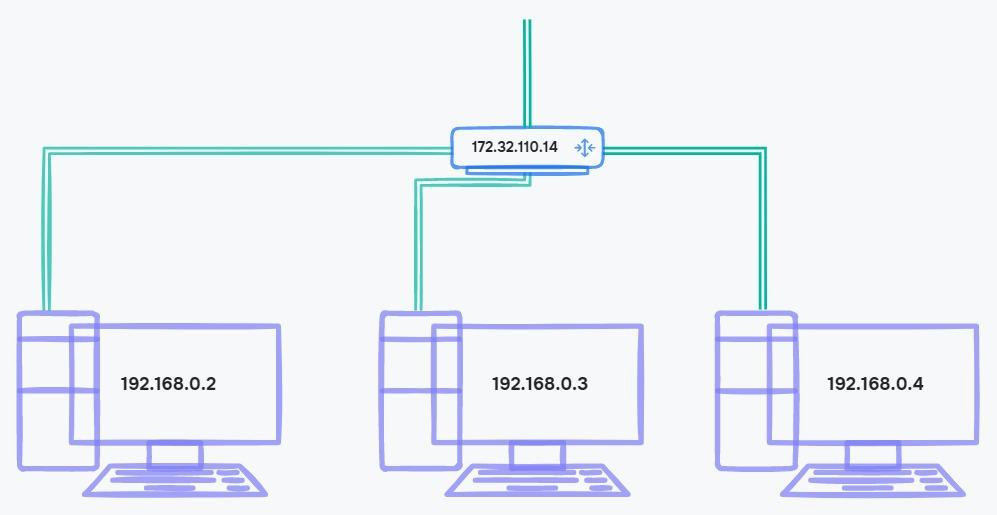
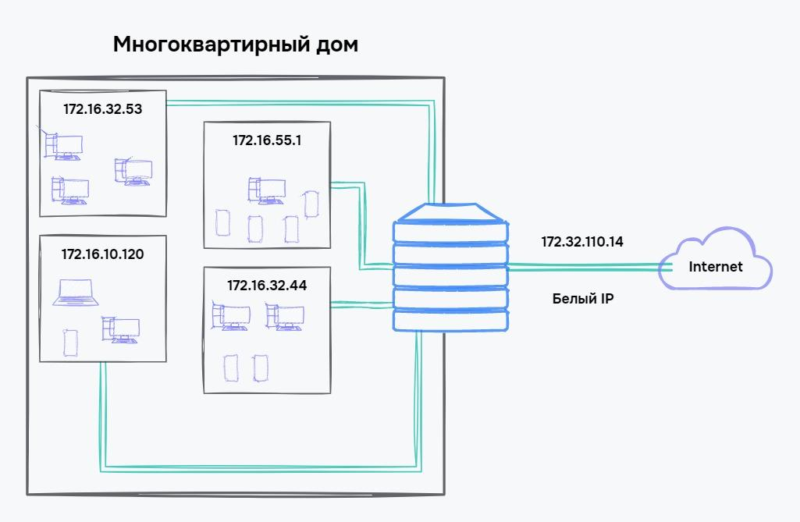
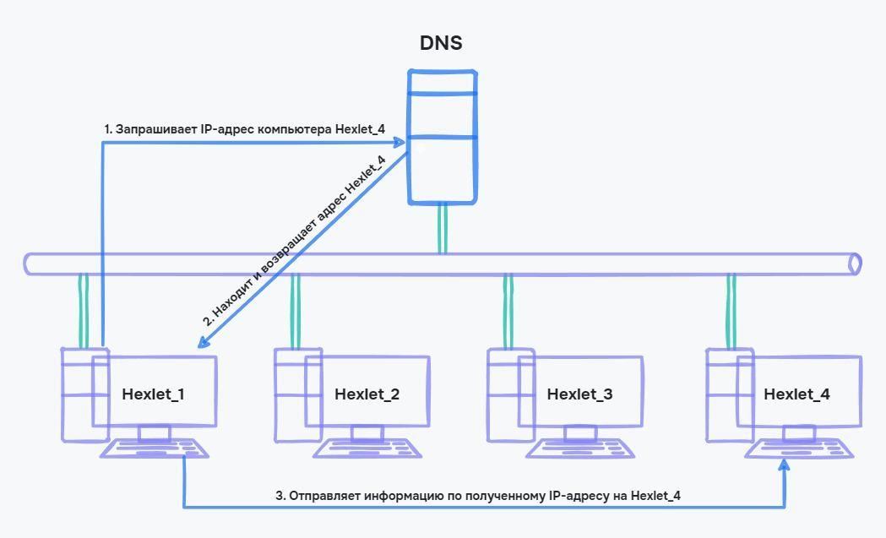

# Компьютерные адреса

Когда мы отправляем письмо по почте, почтальон доставляет его по известному адресу — он написан на конверте. Если адреса квартиры нет, то письмо не дойдет до адресата.

Компьютеры в сети — это тоже «квартиры». Чтобы отправить информацию на другое устройство, нужно знать его адрес. В интернете он называется IP-адресом.

В этом уроке мы познакомимся с уникальными адресами компьютеров внутри сети и их типами. Еще узнаем, хватит ли IP-адресов на всех пользователей и почему их неудобно использовать. Также мы выясним, какая система решила проблему заучивания тысячи цифр, чтобы передавать информацию.

## Что такое уникальный адрес компьютера и каким он бывает

Для того чтобы общаться с другими устройствами в сети, у компьютера есть уникальный адрес. Он стал частью соглашений и правил, которые придумали инженеры ARPANet и назвали **Internet Protocol (IP)**. Уникальный адрес, который описывает адреса компьютеров в сети, назвали **IP-адресом**.

У IP-адреса есть несколько стандартов. Рассмотрим самые используемые в настоящее время:

- Стандарт IPv4
- Стандарт IPv6

Разберем подробнее каждый стандарт.

## Стандарт IPv4
IP-адрес стандарта IPv4 состоит из четырех числовых блоков и записывается в формате десятичной [системы счисления](https://guides.hexlet.io/ru/numeral-systems/?_gl=1*4pzcmc*_ga*MTExOTQzMTcyNC4xNzAwNTc4NDA3*_ga_PM3R85EKHN*MTcwMTE4MzM2OS42LjEuMTcwMTE4NTI5Mi4wLjAuMA..*_ga_WWGZ6EVHEY*MTcwMTE4MzM2OS44LjEuMTcwMTE4NTIzMi42MC4wLjA.) — используются цифры от нуля до девяти. Каждый блок IP-адреса содержит число от 0 до 255 — например, 172.32.110.14.

В этом стандарте выделяют два типа адресов:

- Внутренний IP-адрес
- Внешний IP-адрес

**Внутренние** адреса работают только в пределах локальной сети — по ним нельзя передать информацию из глобальной сети. В интернете насчитывается 22 085 632 таких адресов, они выделяются по группам:

- 10.0.0.0 — 10.255.255.255
- 100.64.0.0 — 100.127.255.255
- 172.16.0.0 — 172.31.255.255
- 192.168.0.0 — 192.168.255.255

Диапазоны таких адресов придумывались разработчиками по мере необходимости и в них нет «скрытого смысла». Внимательно посмотрите на адреса, в каждом диапазоне разное количество доступных адресов. Это сделано, чтобы использовать диапазоны в зависимости от задачи.

Есть адреса, которые используют разработчики, когда создают веб-приложения на компьютере. Например, 127.0.0.1 — адрес компьютера, чтобы обращаться к самому себе. С его помощью проект не попадает в глобальную сеть до конца разработки, и можно не подключаться к интернету.

Еще внутренние адреса получают домашние компьютеры в районной сети. Это будет IP-адрес, который получило ваше устройство, раздающее интернет в квартире, например, роутер. У него есть связь с глобальной сетью. Роутер определяет, кому пересылать информацию внутри локальной сети.

Устройства в локальной сети получат адрес из внутренней группы адресов, а если устройство подключено к интернету, то оно получит **внешний** IP-адрес.

Например, адрес роутера 172.32.110.14 — это внешний адрес, а адрес компьютера, который подключен к нему — 192.168.0.2 — внутренний.

Внешний IP-адрес можно узнать на сервисе [2IP](https://2ip.ru). Если в квартире несколько устройств, то попробуйте посмотреть IP-адрес на каждом из них — он будет одинаковым.



Информация приходит на внешний адрес роутера, который перенаправит ее на нужный частный адрес вашего устройства.

Если от общего количества адресов отнять частные, то получится, что внешних IP-адресов 4 272 881 664. Это небольшая цифра, и количество устройств в сети увеличивается, поэтому провайдерам приходится экономить IP-адреса.

## Как экономят IP-адреса

Провайдеры используют два способа экономии IP-адресов стандарта IPv4:

- Динамические адреса
- Серые IP

**Динамические адреса** можно переиспользовать. Например, когда устройство выходит из сети, то его адрес освобождается и передается другому пользователю.

При **серых IP** создается большая локальная сеть, например, для жилого дома. К глобальной сети подключается только один главный роутер, а к нему подключают сотни пользователей. В такой схеме внешний IP называется **белый IP**.



На схеме серые IP-адреса взяты из диапазона частных адресов 172.16.0.0 — 172.31.255.255. Частные и серые IP — это одно и то же. По такому способу можно подключить миллион квартир к одному белому IP-адресу.

Чтобы использовать способы динамических и серых IP, нужны затраты на оборудование. При этом адреса все равно могут закончиться. Чтобы решить эту проблему, придумали стандарт IPv6. Он ввел новый способ записи адресов для компьютеров в сети.

## Стандарт IPv6

Размер адреса в стандарте IPv6 больше, чем в стандарте IPv4. Он состоит из восьми блоков и записывается в [шестнадцатеричной системе счисления](https://guides.hexlet.io/ru/numeral-systems/?_gl=1*1n954xu*_ga*MTExOTQzMTcyNC4xNzAwNTc4NDA3*_ga_PM3R85EKHN*MTcwMTE4MzM2OS42LjEuMTcwMTE4NTM4NS4wLjAuMA..*_ga_WWGZ6EVHEY*MTcwMTE4MzM2OS44LjEuMTcwMTE4NTIzMi42MC4wLjA.) — цифры от нуля до девяти и буквы a, b, c, d, e, f. Например, a391:5008:1081:a567:b:863e:5543:b2cc. Таких адресов насчитывается 340 282 366 920 938 463 463 374 607 431 768 211 456 — более 340 ундециллионов.

С каждым днем количество компьютеров в сети увеличивается, поэтому IP-адресов стандарта IPv4 может не хватить. Стандарт IPv6 придумали, чтобы решить эту проблему. Но с увеличением числа адресов в ARPANet стали задумываться, как и где хранить столько адресов.

## Как и где хранятся адреса

Когда ARPANet насчитывала не больше 50 компьютеров, пользователи сети хранили их в обычных блокнотах, как в телефонных книгах. Компьютерная сеть набирала популярность, и росло количество компьютеров. Оказалось, что хранить адреса в блокнотах неудобно. Также адрес мог измениться, что тоже нужно было зафиксировать.

Чтобы не усложнять жизнь пользователям, инженеры ARPANet придумали системы хранений:

- Файл hosts.txt
- DNS

Разберем каждую систему подробнее.

## Файл hosts.txt
Отсутствие единой базы имен компьютеров и адресов усложняло жизнь пользователям. Поэтому придумали систему хранения в едином файле — `hosts.txt`.

В файле `hosts.txt` описывается структура вида `IP-адрес — имя компьютера`:

```text
# Адрес для обращения компьютера к себе
127.0.0.1      localhost

# Адреса компьютеров Хекслета в сети
120.1.200.2    Hexlet-PC-JavaScript
97.250.32.12   Hexlet-PC-Ruby
32.42.10.1     Hexlet-PC-DEV
```

Такая запись решила две проблемы:

- Пользователям не нужно хранить адреса компьютеров в сети самостоятельно
- Компьютеры получили удобные имена для обращения. Например, адреса 120.1.200.2, 97.250.32.12, 32.42.10.1 заменились на Hexlet-PC-JavaScript, Hexlet-PC-Ruby или Hexlet-PC-DEV.

Если адрес компьютера менялся, то обновляли файл `hosts.txt` и не запоминали, какой адрес у компьютера теперь.

Файл хранился на одном из компьютеров ARPANet, и пользователи самостоятельно обновляли его на своем устройстве один раз в одну-две недели. Это было удобнее, чем записывать в блокнот.

При этом появились бюрократические проблемы. Например, чтобы добавить в сеть новый компьютер, ученые писали запрос в институт, где хранился главный файл `hosts.txt`. Только так адрес появлялся в новой версии.

Но количество пользователей росло, и система хранения адресов `hosts.txt` становилась сложной и неудобной. Представьте, если один человек записывает телефонные номера людей в районе, и к нему приходят, чтобы обновить базу и получить новые номера. Поэтому систему нужно было автоматизировать.

## DNS

Заменой файлу `hosts.txt` стала **система доменных имен** или **DNS (Domain Name System)** — автоматизированный сервис, который хранит адреса и имена компьютеров в сети.

Задача DNS — вернуть IP-адрес компьютера по его имени. Теперь не нужно присваивать и обновлять адреса для каждого компьютера в сети вручную.

DNS стала большой базой данных, которая помогает компьютерам в сети общаться друг с другом. Компьютер, на котором находится сервис DNS, называется **DNS-сервер**.

Сервис может работать внутри локальной и глобальной сетей. Когда компьютер посылает сообщение на другое устройство, то запрашивает IP-адрес получателя у DNS-сервера. Так это выглядит пошагово:



1. Компьютер Hexlet_1 посылает запрос на DNS-сервер с просьбой сказать ему IP-адрес компьютера Hexlet_4
2. DNS-сервер находит в записях компьютер Hexlet_4 и возвращает его IP-адрес на компьютер Hexlet_1
3. Компьютер Hexlet_1 посылает информацию на адрес, который получил от DNS-сервера

С развитием интернета у DNS появились другие серверы, у каждого из которых своя зона работы. В будущих уроках мы узнаем, как они помогают перейти на сайт Хекслета, и почему для этого используется несколько серверов.

Теперь вы знаете, где и как хранится такое большое количество IP-адресов. DNS автоматизировал работу с адресами, что сделало их хранение более удобным. При этом файлом `hosts.txt` продолжают пользоваться — чаще всего для создания веб-приложений.

## Выводы

-Чтобы передать информацию компьютеру в сети, нужно знать его уникальный адрес — IP-адрес
- IPv4 формируется из четырех блоков и записывается в формате десятичной системы счисления — используются цифры от нуля до девяти. Это дает чуть более четырех миллиардов уникальных адресов
- Из доступных 4 миллиардов адресов несколько десятков миллионов зарезервированы под частные сети
- IPv4 почти исчерпал список доступных адресов, потому что количество устройств с каждым годом становится больше
- Чтобы экономить адреса, провайдеры используют схемы с серыми IP. Они подключают сотни пользователей к одному глобальному адресу
- Новый стандарт IPv6 позволяет подключить более 340 ундециллионов пользователей. Он формируется из восьми блоков и записывается в шестнадцатеричной системе счисления — цифры от нуля до девяти и буквы a, b, c, d, e, f
- Чтобы сделать из IP-адреса более удобное имя компьютера, используется файл hosts.txt. Хранить много записей в нем неудобно. Сейчас его используют, когда создают веб-приложения
- DNS-сервер автоматизирует присвоение IP-адресов — по имени компьютера выдает его IP-адрес

### Дополнительные материалы
1. [Что такое DNS-сервер простыми словами](https://guides.hexlet.io/ru/dns/?_gl=1*1rqqr4u*_ga*MTExOTQzMTcyNC4xNzAwNTc4NDA3*_ga_PM3R85EKHN*MTcwMTE4MzM2OS42LjEuMTcwMTE4NTM4NS4wLjAuMA..*_ga_WWGZ6EVHEY*MTcwMTE4MzM2OS44LjEuMTcwMTE4NTIzMi42MC4wLjA.)
2. [Системы счисления](https://guides.hexlet.io/ru/numeral-systems/?_gl=1*1rqqr4u*_ga*MTExOTQzMTcyNC4xNzAwNTc4NDA3*_ga_PM3R85EKHN*MTcwMTE4MzM2OS42LjEuMTcwMTE4NTM4NS4wLjAuMA..*_ga_WWGZ6EVHEY*MTcwMTE4MzM2OS44LjEuMTcwMTE4NTIzMi42MC4wLjA.)

### Вопросы для самопроверки

**Зачем нужен IP-адрес**

- Для доставки почты
- Для получения информации внутри сети
- Для получения и отправки информации внутри сети
- Для отправки информации внутри сети

**Назовите основные типы IP-адресов, которые выделяют в стандарте IPv4**

- Частные
- Внешние
- Закрытые
- Общественные
- Публичные

**Какой файл используется для связи адреса и имени устройства**

- networks
- hosts
- base
- names

**Какая служба автоматизирует определение IP-адреса по имени сервиса в сети**

- SSD
- DNS
- WWW
- RAM
- NDS

**Какая основная причина перехода на стандарт IPv6**

- Компании хотят заработать на новом оборудовании
- Это позволит ускорить передачу информации в сети
- Заканчиваются IP-адреса по стандарту IPv4
- Неудобные адреса в старом стандарте