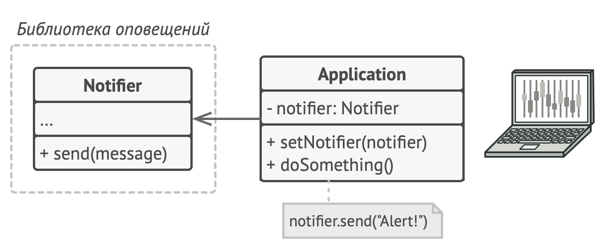
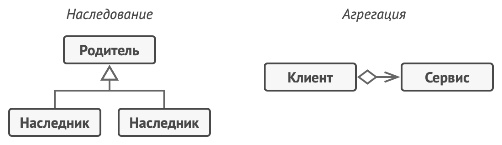
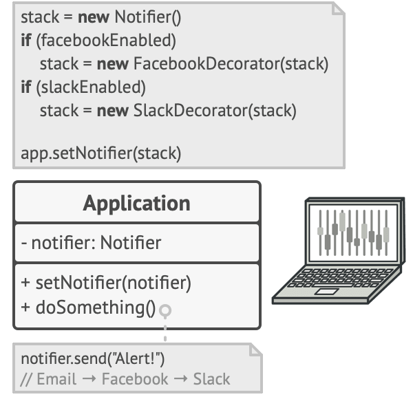
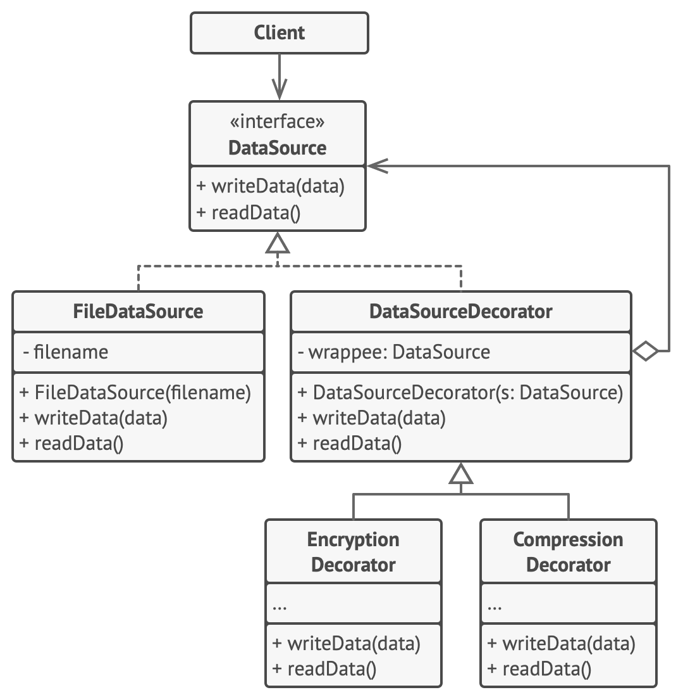

# Декоратор

> Также известен как: **Wrapper**, **Обёртка**, **Decorator**

## Суть паттерна

**Декоратор** — это структурный паттерн проектирования, который позволяет динамически добавлять объектам новую функциональность, оборачивая их в полезные «обёртки».


## Проблема

Вы работаете над библиотекой оповещений, которую можно подключать к разнообразным программам, чтобы получать уведомления о важных событиях.

Основой библиотеки является класс `Notifier` с методом `send`, который принимает на вход строку-сообщение и высылает её всем администраторам по электронной почте. Сторонняя программа должна создать и настроить этот объект, указав кому отправлять оповещения, а затем использовать его каждый раз, когда что-то случается.



*Сторонние программы используют главный класс оповещений.*

В какой-то момент стало понятно, что одних email-оповещений пользователям мало. Некоторые из них хотели бы получать извещения о критических проблемах через SMS. Другие хотели бы получать их в виде сообщений Facebook. Корпоративные пользователи хотели бы видеть сообщения в Slack.


*Каждый тип оповещения живёт в собственном подклассе.*

Сначала вы добавили каждый из этих типов оповещений в программу, унаследовав их от базового класса `Notifier`. Теперь пользователь выбирал один из типов оповещений, который и использовался в дальнейшем.

Но затем кто-то резонно спросил, почему нельзя выбрать несколько типов оповещений сразу? Ведь если вдруг в вашем доме начался пожар, вы бы хотели получить оповещения по всем каналам, не так ли?

Вы попытались реализовать все возможные комбинации подклассов оповещений. Но после того как вы добавили первый десяток классов, стало ясно, что такой подход невероятно раздувает код программы.


*Комбинаторный взрыв подклассов при совмещении типов оповещений.*

Итак, нужен какой-то другой способ комбинирования поведения объектов, который не приводит к взрыву количества подклассов.

## Решение

**Наследование** — это первое, что приходит в голову многим программистам, когда нужно расширить какое-то существующее поведение. Но механизм наследования имеет несколько досадных проблем.

- Он **статичен**. Вы не можете изменить поведение существующего объекта. Для этого вам надо создать новый объект, выбрав другой подкласс.
- Он **не разрешает наследовать поведение нескольких классов одновременно**. Из-за этого вам приходится создавать множество подклассов-комбинаций для получения совмещённого поведения.

Одним из способов обойти эти проблемы является замена наследования *агрегацией* либо <tooltip term="oop_composition">*композицией*</tooltip>. Это когда один объект *содержит* ссылку на другой и делегирует ему работу, вместо того чтобы самому *наследовать* его поведение. Как раз на этом принципе построен паттерн `Декоратор`.



*Наследование против Агрегации.*

Декоратор имеет альтернативное название — *обёртка*. Оно более точно описывает суть паттерна: вы помещаете целевой объект в другой объект-обёртку, который запускает базовое поведение объекта, а затем добавляет к результату что-то своё.

Оба объекта имеют общий интерфейс, поэтому для пользователя нет никакой разницы, с каким объектом работать — чистым или обёрнутым. Вы можете использовать несколько разных обёрток одновременно — результат будет иметь объединённое поведение всех обёрток сразу.

В примере с оповещениями мы оставим в базовом классе простую отправку по электронной почте, а расширенные способы отправки сделаем декораторами.


*Расширенные способы оповещения становятся декораторами.*

Сторонняя программа, выступающая клиентом, во время первичной настройки будет заворачивать объект оповещений в те обёртки, которые соответствуют желаемому способу оповещения.



*Программа может составлять составные объекты из декораторов.*

Последняя обёртка в списке и будет тем объектом, с которым клиент будет работать в остальное время. Для остального клиентского кода, по сути, ничего не изменится, ведь все обёртки имеют точно такой же интерфейс, что и базовый класс оповещений.

Таким же образом можно изменять не только способ доставки оповещений, но и форматирование, список адресатов и так далее. К тому же клиент может «дообернуть» объект любыми другими обёртками, когда ему захочется.

## Аналогия из жизни


*Одежду можно надевать слоями, получая комбинированный эффект.*

Любая одежда — это аналог Декоратора. Применяя Декоратор, вы не меняете первоначальный класс и не создаёте дочерних классов. Так и с одеждой — надевая свитер, вы не перестаёте быть собой, но получаете новое свойство — защиту от холода. Вы можете пойти дальше и надеть сверху ещё один декоратор — плащ, чтобы защититься и от дождя.

## Структура


1. **Компонент** задаёт общий интерфейс обёрток и оборачиваемых объектов.
2. **Конкретный компонент** определяет класс оборачиваемых объектов. Он содержит какое-то базовое поведение, которое потом изменяют декораторы.
3. **Базовый декоратор** хранит ссылку на вложенный объект-компонент. Им может быть как конкретный компонент, так и один из конкретных декораторов. Базовый декоратор делегирует все свои операции вложенному объекту. Дополнительное поведение будет жить в конкретных декораторах.
4. **Конкретные декораторы** — это различные вариации декораторов, которые содержат добавочное поведение. Оно выполняется до или после вызова аналогичного поведения обёрнутого объекта.
5. **Клиент** может оборачивать простые компоненты и декораторы в другие декораторы, работая со всеми объектами через общий интерфейс компонентов.

## Псевдокод

В этом примере **Декоратор** защищает финансовые данные дополнительными уровнями безопасности прозрачно для кода, который их использует.



*Пример шифрования и компрессии данных с помощью обёрток.*

Приложение оборачивает класс данных в шифрующую и сжимающую обёртки, которые при чтении выдают оригинальные данные, а при записи — зашифрованные и сжатые.

Декораторы, как и сам класс данных, имеют общий интерфейс. Поэтому клиентскому коду не важно, с чем работать — c «чистым» объектом данных или с «обёрнутым».

```c
// Общий интерфейс компонентов.
interface DataSource is
    method writeData(data)
    method readData():data

// Один из конкретных компонентов реализует базовую
// функциональность.
class FileDataSource implements DataSource is
    constructor FileDataSource(filename) { ... }

    method writeData(data) is
        // Записать данные в файл.

    method readData():data is
        // Прочитать данные из файла.

// Родитель всех декораторов содержит код обёртывания.
class DataSourceDecorator implements DataSource is
    protected field wrappee: DataSource

    constructor DataSourceDecorator(source: DataSource) is
        wrappee = source

    method writeData(data) is
        wrappee.writeData(data)

    method readData():data is
        return wrappee.readData()

// Конкретные декораторы добавляют что-то своё к базовому
// поведению обёрнутого компонента.
class EncryptionDecorator extends DataSourceDecorator is
    method writeData(data) is
        // 1. Зашифровать поданные данные.
        // 2. Передать зашифрованные данные в метод writeData
        // обёрнутого объекта (wrappee).

    method readData():data is
        // 1. Получить данные из метода readData обёрнутого
        // объекта (wrappee).
        // 2. Расшифровать их, если они зашифрованы.
        // 3. Вернуть результат.

// Декорировать можно не только базовые компоненты, но и уже
// обёрнутые объекты.
class CompressionDecorator extends DataSourceDecorator is
    method writeData(data) is
        // 1. Запаковать поданные данные.
        // 2. Передать запакованные данные в метод writeData
        // обёрнутого объекта (wrappee).

    method readData():data is
        // 1. Получить данные из метода readData обёрнутого
        // объекта (wrappee).
        // 2. Распаковать их, если они запакованы.
        // 3. Вернуть результат.


// Вариант 1. Простой пример сборки и использования декораторов.
class Application is
    method dumbUsageExample() is
        source = new FileDataSource("somefile.dat")
        source.writeData(salaryRecords)
        // В файл были записаны чистые данные.

        source = new CompressionDecorator(source)
        source.writeData(salaryRecords)
        // В файл были записаны сжатые данные.

        source = new EncryptionDecorator(source)
        // Сейчас в source находится связка из трёх объектов:
        // Encryption > Compression > FileDataSource

        source.writeData(salaryRecords)
        // В файл были записаны сжатые и зашифрованные данные.


// Вариант 2. Клиентский код, использующий внешний источник
// данных. Класс SalaryManager ничего не знает о том, как именно
// будут считаны и записаны данные. Он получает уже готовый
// источник данных.
class SalaryManager is
    field source: DataSource

    constructor SalaryManager(source: DataSource) { ... }

    method load() is
        return source.readData()

    method save() is
        source.writeData(salaryRecords)
    // ...Остальные полезные методы...


// Приложение может по-разному собирать декорируемые объекты, в
// зависимости от условий использования.
class ApplicationConfigurator is
    method configurationExample() is
        source = new FileDataSource("salary.dat")
        if (enabledEncryption)
            source = new EncryptionDecorator(source)
        if (enabledCompression)
            source = new CompressionDecorator(source)

        logger = new SalaryManager(source)
        salary = logger.load()
    // ...
```

## Применимость

**Когда вам нужно добавлять обязанности объектам на лету, незаметно для кода, который их использует.**

Объекты помещают в обёртки, имеющие дополнительные поведения. Обёртки и сами объекты имеют одинаковый интерфейс, поэтому клиентам без разницы, с чем работать — с обычным объектом данных или с обёрнутым.

---

**Когда нельзя расширить обязанности объекта с помощью наследования.**

Во многих языках программирования есть ключевое слово `final`, которое может заблокировать наследование класса. Расширить такие классы можно только с помощью Декоратора.

## Шаги реализации

1. Убедитесь, что в вашей задаче есть один основной компонент и несколько опциональных дополнений или надстроек над ним.
2. Создайте интерфейс компонента, который описывал бы общие методы как для основного компонента, так и для его дополнений.
3. Создайте класс конкретного компонента и поместите в него основную бизнес-логику.
4. Создайте базовый класс декораторов. Он должен иметь поле для хранения ссылки на вложенный объект-компонент. Все методы базового декоратора должны делегировать действие вложенному объекту.
5. И конкретный компонент, и базовый декоратор должны следовать одному и тому же интерфейсу компонента.
6. Теперь создайте классы конкретных декораторов, наследуя их от базового декоратора. Конкретный декоратор должен выполнять свою добавочную функцию, а затем (или перед этим) вызывать эту же операцию обёрнутого объекта.
7. Клиент берёт на себя ответственность за конфигурацию и порядок обёртывания объектов.

## Преимущества и недостатки

**Преимущества**

- Большая гибкость, чем у наследования.
- Позволяет добавлять обязанности на лету.
- Можно добавлять несколько новых обязанностей сразу.
- Позволяет иметь несколько мелких объектов вместо одного объекта на все случаи жизни.

**Недостатки**

- Трудно конфигурировать многократно обёрнутые объекты.
- Обилие крошечных классов.

## Примеры реализации паттерна

### Python

- **Сложность**: 2/3
- **Популярность**: 2/3
- **Применимость**: Паттерн можно часто встретить в Python-коде, особенно в коде, работающем с потоками данных.
- **Признаки применения паттерна**: Декоратор можно распознать по создающим методам, которые принимают в параметрах объекты того же абстрактного типа или интерфейса, что и текущий класс.

Этот пример показывает структуру паттерна `Декоратор`, а именно — из каких классов он состоит, какие роли эти классы выполняют и как они взаимодействуют друг с другом.

**main.py**: Пример структуры паттерна

```python
class Component():
    """
    Базовый интерфейс Компонента определяет поведение, которое
    изменяется декораторами.
    """

    def operation(self) -> str:
        pass


class ConcreteComponent(Component):
    """
    Конкретные Компоненты предоставляют реализации поведения по
    умолчанию. Может быть несколько вариаций этих классов.
    """

    def operation(self) -> str:
        return "ConcreteComponent"


class Decorator(Component):
    """
    Базовый класс Декоратора следует тому же интерфейсу, что и другие
    компоненты. Основная цель этого класса - определить интерфейс
    обёртки для всех конкретных декораторов. Реализация кода обёртки
    по умолчанию может включать в себя поле для хранения завёрнутого
    компонента и средства его инициализации.
    """

    _component: Component = None

    def __init__(self, component: Component) -> None:
        self._component = component

    @property
    def component(self) -> Component:
        """
        Декоратор делегирует всю работу обёрнутому компоненту.
        """

        return self._component

    def operation(self) -> str:
        return self._component.operation()


class ConcreteDecoratorA(Decorator):
    """
    Конкретные Декораторы вызывают обёрнутый объект и изменяют его
    результат некоторым образом.
    """

    def operation(self) -> str:
        """
        Декораторы могут вызывать родительскую реализацию операции,
        вместо того, чтобы вызвать обёрнутый объект напрямую. Такой
        подход упрощает расширение классов декораторов.
        """
        return f"ConcreteDecoratorA({self.component.operation()})"


class ConcreteDecoratorB(Decorator):
    """
    Декораторы могут выполнять своё поведение до или после вызова
    обёрнутого объекта.
    """

    def operation(self) -> str:
        return f"ConcreteDecoratorB({self.component.operation()})"


def client_code(component: Component) -> None:
    """
    Клиентский код работает со всеми объектами, используя интерфейс
    Компонента. Таким образом, он остаётся независимым от конкретных
    классов компонентов, с которыми работает.
    """

    # ...

    print(f"RESULT: {component.operation()}", end="")

    # ...


if __name__ == "__main__":
    # Таким образом, клиентский код может поддерживать как простые
    # компоненты...
    simple = ConcreteComponent()
    print("Client: I've got a simple component:")
    client_code(simple)
    print("\n")

    # ...так и декорированные.
    #
    # Обратите внимание, что декораторы могут обёртывать не только
    # простые компоненты, но и другие декораторы.
    decorator1 = ConcreteDecoratorA(simple)
    decorator2 = ConcreteDecoratorB(decorator1)
    print("Client: Now I've got a decorated component:")
    client_code(decorator2)
```

**Output.txt**: Результат выполнения

```text
Client: I've got a simple component:
RESULT: ConcreteComponent

Client: Now I've got a decorated component:
RESULT: ConcreteDecoratorB(ConcreteDecoratorA(ConcreteComponent))
```

### PHP

- **Сложность**: 2/3
- **Популярность**: 2/3
- **Применимость**: Паттерн можно часто встретить в PHP-коде, особенно в коде, работающем с потоками данных.
- **Признаки применения паттерна**: Декоратор можно распознать по создающим методам, которые принимают в параметрах объекты того же абстрактного типа или интерфейса, что и текущий класс.

<tabs>
<tab title="Концептуальный пример">
<h4 id="decorator-php-concept">Концептуальный пример</h4>
<p>Этот пример показывает структуру паттерна <b>Декоратор</b>, а именно — из каких классов он состоит, какие роли эти классы выполняют и как они взаимодействуют друг с другом.</p>
<p>После ознакомления со структурой, вам будет легче воспринимать второй пример, который рассматривает реальный случай использования паттерна в мире PHP.</p>
<p><b>index.php</b>: Пример структуры паттерна</p>
<code-block lang="php">
<![CDATA[
namespace RefactoringGuru\Decorator\Conceptual;

/**
* Базовый интерфейс Компонента определяет поведение, которое изменяется
* декораторами.
*/

interface Component
{
    public function operation(): string;
}

/**
* Конкретные Компоненты предоставляют реализации поведения по умолчанию. Может
* быть несколько вариаций этих классов.
*/

class ConcreteComponent implements Component
{
    public function operation(): string
    {
        return "ConcreteComponent";
    }
}

/**
* Базовый класс Декоратора следует тому же интерфейсу, что и другие компоненты.
* Основная цель этого класса - определить интерфейс обёртки для всех конкретных
* декораторов. Реализация кода обёртки по умолчанию может включать в себя поле
* для хранения завёрнутого компонента и средства его инициализации.
*/

class Decorator implements Component
{
    /**
    * @var Component
    */
    protected $component;

    public function __construct(Component $component)
    {
        $this->component = $component;
    }

    /**
    * Декоратор делегирует всю работу обёрнутому компоненту.
    */
    public function operation(): string
    {
        return $this->component->operation();
    }
}

/**
* Конкретные Декораторы вызывают обёрнутый объект и изменяют его результат
* некоторым образом.
*/

class ConcreteDecoratorA extends Decorator
{
    /**
    * Декораторы могут вызывать родительскую реализацию операции, вместо того,
    * чтобы вызвать обёрнутый объект напрямую. Такой подход упрощает расширение
    * классов декораторов.
    */
    public function operation(): string
    {
        return "ConcreteDecoratorA(" . parent::operation() . ")";
    }
}

/**
* Декораторы могут выполнять своё поведение до или после вызова обёрнутого
* объекта.
*/

class ConcreteDecoratorB extends Decorator
{
    public function operation(): string
    {
        return "ConcreteDecoratorB(" . parent::operation() . ")";
    }
}

/**
* Клиентский код работает со всеми объектами, используя интерфейс Компонента.
* Таким образом, он остаётся независимым от конкретных классов компонентов, с
* которыми работает.
*/

function clientCode(Component $component)
{
    // ...
    echo "RESULT: " . $component->operation();
    // ...
}

/**
* Таким образом, клиентский код может поддерживать как простые компоненты...
*/

$simple = new ConcreteComponent();
echo "Client: I've got a simple component:\n";
clientCode($simple);
echo "\n\n";

/**
* ...так и декорированные.
*
* Обратите внимание, что декораторы могут обёртывать не только простые
* компоненты, но и другие декораторы.
*/
$decorator1 = new ConcreteDecoratorA($simple);
$decorator2 = new ConcreteDecoratorB($decorator1);
echo "Client: Now I've got a decorated component:\n";
clientCode($decorator2);
]]>
</code-block>
<p><b>Output.txt</b>: Результат выполнения</p>
<code-block lang="text">
<![CDATA[
Client: I've got a simple component:
RESULT: ConcreteComponent

Client: Now I've got a decorated component:
RESULT: ConcreteDecoratorB(ConcreteDecoratorA(ConcreteComponent))

]]>
</code-block>
</tab>
<tab title="Пример из реальной жизни">
<h4 id="decorator-php-real">Пример из реальной жизни</h4>
<p>В этом примере паттерн <b>Декоратора</b> помогает создать сложные правила фильтрации текста для приведения информации в порядок перед её отображением на веб-странице. Разные типы информации, такие как комментарии, сообщения на форуме или личные сообщения, требуют разных наборов фильтров.</p>
<p>Например, вы хотели бы удалить весь HTML из комментариев и в тоже время сохранить некоторые основные теги HTML в сообщениях на форуме. Кроме того, вы можете пожелать разрешить публикацию в формате Markdown, который должен быть обработан перед какой-либо фильтрацией HTML. Все эти правила фильтрации могут быть представлены в виде отдельных классов декораторов, которые могут быть сложены в стек по-разному, в зависимости от характера содержимого.</p>
<p><b>index.php</b>: Пример из реальной жизни</p>
<code-block lang="php">
<![CDATA[
namespace RefactoringGuru\Decorator\RealWorld;

/**
* Интерфейс Компонента объявляет метод фильтрации, который должен быть
* реализован всеми конкретными компонентами и декораторами.
*/

interface InputFormat
{
    public function formatText(string $text): string;
}

/**
* Конкретный Компонент является основным элементом декорирования. Он
* содержит исходный текст как есть, без какой-либо фильтрации или
* форматирования.
*/

class TextInput implements InputFormat
{
    public function formatText(string $text): string
    {
        return $text;
    } 
}

/**
* Базовый класс Декоратора не содержит реальной логики фильтрации или
* форматирования. Его основная цель – реализовать базовую
* инфраструктуру декорирования: поле для хранения обёрнутого
* компонента или другого декоратора и базовый метод форматирования,
* который делегирует работу обёрнутому объекту.
* Реальная работа по форматированию выполняется подклассами.
*/

class TextFormat implements InputFormat
{
    /**
    * @var InputFormat
    */
    protected $inputFormat;

    public function __construct(InputFormat $inputFormat)
    {
        $this->inputFormat = $inputFormat;
    }

    /**
    * Декоратор делегирует всю работу обёрнутому компоненту.
    */
    public function formatText(string $text): string
    {
        return $this->inputFormat->formatText($text);
    }
}

/**
* Этот Конкретный Декоратор удаляет все теги HTML из данного текста.
*/

class PlainTextFilter extends TextFormat
{
    public function formatText(string $text): string
    {
        $text = parent::formatText($text);
        return strip_tags($text);
    }
}

/**
* Этот Конкретный Декоратор удаляет только опасные теги и атрибуты
* HTML, которые могут привести к XSS-уязвимости.
*/

class DangerousHTMLTagsFilter extends TextFormat
{
    private $dangerousTagPatterns = [
        "|<script.*?>([\s\S]*)?</script>|i", // ...
    ];

    private $dangerousAttributes = [
        "onclick", "onkeypress", // ...
    ];

    public function formatText(string $text): string
    {
        $text = parent::formatText($text);

        foreach ($this->dangerousTagPatterns as $pattern) {
            $text = preg_replace($pattern, '', $text);
        }

        foreach ($this->dangerousAttributes as $attribute) {
            $text = preg_replace_callback('|<(.*?)>|',
                function ($matches) use ($attribute) {
                    $result = preg_replace("|$attribute=|i", '',
                        $matches[1]);
                    return "<" . $result . ">";
                }, $text);
        }

        return $text;
    }
}

/**
* Этот Конкретный Декоратор предоставляет элементарное преобразование
* Markdown → HTML.
*/

class MarkdownFormat extends TextFormat
{
    public function formatText(string $text): string
    {
        $text = parent::formatText($text);

        // Форматирование элементов блока.
        $chunks = preg_split('|\n\n|', $text);
        foreach ($chunks as &$chunk) {
            // Форматирование заголовков.
            if (preg_match('|^#+|', $chunk)) {
                $chunk = preg_replace_callback('|^(#+)(.*?)$|',
                    function ($matches) {
                        $h = strlen($matches[1]);
                        return "<h$h>" . trim($matches[2]) . "</h$h>";
                    }, $chunk);
            } // Форматирование параграфов.
            else {
                $chunk = "<p>$chunk</p>";
            }
        }
        $text = implode("\n\n", $chunks);

        // Форматирование встроенных элементов.
        $text = preg_replace("|__(.*?)__|", '<strong>$1</strong>',
            $text);
        $text = preg_replace("|\*\*(.*?)\*\*|", '<strong>$1</strong>',
            $text);
        $text = preg_replace("|_(.*?)_|", '<em>$1</em>', $text);
        $text = preg_replace("|\*(.*?)\*|", '<em>$1</em>', $text);

        return $text;
    }
}

/**
* Клиентский код может быть частью реального веб-сайта, который
* отображает создаваемый пользователями контент. Поскольку он работает
* с модулями форматирования через интерфейс компонента, ему всё равно,
* получает ли он простой объект компонента или обёрнутый.
*/ 

function displayCommentAsAWebsite(InputFormat $format, string $text)
{
    // ..
    echo $format->formatText($text);
    // ..
}

/**
* Модули форматирования пользовательского ввода очень удобны при
* работе с контентом, создаваемым пользователями. Отображение такого
* контента «как есть» может быть очень опасным, особенно когда его
* могут создавать анонимные пользователи (например, комментарии).
* Ваш сайт не только рискует получить массу спам-ссылок, но также
* может быть подвергнут XSS-атакам.
*/

$dangerousComment = <<<HERE
    Hello! Nice blog post!
    Please visit my
    <a href='http://www.iwillhackyou.com'>homepage</a>.
    <script src="http://www.iwillhackyou.com/script.js">
        performXSSAttack();
    </script>
HERE;

/**
* Наивное отображение комментариев (небезопасное).
*/

$naiveInput = new TextInput();
echo "Website renders comments without filtering (unsafe):\n";
displayCommentAsAWebsite($naiveInput, $dangerousComment);
echo "\n\n\n";

/**
* Отфильтрованное отображение комментариев (безопасное).
*/

$filteredInput = new PlainTextFilter($naiveInput);
echo "Website renders comments after stripping all tags (safe):\n";
displayCommentAsAWebsite($filteredInput, $dangerousComment);
echo "\n\n\n";


/**
* Декоратор позволяет складывать несколько входных форматов для
* получения точного контроля над отображаемым содержимым.
*/
$dangerousForumPost = <<<HERE
    # Welcome
    This is my first post on this **gorgeous** forum.
    <script src="http://www.iwillhackyou.com/script.js">
        performXSSAttack();
    </script>
HERE;

/**
* Наивное отображение сообщений (небезопасное, без форматирования).
*/

$naiveInput = new TextInput();
echo "Website renders a forum post without filtering and formatting (unsafe, ugly):\n";
displayCommentAsAWebsite($naiveInput, $dangerousForumPost);
echo "\n\n\n";

/**
* Форматтер Markdown + фильтрация опасных тегов (безопасно, красиво).
*/

$text = new TextInput();
$markdown = new MarkdownFormat($text);
$filteredInput = new DangerousHTMLTagsFilter($markdown);
echo "Website renders a forum post after translating markdown markup" .
    "and filtering some dangerous HTML tags and attributes (safe, pretty):\n";
displayCommentAsAWebsite($filteredInput, $dangerousForumPost);
echo "\n\n\n";

]]>
</code-block>
<p><b>Output.txt</b>: Результат выполнения</p>
<code-block lang="plain text">
<![CDATA[
Website renders comments without filtering (unsafe):
Hello! Nice blog post!
Please visit my <a href='http://www.iwillhackyou.com'>homepage</a>.
<script src="http://www.iwillhackyou.com/script.js">
    performXSSAttack();
</script>


Website renders comments after stripping all tags (safe):
Hello! Nice blog post!
Please visit my homepage.

performXSSAttack();


Website renders a forum post without filtering and formatting (unsafe, ugly):
#Welcome

This is my first post on this **gorgeous** forum.

<script src="http://www.iwillhackyou.com/script.js">
    performXSSAttack();
</script>


Website renders a forum post after translating markdown markupand filtering some dangerous HTML tags and attributes (safe, pretty):
<h1>Welcome</h1>

<p>This is my first post on this <strong>gorgeous</strong> forum.</p>

<p></p>

]]>
</code-block>
</tab>
</tabs>