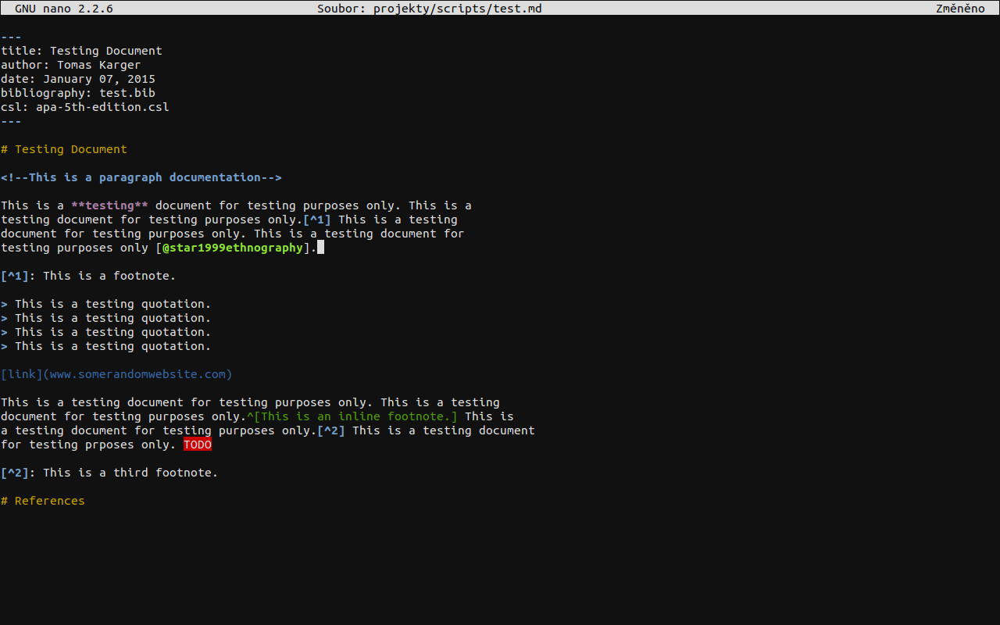
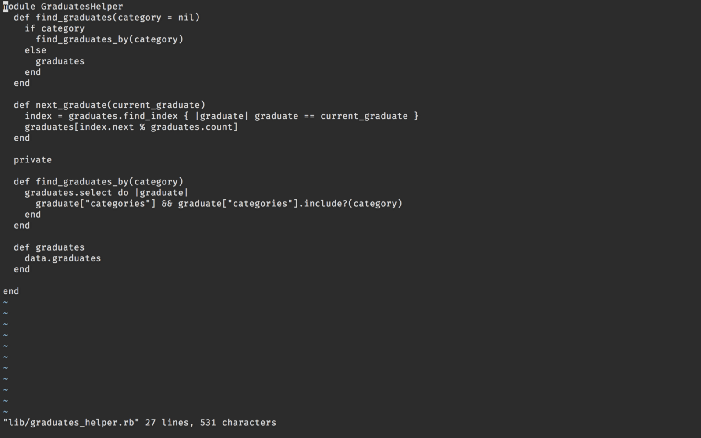
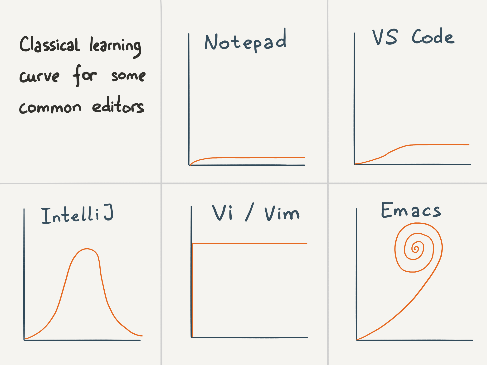
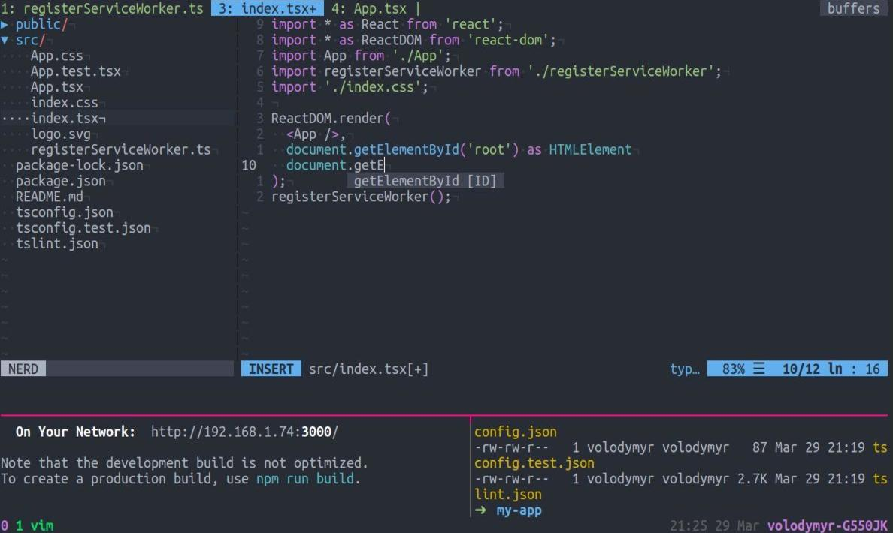

# Редактирование файлов

Для редактирования файлов в командной строке используют редакторы Nano, Vim и Emacs. В этом уроке мы обсудим два редактора из этого списка.

В большинстве случаев в системе установлен только Vim, поэтому важно владеть базовыми навыками обращения с ним. Эти редакторы запускаются прямо в терминале, хотя Vim и Emacs имеют режим, в котором они запускаются как отдельные приложения.

## Nano

Nano — очень простенький текстовый редактор, похожий на Блокнот в Windows, хотя по возможностям он богаче и даже способен подсвечивать содержимое файлов:

```bash
nano .bashrc
```



После запуска редактора внизу открывается панель с подсказками, какие горячие клавиши доступны для использования. Символ `^` означает клавишу <shortcut>Ctrl</shortcut>.

Например, нажав <shortcut>Ctrl + x</shortcut>, вы можете выйти из редактора. При выходе нужно уточнить, хотите ли вы сохранить изменения:

- Сохранить — <shortcut>y</shortcut> (yes)
- Не сохранять — <shortcut>n</shortcut> (no)

В принципе, больше ничего интересного про Nano сказать нельзя. Это обычный редактор, который подходит для несложных изменений в файлах, но им совсем неудобно пользоваться для работы над проектами с множеством файлов и сложным кодом.

## Vim

Совсем другое дело — это Vim (сокращение от *Vi Improved*). Это свободный текстовый редактор, созданный на основе более старого vi (*visual editor*).

Это редактор, который имеет уникальную модель работы:

```bash
vim .bashrc
```



Ключевое отличие Vim от остальных редакторов — наличие режимов. В обычных редакторах мы открываем файл и сразу можем приступать к редактированию. В отличие от них, Vim запускается в режиме **COMMAND** — это режим команд, при котором нажатие на любую клавишу воспринимается как сигнал к какому-то действию.

Если вы не знаете команд, то лучше ничего не трогать, иначе на экране начнется хаос. Обычное редактирование текста выполняется в режиме ввода — **INSERT**. Попасть в него можно с помощью клавиши <shortcut>i</shortcut>. Для выхода в режим команд достаточно нажать <shortcut>Esc</shortcut> или комбинацию <shortcut>Ctrl + [</shortcut>.

Всего у Vim есть четыре основных режима работы:

- Командный режим — это режим по умолчанию. В нем можно перемещаться по файлу, вносить изменения с помощью комбинаций клавиш, удалять и искать текст
- Режим вставки — это режим ввода текста с клавиатуры. Здесь все работает так, как вы привыкли это делать в обычных редакторах
- Визуальный режим — выделение произвольных участков текста
- Режим командной строки — собственная командная строка для редактора текста, из которой можно выполнять множество разнообразных команд

Vim по праву считается редактором с самым высоким порогом входа, и разработчики даже шутят на эту тему:



Конечно, в этой шутке есть доля правды. Но чем дольше вы будете осваивать программирование, тем чаще вы будете встречать опытных и известных разработчиков, которые полностью работают на Vim. Не последнюю роль в этом играют **расширения**.

Посмотрев на Vim без плагинов, сложно поверить, что благодаря расширениям он может стать очень навороченным:



Подробнее о том, почему так происходит и что особенного в Vim, написано в [руководстве](https://guides.hexlet.io/ru/vim?_gl=1*12zw3dp*_ga*MTExOTQzMTcyNC4xNzAwNTc4NDA3*_ga_PM3R85EKHN*MTcwMTM1ODg1Ni4xMC4xLjE3MDEzNTkzMzYuMC4wLjA.*_ga_WWGZ6EVHEY*MTcwMTM1ODg1Ni4xMi4xLjE3MDEzNTkyNzYuMzkuMC4w). Крайне рекомендуем к прочтению.

Говорят, что самое сложное в Vim — это выйти, поэтому подготовимся заранее. Обсудим, как выйти из Vim:

- Убедитесь, что вы находитесь в командном режиме. На всякий случай нажмите <shortcut>Esc</shortcut> или комбинацию <shortcut>Ctrl + [</shortcut>
- Затем наберите `:` (символ "двоеточие") — эта команда переведет вас в режим командной строки
- В конце введите `q!` и нажмите <shortcut>Enter</shortcut>

Так вы выйдете из Vim без сохранения изменений. Если набрать `:wq`, то перед выходом сохранятся все изменения. Если вы хотите просто сохраниться без выхода, то наберите `:w`.

### Дополнительные материалы

1. [Vim](https://guides.hexlet.io/ru/vim?_gl=1*exlkf0*_ga*MTExOTQzMTcyNC4xNzAwNTc4NDA3*_ga_PM3R85EKHN*MTcwMTM1ODg1Ni4xMC4xLjE3MDEzNTkyNzYuMzkuMC4w*_ga_WWGZ6EVHEY*MTcwMTM1ODg1Ni4xMi4xLjE3MDEzNTkyNzYuMzkuMC4w)
2. [Sed (Stream Editor)](https://ru.wikipedia.org/wiki/Sed)

### Вопросы для самопроверки

**Как выйти из Vim без сохранения изменений?**

- i
- xD
- q!

**Как выйти из Nano?**

- q
- Alt + x
- Ctrl + x
- Ctrl + s

**Как войти в режим редактирования в Vim?**

- q
- w
- v
- i