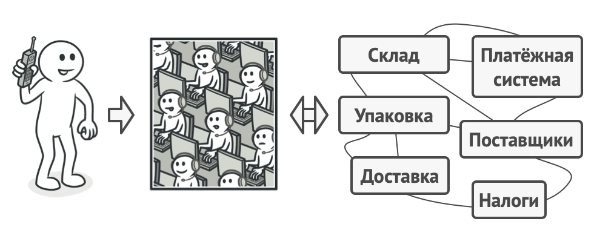

# Фасад

> Также известен как: Facade

## Суть паттерна
**Фасад** — это структурный паттерн проектирования, который предоставляет простой интерфейс к сложной системе классов, библиотеке или фреймворку.


## Проблема

Вашему коду приходится работать с большим количеством объектов некой сложной библиотеки или фреймворка. Вы должны самостоятельно инициализировать эти объекты, следить за правильным порядком зависимостей и так далее.

В результате бизнес-логика ваших классов тесно переплетается с деталями реализации сторонних классов. Такой код довольно сложно понимать и поддерживать.

## Решение
Фасад — это простой интерфейс для работы со сложной подсистемой, содержащей множество классов. Фасад может иметь урезанный интерфейс, не имеющий 100% функциональности, которой можно достичь, используя сложную подсистему напрямую. Но он предоставляет именно те фичи, которые нужны клиенту, и скрывает все остальные.

Фасад полезен, если вы используете какую-то сложную библиотеку со множеством подвижных частей, но вам нужна только часть её возможностей.

К примеру, программа, заливающая видео котиков в социальные сети, может использовать профессиональную библиотеку сжатия видео. Но все, что нужно клиентскому коду этой программы — простой метод `encode(filename, format)`. Создав класс с таким методом, вы реализуете свой первый фасад.

## Аналогия из жизни



*Пример телефонного заказа.*

Когда вы звоните в магазин и делаете заказ по телефону, сотрудник службы поддержки является вашим фасадом ко всем службам и отделам магазина. Он предоставляет вам упрощённый интерфейс к системе создания заказа, платёжной системе и отделу доставки.

## Структура


1. **Фасад** предоставляет быстрый доступ к определённой функциональности подсистемы. Он «знает», каким классам нужно переадресовать запрос, и какие данные для этого нужны.
2. **Дополнительный фасад** можно ввести, чтобы не «захламлять» единственный фасад разнородной функциональностью. Он может использоваться как клиентом, так и другими фасадами.
3. **Сложная подсистема** состоит из множества разнообразных классов. Для того, чтобы заставить их что-то делать, нужно знать подробности устройства подсистемы, порядок инициализации объектов и так далее.<br/>Классы подсистемы не знают о существовании фасада и работают друг с другом напрямую.
4. **Клиент** использует фасад вместо прямой работы с объектами сложной подсистемы.

## Псевдокод
В этом примере Фасад упрощает работу со сложным фреймворком видеоконвертации.


*Пример изоляции множества зависимостей в одном фасаде.*

Вместо непосредственной работы с дюжиной классов, фасад предоставляет коду приложения единственный метод для конвертации видео, который сам заботится о том, чтобы правильно сконфигурировать нужные объекты фреймворка и получить требуемый результат.

```c
// Классы сложного стороннего фреймворка конвертации видео. Мы
// не контролируем этот код, поэтому не можем его упростить.

class VideoFile
// ...

class OggCompressionCodec
// ...

class MPEG4CompressionCodec
// ...

class CodecFactory
// ...

class BitrateReader
// ...

class AudioMixer
// ...


// Вместо этого мы создаём Фасад — простой интерфейс для работы
// со сложным фреймворком. Фасад не имеет всей функциональности
// фреймворка, но зато скрывает его сложность от клиентов.
class VideoConverter is
    method convert(filename, format):File is
        file = new VideoFile(filename)
        sourceCodec = (new CodecFactory).extract(file)
        if (format == "mp4")
            destinationCodec = new MPEG4CompressionCodec()
        else
            destinationCodec = new OggCompressionCodec()
        buffer = BitrateReader.read(filename, sourceCodec)
        result = BitrateReader.convert(buffer, destinationCodec)
        result = (new AudioMixer()).fix(result)
        return new File(result)

// Приложение не зависит от сложного фреймворка конвертации
// видео. Кстати, если вы вдруг решите сменить фреймворк, вам
// нужно будет переписать только класс фасада.
class Application is
    method main() is
        convertor = new VideoConverter()
        mp4 = convertor.convert("funny-cats-video.ogg", "mp4")
        mp4.save()
```

## Применимость

**Когда вам нужно представить простой или урезанный интерфейс к сложной подсистеме.**

Часто подсистемы усложняются по мере развития программы. Применение большинства паттернов приводит к появлению меньших классов, но в бóльшем количестве. Такую подсистему проще повторно использовать, настраивая её каждый раз под конкретные нужды, но вместе с тем, применять подсистему без настройки становится труднее. Фасад предлагает определённый вид системы по умолчанию, устраивающий большинство клиентов.

---

**Когда вы хотите разложить подсистему на отдельные слои.**

Используйте фасады для определения точек входа на каждый уровень подсистемы. Если подсистемы зависят друг от друга, то зависимость можно упростить, разрешив подсистемам обмениваться информацией только через фасады.

Например, возьмём ту же сложную систему видеоконвертации. Вы хотите разбить её на слои работы с аудио и видео. Для каждой из этих частей можно попытаться создать фасад и заставить классы аудио и видео обработки общаться друг с другом через эти фасады, а не напрямую.

## Шаги реализации

1. Определите, можно ли создать более простой интерфейс, чем тот, который предоставляет сложная подсистема. Вы на правильном пути, если этот интерфейс избавит клиента от необходимости знать о подробностях подсистемы.
2. Создайте класс фасада, реализующий этот интерфейс. Он должен переадресовывать вызовы клиента нужным объектам подсистемы. Фасад должен будет позаботиться о том, чтобы правильно инициализировать объекты подсистемы.
3. Вы получите максимум пользы, если клиент будет работать только с фасадом. В этом случае изменения в подсистеме будут затрагивать только код фасада, а клиентский код останется рабочим.
4. Если ответственность фасада начинает **размываться**, подумайте о введении дополнительных фасадов.

## Преимущества и недостатки

**Преимущества**

- Изолирует клиентов от компонентов сложной подсистемы.

**Недостатки**

- Фасад рискует стать божественным объектом, привязанным ко всем классам программы.

## Примеры реализации паттерна

- **Сложность**: 1/3
- **Популярность**: 2/3
- **Применимость**: Паттерн часто встречается в клиентских приложениях, написанных на Python, которые используют классы-фасады для упрощения работы со сложными библиотеки или API.
- **Признаки применения паттерна**: Фасад угадывается в классе, который имеет простой интерфейс, но делегирует основную часть работы другим классам. Чаще всего, фасады сами следят за жизненным циклом объектов сложной системы.

### Python

Этот пример показывает структуру паттерна `Фасад`, а именно — из каких классов он состоит, какие роли эти классы выполняют и как они взаимодействуют друг с другом.

**main.py**: Пример структуры паттерна

```python
from __future__ import annotations


class Facade:
    """
    Класс Фасада предоставляет простой интерфейс для сложной логики
    одной или нескольких подсистем. Фасад делегирует запросы клиентов
    соответствующим объектам внутри подсистемы. Фасад также отвечает
    за управление их жизненным циклом. Все это защищает клиента от
    нежелательной сложности подсистемы.
    """

    def __init__(self, subsystem1: Subsystem1,
        subsystem2: Subsystem2) -> None:
        """
        В зависимости от потребностей вашего приложения вы можете
        предоставить Фасаду существующие объекты подсистемы или
        заставить Фасад создать их самостоятельно.
        """

        self._subsystem1 = subsystem1 or Subsystem1()
        self._subsystem2 = subsystem2 or Subsystem2()

    def operation(self) -> str:
        """
        Методы Фасада удобны для быстрого доступа к сложной
        функциональности подсистем. Однако клиенты получают только
        часть возможностей подсистемы.
        """

        results = []
        results.append("Facade initializes subsystems:")
        results.append(self._subsystem1.operation1())
        results.append(self._subsystem2.operation1())
        results.append("Facade orders subsystems to perform the "
            + "action:")
        results.append(self._subsystem1.operation_n())
        results.append(self._subsystem2.operation_z())
        return "\n".join(results)


class Subsystem1:
    """
    Подсистема может принимать запросы либо от фасада, либо от
    клиента напрямую.
    В любом случае, для Подсистемы Фасад – это ещё один клиент, и он
    не является частью Подсистемы.
    """

    def operation1(self) -> str:
        return "Subsystem1: Ready!"

    # ...

    def operation_n(self) -> str:
        return "Subsystem1: Go!"


class Subsystem2:
    """
    Некоторые фасады могут работать с разными подсистемами
    одновременно.
    """

    def operation1(self) -> str:
        return "Subsystem2: Get ready!"

    # ...

    def operation_z(self) -> str:
        return "Subsystem2: Fire!"


def client_code(facade: Facade) -> None:
    """
    Клиентский код работает со сложными подсистемами через простой
    интерфейс, предоставляемый Фасадом. Когда фасад управляет
    жизненным циклом подсистемы, клиент может даже не знать о
    существовании подсистемы. Такой подход позволяет держать сложность
    под контролем.
    """

    print(facade.operation(), end="")


if __name__ == "__main__":
    # В клиентском коде могут быть уже созданы некоторые объекты
    # подсистемы. В этом случае может оказаться целесообразным
    # инициализировать Фасад с этими объектами вместо того, чтобы
    # позволить Фасаду создавать новые экземпляры.
    subsystem1 = Subsystem1()
    subsystem2 = Subsystem2()
    facade = Facade(subsystem1, subsystem2)
    client_code(facade)
```

**Output.txt**: Результат выполнения

```bash
Facade initializes subsystems:
Subsystem1: Ready!
Subsystem2: Get ready!
Facade orders subsystems to perform the action:
Subsystem1: Go!
Subsystem2: Fire!
```

### PHP

<tabs>
<tab title="Концептуальный пример">
<h4 id="facade-php-concept">Концептуальный пример</h4>
<p>Этот пример показывает структуру паттерна <b>Фасад</b>, а именно — из каких классов он состоит, какие роли эти классы выполняют и как они взаимодействуют друг с другом.</p>
<p>После ознакомления со структурой, вам будет легче воспринимать второй пример, который рассматривает реальный случай использования паттерна в мире PHP.</p>
<p><b>index.php</b>: Пример структуры паттерна</p>
<code-block lang="php">
<![CDATA[
namespace RefactoringGuru\Facade\Conceptual;

/**
* Класс Фасада предоставляет простой интерфейс для сложной логики одной или
* нескольких подсистем. Фасад делегирует запросы клиентов соответствующим
* объектам внутри подсистемы. Фасад также отвечает за управление их жизненным
* циклом. Все это защищает клиента от нежелательной сложности подсистемы.
*/

class Facade
{
    protected $subsystem1;

    protected $subsystem2;

    /**
    * В зависимости от потребностей вашего приложения вы можете предоставить
    * Фасаду существующие объекты подсистемы или заставить Фасад создать их
    * самостоятельно.
    */
    public function __construct(
        Subsystem1 $subsystem1 = null,
        Subsystem2 $subsystem2 = null
    ) {
        $this->subsystem1 = $subsystem1 ?: new Subsystem1();
        $this->subsystem2 = $subsystem2 ?: new Subsystem2();
    }

    /**
    * Методы Фасада удобны для быстрого доступа к сложной функциональности
    * подсистем. Однако клиенты получают только часть возможностей подсистемы.
    */
    public function operation(): string
    {
        $result = "Facade initializes subsystems:\n";
        $result .= $this->subsystem1->operation1();
        $result .= $this->subsystem2->operation1();
        $result .= "Facade orders subsystems to perform the action:\n";
        $result .= $this->subsystem1->operationN();
        $result .= $this->subsystem2->operationZ();
        
        return $result;
    }
}

/**
* Подсистема может принимать запросы либо от фасада, либо от клиента напрямую.
* В любом случае, для Подсистемы Фасад – это еще один клиент, и он не является
* частью Подсистемы.
*/

class Subsystem1
{
    public function operation1(): string
    {
        return "Subsystem1: Ready!\n";
    }

    // ...

    public function operationN(): string
    {
        return "Subsystem1: Go!\n";
    }
}

/**
* Некоторые фасады могут работать с разными подсистемами одновременно.
*/

class Subsystem2
{
    public function operation1(): string
    {
        return "Subsystem2: Get ready!\n";
    }

    // ...

    public function operationZ(): string
    {
        return "Subsystem2: Fire!\n";
    }
}

/**
* Клиентский код работает со сложными подсистемами через простой интерфейс,
* предоставляемый Фасадом. Когда фасад управляет жизненным циклом подсистемы,
* клиент может даже не знать о существовании подсистемы. Такой подход позволяет
* держать сложность под контролем.
*/

function clientCode(Facade $facade)
{
    // ...
    echo $facade->operation();
    // ...
}

/**
* В клиентском коде могут быть уже созданы некоторые объекты подсистемы. В этом
* случае может оказаться целесообразным инициализировать Фасад с этими
* объектами вместо того, чтобы позволить Фасаду создавать новые экземпляры.
*/

$subsystem1 = new Subsystem1();
$subsystem2 = new Subsystem2();
$facade = new Facade($subsystem1, $subsystem2);
clientCode($facade);

]]>
</code-block>
<p><b>Output.txt</b>: Результат выполнения</p>
<code-block lang="text">
<![CDATA[
Facade initializes subsystems:
Subsystem1: Ready!
Subsystem2: Get ready!
Facade orders subsystems to perform the action:
Subsystem1: Go!
Subsystem2: Fire!

]]>
</code-block>
</tab>
<tab title="Пример из реальной жизни">
<h4 id="facade-php-real">Пример из реальной жизни</h4>
<p>Думайте о <b>Фасаде</b> как о «адаптере-упрощателе» для некой сложной подсистемы. Фасад изолирует сложность в рамках одного класса и позволяет остальному коду приложения использовать простой интерфейс.</p>
<p>В этом примере Фасад скрывает сложность API YouTube и библиотеки FFmpeg от клиентского кода. Вместо того, чтобы работать с десятками классов, клиент использует простой метод Фасада.</p>
<p><b>index.php</b>: Пример из реальной жизни</p>
<code-block lang="php">
<![CDATA[
namespace RefactoringGuru\Facade\RealWorld;

/**
* Фасад предоставляет единый метод загрузки видео с YouTube. Этот метод
* скрывает всю сложность сетевого уровня PHP, API YouTube и библиотеки
* преобразования видео (FFmpeg).
*/

class YouTubeDownloader
{
    protected $youtube;
    protected $ffmpeg;

    /**
    * Бывает удобным сделать Фасад ответственным за управление жизненным циклом
    * используемой подсистемы.
    */
    public function __construct(string $youtubeApiKey)
    {
        $this->youtube = new YouTube($youtubeApiKey);
        $this->ffmpeg = new FFMpeg();
    }

    /**
    * Фасад предоставляет простой метод загрузки видео и кодирования его в
    * целевой формат (для простоты понимания примера реальный код
    * закомментирован).
    */
    public function downloadVideo(string $url): void
    {
        echo "Fetching video metadata from youtube...\n";
        // $title = $this->youtube->fetchVideo($url)->getTitle();
        echo "Saving video file to a temporary file...\n";
        // $this->youtube->saveAs($url, "video.mpg");
        
        echo "Processing source video...\n";
        // $video = $this->ffmpeg->open('video.mpg');
        echo "Normalizing and resizing the video to smaller dimensions...\n";
        // $video
        //     ->filters()
        //     ->resize(new FFMpeg\Coordinate\Dimension(320, 240))
        //     ->synchronize();
        echo "Capturing preview image...\n";
        // $video
        //     ->frame(FFMpeg\Coordinate\TimeCode::fromSeconds(10))
        //     ->save($title . 'frame.jpg');
        echo "Saving video in target formats...\n";
        // $video
        //     ->save(new FFMpeg\Format\Video\X264(), $title . '.mp4')
        //     ->save(new FFMpeg\Format\Video\WMV(), $title . '.wmv')
        //     ->save(new FFMpeg\Format\Video\WebM(), $title . '.webm');
        echo "Done!\n";
    }
}

/**
* Подсистема API YouTube.
*/

class YouTube
{
    public function fetchVideo(): string { /* ... */ }

    public function saveAs(string $path): void { /* ... */ }

    // ...дополнительные методы и классы...
}

/**
* Подсистема FFmpeg (сложная библиотека работы с видео/аудио).
*/

class FFMpeg
{
    public static function create(): FFMpeg { /* ... */ }

    public function open(string $video): void { /* ... */ }

    // ...more methods and classes... RU: ...дополнительные методы и классы...
}

class FFMpegVideo
{
    public function filters(): self { /* ... */ }

    public function resize(): self { /* ... */ }

    public function synchronize(): self { /* ... */ }

    public function frame(): self { /* ... */ }

    public function save(string $path): self { /* ... */ }

    // ...more methods and classes... RU: ...дополнительные методы и классы...
}


/**
* Клиентский код не зависит от классов подсистем. Любые изменения внутри кода
* подсистем не будут влиять на клиентский код. Вам нужно будет всего лишь
* обновить Фасад.
*/

function clientCode(YouTubeDownloader $facade)
{
    // ...

    $facade->downloadVideo("https://www.youtube.com/watch?v=QH2-TGUlwu4");

    // ...
}

$facade = new YouTubeDownloader("APIKEY-XXXXXXXXX");
clientCode($facade);

]]>
</code-block>
<p><b>Output.txt</b>: Результат выполнения</p>
<code-block lang="plain text">
<![CDATA[
Fetching video metadata from youtube...
Saving video file to a temporary file...
Processing source video...
Normalizing and resizing the video to smaller dimensions...
Capturing preview image...
Saving video in target formats...
Done!

]]>
</code-block>
</tab>
</tabs>