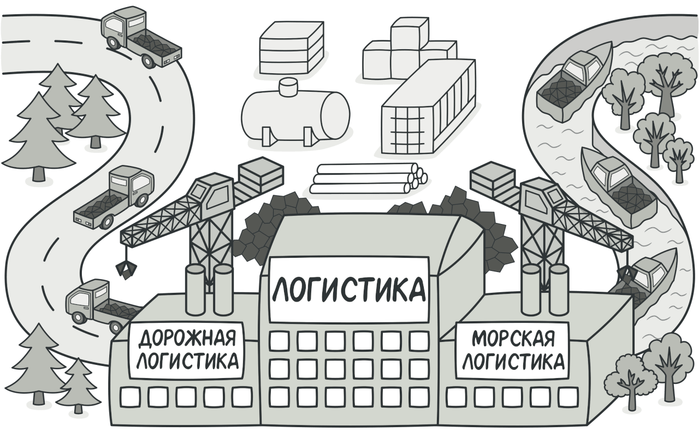
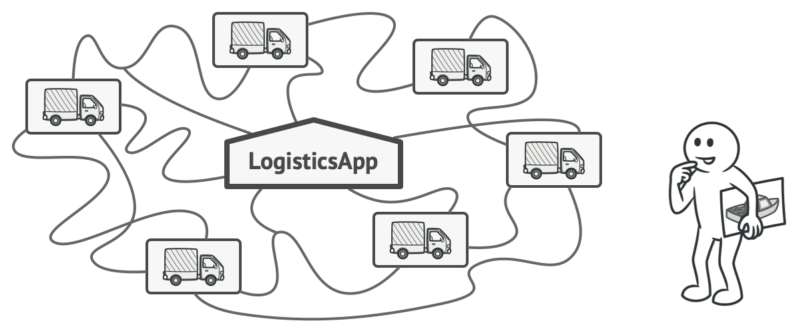
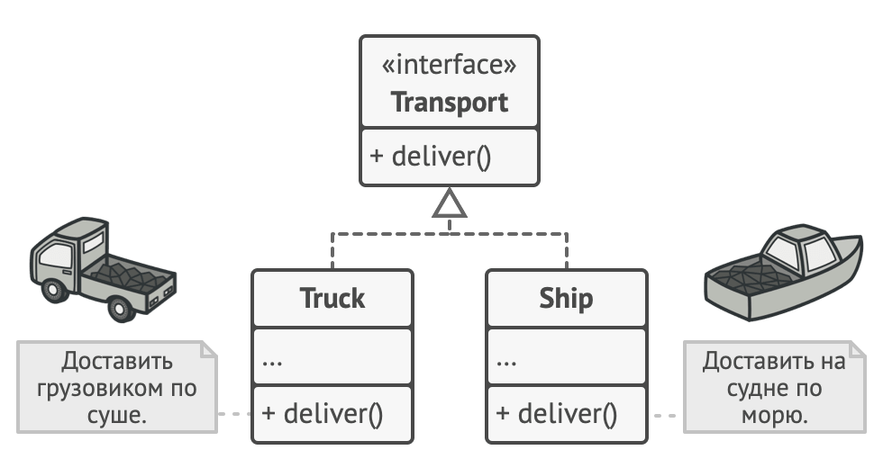

# Фабричный метод

> Также известен как: **Виртуальный конструктор**, **Factory Method**

## Суть паттерна

**Фабричный метод** — это порождающий паттерн проектирования, который определяет общий интерфейс для создания объектов в суперклассе, позволяя подклассам изменять тип создаваемых объектов.



## Проблема

Представьте, что вы создаёте программу управления грузовыми перевозками. Сперва вы рассчитываете перевозить товары только на автомобилях. Поэтому весь ваш код работает с объектами класса `Грузовик`.

В какой-то момент ваша программа становится настолько известной, что морские перевозчики выстраиваются в очередь и просят добавить поддержку морской логистики в программу.



*Добавить новый класс не так-то просто, если весь код уже завязан на конкретные классы.*

Отличные новости, правда?! Но как насчёт кода? Большая часть существующего кода жёстко привязана к классам `Грузовиков`. Чтобы добавить в программу классы морских `Судов`, понадобится перелопатить всю программу. Более того, если вы потом решите добавить в программу ещё один вид транспорта, то всю эту работу придётся повторить.

В итоге вы получите ужасающий код, наполненный условными операторами, которые выполняют то или иное действие, в зависимости от класса транспорта.

## Решение

Паттерн Фабричный метод предлагает создавать объекты не напрямую, используя оператор `new`, а через вызов особого *фабричного метода*. Не пугайтесь, объекты всё равно будут создаваться при помощи `new`, но делать это будет фабричный метод.


*Подклассы могут изменять класс создаваемых объектов.*

На первый взгляд, это может показаться бессмысленным: мы просто переместили вызов конструктора из одного конца программы в другой. Но теперь вы сможете переопределить фабричный метод в подклассе, чтобы изменить тип создаваемого продукта.

Чтобы эта система заработала, все возвращаемые объекты должны иметь общий интерфейс. Подклассы смогут производить объекты различных классов, следующих одному и тому же интерфейсу.



*Все объекты-продукты должны иметь общий интерфейс.*

Например, классы `Грузовик` и `Судно` реализуют интерфейс `Транспорт` с методом доставить. Каждый из этих классов реализует метод по-своему: грузовики везут грузы по земле, а суда — по морю. Фабричный метод в классе `ДорожнойЛогистики` вернёт объект-грузовик, а класс `МорскойЛогистики` — объект-судно.


*Пока все продукты реализуют общий интерфейс, их объекты можно взаимозаменять в клиентском коде.*

Для клиента фабричного метода нет разницы между этими объектами, так как он будет трактовать их как некий абстрактный `Транспорт`. Для него будет важно, чтобы объект имел метод `доставить`, а как конкретно он работает — не важно.

## Структура


1. **Продукт** определяет общий интерфейс объектов, которые может произвести создатель и его подклассы.
2. **Конкретные продукты** содержат код различных продуктов. Продукты будут отличаться реализацией, но интерфейс у них будет общий.
3. **Создатель** объявляет фабричный метод, который должен возвращать новые объекты продуктов. Важно, чтобы тип результата совпадал с общим интерфейсом продуктов. Зачастую фабричный метод объявляют абстрактным, чтобы заставить все подклассы реализовать его по-своему. Но он может возвращать и некий стандартный продукт. Несмотря на название, важно понимать, что создание продуктов **не является** единственной функцией создателя. Обычно он содержит и другой полезный код работы с продуктом. Аналогия: большая софтверная компания может иметь центр подготовки программистов, но основная задача компании — создавать программные продукты, а не готовить программистов.
4. **Конкретные создатели** по-своему реализуют фабричный метод, производя те или иные конкретные продукты. Фабричный метод не обязан всё время создавать новые объекты. Его можно переписать так, чтобы возвращать существующие объекты из какого-то хранилища или кэша.

## Псевдокод

В этом примере **Фабричный метод** помогает создавать кросс-платформенные элементы интерфейса, не привязывая основной код программы к конкретным классам элементов.


*Пример кросс-платформенного диалога.*

Фабричный метод объявлен в классе диалогов. Его подклассы относятся к различным операционным системам. Благодаря фабричному методу, вам не нужно переписывать логику диалогов под каждую систему. Подклассы могут наследовать почти весь код из базового диалога, изменяя типы кнопок и других элементов, из которых базовый код строит окна графического пользовательского интерфейса.

Базовый класс диалогов работает с кнопками через их общий программный интерфейс. Поэтому, какую вариацию кнопок ни вернул бы фабричный метод, диалог останется рабочим. Базовый класс не зависит от конкретных классов кнопок, оставляя подклассам решение о том, какой тип кнопок создавать.

Такой подход можно применить и для создания других элементов интерфейса. Хотя каждый новый тип элементов будет приближать вас к **Абстрактной фабрике**.

```c
// Паттерн Фабричный метод применим тогда, когда в программе
// есть иерархия классов продуктов.
interface Button is
    method render()
    method onClick(f)

class WindowsButton implements Button is
    method render(a, b) is
        // Отрисовать кнопку в стиле Windows.
    method onClick(f) is
        // Навесить на кнопку обработчик событий Windows.

class HTMLButton implements Button is
    method render(a, b) is
        // Вернуть HTML-код кнопки.
    method onClick(f) is
        // Навесить на кнопку обработчик события браузера.


// Базовый класс фабрики. Заметьте, что "фабрика" — это всего
// лишь дополнительная роль для класса. Скорее всего, он уже
// имеет какую-то бизнес-логику, в которой требуется создание
// разнообразных продуктов.
class Dialog is
    method render() is
        // Чтобы использовать фабричный метод, вы должны
        // убедиться в том, что эта бизнес-логика не зависит от
        // конкретных классов продуктов. Button — это общий
        // интерфейс кнопок, поэтому все хорошо.
        Button okButton = createButton()
        okButton.onClick(closeDialog)
        okButton.render()

    // Мы выносим весь код создания продуктов в особый метод,
    // который назвают "фабричным".
    abstract method createButton():Button


// Конкретные фабрики переопределяют фабричный метод и
// возвращают из него собственные продукты.
class WindowsDialog extends Dialog is
    method createButton():Button is
        return new WindowsButton()

class WebDialog extends Dialog is
    method createButton():Button is
        return new HTMLButton()


class Application is
    field dialog: Dialog

    // Приложение создаёт определённую фабрику в зависимости от
    // конфигурации или окружения.
    method initialize() is
        config = readApplicationConfigFile()

        if (config.OS == "Windows") then
            dialog = new WindowsDialog()
        else if (config.OS == "Web") then
            dialog = new WebDialog()
        else
            throw new Exception("Error! Unknown operating system.")

    // Если весь остальной клиентский код работает с фабриками и
    // продуктами только через общий интерфейс, то для него
    // будет не важно, какая фабрика была создана изначально.
    method main() is
        this.initialize()
        dialog.render()
```

## Применимость

**Когда заранее неизвестны типы и зависимости объектов, с которыми должен работать ваш код.**

Фабричный метод отделяет код производства продуктов от остального кода, который эти продукты использует.

Благодаря этому, код производства можно расширять, не трогая основной. Так, чтобы добавить поддержку нового продукта, вам нужно создать новый подкласс и определить в нём фабричный метод, возвращая оттуда экземпляр нового продукта.

---

**Когда вы хотите дать возможность пользователям расширять части вашего фреймворка или библиотеки.**

Пользователи могут расширять классы вашего фреймворка через наследование. Но как сделать так, чтобы фреймворк создавал объекты из этих новых классов, а не из стандартных?

Решением будет дать пользователям возможность расширять не только желаемые компоненты, но и классы, которые создают эти компоненты. А для этого создающие классы должны иметь конкретные создающие методы, которые можно определить.

Например, вы используете готовый UI-фреймворк для своего приложения. Но вот беда — требуется иметь круглые кнопки, вместо стандартных прямоугольных. Вы создаёте класс `RoundButton`. Но как сказать главному классу фреймворка `UIFramework`, чтобы он теперь создавал круглые кнопки, вместо стандартных?

Для этого вы создаёте подкласс `UIWithRoundButtons` из базового класса фреймворка, переопределяете в нём метод создания кнопки (а-ля `createButton`) и вписываете туда создание своего класса кнопок. Затем используете `UIWithRoundButtons` вместо стандартного `UIFramework`.

---

**Когда вы хотите экономить системные ресурсы, повторно используя уже созданные объекты, вместо порождения новых.**

Такая проблема обычно возникает при работе с тяжёлыми ресурсоёмкими объектами, такими, как подключение к базе данных, файловой системе и т. д.

Представьте, сколько действий вам нужно совершить, чтобы повторно использовать существующие объекты:

1. Сначала вам следует создать общее хранилище, чтобы хранить в нём все создаваемые объекты.
2. При запросе нового объекта нужно будет заглянуть в хранилище и проверить, есть ли там неиспользуемый объект.
3. А затем вернуть его клиентскому коду.
4. Но если свободных объектов нет — создать новый, не забыв добавить его в хранилище.

Весь этот код нужно куда-то поместить, чтобы не засорять клиентский код.

Самым удобным местом был бы конструктор объекта, ведь все эти проверки нужны только при создании объектов. Но, увы, конструктор всегда создаёт **новые** объекты, он не может вернуть существующий экземпляр.

Значит, нужен другой метод, который бы отдавал как существующие, так и новые объекты. Им и станет фабричный метод.

## Шаги реализации

1. Приведите все создаваемые продукты к общему интерфейсу.

2. В классе, который производит продукты, создайте пустой фабричный метод. В качестве возвращаемого типа укажите общий интерфейс продукта.

3. Затем пройдитесь по коду класса и найдите все участки, создающие продукты. Поочерёдно замените эти участки вызовами фабричного метода, перенося в него код создания различных продуктов.<br/>
В фабричный метод, возможно, придётся добавить несколько параметров, контролирующих, какой из продуктов нужно создать.<br/>
На этом этапе фабричный метод, скорее всего, будет выглядеть удручающе. В нём будет жить большой условный оператор, выбирающий класс создаваемого продукта. Но не волнуйтесь, мы вот-вот исправим это.
4. Для каждого типа продуктов заведите подкласс и переопределите в нём фабричный метод. Переместите туда код создания соответствующего продукта из суперкласса.
5. Если создаваемых продуктов слишком много для существующих подклассов создателя, вы можете подумать о введении параметров в фабричный метод, которые позволят возвращать различные продукты в пределах одного подкласса.<br/>
Например, у вас есть класс `Почта` с подклассами `АвиаПочта` и `НаземнаяПочта`, а также классы продуктов `Самолёт`, `Грузовик` и `Поезд`. `Авиа` соответствует `Самолётам`, но для `НаземнойПочты` есть сразу два продукта. Вы могли бы создать новый подкласс почты для поездов, но проблему можно решить и по-другому. Клиентский код может передавать в фабричный метод `НаземнойПочты` аргумент, контролирующий тип создаваемого продукта.
6. Если после всех перемещений фабричный метод стал пустым, можете сделать его абстрактным. Если в нём что-то осталось — не беда, это будет его реализацией по умолчанию.

## Преимущества и недостатки

**Преимущества**

- Избавляет класс от привязки к конкретным классам продуктов.
- Выделяет код производства продуктов в одно место, упрощая поддержку кода.
- Упрощает добавление новых продуктов в программу.
- Реализует принцип **[открытости/закрытости](open_close_principle.md)**.

**Недостатки**
- Может привести к созданию больших параллельных иерархий классов, так как для каждого класса продукта надо создать свой подкласс создателя.


## Примеры

### Python

- **Сложность**: 1/3
- **Популярность**: 3/3
- **Применимость**: Паттерн можно часто встретить в любом Python-коде, где требуется гибкость при создании продуктов.
- **Признаки применения паттерна**: Фабричный метод можно определить по создающим методам, которые возвращают объекты продуктов через абстрактные типы или интерфейсы. Это позволяет переопределять типы создаваемых продуктов в подклассах.

Этот пример показывает структуру паттерна **Фабричный метод**, а именно — из каких классов он состоит, какие роли эти классы выполняют и как они взаимодействуют друг с другом.

**main.py: Пример структуры паттерна**

```python
from __future__ import annotations
from abc import ABC, abstractmethod


class Creator(ABC):
    """
    Класс Создатель объявляет фабричный метод, который должен
    возвращать объект класса Продукт. Подклассы Создателя обычно
    предоставляют реализацию этого метода.
    """

    @abstractmethod
    def factory_method(self):
        """
        Обратите внимание, что Создатель может также обеспечить
        реализацию фабричного метода по умолчанию.
        """
        pass

    def some_operation(self) -> str:
        """
        Также заметьте, что, несмотря на название, основная
        обязанность Создателя не заключается в создании продуктов.
        Обычно он содержит некоторую базовую бизнес-логику, которая
        основана на объектах Продуктов, возвращаемых фабричным
        методом. Подклассы могут косвенно изменять эту бизнес-логику,
        переопределяя фабричный метод и возвращая из него другой
        тип продукта.
        """

        # Вызываем фабричный метод, чтобы получить объект-продукт.
        product = self.factory_method()

        # Далее, работаем с этим продуктом.
        result = f"Creator: The same creator's code has just worked "
            + "with {product.operation()}"

        return result


"""
Конкретные Создатели переопределяют фабричный метод для того, чтобы
изменить тип результирующего продукта.
"""


class ConcreteCreator1(Creator):
    """
    Обратите внимание, что сигнатура метода по-прежнему использует тип
    абстрактного продукта, хотя фактически из метода возвращается
    конкретный продукт. Таким образом, Создатель может оставаться
    независимым от конкретных классов продуктов.
    """

    def factory_method(self) -> Product:
        return ConcreteProduct1()


class ConcreteCreator2(Creator):
    def factory_method(self) -> Product:
        return ConcreteProduct2()


class Product(ABC):
    """
    Интерфейс Продукта объявляет операции, которые должны выполнять
    все конкретные продукты.
    """

    @abstractmethod
    def operation(self) -> str:
        pass


"""
Конкретные Продукты предоставляют различные реализации интерфейса
Продукта.
"""


class ConcreteProduct1(Product):
    def operation(self) -> str:
        return "{Result of the ConcreteProduct1}"


class ConcreteProduct2(Product):
    def operation(self) -> str:
        return "{Result of the ConcreteProduct2}"


def client_code(creator: Creator) -> None:
    """
    Клиентский код работает с экземпляром конкретного создателя, хотя
    и через его базовый интерфейс. Пока клиент продолжает работать с
    создателем через базовый интерфейс, вы можете передать ему любой
    подкласс создателя.
    """

    print(f"Client: I'm not aware of the creator's class, but it "
          f"still works.\n{creator.some_operation()}", end="")


if __name__ == "__main__":
    print("App: Launched with the ConcreteCreator1.")
    client_code(ConcreteCreator1())
    print("\n")

    print("App: Launched with the ConcreteCreator2.")
    client_code(ConcreteCreator2())
```

**Output.txt: Результат выполнения**

```text
App: Launched with the ConcreteCreator1.
Client: I'm not aware of the creator's class, but it still works.
Creator: The same creator's code has just worked with {Result of the
ConcreteProduct1}

App: Launched with the ConcreteCreator2.
Client: I'm not aware of the creator's class, but it still works.
Creator: The same creator's code has just worked with {Result of the
ConcreteProduct2}
```

### PHP

- **Сложность**: 1/3
- **Популярность**: 3/3
- **Применимость**: Паттерн можно часто встретить в любом PHP-коде, где требуется гибкость при создании продуктов.
- **Признаки применения паттерна**: Фабричный метод можно определить по создающим методам, которые возвращают объекты продуктов через абстрактные типы или интерфейсы. Это позволяет переопределять типы создаваемых продуктов в подклассах.

<tabs>
    <tab title="Концептуальный пример">
        <p>Этот пример показывает структуру паттерна <b>Фабричный метод</b>, а именно — из каких классов он состоит, какие роли эти классы выполняют и как они взаимодействуют друг с другом.</p>
        <p>После ознакомления со структурой, вам будет легче воспринимать второй пример, который рассматривает реальный случай использования паттерна в мире PHP.</p>
        <p><b>index.php</b>: Пример структуры паттерна</p>
<code-block lang="php">
<![CDATA[
namespace RefactoringGuru\FactoryMethod\Conceptual;
/**
* Класс Создатель объявляет фабричный метод, который должен возвращать 
* объект класса Продукт. Подклассы Создателя обычно предоставляют 
* реализацию этого метода.
*/
abstract class Creator
{
    /**
    * Обратите внимание, что Создатель может также обеспечить 
    * реализацию фабричного метода по умолчанию.
    */
    abstract public function factoryMethod(): Product;

    /**
    * Также заметьте, что, несмотря на название, основная обязанность Создателя
    * не заключается в создании продуктов. Обычно он содержит некоторую базовую
    * бизнес-логику, которая основана на объектах Продуктов, возвращаемых
    * фабричным методом. Подклассы могут косвенно изменять эту бизнес-логику,
    * переопределяя фабричный метод и возвращая из него другой тип продукта.
    */
    
    public function someOperation(): string
    {
        // Вызываем фабричный метод, чтобы получить объект-продукт.
        $product = $this->factoryMethod();
        // Далее, работаем с этим продуктом.
        $result = "Creator: The same creator's code has just worked with " .
        $product->operation();
        return $result;
    }
}

/**
* Конкретные Создатели переопределяют фабричный метод для того, чтобы изменить
* тип результирующего продукта.
*/
class ConcreteCreator1 extends Creator
{
    /**
    * Обратите внимание, что сигнатура метода по-прежнему использует тип
    * абстрактного продукта, хотя фактически из метода возвращается конкретный
    * продукт. Таким образом, Создатель может оставаться независимым от
    * конкретных классов продуктов.
    */
    public function factoryMethod(): Product
    {
        return new ConcreteProduct1();
    }
}

class ConcreteCreator2 extends Creator
{
    public function factoryMethod(): Product
    {
        return new ConcreteProduct2();
    }
}

/**
* Интерфейс Продукта объявляет операции, которые должны выполнять все
* конкретные продукты.
*/
interface Product
{
    public function operation(): string;
}

/**
* Конкретные Продукты предоставляют различные реализации интерфейса Продукта.
*/
class ConcreteProduct1 implements Product
{
    public function operation(): string
    {
        return "{Result of the ConcreteProduct1}";
    }
}

class ConcreteProduct2 implements Product
{
    public function operation(): string
    {
        return "{Result of the ConcreteProduct2}";
    }
}

/**
* Клиентский код работает с экземпляром конкретного создателя, хотя и через его
* базовый интерфейс. Пока клиент продолжает работать с создателем через базовый
* интерфейс, вы можете передать ему любой подкласс создателя.
*/
function clientCode(Creator $creator)
{
    // ...
    echo "Client: I'm not aware of the creator's class, but it still works.\n"
    . $creator->someOperation();
    // ...
}

/**
* Приложение выбирает тип создателя в зависимости от конфигурации или среды.
*/
echo "App: Launched with the ConcreteCreator1.\n";
clientCode(new ConcreteCreator1());
echo "\n\n";
echo "App: Launched with the ConcreteCreator2.\n";
clientCode(new ConcreteCreator2());
]]>
</code-block>
<p><b>Output.txt</b>: Результат выполнения</p>
<code-block lang="text">
<![CDATA[
App: Launched with the ConcreteCreator1.
Client: I'm not aware of the creator's class, but it still works.
Creator: The same creator's code has just worked with {Result of the
ConcreteProduct1}

App: Launched with the ConcreteCreator2.
Client: I'm not aware of the creator's class, but it still works.
Creator: The same creator's code has just worked with {Result of the ConcreteProduct2}

]]>
</code-block>
    </tab>
    <tab title="Пример из реальной жизни">
        <p>В этом примере паттерн Фабричный Метод предоставляет интерфейс для создания коннекторов к социальным сетям, которые могут быть использованы для входа в сеть, создания сообщений и, возможно, выполнения других действий, — и всё это без привязки клиентского кода к определённым классам конкретной социальной сети.</p>
        <p><b>index.php</b>: Пример из реальной жизни</p>
<code-block lang="php">
<![CDATA[
namespace RefactoringGuru\FactoryMethod\RealWorld;

/**
* Создатель объявляет фабричный метод, который может быть использован вместо
* прямых вызовов конструктора продуктов, например:
*
* - До: $p = new FacebookConnector();
* - После: $p = $this->getSocialNetwork;
*
* Это позволяет подклассам SocialNetworkPoster изменять тип создаваемого
* продукта.
*/

abstract class SocialNetworkPoster
{
    /**
    * Фактический фабричный метод. Обратите внимание, что он возвращает
    * абстрактный коннектор. Это позволяет подклассам возвращать любые
    * конкретные коннекторы без нарушения контракта суперкласса.
    */

    abstract public function getSocialNetwork(): SocialNetworkConnector;

    /**
    * Когда фабричный метод используется внутри бизнес-логики Создателя,
    * подклассы могут изменять логику косвенно, возвращая из фабричного метода
    * различные типы коннекторов.
    */
    public function post($content): void
    {
        // Вызываем фабричный метод для создания объекта Продукта...
        $network = $this->getSocialNetwork();
        // ...а затем используем его по своему усмотрению.
        $network->logIn();
        $network->createPost($content);
        $network->logout();
    }
}

/**
* Этот Конкретный Создатель поддерживает Facebook. Помните, что этот класс
* также наследует метод post от родительского класса. Конкретные Создатели —
* это классы, которые фактически использует Клиент.
*/

class FacebookPoster extends SocialNetworkPoster
{
    private $login, $password;
        
    public function __construct(string $login, string $password)
    {
        $this->login = $login;
        $this->password = $password;
    }

    public function getSocialNetwork(): SocialNetworkConnector
    {
        return new FacebookConnector($this->login, $this->password);
    }
}

/**
* Этот Конкретный Создатель поддерживает LinkedIn.
*/

class LinkedInPoster extends SocialNetworkPoster
{
    private $email, $password;

    public function __construct(string $email, string $password)
    {
        $this->email = $email;
        $this->password = $password;
    }

    public function getSocialNetwork(): SocialNetworkConnector
    {
        return new LinkedInConnector($this->email, $this->password);
    }
}

/**
* Интерфейс Продукта объявляет поведения различных типов продуктов.
*/
interface SocialNetworkConnector
{
    public function logIn(): void;

    public function logOut(): void;

    public function createPost($content): void;
}

/**
* Этот Конкретный Продукт реализует API Facebook.
*/
class FacebookConnector implements SocialNetworkConnector
{
    private $login, $password;

    public function __construct(string $login, string $password)
    {
        $this->login = $login;
        $this->password = $password;
    }

    public function logIn(): void
    {
        echo "Send HTTP API request to log in user $this->login with " .
        "password $this->password\n";
    }

    public function logOut(): void
    {
        echo "Send HTTP API request to log out user $this->login\n";
    }

    public function createPost($content): void
    {
        echo "Send HTTP API requests to create a post in Facebook timeline.\n";
    }
}

/**
* А этот Конкретный Продукт реализует API LinkedIn.
*/
class LinkedInConnector implements SocialNetworkConnector
{
    private $email, $password;

    public function __construct(string $email, string $password)
    {
        $this->email = $email;
        $this->password = $password;
    }

    public function logIn(): void
    {
        echo "Send HTTP API request to log in user $this->email with " .
        "password $this->password\n";
    }

    public function logOut(): void
    {
        echo "Send HTTP API request to log out user $this->email\n";
    }

    public function createPost($content): void
    {
        echo "Send HTTP API requests to create a post in LinkedIn timeline.\n";
    }
}

/**
* Клиентский код может работать с любым подклассом SocialNetworkPoster, так как
* он не зависит от конкретных классов.
*/

function clientCode(SocialNetworkPoster $creator)
{
    // ...
    $creator->post("Hello world!");
    $creator->post("I had a large hamburger this morning!");
    // ...
}

/**
* На этапе инициализации приложение может выбрать, с какой социальной сетью оно
* хочет работать, создать объект соответствующего подкласса и передать его
* клиентскому коду.
*/

echo "Testing ConcreteCreator1:\n";
clientCode(new FacebookPoster("john_smith", "******"));
echo "\n\n";

echo "Testing ConcreteCreator2:\n";
clientCode(new LinkedInPoster("john_smith@example.com", "******"));
]]>
</code-block>
<p><b>Output.txt</b>: Результат выполнения</p>
<code-block lang="text">
<![CDATA[
Testing ConcreteCreator1:
Send HTTP API request to log in user john_smith with password ******
Send HTTP API requests to create a post in Facebook timeline.
Send HTTP API request to log out user john_smith
Send HTTP API request to log in user john_smith with password ******
Send HTTP API requests to create a post in Facebook timeline.
Send HTTP API request to log out user john_smith


Testing ConcreteCreator2:
Send HTTP API request to log in user john_smith@example.com with password ******
Send HTTP API requests to create a post in LinkedIn timeline.
Send HTTP API request to log out user john_smith@example.com
Send HTTP API request to log in user john_smith@example.com with password ******
Send HTTP API requests to create a post in LinkedIn timeline.
Send HTTP API request to log out user john_smith@example.com

]]>
</code-block>
    </tab>
</tabs>

