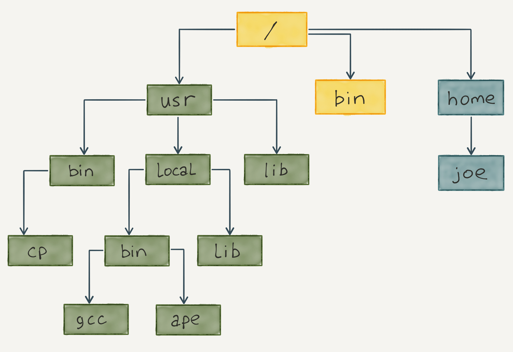

# Файловая структура

Файловая структура *nix-систем серьезно отличается от структуры в Windows и заслуживает отдельного внимания. В этом уроке мы подробнее познакомимся с этой темой.

Начнем с базовых понятий:

- Файловая структура представляет собой **дерево**
- В **узлах** этого дерева находятся **директории** — файлы специального типа
- В **листьях** дерева расположены **файлы**

Схематично такое дерево можно показать так:



## Директории

Понятие «папка» в *nix-системах не используется. Папки здесь называются **директориями** или **каталогами**, хотя по существу эти термины означают одно и то же.

В Windows файловая структура представлена не одним, а несколькими деревьями, так как каждая структура находится на своем диске. В *nix-системах немного по-другому: есть единственное дерево с корнем в `/`. Все устройства, физические и логические диски находятся внутри этого дерева в виде директорий и файлов.

Информация о любом файле или директории доступна по команде `stat` (сокращение от file system status):

```bash
# Не обращайте внимание на непонятные для вас данные
# Об их значении поговорим позже
stat .bashrc

File: '.bashrc'
Size: 3771        Blocks: 8          IO Block: 4096   regular file
Device: ca01h/51713d    Inode: 259234      Links: 1
Access: (0644/-rw-r--r--)  Uid: ( 1002/kirill.m)   Gid: ( 1002/kirill.m)
Access: 2018-08-27 17:24:11.237498138 +0000
Modify: 2015-08-31 23:27:45.000000000 +0000
Change: 2018-01-22 08:13:27.611966864 +0000
Birth: -
```

[](https://asciinema.org/a/evHx3Dudt2TZIJlkI38OmZpEv/iframe?preload=1&cols=120&rows=15)


В Windows и macOS мы привыкли, что имя файла может быть набрано в разных регистрах, и это всегда один и тот же файл. Другими словами, здесь имена **регистронезависимые**.

Но в *nix-системах ситуация другая — здесь регистр имеет значение. Файлы `index.html`, `Index.html`, `INDEX.HTML` и `index.HTML` — это разные файлы. Всегда обращайте внимание на регистр, потому что ошибиться довольно легко.

Говорят, что в *nix «все является файлом». На нижнем уровне так и есть. **Директория** — это специальный файл, который содержит список файлов. Любое подключаемое устройство становится файлом или директорией, если это накопитель.

Такая концепция довольно удобна для разработчиков, потому что печать на принтер и вывод на экран между собой ничем не отличаются — с точки зрения кода, это просто запись в файл. На пользовательском уровне директория все же отличается от файла и имеет собственные команды для создания, удаления и модификации.

В *nix-системах есть **FHS** — базовый стандартизированный набор каталогов. За каждым закреплена какая-то особая роль, например:

- Каталог `/etc` содержит конфигурацию программ в обычных текстовых файлах. В *nix-системах нет реестра, вся конфигурация лежит в обычных файлах
- Каталог `/home` содержит домашние директории пользователей системы, за исключением суперпользователя `root`, домашний каталог которого обычно находится по адресу `/root`
Обязательно пробегитесь по странице [FHS в Википедии](https://ru.wikipedia.org/wiki/FHS) и посмотрите, за что отвечают разные каталоги.

## Скрытые файлы

Не во все директории можно заходить, не все файлы можно читать или менять, и не все программы можно запускать. Так происходит, потому что в *nix-системах развитая система прав, завязанная на пользователей и группы. О ней мы поговорим отдельно позже. Сейчас достаточно знать, что такие ограничения есть. Их можно увидеть в выводе команды `ls -l`.

В отличие от Windows, в *nix-системах отсутствует понятие «расширение файла». Здесь точка считается полноправной частью имени файла. При этом файлы почти всегда именуются так же, как и в Windows — например, `hello.mp3`. Важно понимать, что именем файла считается вся эта строчка. Нередко встречаются и такие имена: `index.html.haml`.

Есть еще одна существенная разница между Windows и *nix-системами. В обоих случаях скрытые файлы есть, но работают они по-разному:

- В Windows видимость файла — это его свойство, которое можно включить или выключить в настройках (при выключении файл станет скрытым)
- В *nix-системах файл считается скрытым, если его имя начинается с точки. Чтобы скрыть файл, ничего не нужно делать в настройках — достаточно просто добавить точку в начале

Вывести все файлы, включая скрытые, можно командой `ls -a`:

```bash
ls -a

.  ..  .bash_history  .bash_logout  .bashrc  .cache  .profile  .ssh
```

Обратите внимание на две особые директории:

- Обозначенные точкой (`.`) — это текущая директория
- Обозначенные двумя точками (`..`) — это директория верхнего уровня
Именно благодаря этой схеме работает команда `cd ..`, которая перемещает нас на уровень выше.

Кроме обычных файлов, в *nix-системах существует ряд других:

- **Hard Link** — дополнительное имя для уже существующего файла
- **Symbolic link** — символическая ссылка. Такой файл похож на ярлык в Windows. Если удалить основной файл, то символическая ссылка будет вести в никуда
- **Socket** — специальный файл, через который происходит взаимодействие между разными процессами операционной системы. Программисты постоянно сталкиваются с сокетами в реальной жизни

Это наиболее важные на начальном этапе знакомства с файловой системой типы файлов. Есть еще и другие типы, но не будем сейчас заострять на них внимание.

### Вопросы для самопроверки

**Выберите верное утверждение:**

- Относительный путь до файла однозначно указывает, где он находится в файловой системе
- В POSIX-совместимых системах устройство — это файл внутри дерева с корнем в `/`
- В Linux диски именуются с большой буквы: C: или X:

**Как называется файл bash.rc в Linux?**

- rc
- bash.rc
- bash

**Как называется файл .index.html в Linux?**

- index
- index.html
- html
- .index.html
- .index

**Изучите вывод команды `ls -la`:**

```bash
ls -la
 
total 576
drwxr-xr-x+ 57 toto    hexlet   1824 Dec 29 12:11 .
drwxr-xr-x   5 root    admin     160 Oct 18 10:30 ..
drwxr-xr-x   8 toto    hexlet    256 Nov 22 13:44 .asdf
-rw-r--r--   1 toto    hexlet     41 Nov 20 09:55 .bashrc
```
**Что обозначает точка в этом выводе?**

- Текущую директорию
- Ничего, это служебный символ
- Родительскую директорию

**Как сделать файл скрытым в Linux?**

- Никак, это невозможно
- Зайти в свойства файла и там поставить галочку
- Переименовать файл, чтобы первым символом имени шла точка

**Какой командой можно посмотреть информацию о файле *index.Html*, находящемся в текущей директории? Напоминаем, что файловая система чувствительна к регистру.**


- Любой командой из перечисленных
- stat index.Html
- _stat index.html