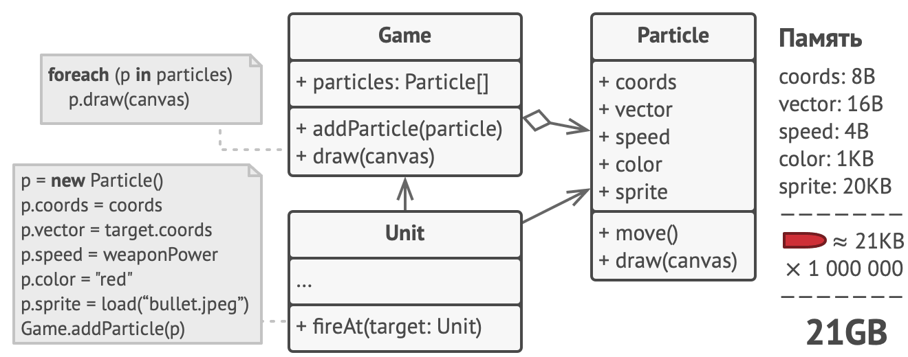
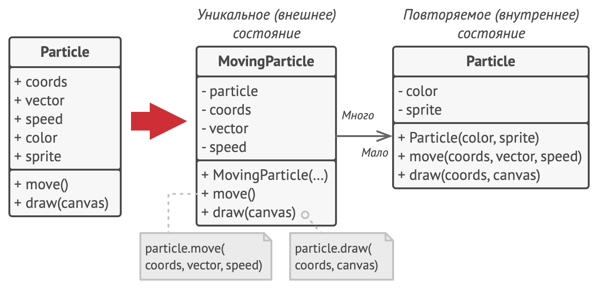
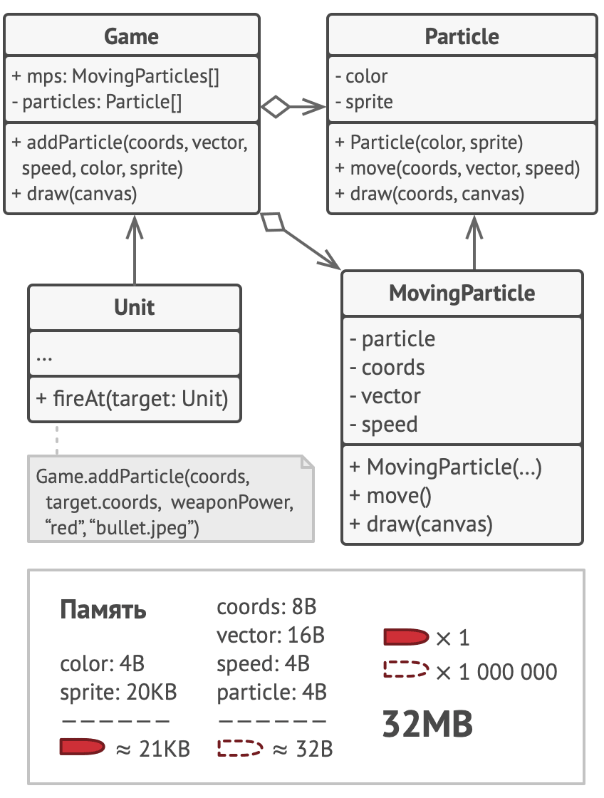
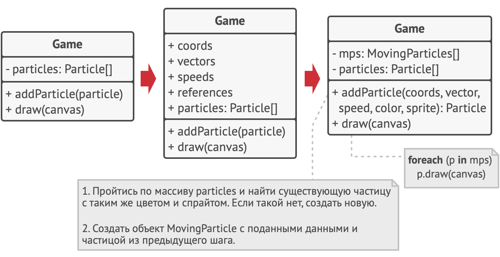
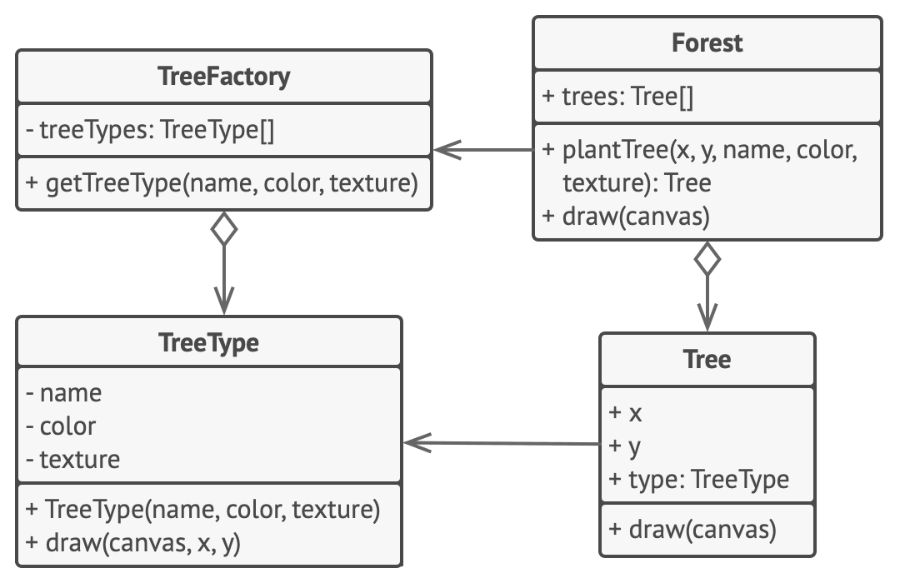

# Легковес

> Также известен как: Приспособленец, Кэш, Flyweight

## Суть паттерна

**Легковес** — это структурный паттерн проектирования, который позволяет вместить бóльшее количество объектов в отведённую оперативную память. Легковес экономит память, разделяя общее состояние объектов между собой, вместо хранения одинаковых данных в каждом объекте.


## Проблема

На досуге вы решили написать небольшую игру, в которой игроки перемещаются по карте и стреляют друг в друга. Фишкой игры должна была стать реалистичная система частиц. Пули, снаряды, осколки от взрывов — всё это должно красиво летать и радовать взгляд.

Игра отлично работала на вашем мощном компьютере. Однако ваш друг сообщил, что игра начинает тормозить и вылетает через несколько минут после запуска. Покопавшись в логах, вы обнаружили, что игра вылетает из-за недостатка оперативной памяти. У вашего друга компьютер значительно менее «прокачанный», поэтому проблема у него и проявляется так быстро.

И действительно, каждая частица представлена собственным объектом, имеющим множество данных. В определённый момент, когда побоище на экране достигает кульминации, новые объекты частиц уже не вмещаются в оперативную память компьютера, и программа вылетает.



## Решение

Если внимательно посмотреть на класс частиц, то можно заметить, что цвет и спрайт занимают больше всего памяти. Более того, они хранятся в каждом объекте, хотя фактически их значения одинаковы для большинства частиц.



Остальное состояние объектов — координаты, вектор движения и скорость — отличаются для всех частиц. Таким образом, эти поля можно рассматривать как контекст, в котором частица используется. А цвет и спрайт — это данные, не изменяющиеся во времени.

Неизменяемые данные объекта принято называть «внутренним состоянием». Все остальные данные — это «внешнее состояние».

Паттерн Легковес предлагает не хранить в классе внешнее состояние, а передавать его в те или иные методы через параметры. Таким образом, одни и те же объекты можно будет повторно использовать в различных контекстах. Но главное — понадобится гораздо меньше объектов, ведь теперь они будут отличаться только внутренним состоянием, а оно имеет не так много вариаций.



В нашем примере с частицами достаточно будет оставить всего три объекта с отличающимися спрайтами и цветом — для пуль, снарядов и осколков. Несложно догадаться, что такие облегчённые объекты называют легковéсами .

### Хранилище внешнего состояния

Но куда переедет внешнее состояние? Ведь кто-то должен его хранить. Чаще всего, его перемещают в контейнер, который управлял объектами до применения паттерна.

В нашем случае это был главный объект игры. Вы могли бы добавить в его класс поля-массивы для хранения координат, векторов и скоростей частиц. Кроме этого, понадобится ещё один массив для хранения ссылок на объекты-легковесы, соответствующие той или иной частице.



Но более элегантным решением было бы создать дополнительный класс-контекст, который бы связывал внешнее состояние с тем или иным легковесом. Это позволит обойтись только одним полем-массивом в классе контейнера.

«Но погодите-ка, нам потребуется столько же этих объектов, сколько было в самом начале!», — скажете вы и будете правы! Но дело в том, что объекты-контексты занимают намного меньше места, чем первоначальные. Ведь самые тяжёлые поля остались в легковесах (простите за каламбур), и сейчас мы будем ссылаться на эти объекты из контекстов, вместо того, чтобы повторно хранить дублирующееся состояние.

### Неизменяемость Легковесов

Так как объекты легковесов будут использованы в разных контекстах, вы должны быть уверены в том, что их состояние невозможно изменить после создания. Всё внутреннее состояние легковес должен получать через параметры конструктора. Он не должен иметь сеттеров и публичных полей.

### Фабрика Легковесов

Для удобства работы с легковесами и контекстами можно создать фабричный метод, принимающий в параметрах всё внутреннее (а иногда и внешнее) состояние желаемого объекта.

Главная польза от этого метода в том, чтобы искать уже созданные легковесы с таким же внутренним состоянием, что и требуемое. Если легковес находится, его можно повторно использовать. Если нет — просто создаём новый. Обычно этот метод добавляют в контейнер легковесов либо создают отдельный класс-фабрику. Его даже можно сделать статическим и поместить в класс легковесов.

## Структура


1. Вы всегда должны помнить о том, что Легковес применяется в программе, имеющей громадное количество одинаковых объектов. Этих объектов должно быть так много, чтобы они не помещались в доступную оперативную память без ухищрений. Паттерн разделяет данные этих объектов на две части — легковесы и контексты.
2. **Легковес** содержит состояние, которое повторялось во множестве первоначальных объектов. Один и тот же легковес можно использовать в связке со множеством контекстов. Состояние, которое хранится здесь, называется внутренним, а то, которое он получает извне — внешним.
3. **Контекст** содержит «внешнюю» часть состояния, уникальную для каждого объекта. Контекст связан с одним из объектов-легковесов, хранящих оставшееся состояние.
4. Поведение оригинального объекта чаще всего оставляют в Легковесе, передавая значения контекста через параметры методов. Тем не менее, поведение можно поместить и в контекст, используя легковес как объект данных.
5. **Клиент** вычисляет или хранит контекст, то есть внешнее состояние легковесов. Для клиента легковесы выглядят как шаблонные объекты, которые можно настроить во время использования, передав контекст через параметры.
6. **Фабрика легковесов** управляет созданием и повторным использованием легковесов. Фабрика получает запросы, в которых указано желаемое состояние легковеса. Если легковес с таким состоянием уже создан, фабрика сразу его возвращает, а если нет — создаёт новый объект.

## Псевдокод

В этом примере **Легковес** помогает сэкономить оперативную память при отрисовке на экране миллионов объектов-деревьев.



Легковес выделяет повторяющуюся часть состояния из основного класса `Tree` и помещает его в дополнительный класс `TreeType`.

Теперь, вместо хранения повторяющихся данных во всех объектах, отдельные деревья будут ссылаться на несколько общих объектов, хранящих эти данные. Клиент работает с деревьями через фабрику деревьев, которая скрывает от него сложность кеширования общих данных деревьев.

Таким образом, программа будет использовать намного меньше оперативной памяти, что позволит отрисовать больше деревьев на экране на том же железе.
```c
// Этот класс-легковес содержит часть полей, которые описывают
// деревья. Эти поля не уникальны для каждого дерева, в отличие,
// например, от координат: несколько деревьев могут иметь ту же
// текстуру.
//
// Поэтому мы переносим повторяющиеся данные в один-единственный
// объект и ссылаемся на него из множества отдельных деревьев.
class TreeType is
    field name
    field color
    field texture
    constructor TreeType(name, color, texture) { ... }
    method draw(canvas, x, y) is
        // 1. Создать картинку данного типа, цвета и текстуры.
        // 2. Нарисовать картинку на холсте в позиции X, Y.

// Фабрика легковесов решает, когда нужно создать новый
// легковес, а когда можно обойтись существующим.
class TreeFactory is
    static field treeTypes: collection of tree types
    static method getTreeType(name, color, texture) is
        type = treeTypes.find(name, color, texture)
        if (type == null)
            type = new TreeType(name, color, texture)
            treeTypes.add(type)
        return type

// Контекстный объект, из которого мы выделили легковес
// TreeType. В программе могут быть тысячи объектов Tree, так
// как накладные расходы на их хранение совсем небольшие — в
// памяти нужно держать всего три целых числа (две координаты и
// ссылка).
class Tree is
    field x,y
    field type: TreeType
    constructor Tree(x, y, type) { ... }
    method draw(canvas) is
        type.draw(canvas, this.x, this.y)

// Классы Tree и Forest являются клиентами Легковеса. При
// желании их можно слить в один класс, если вам не нужно
// расширять класс деревьев далее.
class Forest is
    field trees: collection of Trees

    method plantTree(x, y, name, color, texture) is
        type = TreeFactory.getTreeType(name, color, texture)
        tree = new Tree(x, y, type)
        trees.add(tree)

    method draw(canvas) is
        foreach (tree in trees) do
            tree.draw(canvas)
```

## Применимость

**Когда не хватает оперативной памяти для поддержки всех нужных объектов.**

Эффективность паттерна Легковес во многом зависит от того, как и где он используется. Применяйте этот паттерн, когда выполнены все перечисленные условия:
- в приложении используется большое число объектов;
- из-за этого высоки расходы оперативной памяти;
- большую часть состояния объектов можно вынести за пределы их классов;
- большие группы объектов можно заменить относительно небольшим количеством разделяемых объектов, поскольку внешнее состояние вынесено.

## Шаги реализации

1. Разделите поля класса, который станет легковесом, на две части:
    - внутреннее состояние: значения этих полей одинаковы для большого числа объектов;
    - внешнее состояние (контекст): значения полей уникальны для каждого объекта.
2. Оставьте поля внутреннего состояния в классе, но убедитесь, что их значения неизменяемы. Эти поля должны инициализироваться только через конструктор.
3. Превратите поля внешнего состояния в параметры методов, где эти поля использовались. Затем удалите поля из класса.

4. Создайте фабрику, которая будет кешировать и повторно отдавать уже созданные объекты. Клиент должен запрашивать из этой фабрики легковеса с определённым внутренним состоянием, а не создавать его напрямую.
5. Клиент должен хранить или вычислять значения внешнего состояния (контекст) и передавать его в методы объекта легковеса.

## Преимущества и недостатки

**Преимущества**

- Экономит оперативную память.

**Недостатки**

- Расходует процессорное время на поиск/вычисление контекста.
- Усложняет код программы из-за введения множества дополнительных классов.

## Примеры реализации паттерна

- **Сложность**: 3/3
- **Популярность**: 0/3
- **Применимость**: Весь смысл использования Легковеса — в экономии памяти. Поэтому, если в приложении нет такой проблемы, то вы вряд ли найдёте там примеры Легковеса.
- **Признаки применения паттерна**: Легковес можно определить по создающим методам класса, которые возвращают закешированные объекты, вместо создания новых.

### Python

Этот пример показывает структуру паттерна `Легковес`, а именно — из каких классов он состоит, какие роли эти классы выполняют и как они взаимодействуют друг с другом.

**main.py**: Пример структуры паттерна
```python
import json
from typing import Dict


class Flyweight():
    """
    Легковес хранит общую часть состояния (также называемую внутренним
    состоянием), которая принадлежит нескольким реальным
    бизнес-объектам.
    Легковес принимает оставшуюся часть состояния (внешнее состояние,
    уникальное для каждого объекта) через его параметры метода.
    """

    def __init__(self, shared_state: str) -> None:
        self._shared_state = shared_state

    def operation(self, unique_state: str) -> None:
        s = json.dumps(self._shared_state)
        u = json.dumps(unique_state)
        print(f"Flyweight: Displaying shared ({s}) and unique ({u}) "
            + "state.", end="")


class FlyweightFactory():
    """
    Фабрика Легковесов создает объекты-Легковесы и управляет ими. Она
    обеспечивает правильное разделение легковесов. Когда клиент
    запрашивает легковес, фабрика либо возвращает существующий
    экземпляр, либо создает новый, если он ещё не существует.
    """

    _flyweights: Dict[str, Flyweight] = {}

    def __init__(self, initial_flyweights: Dict) -> None:
        for state in initial_flyweights:
            self._flyweights[self.get_key(state)] = Flyweight(state)

    def get_key(self, state: Dict) -> str:
        """
        Возвращает хеш строки Легковеса для данного состояния.
        """

        return "_".join(sorted(state))

    def get_flyweight(self, shared_state: Dict) -> Flyweight:
        """
        Возвращает существующий Легковес с заданным состоянием или
        создает новый.
        """

        key = self.get_key(shared_state)

        if not self._flyweights.get(key):
            print("FlyweightFactory: Can't find a flyweight, "
                + "creating new one.")
            self._flyweights[key] = Flyweight(shared_state)
        else:
            print("FlyweightFactory: Reusing existing flyweight.")

        return self._flyweights[key]

    def list_flyweights(self) -> None:
        count = len(self._flyweights)
        print(f"FlyweightFactory: I have {count} flyweights:")
        print("\n".join(map(str, self._flyweights.keys())), end="")


def add_car_to_police_database(
    factory: FlyweightFactory, plates: str, owner: str,
    brand: str, model: str, color: str
) -> None:
    print("\n\nClient: Adding a car to database.")
    flyweight = factory.get_flyweight([brand, model, color])
    # Клиентский код либо сохраняет, либо вычисляет внешнее состояние
    # и передает его методам легковеса.
    flyweight.operation([plates, owner])


if __name__ == "__main__":
    """
    Клиентский код обычно создает кучу предварительно заполненных
    легковесов на этапе инициализации приложения.
    """

    factory = FlyweightFactory([
        ["Chevrolet", "Camaro2018", "pink"],
        ["Mercedes Benz", "C300", "black"],
        ["Mercedes Benz", "C500", "red"],
        ["BMW", "M5", "red"],
        ["BMW", "X6", "white"],
    ])

    factory.list_flyweights()

    add_car_to_police_database(
        factory, "CL234IR", "James Doe", "BMW", "M5", "red")

    add_car_to_police_database(
        factory, "CL234IR", "James Doe", "BMW", "X1", "red")

    print("\n")

    factory.list_flyweights()
```

**Output.txt**: Результат выполнения

```bash
FlyweightFactory: I have 5 flyweights:
Camaro2018_Chevrolet_pink
C300_Mercedes Benz_black
C500_Mercedes Benz_red
BMW_M5_red
BMW_X6_white

Client: Adding a car to database.
FlyweightFactory: Reusing existing flyweight.
Flyweight: Displaying shared (["BMW", "M5", "red"]) and unique (["CL234IR", "James Doe"]) state.

Client: Adding a car to database.
FlyweightFactory: Can't find a flyweight, creating new one.
Flyweight: Displaying shared (["BMW", "X1", "red"]) and unique (["CL234IR", "James Doe"]) state.

FlyweightFactory: I have 6 flyweights:
Camaro2018_Chevrolet_pink
C300_Mercedes Benz_black
C500_Mercedes Benz_red
BMW_M5_red
BMW_X6_white
BMW_X1_red
```

### PHP

<tabs>
<tab title="Концептуальный пример">
<h4 id="flyweight-php-concept">Концептуальный пример</h4>
<p>Этот пример показывает структуру паттерна <b>Легковес</b>, а именно — из каких классов он состоит, какие роли эти классы выполняют и как они взаимодействуют друг с другом.</p>
<p>После ознакомления со структурой, вам будет легче воспринимать второй пример, который рассматривает реальный случай использования паттерна в мире PHP.</p>
<p><b>index.php</b>: Пример структуры паттерна</p>
<code-block lang="php">
<![CDATA[
namespace RefactoringGuru\Flyweight\Conceptual;

/**
* Легковес хранит общую часть состояния (также называемую внутренним
* состоянием), которая принадлежит нескольким реальным бизнес-объектам.
* Легковес принимает оставшуюся часть состояния (внешнее состояние, уникальное
* для каждого объекта)  через его параметры метода.
*/

class Flyweight
{
    private $sharedState;

    public function __construct($sharedState)
    {
        $this->sharedState = $sharedState;
    }

    public function operation($uniqueState): void
    {
        $s = json_encode($this->sharedState);
        $u = json_encode($uniqueState);
        echo "Flyweight: Displaying shared ($s) and unique ($u) state.\n";
    }
}

/**
* Фабрика Легковесов создает объекты-Легковесы и управляет ими. Она
* обеспечивает правильное разделение легковесов. Когда клиент запрашивает
* легковес, фабрика либо возвращает существующий экземпляр, либо создает новый,
* если он ещё не существует.
*/

class FlyweightFactory
{
    /**
    * @var Flyweight[]
    */
    private $flyweights = [];

    public function __construct(array $initialFlyweights)
    {
        foreach ($initialFlyweights as $state) {
            $this->flyweights[$this->getKey($state)] = new Flyweight($state);
        }
    }

    /**
    * Возвращает хеш строки Легковеса для данного состояния.
    */
    private function getKey(array $state): string
    {
        ksort($state);
        return implode("_", $state);
    }

    /**
    * Возвращает существующий Легковес с заданным состоянием или создает новый.
    */
  
    public function getFlyweight(array $sharedState): Flyweight
    {
        $key = $this->getKey($sharedState);
        if (!isset($this->flyweights[$key])) {
            echo "FlyweightFactory: Can't find a flyweight, creating new one.\n";
            $this->flyweights[$key] = new Flyweight($sharedState);
        } else {
            echo "FlyweightFactory: Reusing existing flyweight.\n";
        }
        return $this->flyweights[$key];
    }

    public function listFlyweights(): void
    {
        $count = count($this->flyweights);
        echo "\nFlyweightFactory: I have $count flyweights:\n";
        foreach ($this->flyweights as $key => $flyweight) {
            echo $key . "\n";
        }
    }
}

/**
* Клиентский код обычно создает кучу предварительно заполненных легковесов на
* этапе инициализации приложения.
*/

$factory = new FlyweightFactory([
    ["Chevrolet", "Camaro2018", "pink"],
    ["Mercedes-Benz", "C300", "black"],
    ["Mercedes-Benz", "C500", "red"],
    ["BMW", "M5", "red"],
    ["BMW", "X6", "white"],
    // ...
]);
$factory->listFlyweights();

// ...

function addCarToPoliceDatabase(
    FlyweightFactory $ff, $plates, $owner,
    $brand, $model, $color
) {
    echo "\nClient: Adding a car to database.\n";
    $flyweight = $ff->getFlyweight([$brand, $model, $color]);

    // Клиентский код либо сохраняет, либо вычисляет внешнее состояние и
    // передает его методам легковеса.
    $flyweight->operation([$plates, $owner]);
}

addCarToPoliceDatabase($factory,
    "CL234IR",
    "James Doe",
    "BMW",
    "M5",
    "red",
);

addCarToPoliceDatabase($factory,
    "CL234IR",
    "James Doe",
    "BMW",
    "X1",
    "red",
);

$factory->listFlyweights();

]]>
</code-block>
<p><b>Output.txt</b>: Результат выполнения</p>
<code-block lang="text">
<![CDATA[
FlyweightFactory: I have 5 flyweights:
Chevrolet_Camaro2018_pink
Mercedes Benz_C300_black
Mercedes Benz_C500_red
BMW_M5_red
BMW_X6_white

Client: Adding a car to database.
FlyweightFactory: Reusing existing flyweight.
Flyweight: Displaying shared (["BMW","M5","red"]) and unique (["CL234IR","James Doe"]) state.

Client: Adding a car to database.
FlyweightFactory: Can't find a flyweight, creating new one.
Flyweight: Displaying shared (["BMW","X1","red"]) and unique (["CL234IR","James Doe"]) state.

FlyweightFactory: I have 6 flyweights:
Chevrolet_Camaro2018_pink
Mercedes Benz_C300_black
Mercedes Benz_C500_red
BMW_M5_red
BMW_X6_white
BMW_X1_red

]]>
</code-block>
</tab>
<tab title="Пример из реальной жизни">
<h4 id="flyweight-php-real">Пример из реальной жизни</h4>
<p>Прежде чем мы начнём, обратите внимание, что реальное применение паттерна <b>Легковес</b> на PHP встречается довольно редко. Это связано с однопоточным характером PHP, где вы не должны хранить ВСЕ объекты вашего приложения в памяти одновременно в одном потоке. Хотя замысел этого примера только наполовину серьёзен, и вся проблема с ОЗУ может быть решена, если приложение структурировать по-другому, он всё же наглядно показывает концепцию паттерна, как он работает в реальном мире. Итак, я вас предупредил. Теперь давайте начнём.</p>
<p>В этом примере паттерн Легковес применяется для минимизации использования оперативной памяти объектами в базе данных животных ветеринарной клиники только для кошек. Каждую запись в базе данных представляет объект - <code>Кот</code>. Его данные состоят из двух частей:</p>
<ol>
<li>Уникальные (внешние) данные: имя кота, возраст и инфо о владельце.</li>
<li>Общие (внутренние) данные: название породы, цвет, текстура и т. д.</li>
</ol>
<p>Первая часть хранится непосредственно внутри класса <code>Кот</code>, который играет роль контекста. Вторая часть, однако, хранится отдельно и может совместно использоваться разными котами. Эти совместно используемые данные находятся внутри класса <code>РазновидностиКотов</code>. Все коты, имеющие схожие признаки, привязаны к одному и тому же классу <code>РазновидностиКотов</code>, вместо того чтобы хранить повторяющиеся данные в каждом из своих объектов.</p>
<p><b>index.php</b>: Пример из реальной жизни</p>
<code-block lang="php">
<![CDATA[
namespace RefactoringGuru\Flyweight\RealWorld;

/**
* Объекты Легковеса представляют данные, разделяемые несколькими объектами
* Кошек. Это сочетание породы, цвета, текстуры и т.д.
*/

class CatVariation
{
    /**
    * Так называемое «внутреннее» состояние.
    */
    public $breed;

    public $image;
    
    public $color;
    
    public $texture;
    
    public $fur;
    
    public $size;

    public function __construct(
        string $breed,
        string $image,
        string $color,
        string $texture,
        string $fur,
        string $size
    ) {
        $this->breed = $breed;
        $this->image = $image;
        $this->color = $color;
        $this->texture = $texture;
        $this->fur = $fur;
        $this->size = $size;
    }

    /**
    * Этот метод отображает информацию о кошке. Метод принимает внешнее
    * состояние в качестве аргументов. Остальная часть состояния хранится
    * внутри полей Легковеса.
    *
    * Возможно, вы удивлены, почему мы поместили основную логику кошки в класс
    * РазновидностейКошек вместо того, чтобы держать её в классе Кошки. Я
    * согласен, это звучит странно.
    *
    * Имейте в виду, что в реальной жизни паттерн Легковес может быть либо
    * реализован с самого начала, либо принудительно применён к существующему
    * приложению, когда разработчики понимают, что они столкнулись с проблемой
    * ОЗУ.
    *
    * Во втором случае вы получаете такие же классы, как у нас. Мы как бы
    * «отрефакторили» идеальное приложение, где все данные изначально
    * находились внутри класса Кошки. Если бы мы реализовывали Легковес с
    * самого начала, названия наших классов могли бы быть другими и более
    * определёнными. Например, Кошка и КонтекстКошки.
    *
    * Однако действительная причина, по которой основное поведение должно
    * проживать в классе Легковеса, заключается в том, что у вас может вообще
    * не быть объявленного класса Контекста. Контекстные данные могут храниться
    * в массиве или какой-то другой, более эффективной структуре данных.
    */
    public function renderProfile(string $name, string  $age, string $owner)
    {
        echo "= $name =\n";
        echo "Age: $age\n";
        echo "Owner: $owner\n";
        echo "Breed: $this->breed\n";
        echo "Image: $this->image\n";
        echo "Color: $this->color\n";
        echo "Texture: $this->texture\n";
    }
}

/**
* Контекст хранит данные, уникальные для каждой кошки.
*
* Создавать отдельный класс для хранения контекста необязательно и не всегда
* целесообразно. Контекст может храниться внутри громоздкой структуры данных в
* коде Клиента и при необходимости передаваться в методы легковеса.
*/

class Cat
{
    /**
    * Так называемое «внешнее» состояние.
    */
    public $name;

    public $age;
    
    public $owner;

    /**
    * @var CatVariation
    */
    private $variation;

    public function __construct(string $name, string $age, string $owner,
        CatVariation $variation){
        $this->name = $name;
        $this->age = $age;
        $this->owner = $owner;
        $this->variation = $variation;
    }

    /**
    * Поскольку объекты Контекста не владеют всем своим состоянием, иногда для
    * удобства вы можете реализовать несколько вспомогательных методов
    * (например, для сравнения нескольких объектов Контекста между собой).
    */
    public function matches(array $query): bool
    {
        foreach ($query as $key => $value) {
            if (property_exists($this, $key)) {
                if ($this->$key != $value) {
                    return false;
                }
            } elseif (property_exists($this->variation, $key)) {
                if ($this->variation->$key != $value) {
                    return false;
                }
            } else {
                return false;
            }
        }
        return true;
    }

    /**
    * Кроме того, Контекст может определять несколько методов быстрого доступа,
    * которые делегируют исполнение объекту-Легковесу. Эти методы могут быть
    * остатками реальных методов, извлечённых в класс Легковеса во время
    * массивного рефакторинга к паттерну Легковес.
    */
    public function render(): string
    {
        $this->variation->renderProfile($this->name, $this->age, $this->owner);
    }
}

/**
* Фабрика Легковесов хранит объекты Контекст и Легковес, эффективно скрывая
* любое упоминание о паттерне Легковес от клиента.
*/ 

class CatDataBase
{
    /**
    * Список объектов-кошек (Контексты).
    */
    private $cats = [];

    /**
    * Список вариаций кошки (Легковесы).
    */
    private $variations = [];

    /**
    * При добавлении кошки в базу данных мы сначала ищем существующую вариацию
    * кошки.
    */
    public function addCat(
        string $name,
        string $age,
        string $owner,
        string $breed,
        string $image,
        string $color,
        string $texture,
        string $fur,
        string $size
    ) {
        $variation = $this->getVariation($breed, $image, $color,
            $texture, $fur, $size);
        $this->cats[] = new Cat($name, $age, $owner, $variation);
        echo "CatDataBase: Added a cat ($name, $breed).\n";
    }

    /**
    * Возвращаем существующий вариант (Легковеса) по указанным данным или
    * создаём новый, если он ещё не существует.
    */
    public function getVariation(
        string $breed,
        string $image, $color,
        string $texture,
        string $fur,
        string $size
    ): CatVariation {
        $key = $this->getKey(get_defined_vars());
        if (!isset($this->variations[$key])) {
            $this->variations[$key] = new CatVariation($breed, $image,
                $color, $texture, $fur, $size);
        }
        return $this->variations[$key];
    }

    /**
    * Эта функция помогает генерировать уникальные ключи массива.
    */
    private function getKey(array $data): string
    {
        return md5(implode("_", $data));
    }

    /**
    * Ищем кошку в базе данных, используя заданные параметры запроса.
    */
    public function findCat(array $query)
    {
        foreach ($this->cats as $cat) {
            if ($cat->matches($query)) {
                return $cat;
            }
        }
        echo "CatDataBase: Sorry, your query does not yield any results.";
    }
}

/**
* Клиентский код.
*/
$db = new CatDataBase();

echo "Client: Let's see what we have in \"cats.csv\".\n";

// Чтобы увидеть реальный эффект паттерна, вы должны иметь большую базу данных с
// несколькими миллионами записей. Не стесняйтесь экспериментировать с кодом,
// чтобы увидеть реальные масштабы паттерна.
$handle = fopen(__DIR__ . "/cats.csv", "r");
$row = 0;
$columns = [];
while (($data = fgetcsv($handle)) !== false) {
    if ($row == 0) {
        for ($c = 0; $c < count($data); $c++) {
            $columnIndex = $c;
            $columnKey = strtolower($data[$c]);
            $columns[$columnKey] = $columnIndex;
        }
        $row++;
        continue;
    }
    $db->addCat(
        $data[$columns['name']],
        $data[$columns['age']],
        $data[$columns['owner']],
        $data[$columns['breed']],
        $data[$columns['image']],
        $data[$columns['color']],
        $data[$columns['texture']],
        $data[$columns['fur']],
        $data[$columns['size']],
    );
    $row++;
}
fclose($handle);
// ...
echo "\nClient: Let's look for a cat named \"Siri\".\n";
$cat = $db->findCat(['name' => "Siri"]);
if ($cat) {
    $cat->render();
}
echo "\nClient: Let's look for a cat named \"Bob\".\n";
$cat = $db->findCat(['name' => "Bob"]);
if ($cat) {
    $cat->render();
}

]]>
</code-block>
<p><b>Output.txt</b>: Результат выполнения</p>
<code-block lang="plain text">
<![CDATA[
Client: Let's see what we have in "cats.csv".
CatDataBase: Added a cat (Steve, Bengal).
CatDataBase: Added a cat (Siri, Domestic short-haired).
CatDataBase: Added a cat (Fluffy, Maine Coon).

Client: Let's look for a cat named "Siri".
= Siri =
Age: 2
Owner: Alexander Shvets
Breed: Domestic short-haired
Image: /cats/domestic-sh.jpg
Color: Black
Texture: Solid

Client: Let's look for a cat named "Bob".
CatDataBase: Sorry, your query does not yield any results.

]]>
</code-block>
</tab>
</tabs>