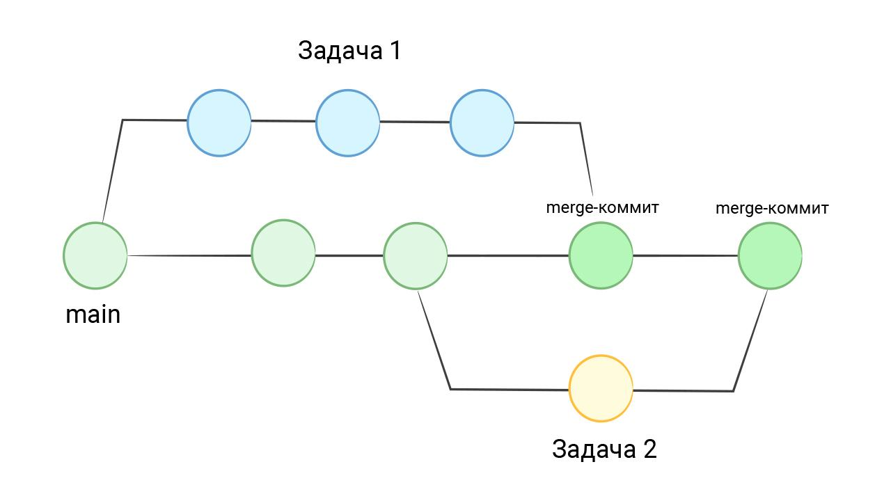

# Понимание Git

Обилие команд и возможностей могут повергнуть в ужас любого, кто только начинает изучать Git. Git — это комбайн с невероятным количеством фич. Но надо ли знать их все? И как их запомнить? Как вообще научиться эффективно его использовать? В этом уроке мы ответим на эти вопросы.

Правда состоит в том, что почти никто не знает Git до конца. Разработчики регулярно открывают внутри него что-то новое, а еще постоянно гуглят его команды или смотрят документацию. Единственный способ изучить Git — постоянно использовать его. Причем наибольший эффект достигается при работе с Git в команде. Одиночная разработка в этом смысле сильно уступает, так как не затрагивает многих сложных ситуаций, возникающих только при совместной работе над одним и тем же кодом.

С другой стороны, чтобы освоить Git, нужно понять, как он устроен и на каких идеях базируется. После этого вы осознаете, что подавляющее большинство команд — это всего лишь обертки над очень простой концепцией.

Для начала давайте выведем коммиты нашего проекта *my-git* в специальном виде, который активируется опцией ```--graph```:

```bash
git log --graph

# Неполный вывод, чтобы не отвлекаться от сути
* commit e7bb5e51f96e572084f6c04ba3312e32ce6b8c0f (HEAD -> main, origin/main, origin/HEAD)
|
|     update README.md
|
* commit 65a8ef7fd56c7356dcee35c2d05b4400f4467ca8
|
|     Revert "remove PEOPLE.md"
|
|     This reverts commit aa600a43cb164408e4ad87d216bc679d097f1a6c.
|
* commit 5120bea3e5528c29f8d1da43731cbe895892eb6d
|
|     add new content
|
* commit e6f625cf8433c8b1f1aaed58cd2b437ec8a60f27
|
|     add INFO.md
|
* commit 273f81cf2117044f1973ea80ce1067a94bea3f80
|
|     remove NEW.md
```

Обратите внимание на полоску слева. Она отражает связи между коммитами. Каждый новый коммит базируется на коде предыдущего коммита. С точки зрения информатики коммиты выстраиваются в так называемый **односвязный список**. В таком списке каждый элемент ссылается на предыдущий. Последний элемент при этом называется **головой списка** (*head* по-английски).

В Git элементы списка — это сами коммиты. Как и в односвязном списке, новый коммит — это элемент, который имеет ссылку на предыдущий коммит. Предыдущий коммит ссылается на свой предыдущий, и так далее до первого коммита, который никуда не ссылается.

Понятие «голова списка» (```HEAD```) в Git присутствует явно и активно используется для разных операций. Например, удаление последнего коммита выглядит так:

```bash
# HEAD~1 означает: взять голову и удалить один коммит, начиная от нее
# То есть мы удаляем только последний коммит
git reset --hard HEAD~1
```

Сам список коммитов тоже имеет название. Вы его уже видели — это *main*. В терминологии Git такой список называется **веткой** (*branch*). Именно поэтому команда для показа текущего местоположения в истории называется ```git branch```:

```bash
git branch

* main
```

Строго говоря, ветка в Git — это просто подвижный указатель на один из коммитов. При каждом новом коммите указатель сдвигается вперед автоматически.

Основная работа Git — формировать односвязный список из коммитов. Подавляющее большинство команд Git — это всего лишь небольшие программы, которые умеют ходить по этому списку и извлекать нужную информацию. Фактически все сводится к тому, что мы блуждаем по этому списку, меняем его и добавляем новые коммиты.

## Ветки

Если смотреть дальше, то мы увидим, что цепочка коммитов в Git это не просто односвязный список. **Это направленный ациклический граф** — множество односвязных списков, переплетенных вместе.

Представьте себе, что в один момент два разных человека должны делать какие-то длинные задачи, требующие нескольких дней разработки или даже больше. В таком случае main-ветка должна оставаться рабочей: коммитить промежуточные изменения в нее нельзя, так как изменения могут сломать код. Но коммитить все равно надо, потому что просто небезопасно копить изменения в рабочей директории, не отправляя их в Git. Что делать в такой ситуации?

Гит позволяет отпочковаться от основного списка — сформировать ветку. То есть создается отдельный список коммитов, который идет мимо главной ветки. В конце разработки все коммиты из такой ветки вливаются обратно в main-ветку:



Ветки в Git — большая история, которая достойна отдельного курса. Здесь мы про них рассказываем только потому, что невозможно работать с Git и не слышать про них.

### Дополнительные материалы

1. [Ветки в GIT](https://learngitbranching.js.org/?locale=ru_RU)
2. [Trunk Based Development](https://trunkbaseddevelopment.com)