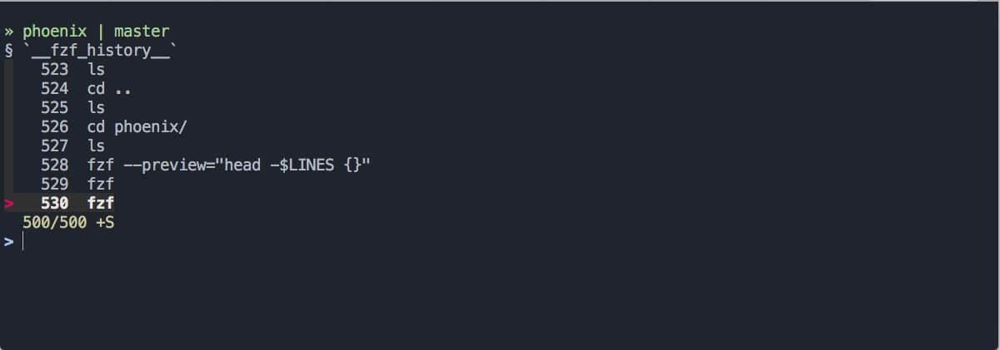

# История

Чем больше работаешь в командной строке, тем чаще возникает необходимость повторять введенные ранее команды. Самый простой способ просматривать историю команд — нажимать клавиши «вверх» и «вниз». При каждом нажатии стрелки «вверх» в поле ввода начнет появляться предыдущая выполненная команда, если нажать «вниз» — то следующая.

В этом уроке вы узнаете, как работать с историей и где это может пригодиться.

История команд bash хранится в специальном файле `.bash_history`, который лежит в домашней директории пользователя. Каждый раз, когда пользователь вводит команду, она попадает именно в этот файл. Он ничем не отличается от остальных файлов: его можно открыть, посмотреть и даже отредактировать. За то, какое количество команд хранится в истории, отвечает переменная окружения `HISTFILESIZE`. Если она выставлена, то берется указанное в ней число. Если переменной нет, история не обрезается и файл `.bash_history` растет бесконечно:

```bash
tail .bash_history

rm -r one/
env
HOME=/tmp cd
pwd
cd
echo $HOME
export HOME=/tmp
id
exit
id
```

[](https://asciinema.org/a/RFDHy4Bw8xKnBTq1AsJyWS8u0/iframe?preload=1&cols=120&rows=17)

Посмотреть историю можно и более простым способом. Достаточно выполнить команду `history`:

```bash
history

1  docke rps
2  free -m
3  docker ps
4  docker exec -it 8678a6520641 bash
5  ls
6  exit
7  docker ps
8  docker exec -it 1209b6e5ce6b bash
...
```

[](https://asciinema.org/a/CXsg76yT8h7WEIut5uEVV4kJ7/iframe?preload=1&cols=120&rows=17)

Эта команда выведет содержимое файла `.bash_history`, добавив слева номер. Если набрать `history 5`, то отобразятся только пять последних введенных команд. Используя номер команды в выводе `history`, можно выполнить повторный запуск без необходимости набирать или копировать команду из истории:

```bash
# Эта команда имела второй номер в списке выше
!2

free -m
total        used        free      shared  buff/cache   available
Mem:           1998        1532          75          21         390         227
Swap:             0           0           0
```

[](https://asciinema.org/a/N5uUGxC4HDATcu4hiI3RiO2gJ/iframe?preload=1&cols=120&rows=17)

При необходимости историю всегда можно погрепать:

```bash
history | grep export

174  export HOME=/tmp
183  history | grep export
```

[](https://asciinema.org/a/v5y6BmTwpZO9t6dwWMeDMZdoU/iframe?preload=1&cols=120&rows=17)

Последнее и самое интересное — **реверсивный поиск**. Если нажать комбинацию <shortcut>Ctrl + r</shortcut>, то запустится поиск по истории. Он ожидает ввода символов и сразу отображает ближайшую команду, в которой эти символы встречаются. Если найденное соответствие вас не устроило, то повторное нажатие <shortcut>Ctrl + r</shortcut> выберет следующее соответствие из истории:

[](https://asciinema.org/a/EYtMWjzh7VfnDKJsC8mwGYlde/iframe?preload=1&cols=120&rows=17)



На скриншоте выше продвинутая версия этого поиска, работающая через утилиту [fzf](https://github.com/junegunn/fzf#installation).

### Самостоятельная работа

Проанализируйте историю на своем локальном компьютере и поэкспериментируйте с реверсивным поиском.

### Вопросы для самопроверки

**Как найти что-либо в истории команд?**

- Попросить админа найти команду
- Прогрепать файл `.bash_history`
- Использовать реверсивный поиск