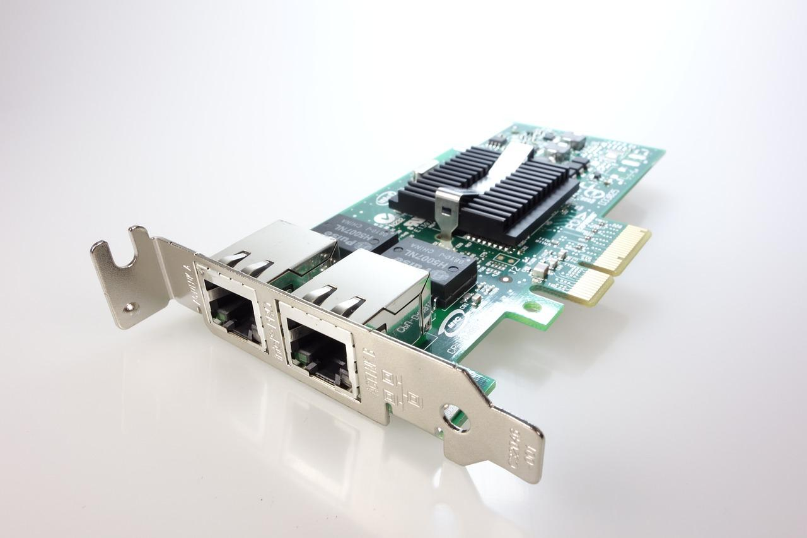
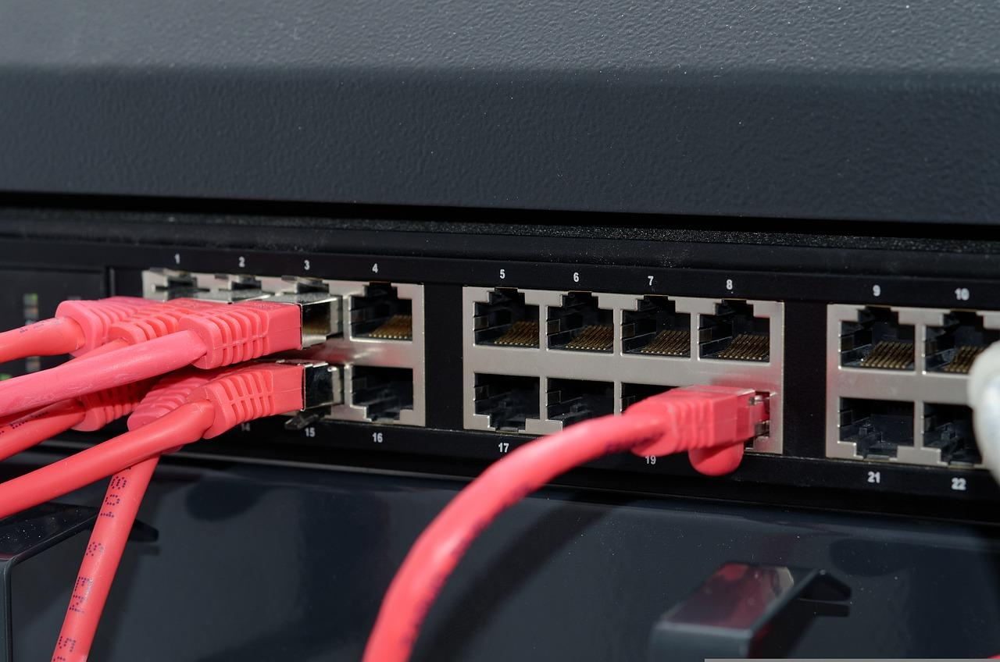

# Как соединяются компьютеры

Когда вы объединили с другом два компьютера для совместной игры, создалась **компьютерная сеть** — система, внутри которой компьютеры обмениваются информацией.

**Информация** — это то, что можно передать на другой компьютер: от сообщений в чате до результатов вычислений сложных математических формул.

В этом курсе мы не будем подробно разбираться, как формируются компьютерные сети. Эта обширная тема, которая изучается в колледжах и институтах на отдельном предмете. Нам достаточно разобраться в концепции построения сетей.

Из этого урока мы поймем, как подключить два компьютера в сеть и какая разница в подключении сотни устройств. Еще затронем тему оборудования, которое помогает объединять тысячи компьютеров в одну сеть.

## Как соединяются компьютеры

Есть три способа, с помощью которых можно соединить компьютеры:

- **Проводной тип соединения** — используются провода, которые физически соединяют компьютеры друг с другом
- **Спутниковые сети** — компьютеры соединяются с помощью спутникового сигнала
- **Беспроводной тип соединения** — используется специальное устройство, которое подключается к интернету и «раздает» его с помощью радиоволн

В этом уроке рассмотрим только проводное и беспроводное соединения. Спутниковое соединение — это дорогой тип подключения, так как не получится построить такую сеть самостоятельно, если не запустить собственные спутники в космос.

Спутниковое соединение покрывает большую площадь — 100% поверхности Земли, но на качество связи влияет даже плохая погода. Такой тип сети используется в основном военными.

Теперь рассмотрим подробнее две другие сети — начнем с проводной.

## Проводной тип соединения

Для создания простой проводной сети используется два компьютера и провод, который подключается между ними. Проводное соединение используется с момента создания первой сети и считается самым надежным способом подключения, так как отсутствуют препятствия в виде плохой погоды, кирпичных стен и других факторов, которые нарушают стабильную работу при использовании беспроводных соединений.

Рассмотрим подробнее проводное подключение: какое оборудование нужно, какие провода используются.

Чтобы соединить два компьютера в единую сеть с помощью провода, используется кабель с разъемом 8P8C и две сетевые карты. В компьютерных магазинах и в сообществе такие разъемы называют RJ-45, но это не совсем верно.

**RJ-45** — стандарт, который описывает, как устройства подключаются, какие разъемы используются и какая область применения у такого подключения. Не беспокойтесь, если назовете разъем RJ-45 — в магазине вас поймут.

Провод с разъемом 8P8C называют **патч-корд** из-за английского названия patching cord — соединительный шнур. Еще его называют коммутационным шнуром, коммутационным кабелем и соединительным кабелем.

Вот так выглядит провод с разъемом 8P8C:

Такой провод подключается к обоим компьютерам. Для этого нужны сетевые карты. У них есть специальные разъемы для подключения. Карты бывают разных видов:

- Встроенные в материнскую плату
- Отдельные модули, которые подключаются к материнской плате
- Устройства с USB кабелем, которые подключаются к телефону, планшету, компьютеру

Чтобы подключить два компьютера через патч-корд, дополнительное оборудование не требуется. Нужно только подключить провод и настроить сами компьютеры. Это отдельная тема, которая не входит в рамки этого курса, поэтому научиться настраивать компьютеры предстоит отдельно.

Сеть из двух компьютеров выглядит так:

Представим ситуацию, к нам решил подключиться еще один игрок. Теперь нам нужно соединить три компьютера. Но на двух первых устройствах сетевые карты уже заняты. В этом случае каждому компьютеру можно докупить сетевую карту и соединить патч-кордами.

Это дорогой подход, так как придется докупить три сетевые карты. Если в сети появится четвертый компьютер, то на каждом компьютере должно быть по три сетевые карты. Чем больше компьютеров, тем больше сетевых карт и проводов нужно.

Чтобы подключить больше двух компьютеров, используют дополнительные устройства — **коммутатор** или **свитч**.

Коммутатор — это устройство с десятком сетевых карт, а компьютеры подключаются к нему. Так можно не покупать новые сетевые карты и большое количество проводов. Коммутаторы соединяют компьютеры с помощью патч-кордов и хранят данные о компьютерах в сети, чтобы перенаправлять информацию нужному устройству.

Наша компьютерная сеть теперь выглядит так:

Компьютеры подключаются к одному коммутатору и обмениваются информацией. Количество устройств ограничено только тем, сколько выходов у коммутатора.

В большой сети с сотнями компьютеров одного коммутатора недостаточно. Чтобы объединить много компьютеров, соединяют несколько коммутаторов друг с другом:

Так строятся сети внутри компаний и предприятий.

Проводной тип соединения — это самый надежный способ передачи информации, так как на него почти не влияют наводки и плохая погода. У такого соединения есть альтернатива, для которой провода не нужны. Рассмотрим этот тип подробнее.

## Беспроводной тип соединения
Беспроводное соединение отличается от проводного тем, что для него не нужны провода. Компьютеры соединяются с помощью радиосигналов, которые принимают и передают специальные приемники в компьютерах.

Распространенный вид беспроводного соединения — **Wi-Fi**. Сегодня под этим названием используется несколько стандартов, которые обеспечивают связь на разных скоростях.

Wi-Fi не единственный способ беспроводного соединения. Чтобы связать оборудование друг с другом, используют **Bluetooth-соединения** и **инфракрасное соединение**. Например, по Bluetooth можно подключить к ноутбуку наушники, клавиатуру и мышь. Тип соединения определяет только способ подключения, но не то, для чего это используется. Поэтому Wi-Fi — это не интернет, а только способ соединения устройств друг с другом.

Чтобы создать беспроводную сеть, используется точка доступа. Это устройство похоже на коммутатор, но данные передаются через радиочастоты:

С помощью точки доступа в сеть объединяют компьютеры, ноутбуки, смартфоны, принтеры, телевизоры.

Преимущество беспроводного соединения — удобство, так как между компьютерами не нужно прокладывать провода. Но такой способ связи накладывает ограничения:

- Покрытие. Беспроводные технологии используются в небольших помещениях, так как не передают данные на большие расстояния. Создатели стандартов любят говорить о большом покрытии, но это возможно только в чистом поле
- Помехи. Радиосигнал не изолирован и подвержен помехам. Даже бетонная стена может стать преградой. Поэтому точки доступа располагают так, чтобы сигнал не проходил через одну или две стены

Беспроводное соединение набрало популярность в последние десятилетия из-за удобства. При этом оно может использоваться одновременно с проводным типом.

## Совместное использование проводного и беспроводного соединения
Разные виды соединений могут использоваться внутри одной сети. Например, в квартиру проведен интернет по проводному соединению. Кабель подключается в точку доступа Wi-Fi, который создает беспроводное соединение в квартире.

Допустим, стационарный компьютер могут подключить к сети с помощью провода, а ноутбук — с помощью Wi-Fi:

В этом случае в квартире одновременно используется проводное и беспроводное соединения.

Мы рассмотрели, как объединяются компьютеры, а также разобрали типы соединения и их принципы работы. Проводное и беспроводное соединения подходят как для личного пользования компьютером, так и для работы крупной компании. Выбор зависит от возможностей и желания пользователей.

Еще стоит разобраться, какие сети называют локальными, а какие — глобальными. Так вы сможете понять, какой тип сети подойдет для компании, в которой работаете, а что лучше выбрать для игры с друзьями.

## Выводы
- Чтобы соединить компьютеры, используется один из трех типов соединения: проводной, беспроводной или спутниковый
- Два компьютера соединяются патч-кордом, но такая схема дорогая при подключении трех и более компьютеров, поэтому нужно искать другой подход
- Чтобы создавать сети из нескольких компьютеров, используются коммутаторы, которые можно подключать друг к другу. Так создаются сети из сотен компьютеров
- Беспроводное соединение удобно пользователю, но у него есть ограничения на расстояние передачи, а еще оно подвержено наводкам
- Проводной и беспроводной типы сетей можно объединять в одном помещении и устройстве

### Вопросы для самопроверки

**Что из этого считается информацией**

- Клавиатура
- Текст
- Бабушкины блины
- Ход соперника в онлайн-партии по шахматам
- Видео

**Типы способов соединения устройств**
- Wi-Fi
- RJ-45
- Проводное
- Беспроводное

**Какой тип соединения самый надежный**
- Беспроводное соединение
- Спутниковое соединение
- Проводное соединение