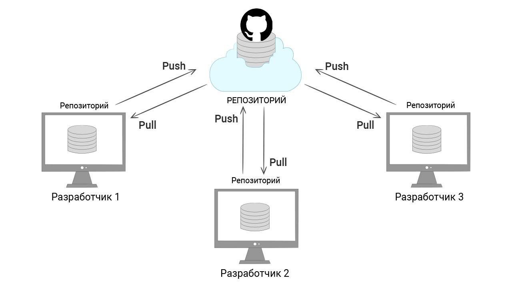

# Интеграция с GitHub

Сейчас у нас есть репозиторий с двумя коммитами. Содержимое директории *my-git* выглядит так:

```bash
ls -a

.git
PEOPLE.md
README.md
```
Перед тем, как продолжить экспериментировать, добавим наш репозиторий на GitHub. В этом уроке мы познакомимся с этим сервисом и освоим самые базовые действия с ним.

## Как добавить репозиторий

Сохраненный репозиторий в любой момент можно извлечь и продолжить работу в нем с последнего добавленного коммита. Это пригодится, если мы случайно удалим или изменим локальный репозиторий так, что с ним станет невозможно работать.

Добавим наш репозиторий на GitHub:

1. Зарегистрируйтесь на GitHub и создайте ssh-ключи по [инструкции](https://github.com/Hexlet/ru-instructions/blob/main/git.md). SSH-ключи — это наиболее безопасный способ работы с GitHub, поэтому важно разобраться с ними
2. [Создайте репозиторий](https://github.com/new) на GitHub. Назовите его *my-git* (или используйте любое другое имя). Важно, чтобы репозиторий создавался пустым, поэтому не отмечайте галочки, добавляющие файлы
3. На странице репозитория вы увидите готовые команды для подключения созданного репозитория на GitHub к уже существующему репозиторию у вас на компьютере:
  
  
  Выполните эти шаги:
```bash
# Подробнее эти команды мы разберем позже
git remote add origin git@github.com:<ИМЯ НА ГИТХАБЕ>/my-git.git
git branch -M main
git push -u origin main
```
4. Обновите страницу с репозиторием на GitHub. Изучите ее интерфейс и содержимое репозитория. Обратите внимание, что директория *.git* отсутствует. Почему это так, мы узнаем в одном из следующих уроков

После этой команды репозиторий, созданный на github.com, «соединяется» с локальным репозиторием *my-git*. Здесь может возникнуть вопрос: «Почему соединяется? Разве это не один и тот же репозиторий?».

На самом деле, это разные репозитории. Git — это **распределенная система контроля версий**. Это значит, что у Git нет какого-то центрального места, где лежит один главный репозиторий, а разработчики работают с ним со своих компьютеров.

Каждый репозиторий на GitHub и на компьютере у разработчика — это отдельные полноценные репозитории. Система Git связывает эти отдельные репозитории, объединяет их общей историей и добавляет возможность обмениваться изменениями:



В примере выше именно команда ```git push``` отправляет изменения во вновь созданный репозиторий.

Когда мы выполнили команды выше, локальный и удаленный репозиторий идентичны. Но в процессе работы они все время будут расходиться. Поэтому программисты должны не забывать **синхронизировать изменения** — заливать в репозиторий новые коммиты и забирать оттуда коммиты, сделанные другими разработчиками.

Теперь не важно, какие изменения делаются в локальном репозитории. На GitHub все коммиты попадут только после команды ```git push```, поэтому не забывайте делать ее. Бывает такое, что разработчик случайно удаляет локальный репозиторий, забыв **запушить изменения** — применить команду ```git push```.

Далее мы попробуем скачать репозиторий с GitHub так, как будто у нас нет локальной копии. Для этого удалите директорию проекта *my-git* с вашего компьютера.

## Как клонировать репозиторий

Репозитории на GitHub делятся на публичные и приватные. Публичный репозиторий любой человек может клонировать себе на компьютер. После клонирования он начнет работать с ним как с личным.

Единственное ограничение — он не сможет запушить изменения, так как GitHub не дает напрямую менять чужие репозитории.

Клонирование — базовая операция при работе с удаленными репозиториями. Проекты, над которыми работают программисты, всегда находятся в системах, подобных GitHub. Для работы с ними нужно клонировать репозиторий к себе на компьютер.

Клонировать репозиторий можно с помощью команды ```git clone```. Полную команду для клонирования можно получить на странице репозитория. Для этого нажмите большую кнопку Code, перейдите на вкладку SSH и скопируйте содержимое:

```bash
git clone git@github.com:<ИМЯ НА ГИТХАБЕ>/my-git.git
cd my-git
ls -la

# Если эта операция проходит первый раз,
# То вы можете увидеть такое подобное сообщение
The authenticity of host github.com cannot be established. RSA key fingerprint is SHA256: хххххххххх Are you sure you want to continue connecting (yes/no/[fingerprint])? yes Warning: Permanently added github.com (RSA) to the list of known hosts.
# Наберите yes и нажмите Enter
```

Мы получили точную копию репозитория, который был у нас до удаления директории *my-git*.

## Как получить изменения с GitHub

Разработчики не только отправляют свои изменения на GitHub, но и забирают их оттуда. Чаще всего это изменения, сделанные другими разработчиками проекта, но необязательно. Бывает такое, что один разработчик работает над одним проектом с разных компьютеров, на каждом из которых своя собственная копия репозитория.

В таком случае, перед началом работы нужно всегда выполнять команду ```git pull --rebase```, которая скачивает из внешнего репозитория новые коммиты и добавляет их в локальный репозиторий.

Считается, что достаточно вызывать ```git pull```, но это может приводить к созданию ненужных коммитов, из-за которых становится сложнее следить за историей изменений.

Правильная работа с ```git pull``` требует знания таких вещей, как ветвление и ```git rebase```. Они довольно сложны для новичков, поэтому мы рассмотрим их позже, когда появится хоть какой-то опыт работы с Git.

## Выводы

Подведем некоторый итог. В этом уроке мы создали репозиторий с несколькими коммитами и добавили его на GitHub. Теперь его можно склонировать для дальнейшей разработки.

Какую пользу из Git мы можем извлечь к текущему моменту? У нас есть запасная копия кода на сайте GitHub. Как минимум, нам нестрашно потерять код. Теперь его легко восстановить при случае, а еще им можно поделиться с другими.

Отдельно стоит сказать, что GitHub — это хоть и самая популярная, но не единственная площадка для хостинга репозиториев. Кроме него, особенно известны Bitbucket и GitLab. Последний можно даже поставить к себе на сервер и хостить репозитории внутри своей компании, что многие и делают по соображениям безопасности или экономии.

### Самостоятельная работа

1. Выполните все шаги из урока, создайте и добавьте ssh-ключи на GitHub по [инструкции](https://github.com/Hexlet/ru-instructions/blob/main/git.md)
2. Добавьте новый файл *NEW.md* с произвольным содержимым в репозиторий. Для этого нужно выполнить коммит
3. Залейте изменения на GitHub с помощью ```git push```
4. Обновите страницу репозитория на GitHub. Там должен появиться последний коммит — те изменения, которые были совершены

### Дополнительные материалы

- Цикл git-разработки (init, commit, push on GitHub)
  <video src="https://www.youtube.com/watch?v=ku3Mg_XCsAo" />
- [GitHub — Настройка и конфигурация учетной записи](https://git-scm.com/book/ru/v2/GitHub-Настройка-и-конфигурация-учетной-записи)
- [Создание SSH-ключа для работы с GitHub по SSH](https://docs.github.com/en/authentication/connecting-to-github-with-ssh/about-ssh)