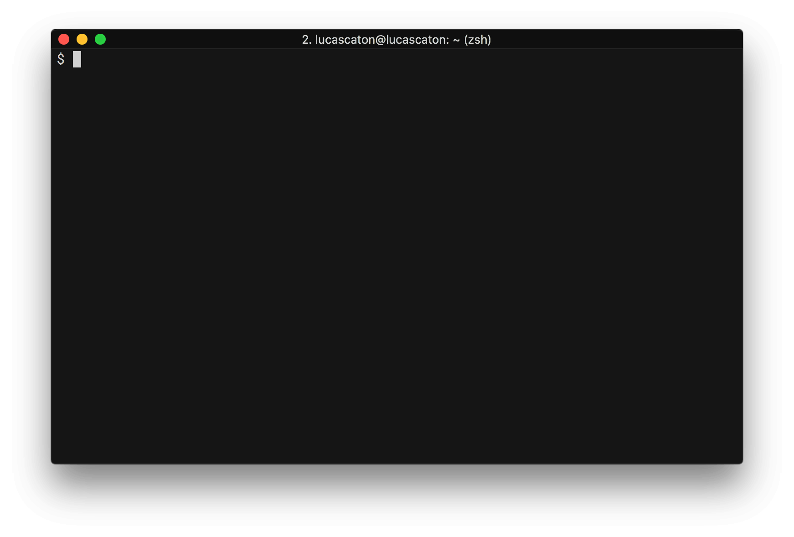

# Введение

Написание кода — важная часть процесса программирования, но далеко не единственная. Одно дело — написать программу, но совсем другое — заставить ее работать у пользователя или на сервере.

Вот лишь неполный перечень вопросов, на которые вам предстоит ответить, попав в разработку:

- Как зайти на сервер?
- Как выгрузить код на сервер?
- Как запустить сайт?
- Как перемещаться на сервере?
- Как редактировать файлы на сервере?
- Как анализировать проблемы в процессе работы сайта?
- Как анализировать систему при различных неполадках?

Эти вопросы становятся особенно интересными, если учесть, что на большинстве серверов установлен не привычный Windows, а Linux без графической оболочки.

Подключившись к удаленной машине, вы увидите **терминал** — специальную программу, через которую идет подключение:

Это командная строка, в которой можно выполнять все привычные операции на домашнем компьютере:

- Вводить разные команды
- Запускать программы
- Анализировать систему

Кому-то такой способ взаимодействия с системой покажется архаичным, но это только на первый взгляд. Текстовый режим дает множество преимуществ:

- Значительно экономит ресурсы, что особенно важно для серверного окружения
- Позволяет автоматизировать любые действия — команды можно не только выполнять вручную, но и записать в файл и выполнять все вместе
- Дает практически неограниченный доступ к возможностям системы
- Открывает больше возможностей во многих программах

Умение работать с командной строкой помогает проще решать самые разные задачи и повышает ваш уровень как разработчика. Вы легко сможете запустить и отладить сайт на удаленной машине, а также оптимизировать ежедневную работу на своем компьютере. Командная строка нужна:

- Для запуска кода на любом языке
- Для совместной разработки
- Для работы с самыми распространенными инструментами фронтенд-разработчика (Gulp, Webpack, Babel и так далее)
