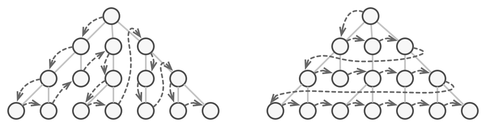

# Итератор

> Также известен как: Iterator

## Суть паттерна

**Итератор** — это поведенческий паттерн проектирования, который даёт возможность последовательно обходить элементы составных объектов, не раскрывая их внутреннего представления.


## Проблема

Коллекции — самая распространённая структура данных, которую вы можете встретить в программировании. Это набор объектов, собранный в одну кучу по каким-то критериям.


*Разные типы коллекций.*

Большинство коллекций выглядят как обычный список элементов. Но есть и экзотические коллекции, построенные на основе деревьев, графов и других сложных структур данных.

Но как бы ни была структурирована коллекция, пользователь должен иметь возможность последовательно обходить её элементы, чтобы проделывать с ними какие-то действия.

Но каким способом следует перемещаться по сложной структуре данных? Например, сегодня может быть достаточным обход дерева в глубину, но завтра потребуется возможность перемещаться по дереву в ширину. А на следующей неделе и того хуже — понадобится обход коллекции в случайном порядке.



*Одну и ту же коллекцию можно обходить разными способами.*

Добавляя всё новые алгоритмы в код коллекции, вы понемногу размываете её основную задачу, которая заключается в эффективном хранении данных. Некоторые алгоритмы могут быть и вовсе слишком «заточены» под определённое приложение и смотреться дико в общем классе коллекции.

## Решение

Идея паттерна Итератор состоит в том, чтобы вынести поведение обхода коллекции из самой коллекции в отдельный класс.


*Итераторы содержат код обхода коллекции. Одну коллекцию могут обходить сразу несколько итераторов.*

Объект-итератор будет отслеживать состояние обхода, текущую позицию в коллекции и сколько элементов ещё осталось обойти. Одну и ту же коллекцию смогут одновременно обходить различные итераторы, а сама коллекция не будет даже знать об этом.

К тому же, если вам понадобится добавить новый способ обхода, вы сможете создать отдельный класс итератора, не изменяя существующий код коллекции.

## Аналогия из жизни


*Варианты прогулок по Риму.*

Вы планируете полететь в Рим и обойти все достопримечательности за пару дней. Но приехав, вы можете долго петлять узкими улочками, пытаясь найти Колизей.

Если у вас ограниченный бюджет — не беда. Вы можете воспользоваться виртуальным гидом, скачанным на телефон, который позволит отфильтровать только интересные вам точки. А можете плюнуть и нанять локального гида, который хоть и обойдётся в копеечку, но знает город как свои пять пальцев, и сможет посвятить вас во все городские легенды.

Таким образом, Рим выступает коллекцией достопримечательностей, а ваш мозг, навигатор или гид — итератором по коллекции. Вы, как клиентский код, можете выбрать один из итераторов, отталкиваясь от решаемой задачи и доступных ресурсов.

## Структура


1. **Итератор** описывает интерфейс для доступа и обхода элементов коллекции.
2. **Конкретный итератор** реализует алгоритм обхода какой-то конкретной коллекции. Объект итератора должен сам отслеживать текущую позицию при обходе коллекции, чтобы отдельные итераторы могли обходить одну и ту же коллекцию независимо.
3. **Коллекция** описывает интерфейс получения итератора из коллекции. Как мы уже говорили, коллекции не всегда являются списком. Это может быть и база данных, и удалённое API, и даже дерево Компоновщика. Поэтому сама коллекция может создавать итераторы, так как она знает, какие именно итераторы способны с ней работать.
4. **Конкретная коллекция** возвращает новый экземпляр определённого конкретного итератора, связав его с текущим объектом коллекции. Обратите внимание, что сигнатура метода возвращает интерфейс итератора. Это позволяет клиенту не зависеть от конкретных классов итераторов.
5. **Клиент** работает со всеми объектами через интерфейсы коллекции и итератора. Так клиентский код не зависит от конкретных классов, что позволяет применять различные итераторы, не изменяя существующий код программы.<br/>В общем случае клиенты не создают объекты итераторов, а получают их из коллекций. Тем не менее, если клиенту требуется специальный итератор, он всегда может создать его самостоятельно.

## Псевдокод

В этом примере паттерн **Итератор** используется для реализации обхода нестандартной коллекции, которая инкапсулирует доступ к социальному графу Facebook. Коллекция предоставляет несколько итераторов, которые могут по-разному обходить профили людей.


*Пример обхода социальных профилей через итератор.*

Так, итератор друзей перебирает всех друзей профиля, а итератор коллег — фильтрует друзей по принадлежности к компании профиля. Все итераторы реализуют общий интерфейс, который позволяет клиентам работать с профилями, не вникая в детали работы с социальной сетью (например, в авторизацию, отправку REST-запросов и т. д.)

Кроме того, Итератор избавляет код от привязки к конкретным классам коллекций. Это позволяет добавить поддержку другого вида коллекций (например, LinkedIn), не меняя клиентский код, который работает с итераторами и коллекциями.

```c
// Общий интерфейс коллекций должен определить фабричный метод
// для производства итератора. Можно определить сразу несколько
// методов, чтобы дать пользователям различные варианты обхода
// одной и той же коллекции.
interface SocialNetwork is
    method createFriendsIterator(profileId):ProfileIterator
    method createCoworkersIterator(profileId):ProfileIterator


// Конкретная коллекция знает, объекты каких итераторов нужно
// создавать.
class Facebook implements SocialNetwork is
    // ...Основной код коллекции...

    // Код получения нужного итератора.
    method createFriendsIterator(profileId) is
        return new FacebookIterator(this, profileId, "friends")
    method createCoworkersIterator(profileId) is
        return new FacebookIterator(this, profileId, "coworkers")


// Общий интерфейс итераторов.
interface ProfileIterator is
    method getNext():Profile
    method hasMore():bool


// Конкретный итератор.
class FacebookIterator implements ProfileIterator is
    // Итератору нужна ссылка на коллекцию, которую он обходит.
    private field facebook: Facebook
    private field profileId, type: string

    // Но каждый итератор обходит коллекцию, независимо от
    // остальных, поэтому он содержит информацию о текущей
    // позиции обхода.
    private field currentPosition
    private field cache: array of Profile

    constructor FacebookIterator(facebook, profileId, type) is
        this.facebook = facebook
        this.profileId = profileId
        this.type = type

    private method lazyInit() is
        if (cache == null)
            cache = facebook.socialGraphRequest(profileId, type)

    // Итератор реализует методы базового интерфейса по-своему.
    method getNext() is
        if (hasMore())
            result = cache[currentPosition]
            currentPosition++
            return result

    method hasMore() is
        lazyInit()
        return currentPosition < cache.length


// Вот ещё полезная тактика: мы можем передавать объект
// итератора вместо коллекции в клиентские классы. При таком
// подходе клиентский код не будет иметь доступа к коллекциям, а
// значит, его не будут волновать подробности их реализаций. Ему
// будет доступен только общий интерфейс итераторов.
class SocialSpammer is
    method send(iterator: ProfileIterator, message: string) is
        while (iterator.hasMore())
            profile = iterator.getNext()
            System.sendEmail(profile.getEmail(), message)


// Класс приложение конфигурирует классы, как захочет.
class Application is
    field network: SocialNetwork
    field spammer: SocialSpammer

    method config() is
        if working with Facebook
            this.network = new Facebook()
        if working with LinkedIn
            this.network = new LinkedIn()
        this.spammer = new SocialSpammer()

    method sendSpamToFriends(profile) is
        iterator = network.createFriendsIterator(profile.getId())
        spammer.send(iterator, "Very important message")

    method sendSpamToCoworkers(profile) is
        iterator = network.createCoworkersIterator(profile.getId())
        spammer.send(iterator, "Very important message")
```

## Применимость

**Когда у вас есть сложная структура данных, и вы хотите скрыть от клиента детали её реализации (из-за сложности или вопросов безопасности).**

Итератор предоставляет клиенту всего несколько простых методов перебора элементов коллекции. Это не только упрощает доступ к коллекции, но и защищает её данные от неосторожных или злоумышленных действий.

---

**Когда вам нужно иметь несколько вариантов обхода одной и той же структуры данных.**

Нетривиальные алгоритмы обхода структуры данных могут иметь довольно объёмный код. Этот код будет захламлять всё вокруг — будь то сам класс коллекции или часть бизнес-логики программы. Применив итератор, вы можете выделить код обхода структуры данных в собственный класс, упростив поддержку остального кода.

---

**Когда вам хочется иметь единый интерфейс обхода различных структур данных.**

Итератор позволяет вынести реализации различных вариантов обхода в подклассы. Это позволит легко взаимозаменять объекты итераторов, в зависимости от того, с какой структурой данных приходится работать.

## Шаги реализации

1. Создайте общий интерфейс итераторов. Обязательный минимум — это операция получения следующего элемента коллекции. Но для удобства можно предусмотреть и другое. Например, методы для получения предыдущего элемента, текущей позиции, проверки окончания обхода и прочие.
2. Создайте интерфейс коллекции и опишите в нём метод получения итератора. Важно, чтобы сигнатура метода возвращала общий интерфейс итераторов, а не один из конкретных итераторов.
3. Создайте классы конкретных итераторов для тех коллекций, которые нужно обходить с помощью паттерна. Итератор должен быть привязан только к одному объекту коллекции. Обычно эта связь устанавливается через конструктор.
4. Реализуйте методы получения итератора в конкретных классах коллекций. Они должны создавать новый итератор того класса, который способен работать с данным типом коллекции. Коллекция должна передавать ссылку на собственный объект в конструктор итератора.
5. В клиентском коде и в классах коллекций не должно остаться кода обхода элементов. Клиент должен получать новый итератор из объекта коллекции каждый раз, когда ему нужно перебрать её элементы.

## Преимущества и недостатки

**Преимущества**

- Упрощает классы хранения данных.
- Позволяет реализовать различные способы обхода структуры данных.
- Позволяет одновременно перемещаться по структуре данных в разные стороны.

**Недостатки**

- Не оправдан, если можно обойтись простым циклом.

## Примеры реализации паттерна

### Python

- **Сложность**: 2/3
- **Популярность**: 3/3
- **Применимость**: Паттерн можно часто встретить в Python-коде, особенно в программах, работающих с разными типами коллекций, и где требуется обход разных сущностей.
- **Признаки применения паттерна**: Итератор легко определить по методам навигации (например, получения следующего/предыдущего элемента и т. д.). Код использующий итератор зачастую вообще не имеет ссылок на коллекцию, с которой работает итератор. Итератор либо принимает коллекцию в параметрах конструктора при создании, либо возвращается самой коллекцией.

Этот пример показывает структуру паттерна `Итератор`, а именно — из каких классов он состоит, какие роли эти классы выполняют и как они взаимодействуют друг с другом.

**main.py**: Пример структуры паттерна

```python
from __future__ import annotations
from collections.abc import Iterable, Iterator
from typing import Any


"""
Для создания итератора в Python есть два абстрактных класса из
встроенного модуля collections - Iterable, Iterator. Нужно реализовать
метод __iter__() в итерируемом объекте (списке), а метод __next__() в
итераторе.
"""


class AlphabeticalOrderIterator(Iterator):
    """
    Конкретные Итераторы реализуют различные алгоритмы обхода. Эти
    классы постоянно хранят текущее положение обхода.
    """

    """
    Атрибут _position хранит текущее положение обхода. У итератора
    может быть множество других полей для хранения состояния итерации,
    особенно когда он должен работать с определённым типом коллекции.
    """
    _position: int = None

    """
    Этот атрибут указывает направление обхода.
    """
    _reverse: bool = False

    def __init__(self, collection: WordsCollection,
        reverse: bool = False) -> None:
        self._collection = collection
        self._reverse = reverse
        self._position = -1 if reverse else 0

    def __next__(self) -> Any:
        """
        Метод __next __() должен вернуть следующий элемент в
        последовательности. При достижении конца коллекции и в
        последующих вызовах должно вызываться исключение
        StopIteration.
        """
        try:
            value = self._collection[self._position]
            self._position += -1 if self._reverse else 1
        except IndexError:
            raise StopIteration()

        return value


class WordsCollection(Iterable):
    """
    Конкретные Коллекции предоставляют один или несколько методов для
    получения новых экземпляров итератора, совместимых с классом
    коллекции.
    """

    def __init__(self, collection: list[Any] | None = None) -> None:
        self._collection = collection or []


    def __getitem__(self, index: int) -> Any:
        return self._collection[index]

    def __iter__(self) -> AlphabeticalOrderIterator:
        """
        Метод __iter__() возвращает объект итератора, по умолчанию мы
        возвращаем итератор с сортировкой по возрастанию.
        """
        return AlphabeticalOrderIterator(self)

    def get_reverse_iterator(self) -> AlphabeticalOrderIterator:
        return AlphabeticalOrderIterator(self, True)

    def add_item(self, item: Any) -> None:
        self._collection.append(item)


if __name__ == "__main__":
    # Клиентский код может знать или не знать о Конкретном Итераторе
    # или классах Коллекций, в зависимости от уровня косвенности,
    # который вы хотите сохранить в своей программе.
    collection = WordsCollection()
    collection.add_item("First")
    collection.add_item("Second")
    collection.add_item("Third")

    print("Straight traversal:")
    print("\n".join(collection))
    print("")

    print("Reverse traversal:")
    print("\n".join(collection.get_reverse_iterator()), end="")
```

**Output.txt**: Результат выполнения

```text
Straight traversal:
First
Second
Third

Reverse traversal:
Third
Second
First
```

### PHP

- **Сложность**: 2/3
- **Популярность**: 2/3
- **Применимость**: Паттерн можно часто встретить в PHP-коде, особенно в программах, работающих с разными типами коллекций, и где требуется обход разных сущностей.<br/> PHP имеет встроенный интерфейс для поддержки итераторов (Iterator), на основании которого можно строить свои Итераторы, совместимые с остальным PHP-кодом.
- **Признаки применения паттерна**: Итератор легко определить по методам навигации (например, получения следующего/предыдущего элемента и т. д.). Код использующий итератор зачастую вообще не имеет ссылок на коллекцию, с которой работает итератор. Итератор либо принимает коллекцию в параметрах конструктора при создании, либо возвращается самой коллекцией.

<tabs>
<tab title="Концептуальный пример">
<h4 id="iterator-php-concept">Концептуальный пример</h4>
<p>Этот пример показывает структуру паттерна <b>Итератор</b>, а именно — из каких классов он состоит, какие роли эти классы выполняют и как они взаимодействуют друг с другом.</p>
<p>После ознакомления со структурой, вам будет легче воспринимать второй пример, который рассматривает реальный случай использования паттерна в мире PHP.</p>
<p><b>index.php</b>: Пример структуры паттерна</p>
<code-block lang="php">
<![CDATA[
namespace RefactoringGuru\Iterator\Conceptual;

/**
* Конкретные Итераторы реализуют различные алгоритмы обхода. Эти классы
* постоянно хранят текущее положение обхода.
*/

class AlphabeticalOrderIterator implements \Iterator
{
    /**
    * @var WordsCollection
    */
    private $collection;

    /**
    * @var int Хранит текущее положение обхода. У итератора может быть
    * множество других полей для хранения состояния итерации, особенно когда он
    * должен работать с определённым типом коллекции.
    */
    private $position = 0;

    /**
    * @var bool Эта переменная указывает направление обхода.
    */
    private $reverse = false;

    public function __construct($collection, $reverse = false)
    {
        $this->collection = $collection;
        $this->reverse = $reverse;
    }

    public function rewind()
    {
        $this->position = $this->reverse ?
        count($this->collection->getItems()) - 1 : 0;
    }

    public function current()
    {
        return $this->collection->getItems()[$this->position];
    }

    public function key()
    {
        return $this->position;
    }
    
    public function next()
    {
        $this->position = $this->position + ($this->reverse ? -1 : 1);
    }

    public function valid()
    {
        return isset($this->collection->getItems()[$this->position]);
    }
}

/**
* Конкретные Коллекции предоставляют один или несколько методов для получения
* новых экземпляров итератора, совместимых с классом коллекции.
*/

class WordsCollection implements \IteratorAggregate
{
    private $items = [];
    
    public function getItems()
    {
        return $this->items;
    }
    
    public function addItem($item)
    {
        $this->items[] = $item;
    }
    
    public function getIterator(): Iterator
    {
        return new AlphabeticalOrderIterator($this);
    }
    
    public function getReverseIterator(): Iterator
    {
        return new AlphabeticalOrderIterator($this, true);
    }
}

/**
* Клиентский код может знать или не знать о Конкретном Итераторе или классах
* Коллекций, в зависимости от уровня косвенности, который вы хотите сохранить в
* своей программе.
*/
$collection = new WordsCollection();
$collection->addItem("First");
$collection->addItem("Second");
$collection->addItem("Third");

echo "Straight traversal:\n";
foreach ($collection->getIterator() as $item) {
    echo $item . "\n";
}

echo "\n";
echo "Reverse traversal:\n";
foreach ($collection->getReverseIterator() as $item) {
    echo $item . "\n";
}

]]>
</code-block>
<p><b>Output.txt</b>: Результат выполнения</p>
<code-block lang="text">
<![CDATA[
Straight traversal:
First
Second
Third

Reverse traversal:
Third
Second
First

]]>
</code-block>
</tab>
<tab title="Пример из реальной жизни">
<h4 id="iterator-php-real">Пример из реальной жизни</h4>
<p>Так как PHP уже имеет встроенный интерфейс <b>Итератора</b>, который предоставляет удобную интеграцию с циклами foreach, очень легко создать собственные итераторы для обхода практически любой мыслимой структуры данных.</p>
<p>Этот пример паттерна Итератор предоставляет лёгкий доступ к CSV-файлам.</p>
<p><b>index.php</b>: Пример из реальной жизни</p>
<code-block lang="php">
<![CDATA[
namespace RefactoringGuru\Iterator\RealWorld;

/**
* Итератор CSV-файлов.
*
* @author Josh Lockhart
*/

class CsvIterator implements \Iterator
{
    const ROW_SIZE = 4096;

    /**
    * Указатель на CSV-файл.
    *
    * @var resource
    */
    protected $filePointer = null;

    /**
    * Текущий элемент, который возвращается на каждой итерации.
    *
    * @var array
    */
    protected $currentElement = null;

    /**
    * Счётчик строк.
    *
    * @var int
    */
    protected $rowCounter = null;

    /**
    * Разделитель для CSV-файла.
    *
    * @var string
    */
    protected $delimiter = null;

    /**
    * Конструктор пытается открыть CSV-файл. Он выдаёт исключение при ошибке.
    *
    * @param string $file CSV-файл.
    * @param string $delimiter Разделитель.
    *
    * @throws \Exception
    */
    public function __construct($file, $delimiter = ',')
    {
        try {
            $this->filePointer = fopen($file, 'rb');
            $this->delimiter = $delimiter;
        } catch (\Exception $e) {
            throw new \Exception('The file "' . $file . '" cannot be read.');
        }
    }

    /**
    * Этот метод сбрасывает указатель файла.
    */
    public function rewind(): void
    {
        $this->rowCounter = 0;
        rewind($this->filePointer);
    }

    /**
    * Этот метод возвращает текущую CSV-строку в виде двумерного массива.
    *
    * @return array Текущая CSV-строка в виде двумерного массива.
    */
    public function current(): array
    {
        $this->currentElement = fgetcsv($this->filePointer, self::ROW_SIZE, $this->delimiter);
        $this->rowCounter++;
    
        return $this->currentElement;
    }

    /**
    * Этот метод возвращает номер текущей строки.
    *
    * @return int Номер текущей строки.
    */
    public function key(): int
    {
        return $this->rowCounter;
    }

    /**
    * Этот метод проверяет, достигнут ли конец файла.
    *
    * @return bool Возвращает true при достижении EOF, в ином случае false.
    */
    public function next(): bool
    {
        if (is_resource($this->filePointer)) {
            return !feof($this->filePointer);
        }
        return false;
    }

    /**
    * Этот метод проверяет, является ли следующая строка допустимой.
    *
    * @return bool Если следующая строка является допустимой.
    */
    public function valid(): bool
    {
        if (!$this->next()) {
            if (is_resource($this->filePointer)) {
                fclose($this->filePointer);
            }
            return false;
        }
        return true;
    }
}

/**
* Клиентский код.
*/
$csv = new CsvIterator(__DIR__ . '/cats.csv');

foreach ($csv as $key => $row) {
    print_r($row);
}

]]>
</code-block>
<p><b>Output.txt</b>: Результат выполнения</p>
<code-block lang="plain text">
<![CDATA[
Array
(
    [0] => Name
    [1] => Age
    [2] => Owner
    [3] => Breed
    [4] => Image
    [5] => Color
    [6] => Texture
    [7] => Fur
    [8] => Size
)
Array
(
    [0] => Steve
    [1] => 3
    [2] => Alexander Shvets
    [3] => Bengal
    [4] => /cats/bengal.jpg
    [5] => Brown
    [6] => Stripes
    [7] => Short
    [8] => Medium
)
Array
(
    [0] => Siri
    [1] => 2
    [2] => Alexander Shvets
    [3] => Domestic short-haired
    [4] => /cats/domestic-sh.jpg
    [5] => Black
    [6] => Solid
    [7] => Medium
    [8] => Medium
)
Array
(
    [0] => Fluffy
    [1] => 5
    [2] => John Smith
    [3] => Maine Coon
    [4] => /cats/Maine-Coon.jpg
    [5] => Gray
    [6] => Stripes
    [7] => Long
    [8] => Large
)

]]>
</code-block>
</tab>
</tabs>