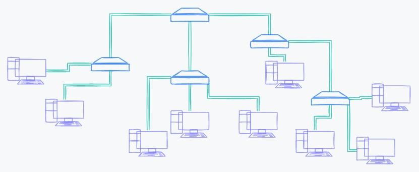

# Локальные и глобальные сети

Мы научились подключать компьютеры друг к другу разными способами. Но все еще не образовали интернет. Соединив несколько компьютеров, можно создать небольшую и замкнутую сеть, которая не позволит общаться с людьми со всего мира и делиться с ними информацией.

В этом уроке мы рассмотрим понятие глобальной и локальной сети. Узнаем об их основном отличии и разберемся, кто такие провайдеры, благодаря которым устройства в наших квартирах и домах получают доступ к глобальной сети интернет.

## Локальные и глобальные сети

Существует два вида сети:

- Локальная вычислительная сеть
- Глобальная вычислительная сеть

Взглянем на пример подключения компьютеров с помощью нескольких коммутаторов

Так можно соединить сотню компьютеров между собой, но все они замкнуты в рамках единой системы, одного главного коммутатора, который находится в самом верху на изображении. Так образовалась **локальная вычислительная сеть** — LAN (Local Area Network). Она ограничена и объединяет в себе устройства в квартире, доме, офисе. Особенность локальных сетей — замкнутость, то есть у них нет выхода в другие сети.

Если объединить локальные сети, чтобы обмениваться информацией, получится **глобальная вычислительная сеть** — WAN (Wide Area Network). Такая сеть объединяет неограниченное количество устройств.

Локальная сеть объединяет в себе не только небольшой участок — квартиру или дом. Например, сеть внутри района тоже будет локальной, если у нее нет выходов в другие сети, например, интернет. Когда локальная сеть строится, можно точно сказать, сколько компьютеров подключено и какое ограничение на количество устройств.

Пример построения локальной сети — компания, которая поставляет интернет в ваш дом. Она объединяет компьютеры в доме, но у самой есть доступ к глобальной сети, к которой она и подключает локальную сеть. Такие компании называют провайдерами.

## Провайдеры

Чтобы подключиться к глобальной сети, недостаточно взять патч-корд и присоединить его к компьютеру. Выйти в глобальную сеть можно через договор с поставщиками интернета — **провайдерами**.

Провайдеры делятся на три уровня, у каждого из которых своя зона ответственности:

- **Tier-1** — провайдеры первого уровня. Главные поставщики интернета, так как владеют основными магистралями. Например, им принадлежат кабели, которые соединяют материки друг с другом. На 2021 год таких компаний насчитывается 16 в мире
- **Tier-2** — провайдеры второго уровня. Национальные компании, которых в каждой стране свое количество. Для выхода в интернет они покупают доступ у провайдеров уровня Tier-1
- **Tier-3** — провайдеры третьего уровня. Региональные провайдеры, которые работают в пределах района или города. Они покупают доступ у провайдеров уровня Tier-2. С ними заключают договор пользователи интернета
Некоторые ресурсы выделяют четыре уровня провайдеров. Основной принцип при этом не меняется: на первом уровне находятся главные поставщики, и далее каждый уровень переносит на более локальную зону ответственности.

Не стоит отказываться от провайдеров и пытаться строить свою сеть, которая свяжет континенты. Это не удастся из-за оборудования и технических ограничений.

Например, сеть начнет давать сбои, если длина кабеля превысит 100-120 метров. После этих значений сигнал слабеет, и информация не доходит до получателя. У провайдеров есть оборудование и возможности организовывать сеть с минимальными потерями и максимальной скоростью даже через континенты.

Провайдеры покупают оборудование, обеспечивают точки, в которых сигнал усиливается, подключают тысячи людей и заключают контракты с провайдерами других уровней. Так как у организаций свои зоны ответственности, то небольшому провайдеру из города не нужно думать о передаче данных через Атлантический океан — это забота провайдера уровня Tier-1.

Локальные и глобальные сети отличаются масштабностью, но у них есть одно главное сходство — они объединяют компьютеры, которые могут передать информацию между собой. Проанализируйте, какую сеть использует компания, в которой вы работаете, а к какой сети подключен ваш компьютер дома. Так вы точно поймете, чем отличаются данные сети.

## Выводы
У локальных сетей нет выхода в другие сети. Глобальные сети объединяют локальные сети и позволяют общаться друг с другом. Основная глобальная сеть — интернет
Провайдеры, которые поставляют интернет, бывают разных уровней. Это зависит от размера сети, к которой у них есть доступ

### Вопросы для самопроверки

**Какие существуют типы сетей**

- Локальные
- Домашние
- Глобальные
- Городские

**Какой уровень провайдера — главные поставщики интернета**
- Tier-2
- Tier-1
- Tier-3

**В чем особенность локальной сети?**
- Для создания сети нужно специальное оборудование
- Невозможность подключения более десяти компьютеров
- Отсутствие выхода в глобальную сеть