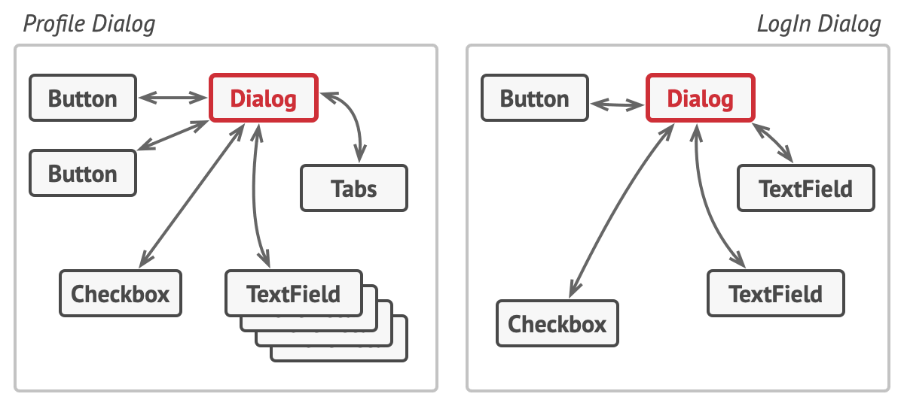

# Посредник

> Также известен как: Intermediary, Controller, Mediator

## Суть паттерна

**Посредник** — это поведенческий паттерн проектирования, который позволяет уменьшить связанность множества классов между собой, благодаря перемещению этих связей в один класс-посредник.


## Проблема

Предположим, что у вас есть диалог создания профиля пользователя. Он состоит из всевозможных элементов управления — текстовых полей, чекбоксов, кнопок.


*Беспорядочные связи между элементами пользовательского интерфейса.*

Отдельные элементы диалога должны взаимодействовать друг с другом. Так, например, чекбокс «у меня есть собака» открывает скрытое поле для ввода имени домашнего любимца, а клик по кнопке отправки запускает проверку значений всех полей формы.


*Код элементов нужно трогать при изменении каждого диалога.*

Прописав эту логику прямо в коде элементов управления, вы поставите крест на их повторном использовании в других местах приложения. Они станут слишком тесно связанными с элементами диалога редактирования профиля, которые не нужны в других контекстах. Поэтому вы сможете использовать либо все элементы сразу, либо ни одного.

## Решение

Паттерн **Посредник** заставляет объекты общаться не напрямую друг с другом, а через отдельный объект-посредник, который знает, кому нужно перенаправить тот или иной запрос. Благодаря этому, компоненты системы будут зависеть только от посредника, а не от десятков других компонентов.

В нашем примере посредником мог бы стать диалог. Скорее всего, класс диалога и так знает, из каких элементов состоит, поэтому никаких новых связей добавлять в него не придётся.



*Элементы интерфейса общаются через посредника.*

Основные изменения произойдут внутри отдельных элементов диалога. Если раньше при получении клика от пользователя объект кнопки сам проверял значения полей диалога, то теперь его единственной обязанностью будет сообщить диалогу о том, что произошёл клик. Получив извещение, диалог выполнит все необходимые проверки полей. Таким образом, вместо нескольких зависимостей от остальных элементов кнопка получит только одну — от самого диалога.

Чтобы сделать код ещё более гибким, можно выделить общий интерфейс для всех посредников, то есть диалогов программы. Наша кнопка станет зависимой не от конкретного диалога создания пользователя, а от абстрактного, что позволит использовать её и в других диалогах.

Таким образом, посредник скрывает в себе все сложные связи и зависимости между классами отдельных компонентов программы. А чем меньше связей имеют классы, тем проще их изменять, расширять и повторно использовать.

## Аналогия из жизни


*Пилоты самолётов общаются не напрямую, а через диспетчера.*

Пилоты садящихся или улетающих самолётов не общаются напрямую с другими пилотами. Вместо этого они связываются с диспетчером, который координирует действия нескольких самолётов одновременно. Без диспетчера пилотам приходилось бы все время быть начеку и следить за всеми окружающими самолётами самостоятельно, а это приводило бы к частым катастрофам в небе.

Важно понимать, что диспетчер не нужен во время всего полёта. Он задействован только в зоне аэропорта, когда нужно координировать взаимодействие многих самолётов.

## Структура


1. **Компоненты** — это разнородные объекты, содержащие бизнес-логику программы. Каждый компонент хранит ссылку на объект посредника, но работает с ним только через абстрактный интерфейс посредников. Благодаря этому, компоненты можно повторно использовать в другой программе, связав их с посредником другого типа.
2. **Посредник** определяет интерфейс для обмена информацией с компонентами. Обычно хватает одного метода, чтобы оповещать посредника о событиях, произошедших в компонентах. В параметрах этого метода можно передавать детали события: ссылку на компонент, в котором оно произошло, и любые другие данные.
3. **Конкретный посредник** содержит код взаимодействия нескольких компонентов между собой. Зачастую этот объект не только хранит ссылки на все свои компоненты, но и сам их создаёт, управляя дальнейшим жизненным циклом.
4. Компоненты не должны общаться друг с другом напрямую. Если в компоненте происходит важное событие, он должен оповестить своего посредника, а тот сам решит — касается ли событие других компонентов, и стоит ли их оповещать. При этом компонент-отправитель не знает кто обработает его запрос, а компонент-получатель не знает кто его прислал.

## Псевдокод

В этом примере Посредник помогает избавиться от зависимостей между классами различных элементов пользовательского интерфейса: кнопками, чекбоксами и надписями.


*Пример структурирования классов UI-диалогов.*

По реакции на действия пользователей элементы не взаимодействуют напрямую, а всего лишь уведомляют посредника о том, что они изменились.

Посредник в виде диалога авторизации знает, как конкретные элементы должны взаимодействовать. Поэтому при получении уведомлений он может перенаправить вызов тому или иному элементу.

```c
// Общий интерфейс посредников.
interface Mediator is
    method notify(sender: Component, event: string)


// Конкретный посредник. Все связи между конкретными
// компонентами переехали в код посредника. Он получает
// извещения от своих компонентов и знает, как на них
// реагировать.
class AuthenticationDialog implements Mediator is
    private field title: string
    private field loginOrRegisterChkBx: Checkbox
    private field loginUsername, loginPassword: Textbox
    private field registrationUsername, registrationPassword,
                  registrationEmail: Textbox
    private field okBtn, cancelBtn: Button

    constructor AuthenticationDialog() is
        // Здесь нужно создать объекты всех компонентов, подав
        // текущий объект-посредник в их конструктор.

    // Когда что-то случается с компонентом, он шлёт посреднику
    // оповещение. После получения извещения посредник может
    // либо сделать что-то самостоятельно, либо перенаправить
    // запрос другому компоненту.
    method notify(sender, event) is
        if (sender == loginOrRegisterChkBx and event == "check")
            if (loginOrRegisterChkBx.checked)
                title = "Log in"
                // 1. Показать компоненты формы входа.
                // 2. Скрыть компоненты формы регистрации.
            else
                title = "Register"
                // 1. Показать компоненты формы регистрации.
                // 2. Скрыть компоненты формы входа.

        if (sender == okBtn && event == "click")
            if (loginOrRegister.checked)
                // Попробовать найти пользователя с данными из
                // формы логина.
                if (!found)
                    // Показать ошибку над формой логина.
            else
                // 1. Создать пользовательский аккаунт с данными
                // из формы регистрации.
                // 2. Авторизировать этого пользователя.
                // ...


// Классы компонентов общаются с посредниками через их общий
// интерфейс. Благодаря этому одни и те же компоненты можно
// использовать в разных посредниках.
class Component is
    field dialog: Mediator

    constructor Component(dialog) is
        this.dialog = dialog

    method click() is
        dialog.notify(this, "click")

    method keypress() is
        dialog.notify(this, "keypress")

// Конкретные компоненты не связаны между собой напрямую. У них
// есть только один канал общения — через отправку уведомлений
// посреднику.
class Button extends Component is
    // ...

class Textbox extends Component is
    // ...

class Checkbox extends Component is
    method check() is
        dialog.notify(this, "check")
    // ...
```

## Применимость

**Когда вам сложно менять некоторые классы из-за того, что они имеют множество хаотичных связей с другими классами.**

Посредник позволяет поместить все эти связи в один класс, после чего вам будет легче их отрефакторить, сделать более понятными и гибкими.

---

**Когда вы не можете повторно использовать класс, поскольку он зависит от уймы других классов.**

После применения паттерна компоненты теряют прежние связи с другими компонентами, а всё их общение происходит косвенно, через объект-посредник.

---

**Когда вам приходится создавать множество подклассов компонентов, чтобы использовать одни и те же компоненты в разных контекстах.**

Если раньше изменение отношений в одном компоненте могли повлечь за собой лавину изменений во всех остальных компонентах, то теперь вам достаточно создать подкласс посредника и поменять в нём связи между компонентами.

## Шаги реализации

1. Найдите группу тесно переплетённых классов, отвязав которые друг от друга, можно получить некоторую пользу. Например, чтобы повторно использовать их код в другой программе.

2. Создайте общий интерфейс посредников и опишите в нём методы для взаимодействия с компонентами. В простейшем случае достаточно одного метода для получения оповещений от компонентов.<br/>Этот интерфейс необходим, если вы хотите повторно использовать классы компонентов для других задач. В этом случае всё, что нужно сделать — это создать новый класс конкретного посредника.
3. Реализуйте этот интерфейс в классе конкретного посредника. Поместите в него поля, которые будут содержать ссылки на все объекты компонентов.
4. Вы можете пойти дальше и переместить код создания компонентов в класс посредника, после чего он может напоминать [фабрику](factory-method.md) или [фасад](facade.md).
5. Компоненты тоже должны иметь ссылку на объект посредника. Связь между ними удобнее всего установить, подавая посредника в параметры конструктора компонентов.
6. Измените код компонентов так, чтобы они вызывали метод оповещения посредника, вместо методов других компонентов. С противоположной стороны, посредник должен вызывать методы нужного компонента, когда получает оповещение от компонента.

## Преимущества и недостатки

**Преимущества**
- Устраняет зависимости между компонентами, позволяя повторно их использовать.
- Упрощает взаимодействие между компонентами.
- Централизует управление в одном месте.

**Недостатки**

- Посредник может сильно раздуться.

## Примеры реализации паттерна

### Python

- **Сложность**: 2/3
- **Популярность**: 0/3
- **Применимость**: Пожалуй, самое популярное применение Посредника в Python-коде — это связь нескольких компонентов GUI одной программы.

Этот пример показывает структуру паттерна `Посредник`, а именно — из каких классов он состоит, какие роли эти классы выполняют и как они взаимодействуют друг с другом.

**main.py**: Пример структуры паттерна

```python
from __future__ import annotations
from abc import ABC


class Mediator(ABC):
    """
    Интерфейс Посредника предоставляет метод, используемый
    компонентами для уведомления посредника о различных событиях.
    Посредник может реагировать на эти события и передавать исполнение
    другим компонентам.
    """

    def notify(self, sender: object, event: str) -> None:
        pass


class ConcreteMediator(Mediator):
    def __init__(self, component1: Component1, 
        component2: Component2) -> None:
        self._component1 = component1
        self._component1.mediator = self
        self._component2 = component2
        self._component2.mediator = self

    def notify(self, sender: object, event: str) -> None:
        if event == "A":
            print("Mediator reacts on A and triggers following "
                + "operations:")
            self._component2.do_c()
        elif event == "D":
            print("Mediator reacts on D and triggers following "
                + "operations:")
            self._component1.do_b()
            self._component2.do_c()


class BaseComponent:
    """
    Базовый Компонент обеспечивает базовую функциональность хранения
    экземпляра посредника внутри объектов компонентов.
    """

    def __init__(self, mediator: Mediator = None) -> None:
        self._mediator = mediator

    @property
    def mediator(self) -> Mediator:
        return self._mediator

    @mediator.setter
    def mediator(self, mediator: Mediator) -> None:
        self._mediator = mediator


"""
Конкретные Компоненты реализуют различную функциональность. Они не
зависят от других компонентов. Они также не зависят от каких-либо
конкретных классов посредников.
"""


class Component1(BaseComponent):
    def do_a(self) -> None:
        print("Component 1 does A.")
        self.mediator.notify(self, "A")

    def do_b(self) -> None:
        print("Component 1 does B.")
        self.mediator.notify(self, "B")


class Component2(BaseComponent):
    def do_c(self) -> None:
        print("Component 2 does C.")
        self.mediator.notify(self, "C")

    def do_d(self) -> None:
        print("Component 2 does D.")
        self.mediator.notify(self, "D")


if __name__ == "__main__":
    # Клиентский код.
    c1 = Component1()
    c2 = Component2()
    mediator = ConcreteMediator(c1, c2)

    print("Client triggers operation A.")
    c1.do_a()

    print("\n", end="")

    print("Client triggers operation D.")
    c2.do_d()
```

**Output.txt**: Результат выполнения

```text
Client triggers operation A.
Component 1 does A.
Mediator reacts on A and triggers following operations:
Component 2 does C.


Client triggers operation D.
Component 2 does D.
Mediator reacts on D and triggers following operations:
Component 1 does B.
Component 2 does C.
```

### PHP

- **Сложность**: 2/3
- **Популярность**: 0/3
- **Применимость**: Посредник не столь актуален в PHP, как в других языках, из-за того, что разные компоненты приложения не часто общаются друг с другом в пределах одной сессии скрипта.<br/>Тем не менее, примерами паттерна могут служить EventDispatcher-ы многих фреймворков, а также некоторые реализации контроллеров в MVC фреймворках.

<tabs>
<tab title="Концептуальный пример">
<h4 id="mediator-php-concept">Концептуальный пример</h4>
<p>Этот пример показывает структуру паттерна <b>Посредник</b>, а именно — из каких классов он состоит, какие роли эти классы выполняют и как они взаимодействуют друг с другом.</p>
<p>После ознакомления со структурой, вам будет легче воспринимать второй пример, который рассматривает реальный случай использования паттерна в мире PHP.</p>
<p><b>index.php</b>: Пример структуры паттерна</p>
<code-block lang="php">
<![CDATA[
namespace RefactoringGuru\Mediator\Conceptual;

/**
* Интерфейс Посредника предоставляет метод, используемый компонентами для
* уведомления посредника о различных событиях. Посредник может реагировать на
* эти события и передавать исполнение другим компонентам.
*/

interface Mediator
{
    public function notify(object $sender, string $event): void;
}

/**
* Конкретные Посредники реализуют совместное поведение, координируя отдельные
* компоненты.
*/

class ConcreteMediator implements Mediator
{
    private $component1;

    private $component2;

    public function __construct(Component1 $c1, Component2 $c2)
    {
        $this->component1 = $c1;
        $this->component1->setMediator($this);
        $this->component2 = $c2;
        $this->component2->setMediator($this);
    }

    public function notify(object $sender, string $event): void
    {
        if ($event == "A") {
            echo "Mediator reacts on A and triggers following operations:\n";
            $this->component2->doC();
        }

        if ($event == "D") {
            echo "Mediator reacts on D and triggers following operations:\n";
            $this->component1->doB();
            $this->component2->doC();
        }
    }
}

/**
* Базовый Компонент обеспечивает базовую функциональность хранения экземпляра
* посредника внутри объектов компонентов.
*/

class BaseComponent
{
    protected $mediator;
    
    public function __construct(Mediator $mediator = null)
    {
        $this->mediator = $mediator;
    }
    
    public function setMediator(Mediator $mediator): void
    {
        $this->mediator = $mediator;
    }
}

/**
* Конкретные Компоненты реализуют различную функциональность. Они не зависят от
* других компонентов. Они также не зависят от каких-либо конкретных классов
* посредников.
*/

class Component1 extends BaseComponent
{
    public function doA(): void
    {
        echo "Component 1 does A.\n";
        $this->mediator->notify($this, "A");
    }

    public function doB(): void
    {
        echo "Component 1 does B.\n";
        $this->mediator->notify($this, "B");
    }
}

class Component2 extends BaseComponent
{
    public function doC(): void
    {
        echo "Component 2 does C.\n";
        $this->mediator->notify($this, "C");
    }

    public function doD(): void
    {
        echo "Component 2 does D.\n";
        $this->mediator->notify($this, "D");
    }
}

/**
* Клиентский код.
*/
$c1 = new Component1();
$c2 = new Component2();
$mediator = new ConcreteMediator($c1, $c2);

echo "Client triggers operation A.\n";
$c1->doA();

echo "\n";
echo "Client triggers operation D.\n";
$c2->doD();

]]>
</code-block>
<p><b>Output.txt</b>: Результат выполнения</p>
<code-block lang="text">
<![CDATA[
Client triggers operation A.
Component 1 does A.
Mediator reacts on A and triggers following operations:
Component 2 does C.

Client triggers operation D.
Component 2 does D.
Mediator reacts on D and triggers following operations:
Component 1 does B.
Component 2 does C.

]]>
</code-block>
</tab>
<tab title="Пример из реальной жизни">
<h4 id="mediator-php-real">Пример из реальной жизни</h4>
<p>В этом примере паттерн **Посредник** расширяет базовую идею паттерна **Наблюдатель**, предоставляя централизованный диспетчер событий. Он позволяет любому объекту отслеживать и запускать события в других объектах, независимо от их классов.</p>
<p><b>index.php</b>: Пример из реальной жизни</p>
<code-block lang="php">
<![CDATA[
namespace RefactoringGuru\Mediator\RealWorld;

/**
* Класс Диспетчера Событий выполняет функции Посредника и содержит логику
* подписки и уведомлений. Хотя классический Посредник часто зависит от
* конкретных классов компонентов, этот привязан только к их абстрактным
* интерфейсам.
*
* Достичь слабой связанности между компонентами можно благодаря особому способу
* установления связей между ними. Компоненты сами могут подписаться на
* интересующие их конкретные события через интерфейс подписки Посредника.
*
* Обратите внимание, что мы не можем использовать здесь встроенные в PHP
* интерфейсы Subject/Observer, так как они не дадут нам реализовать расширенные
* методы подписки и оповещений.
*/

class EventDispatcher
{
    /**
    * @var array
    */
    private $observers = [];

    public function __construct()
    {
        // Специальная группа событий для наблюдателей, которые хотят слушать
        // все события.
        $this->observers["*"] = [];
    }
    
    private function initEventGroup(string &$event = "*"): void
    {
        if (!isset($this->observers[$event])) {
            $this->observers[$event] = [];
        }
    }
    
    private function getEventObservers(string $event = "*"): array
    {
        $this->initEventGroup($event);
        $group = $this->observers[$event];
        $all = $this->observers["*"];
        return array_merge($group, $all);
    }

    public function attach(Observer $observer, string $event = "*"): void
    {
        $this->initEventGroup($event);
        $this->observers[$event][] = $observer;
    }

    public function detach(Observer $observer, string $event = "*"): void
    {
        foreach ($this->getEventObservers($event) as $key => $s) {
            if ($s === $observer) {
                unset($this->observers[$event][$key]);
            }
        }
    }

    public function trigger(string $event, object $emitter, $data = null): void
    {
        echo "EventDispatcher: Broadcasting the '$event' event.\n";
        foreach ($this->getEventObservers($event) as $observer) {
            $observer->update($event, $emitter, $data);
        }
    }
}

/**
* Простая вспомогательная функция для предоставления глобального доступа к
* диспетчеру событий.
*/

function events(): EventDispatcher
{
    static $eventDispatcher;
    if (!$eventDispatcher) {
        $eventDispatcher = new EventDispatcher();
    }

    return $eventDispatcher;
}

/**
* Интерфейс Наблюдателя определяет, как компоненты получают уведомления о
* событиях.
*/

interface Observer
{
    public function update(string $event, object $emitter, $data = null);
}

/**
* В отличие от нашего примера паттерна Наблюдатель, этот пример заставляет
* ПользовательскийРепозиторий действовать как обычный компонент, который не
* имеет никаких специальных методов, связанных с событиями. Как и любой другой
* компонент, этот класс использует ДиспетчерСобытий для трансляции своих
* событий и прослушивания других.
*
* @see \RefactoringGuru\Observer\RealWorld\UserRepository
*/

class UserRepository implements Observer
{
    /**
    * @var array Список пользователей приложения.
    */
    private $users = [];

    /**
    * Компоненты могут подписаться на события самостоятельно или через
    * клиентский код.
    */
    public function __construct()
    {
        events()->attach($this, "users:deleted");
    }

    /**
    * Компоненты могут принять решение, будут ли они обрабатывать событие,
    * используя его название, источник или какие-то контекстные данные,
    * переданные вместе с событием.
    */
    public function update(string $event, object $emitter, $data = null): void
    {
        switch ($event) {
            case "users:deleted":
                if ($emitter === $this) {
                    return;
                }
                $this->deleteUser($data, true);
                break;
        }
    }

    // Эти методы представляют бизнес-логику класса.
    
    public function initialize(string $filename): void
    {
        echo "UserRepository: Loading user records from a file.\n";
        // ...
        events()->trigger("users:init", $this, $filename);
    }

    public function createUser(array $data, bool $silent = false): User
    {
        echo "UserRepository: Creating a user.\n";
        $user = new User();
        $user->update($data);
        $id = bin2hex(openssl_random_pseudo_bytes(16));
        $user->update(["id" => $id]);
        $this->users[$id] = $user;
        if (!$silent) {
            events()->trigger("users:created", $this, $user);
        }
        return $user;
    }

    public function updateUser(User $user, array $data, bool $silent = false): ?User
    {
        echo "UserRepository: Updating a user.\n";
        $id = $user->attributes["id"];
        if (!isset($this->users[$id])) {
            return null;
        }
        $user = $this->users[$id];
        $user->update($data);
        if (!$silent) {
            events()->trigger("users:updated", $this, $user);
        }
        return $user;
    }

    public function deleteUser(User $user, bool $silent = false): void
    {
        echo "UserRepository: Deleting a user.\n";

        $id = $user->attributes["id"];
        if (!isset($this->users[$id])) {
            return;
        }
        unset($this->users[$id]);
        if (!$silent) {
            events()->trigger("users:deleted", $this, $user);
        }
    }
}

/**
* Давайте сохраним класс Пользователя тривиальным, так как он не является
* главной темой нашего примера.
*/

class User
{
    public $attributes = [];
    
    public function update($data): void
    {
        $this->attributes = array_merge($this->attributes, $data);
    }

    /**
    * Все объекты могут вызывать события.
    */
    public function delete(): void
    {
        echo "User: I can now delete myself without worrying about the repository.\n";
        events()->trigger("users:deleted", $this, $this);
    }
}

/**
* Этот Конкретный Компонент регистрирует все события, на которые он подписан.
*/
class Logger implements Observer
{
    private $filename;
    
    public function __construct($filename)
    {
        $this->filename = $filename;
        if (file_exists($this->filename)) {
            unlink($this->filename);
        }
    }

    public function update(string $event, object $emitter, $data = null)
    {
        $entry = date("Y-m-d H:i:s") . ": '$event' with data '" . json_encode($data) . "'\n";
        file_put_contents($this->filename, $entry, FILE_APPEND);
        echo "Logger: I've written '$event' entry to the log.\n";
    }
}

/**
* Этот Конкретный Компонент отправляет начальные инструкции новым
* пользователям. Клиент несёт ответственность за присоединение этого компонента
* к соответствующему событию создания пользователя.
*/

class OnboardingNotification implements Observer
{
    private $adminEmail;
    
    public function __construct(string $adminEmail)
    {
        $this->adminEmail = $adminEmail;
    }
    
    public function update(string $event, object $emitter, $data = null): void
    {
        // mail($this->adminEmail,
        //     "Onboarding required",
        //     "We have a new user. Here's his info: " .json_encode($data));
    
        echo "OnboardingNotification: The notification has been emailed!\n";
    }
}

/**
* Клиентский код.
*/

$repository = new UserRepository();
events()->attach($repository, "facebook:update");

$logger = new Logger(__DIR__ . "/log.txt");
events()->attach($logger, "*");

$onboarding = new OnboardingNotification("1@example.com");
events()->attach($onboarding, "users:created");

// ...

$repository->initialize(__DIR__ . "users.csv");

// ...

$user = $repository->createUser([
    "name" => "John Smith",
    "email" => "john99@example.com",
]);

// ...

$user->delete();

]]>
</code-block>
<p><b>Output.txt</b>: Результат выполнения</p>
<code-block lang="plain text">
<![CDATA[
UserRepository: Loading user records from a file.
EventDispatcher: Broadcasting the 'users:init' event.
Logger: I've written 'users:init' entry to the log.
UserRepository: Creating a user.
EventDispatcher: Broadcasting the 'users:created' event.
OnboardingNotification: The notification has been emailed!
Logger: I've written 'users:created' entry to the log.
User: I can now delete myself without worrying about the repository.
EventDispatcher: Broadcasting the 'users:deleted' event.
UserRepository: Deleting a user.
Logger: I've written 'users:deleted' entry to the log.

]]>
</code-block>
</tab>
</tabs>