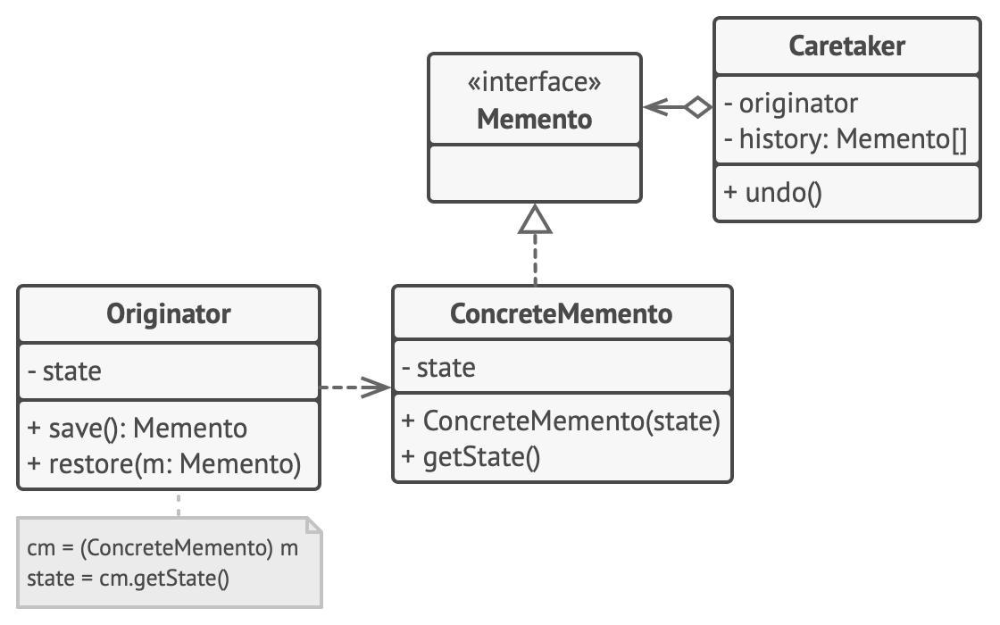
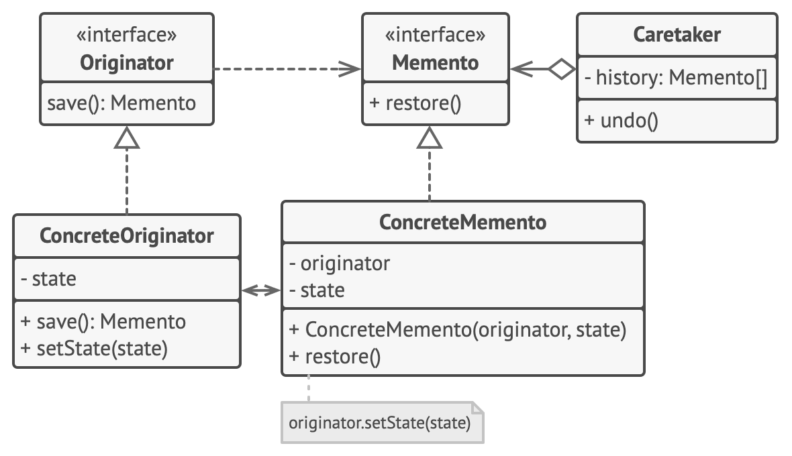

# Снимок

> Также известен как: Хранитель, Memento

## Суть паттерна

**Снимок** — это поведенческий паттерн проектирования, который позволяет сохранять и восстанавливать прошлые состояния объектов, не раскрывая подробностей их реализации.


## Проблема

Предположим, что вы пишете программу текстового редактора. Помимо обычного редактирования, ваш редактор позволяет менять форматирование текста, вставлять картинки и прочее.

В какой-то момент вы решили сделать все эти действия отменяемыми. Для этого вам нужно сохранять текущее состояние редактора перед тем, как выполнить любое действие. Если потом пользователь решит отменить своё действие, вы достанете копию состояния из истории и восстановите старое состояние редактора.


*Перед выполнением команды вы можете сохранить копию состояния редактора, чтобы потом иметь возможность отменить операцию.*

Чтобы сделать копию состояния объекта, достаточно скопировать значение его полей. Таким образом, если вы сделали класс редактора достаточно открытым, то любой другой класс сможет заглянуть внутрь, чтобы скопировать его состояние.

Казалось бы, что ещё нужно? Ведь теперь любая операция сможет сделать резервную копию редактора перед своим действием. Но такой наивный подход обеспечит вам уйму проблем в будущем. Ведь если вы решите провести рефакторинг — убрать или добавить парочку полей в класс редактора — то придётся менять код всех классов, которые могли копировать состояние редактора.


*Как команде создать снимок состояния редактора, если все его поля приватные?*

Но это ещё не все. Давайте теперь рассмотрим сами копии состояния редактора. Из чего состоит состояние редактора? Даже самый примитивный редактор должен иметь несколько полей для хранения текущего текста, позиции курсора и прокрутки экрана. Чтобы сделать копию состояния, вам нужно записать значения всех этих полей в некий «контейнер».

Скорее всего, вам понадобится хранить массу таких контейнеров в качестве истории операций, поэтому удобнее всего сделать их объектами одного класса. Этот класс должен иметь много полей, но практически никаких методов. Чтобы другие объекты могли записывать и читать из него данные, вам придётся сделать его поля публичными. Но это приведёт к той же проблеме, что и с открытым классом редактора. Другие классы станут зависимыми от любых изменений в классе контейнера, который подвержен тем же изменениям, что и класс редактора.

Получается, нам придётся либо открыть классы для всех желающих, испытывая массу хлопот с поддержкой кода, либо оставить классы закрытыми, отказавшись от идеи отмены операций. Нет ли какого-то другого пути?

## Решение

Все проблемы, описанные выше, возникают из-за нарушения инкапсуляции. Это когда одни объекты пытаются сделать работу за других, влезая в их приватную зону, чтобы собрать необходимые для операции данные.

Паттерн Снимок поручает создание копии состояния объекта самому объекту, который этим состоянием владеет. Вместо того, чтобы делать снимок «извне», наш редактор сам сделает копию своих полей, ведь ему доступны все поля, даже приватные.

Паттерн предлагает держать копию состояния в специальном объекте-снимке с ограниченным интерфейсом, позволяющим, например, узнать дату изготовления или название снимка. Но, с другой стороны, снимок должен быть открыт для своего создателя, позволяя прочесть и восстановить его внутреннее состояние.


*Снимок полностью открыт для создателя, но лишь частично открыт для опекунов.*

Такая схема позволяет создателям производить снимки и отдавать их для хранения другим объектам, называемым опекунами. Опекунам будет доступен только ограниченный интерфейс снимка, поэтому они никак не смогут повлиять на «внутренности» самого снимка. В нужный момент опекун может попросить создателя восстановить своё состояние, передав ему соответствующий снимок.

В примере с редактором вы можете сделать опекуном отдельный класс, который будет хранить список выполненных операций. Ограниченный интерфейс снимков позволит демонстрировать пользователю красивый список с названиями и датами выполненных операций. А когда пользователь решит откатить операцию, класс истории возьмёт последний снимок из стека и отправит его объекту редактор для восстановления.

## Структура

**Классическая реализация на вложенных классах**

Классическая реализация паттерна полагается на механизм вложенных классов, который доступен лишь в некоторых языках программирования (C++, C#, Java).


1. **Создатель** может производить снимки своего состояния, а также воспроизводить прошлое состояние, если подать в него готовый снимок.
2. **Снимок** — это простой объект данных, содержащий состояние создателя. Надёжнее всего сделать объекты снимков неизменяемыми, передавая в них состояние только через конструктор.
3. **Опекун** должен знать, когда делать снимок создателя и когда его нужно восстанавливать.<br/>Опекун может хранить историю прошлых состояний создателя в виде стека из снимков. Когда понадобится отменить выполненную операцию, он возьмёт «верхний» снимок из стека и передаст его создателю для восстановления.
4. В данной реализации снимок — это внутренний класс по отношению к классу создателя. Именно поэтому он имеет полный доступ к полям и методам создателя, даже приватным. С другой стороны, опекун не имеет доступа ни к состоянию, ни к методам снимков и может всего лишь хранить ссылки на эти объекты.

**Реализация с пустым промежуточным интерфейсом**

Подходит для языков, не имеющих механизма вложенных классов (например, PHP).



1. В этой реализации создатель работает напрямую с конкретным классом снимка, а опекун — только с его ограниченным интерфейсом.
2. Благодаря этому достигается тот же эффект, что и в классической реализации. Создатель имеет полный доступ к снимку, а опекун — нет.

**Снимки с повышенной защитой**

Когда нужно полностью исключить возможность доступа к состоянию создателей и снимков.



1. Эта реализация разрешает иметь несколько видов создателей и снимков. Каждому классу создателей соответствует свой класс снимков. Ни создатели, ни снимки не позволяют другим объектам прочесть своё состояние.
2. Здесь опекун ещё более жёстко ограничен в доступе к состоянию создателей и снимков. Но, с другой стороны, опекун становится независим от создателей, поскольку метод восстановления теперь находится в самих снимках.
3. Снимки теперь связаны с теми создателями, из которых они сделаны. Они по-прежнему получают состояние через конструктор. Благодаря близкой связи между классами, снимки знают, как восстановить состояние своих создателей.

## Псевдокод

В этом примере паттерн **Снимок** используется совместно с паттерном **[Команда](command.md)** и позволяет хранить резервные копии сложного состояния текстового редактора и восстанавливать его, если потребуется.


*Пример сохранения снимков состояния текстового редактора.*

Объекты команд выступают в роли опекунов и запрашивают снимки у редактора перед тем, как выполнить своё действие. Если потребуется отменить операцию, команда сможет восстановить состояние редактора, используя сохранённый снимок.

При этом снимок не имеет публичных полей, поэтому другие объекты не имеют доступа к его внутренним данным. Снимки связаны с определённым редактором, который их создал. Они же и восстанавливают состояние своего редактора. Это позволяет программе иметь одновременно несколько объектов редакторов, например, разбитых по разным вкладкам программы.

```c
// Класс создателя должен иметь специальный метод, который
// сохраняет состояние создателя в новом объекте-снимке.
class Editor is
    private field text, curX, curY, selectionWidth

    method setText(text) is
        this.text = text

    method setCursor(x, y) is
        this.curX = x
        this.curY = y

    method setSelectionWidth(width) is
        this.selectionWidth = width

    method createSnapshot():Snapshot is
        // Снимок — неизменяемый объект, поэтому Создатель
        // передаёт все своё состояние через параметры
        // конструктора.
        return new Snapshot(this, text, curX, curY, selectionWidth)

// Снимок хранит прошлое состояние редактора.
class Snapshot is
    private field editor: Editor
    private field text, curX, curY, selectionWidth

    constructor Snapshot(editor, text, curX, curY, selectionWidth) is
        this.editor = editor
        this.text = text
        this.curX = x
        this.curY = y
        this.selectionWidth = selectionWidth

    // В нужный момент владелец снимка может восстановить
    // состояние редактора.
    method restore() is
        editor.setText(text)
        editor.setCursor(curX, curY)
        editor.setSelectionWidth(selectionWidth)

// Опекуном может выступать класс команд (см. паттерн Команда).
// В этом случае команда сохраняет снимок состояния объекта-
// получателя, перед тем как передать ему своё действие. А в
// случае отмены команда вернёт объект в прежнее состояние.
class Command is
    private field backup: Snapshot

    method makeBackup() is
        backup = editor.createSnapshot()

    method undo() is
        if (backup != null)
            backup.restore()
    // ...
```

## Применимость

**Когда вам нужно сохранять мгновенные снимки состояния объекта (или его части), чтобы впоследствии объект можно было восстановить в том же состоянии.**

Паттерн Снимок позволяет создавать любое количество снимков объекта и хранить их, независимо от объекта, с которого делают снимок. Снимки часто используют не только для реализации операции отмены, но и для транзакций, когда состояние объекта нужно «откатить», если операция не удалась.

---

**Когда прямое получение состояния объекта раскрывает приватные детали его реализации, нарушая инкапсуляцию.**

Паттерн предлагает изготовить снимок самому исходному объекту, поскольку ему доступны все поля, даже приватные.

## Шаги реализации

1. Определите класс создателя, объекты которого должны создавать снимки своего состояния.
2. Создайте класс снимка и опишите в нём все те же поля, которые имеются в оригинальном классе-создателе.
3. Сделайте объекты снимков неизменяемыми. Они должны получать начальные значения только один раз, через свой конструктор.
4. Если ваш язык программирования это позволяет, сделайте класс снимка вложенным в класс создателя. Если нет, извлеките из класса снимка пустой интерфейс, который будет доступен остальным объектам программы. Впоследствии вы можете добавить в этот интерфейс некоторые вспомогательные методы, дающие доступ к метаданным снимка, однако прямой доступ к данным создателя должен быть исключён.
5. Добавьте в класс создателя метод получения снимков. Создатель должен создавать новые объекты снимков, передавая значения своих полей через конструктор. <br/>Сигнатура метода должна возвращать снимки через ограниченный интерфейс, если он у вас есть. Сам класс должен работать с конкретным классом снимка.
6. Добавьте в класс создателя метод восстановления из снимка. Что касается привязки к типам, руководствуйтесь той же логикой, что и в пункте 4.
7. Опекуны, будь то история операций, объекты команд или нечто иное, должны знать о том, когда запрашивать снимки у создателя, где их хранить и когда восстанавливать.
8. Связь опекунов с создателями можно перенести внутрь снимков. В этом случае каждый снимок будет привязан к своему создателю и должен будет сам восстанавливать его состояние. Но это будет работать либо если классы снимков вложены в классы создателей, либо если создатели имеют соответствующие сеттеры для установки значений своих полей.

## Преимущества и недостатки

**Преимущества**

- Не нарушает инкапсуляции исходного объекта.
- Упрощает структуру исходного объекта. Ему не нужно хранить историю версий своего состояния.

**Недостатки**

- Требует много памяти, если клиенты слишком часто создают снимки.
- Может повлечь дополнительные издержки памяти, если объекты, хранящие историю, не освобождают ресурсы, занятые устаревшими снимками.
- В некоторых языках (например, PHP, Python, JavaScript) сложно гарантировать, чтобы только исходный объект имел доступ к состоянию снимка.

## Примеры реализации паттерна

### Python

- **Сложность**: 3/3
- **Популярность**: 1/3
- **Применимость**: Снимок на Python чаще всего реализуют с помощью сериализации. Но это не единственный, да и не самый эффективный метод сохранения состояния объектов во время выполнения программы.

Этот пример показывает структуру паттерна `Снимок`, а именно — из каких классов он состоит, какие роли эти классы выполняют и как они взаимодействуют друг с другом.

**main.py**: Пример структуры паттерна

```python
from __future__ import annotations
from abc import ABC, abstractmethod
from datetime import datetime
from random import sample
from string import ascii_letters


class Originator:
    """
    Создатель содержит некоторое важное состояние, которое может со
    временем меняться. Он также объявляет метод сохранения состояния
    внутри снимка и метод восстановления состояния из него.
    """

    _state = None
    """
    Для удобства состояние создателя хранится внутри одной переменной.
    """

    def __init__(self, state: str) -> None:
        self._state = state
        print(f"Originator: My initial state is: {self._state}")

    def do_something(self) -> None:
        """
        Бизнес-логика Создателя может повлиять на его внутреннее
        состояние. Поэтому клиент должен выполнить резервное
        копирование состояния с помощью метода save перед запуском
        методов бизнес-логики.
        """

        print("Originator: I'm doing something important.")
        self._state = self._generate_random_string(30)
        print("Originator: and my state has changed to: "
            + self._state)

    @staticmethod
    def _generate_random_string(length: int = 10) -> str:
        return "".join(sample(ascii_letters, length))

    def save(self) -> Memento:
        """
        Сохраняет текущее состояние внутри снимка.
        """

        return ConcreteMemento(self._state)

    def restore(self, memento: Memento) -> None:
        """
        Восстанавливает состояние Создателя из объекта снимка.
        """

        self._state = memento.get_state()
        print(f"Originator: My state has changed to: {self._state}")


class Memento(ABC):
    """
    Интерфейс Снимка предоставляет способ извлечения метаданных снимка,
    таких как дата создания или название. Однако он не раскрывает
    состояние Создателя.
    """

    @abstractmethod
    def get_name(self) -> str:
        pass

    @abstractmethod
    def get_date(self) -> str:
        pass


class ConcreteMemento(Memento):
    def __init__(self, state: str) -> None:
        self._state = state
        self._date = str(datetime.now())[:19]

    def get_state(self) -> str:
        """
        Создатель использует этот метод, когда восстанавливает своё
        состояние.
        """
        return self._state

    def get_name(self) -> str:
        """
        Остальные методы используются Опекуном для отображения
        метаданных.
        """

        return f"{self._date} / ({self._state[0:9]}...)"

    def get_date(self) -> str:
        return self._date


class Caretaker:
    """
    Опекун не зависит от класса Конкретного Снимка. Таким образом, он 
    не имеет доступа к состоянию создателя, хранящемуся внутри снимка.
    Он работает со всеми снимками через базовый интерфейс Снимка.
    """

    def __init__(self, originator: Originator) -> None:
        self._mementos = []
        self._originator = originator

    def backup(self) -> None:
        print("\nCaretaker: Saving Originator's state...")
        self._mementos.append(self._originator.save())

    def undo(self) -> None:
        if not len(self._mementos):
            return

        memento = self._mementos.pop()
        print(f"Caretaker: Restoring state to: {memento.get_name()}")
        try:
            self._originator.restore(memento)
        except Exception:
            self.undo()

    def show_history(self) -> None:
        print("Caretaker: Here's the list of mementos:")
        for memento in self._mementos:
            print(memento.get_name())


if __name__ == "__main__":
    originator = Originator("Super-duper-super-puper-super.")
    caretaker = Caretaker(originator)

    caretaker.backup()
    originator.do_something()

    caretaker.backup()
    originator.do_something()

    caretaker.backup()
    originator.do_something()

    print()
    caretaker.show_history()

    print("\nClient: Now, let's rollback!\n")
    caretaker.undo()

    print("\nClient: Once more!\n")
    caretaker.undo()
```

**Output.txt**: Результат выполнения

```text
Originator: My initial state is: Super-duper-super-puper-super.

Caretaker: Saving Originator's state...
Originator: I'm doing something important.
Originator: and my state has changed to: wQAehHYOqVSlpEXjyIcgobrxsZUnat

Caretaker: Saving Originator's state...
Originator: I'm doing something important.
Originator: and my state has changed to: lHxNORKcsgMWYnJqoXjVCbQLEIeiSp

Caretaker: Saving Originator's state...
Originator: I'm doing something important.
Originator: and my state has changed to: cvIYsRilNOtwynaKdEZpDCQkFAXVMf

Caretaker: Here's the list of mementos:
2019-01-26 21:11:24 / (Super-dup...)
2019-01-26 21:11:24 / (wQAehHYOq...)
2019-01-26 21:11:24 / (lHxNORKcs...)

Client: Now, let's rollback!

Caretaker: Restoring state to: 2019-01-26 21:11:24 / (lHxNORKcs...)
Originator: My state has changed to: lHxNORKcsgMWYnJqoXjVCbQLEIeiSp

Client: Once more!

Caretaker: Restoring state to: 2019-01-26 21:11:24 / (wQAehHYOq...)
Originator: My state has changed to: wQAehHYOqVSlpEXjyIcgobrxsZUnat
```

### PHP

- **Сложность**: 3/3
- **Популярность**: 1/3
- **Применимость**: Реальная применимость паттерна Снимок в мире PHP под большим вопросом. Чаще всего задачу хранения копии состояния можно решить куда проще при помощи сериализации.

Этот пример показывает структуру паттерна **Снимок**, а именно — из каких классов он состоит, какие роли эти классы выполняют и как они взаимодействуют друг с другом.
После ознакомления со структурой, вам будет легче воспринимать второй пример, который рассматривает реальный случай использования паттерна в мире PHP.

**index.php**: Пример структуры паттерна

```php
namespace RefactoringGuru\Memento\Conceptual;

/**
 * Создатель содержит некоторое важное состояние, которое может со
 * временем меняться. Он также объявляет метод сохранения состояния
 * внутри снимка и метод восстановления состояния из него.
 */
class Originator
{
    /**
     * @var string Для удобства состояние создателя хранится внутри
     * одной переменной.
     */
    private $state;

    public function __construct(string $state)
    {
        $this->state = $state;
        echo "Originator: My initial state is: {$this->state}\n";
    }

    /**
     * Бизнес-логика Создателя может повлиять на его внутреннее
     * состояние. Поэтому клиент должен выполнить резервное
     * копирование состояния с помощью метода save перед запуском
     * методов бизнес-логики.
     */
    public function doSomething(): void
    {
        echo "Originator: I'm doing something important.\n";
        $this->state = $this->generateRandomString(30);
        echo "Originator: and my state has changed to: {$this->state}"
            . "\n";
    }

    private function generateRandomString(int $length = 10): string
    {
        return substr(
            str_shuffle(
                str_repeat(
                    $x = 'abcdefghijklmnopqrstuvwxyzABCDEFGHIJKLMNOPQRSTUVWXYZ',
                    ceil($length / strlen($x))
                )
            ),
            1,
            $length,
        );
    }

    /**
     * Сохраняет текущее состояние внутри снимка.
     */
    public function save(): Memento
    {
        return new ConcreteMemento($this->state);
    }

    /**
     * Восстанавливает состояние Создателя из объекта снимка.
     */
    public function restore(Memento $memento): void
    {
        $this->state = $memento->getState();
        echo "Originator: My state has changed to: {$this->state}\n";
    }
}

/**
 * Интерфейс Снимка предоставляет способ извлечения метаданных снимка,
 * таких как дата создания или название. Однако он не раскрывает
 * состояние Создателя.
 */
interface Memento
{
    public function getName(): string;

    public function getDate(): string;
}

/**
 * Конкретный снимок содержит инфраструктуру для хранения состояния
 * Создателя.
 */
class ConcreteMemento implements Memento
{
    private $state;

    private $date;

    public function __construct(string $state)
    {
        $this->state = $state;
        $this->date = date('Y-m-d H:i:s');
    }

    /**
     * Создатель использует этот метод, когда восстанавливает своё
     * состояние.
     */
    public function getState(): string
    {
        return $this->state;
    }

    /**
     * Остальные методы используются Опекуном для отображения
     * метаданных.
     */
    public function getName(): string
    {
        return $this->date . " / (" . substr($this->state, 0, 9) 
            . "...)";
    }

    public function getDate(): string
    {
        return $this->date;
    }
}

/**
 * Опекун не зависит от класса Конкретного Снимка. Таким образом, он
 * не имеет доступа к состоянию создателя, хранящемуся внутри снимка.
 * Он работает со всеми снимками через базовый интерфейс Снимка.
 */
class Caretaker
{
    /**
     * @var Memento[]
     */
    private $mementos = [];

    /**
     * @var Originator
     */
    private $originator;

    public function __construct(Originator $originator)
    {
        $this->originator = $originator;
    }

    public function backup(): void
    {
        echo "\nCaretaker: Saving Originator's state...\n";
        $this->mementos[] = $this->originator->save();
    }

    public function undo(): void
    {
        if (!count($this->mementos)) {
            return;
        }
        $memento = array_pop($this->mementos);

        echo "Caretaker: Restoring state to: " . $memento->getName()
            . "\n";
        try {
            $this->originator->restore($memento);
        } catch (\Exception $e) {
            $this->undo();
        }
    }

    public function showHistory(): void
    {
        echo "Caretaker: Here's the list of mementos:\n";
        foreach ($this->mementos as $memento) {
            echo $memento->getName() . "\n";
        }
    }
}

/**
 * Клиентский код.
 */
$originator = new Originator("Super-duper-super-puper-super.");
$caretaker = new Caretaker($originator);

$caretaker->backup();
$originator->doSomething();

$caretaker->backup();
$originator->doSomething();

$caretaker->backup();
$originator->doSomething();

echo "\n";
$caretaker->showHistory();

echo "\nClient: Now, let's rollback!\n\n";
$caretaker->undo();

echo "\nClient: Once more!\n\n";
$caretaker->undo();
```
**Output.txt**: Результат выполнения

```text
Originator: My initial state is: Super-duper-super-puper-super. 

Caretaker: Saving Originator's state...
Originator: I'm doing something important.
Originator: and my state has changed to: srGIngezAEboNPDjBkuvymJKUtMSFX

Caretaker: Saving Originator's state...
Originator: I'm doing something important.
Originator: and my state has changed to: UwCZQaHJOiERLlchyVuMbXNtpqTgWF

Caretaker: Saving Originator's state...
Originator: I'm doing something important.
Originator: and my state has changed to: incqsdoJXkbDUuVOvRFYyKBgfzwZCQ

Caretaker: Here's the list of mementos:
2018-06-04 14:50:39 / (Super-dup...)
2018-06-04 14:50:39 / (srGIngezA...)
2018-06-04 14:50:39 / (UwCZQaHJO...)

Client: Now, let's rollback!

Caretaker: Restoring state to: 2018-06-04 14:50:39 / (UwCZQaHJO...)
Originator: My state has changed to: UwCZQaHJOiERLlchyVuMbXNtpqTgWF

Client: Once more!

Caretaker: Restoring state to: 2018-06-04 14:50:39 / (srGIngezA...)
Originator: My state has changed to: srGIngezAEboNPDjBkuvymJKUtMSFX
```