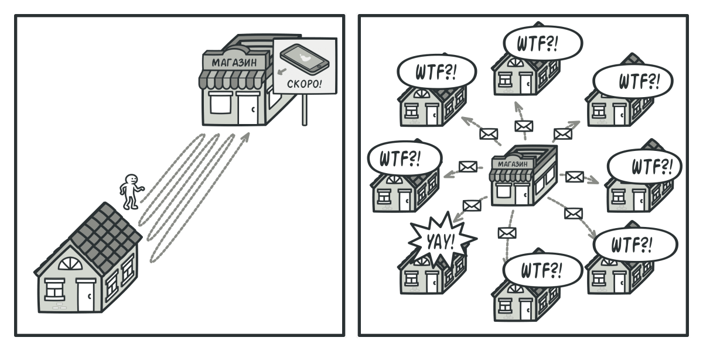
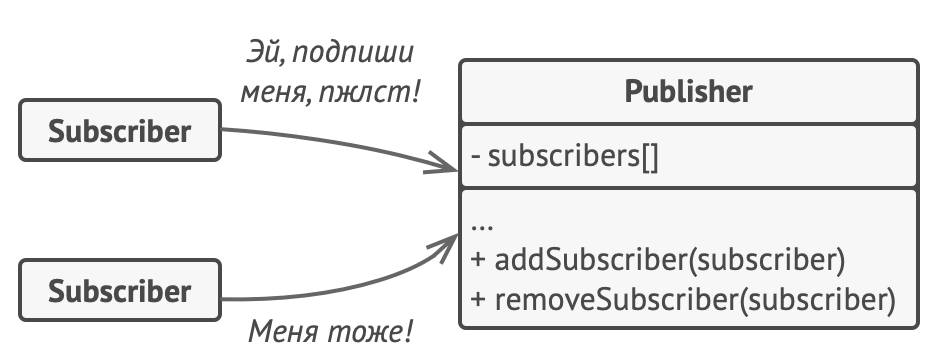
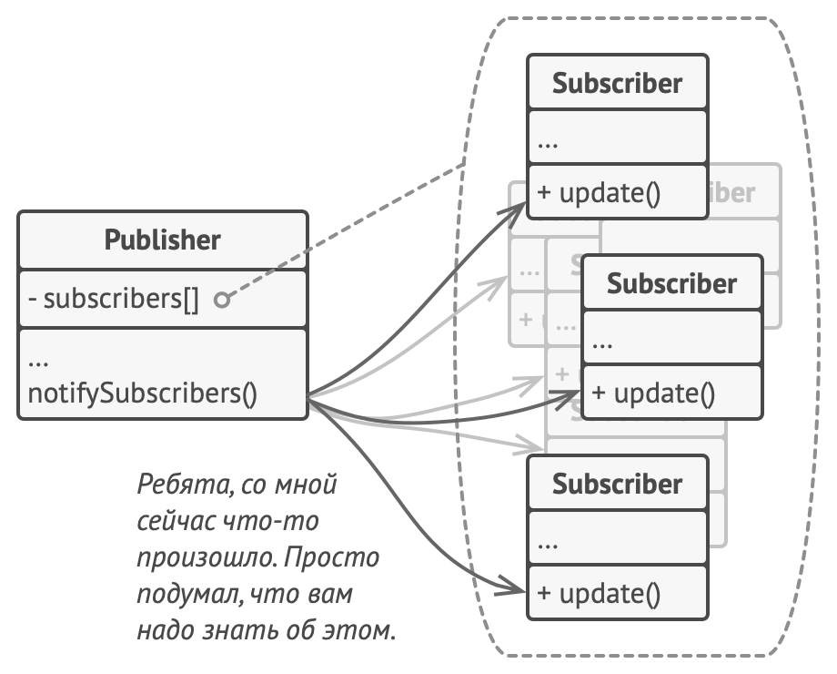

# Наблюдатель

> Также известен как: Издатель-Подписчик, Слушатель, Observer

## Суть паттерна

**Наблюдатель** — это поведенческий паттерн проектирования, который создаёт механизм подписки, позволяющий одним объектам следить и реагировать на события, происходящие в других объектах.


## Проблема

Представьте, что вы имеете два объекта: `Покупатель` и `Магазин`. В магазин вот-вот должны завезти новый товар, который интересен покупателю.

Покупатель может каждый день ходить в магазин, чтобы проверить наличие товара. Но при этом он будет злиться, без толку тратя своё драгоценное время.



*Постоянное посещение магазина или спам?*

С другой стороны, магазин может разослать спам каждому своему покупателю. Многих это расстроит, так как товар специфический, и не всем он нужен.

Получается конфликт: либо покупатель тратит время на периодические проверки, либо магазин тратит ресурсы на бесполезные оповещения.

## Решение
Давайте называть `Издателями` те объекты, которые содержат важное или интересное для других состояние. Остальные объекты, которые хотят отслеживать изменения этого состояния, назовём `Подписчиками`.

Паттерн Наблюдатель предлагает хранить внутри объекта издателя список ссылок на объекты подписчиков, причём издатель не должен вести список подписки самостоятельно. Он предоставит методы, с помощью которых подписчики могли бы добавлять или убирать себя из списка.



*Подписка на события.*

Теперь самое интересное. Когда в издателе будет происходить важное событие, он будет проходиться по списку подписчиков и оповещать их об этом, вызывая определённый метод объектов-подписчиков.

Издателю безразлично, какой класс будет иметь тот или иной подписчик, так как все они должны следовать общему интерфейсу и иметь единый метод оповещения.



*Оповещения о событиях.*

Увидев, как складно всё работает, вы можете выделить общий интерфейс, описывающий методы подписки и отписки, и для всех издателей. После этого подписчики смогут работать с разными типами издателей, а также получать оповещения от них через один и тот же метод.

## Аналогия из жизни


*Подписка на газеты и их доставка.*

После того как вы оформили подписку на газету или журнал, вам больше не нужно ездить в супермаркет и проверять, не вышел ли очередной номер. Вместо этого издательство будет присылать новые номера по почте прямо к вам домой сразу после их выхода.

Издательство ведёт список подписчиков и знает, кому какой журнал высылать. Вы можете в любой момент отказаться от подписки, и журнал перестанет вам приходить.

## Структура


1. **Издатель** владеет внутренним состоянием, изменение которого интересно отслеживать подписчикам. Издатель содержит механизм подписки: список подписчиков и методы подписки/отписки.
2. Когда внутреннее состояние издателя меняется, он оповещает своих подписчиков. Для этого издатель проходит по списку подписчиков и вызывает их метод оповещения, заданный в общем интерфейсе подписчиков.
3. **Подписчик** определяет интерфейс, которым пользуется издатель для отправки оповещения. В большинстве случаев для этого достаточно единственного метода.
4. **Конкретные подписчики** выполняют что-то в ответ на оповещение, пришедшее от издателя. Эти классы должны следовать общему интерфейсу подписчиков, чтобы издатель не зависел от конкретных классов подписчиков.
5. По приходу оповещения подписчику нужно получить обновлённое состояние издателя. Издатель может передать это состояние через параметры метода оповещения. Более гибкий вариант — передавать через параметры весь объект издателя, чтобы подписчик мог сам получить требуемые данные. Как вариант, подписчик может постоянно хранить ссылку на объект издателя, переданный ему в конструкторе.
6. **Клиент** создаёт объекты издателей и подписчиков, а затем регистрирует подписчиков на обновления в издателях.

## Псевдокод

В этом примере **Наблюдатель** позволяет объекту текстового редактора оповещать другие объекты об изменениях своего состояния.


*Пример оповещения объектов о событиях в других объектах.*

Список подписчиков составляется динамически, объекты могут как подписываться на определённые события, так и отписываться от них прямо во время выполнения программы.

В этой реализации редактор не ведёт список подписчиков самостоятельно, а делегирует это вложенному объекту. Это даёт возможность использовать механизм подписки не только в классе редактора, но и в других классах программы.

Для добавления в программу новых подписчиков не нужно менять классы издателей, пока они работают с подписчиками через общий интерфейс.

```c
// Базовый класс-издатель. Содержит код управления подписчиками
// и их оповещения.
class EventManager is
    private field listeners: hash map of event types and listeners

    method subscribe(eventType, listener) is
        listeners.add(eventType, listener)

    method unsubscribe(eventType, listener) is
        listeners.remove(eventType, listener)

    method notify(eventType, data) is
        foreach (listener in listeners.of(eventType)) do
            listener.update(data)

// Конкретный класс-издатель, содержащий интересную для других
// компонентов бизнес-логику. Мы могли бы сделать его прямым
// потомком EventManager, но в реальной жизни это не всегда
// возможно (например, если у класса уже есть родитель). Поэтому
// здесь мы подключаем механизм подписки при помощи композиции.
class Editor is
    public field events: EventManager
    private field file: File

    constructor Editor() is
        events = new EventManager()

    // Методы бизнес-логики, которые оповещают подписчиков об
    // изменениях.
    method openFile(path) is
        this.file = new File(path)
        events.notify("open", file.name)

    method saveFile() is
        file.write()
        events.notify("save", file.name)
    // ...


// Общий интерфейс подписчиков. Во многих языках, поддерживающих
// функциональные типы, можно обойтись без этого интерфейса и
// конкретных классов, заменив объекты подписчиков функциями.
interface EventListener is
    method update(filename)

// Набор конкретных подписчиков. Они реализуют добавочную
// функциональность, реагируя на извещения от издателя.
class LoggingListener implements EventListener is
    private field log: File
    private field message: string

    constructor LoggingListener(log_filename, message) is
        this.log = new File(log_filename)
        this.message = message

    method update(filename) is
        log.write(replace('%s',filename,message))

class EmailAlertsListener implements EventListener is
    private field email: string
    private field message: string

    constructor EmailAlertsListener(email, message) is
        this.email = email
        this.message = message

    method update(filename) is
        system.email(email, replace('%s',filename,message))


// Приложение может сконфигурировать издателей и подписчиков как
// угодно, в зависимости от целей и окружения.
class Application is
    method config() is
        editor = new Editor()

        logger = new LoggingListener(
            "/path/to/log.txt",
            "Someone has opened file: %s");
        editor.events.subscribe("open", logger)

        emailAlerts = new EmailAlertsListener(
            "admin@example.com",
            "Someone has changed the file: %s")
        editor.events.subscribe("save", emailAlerts)
```

## Применимость

**Когда после изменения состояния одного объекта требуется что-то сделать в других, но вы не знаете наперёд, какие именно объекты должны отреагировать.**

Описанная проблема может возникнуть при разработке библиотек пользовательского интерфейса, когда вам надо дать возможность сторонним классам реагировать на клики по кнопкам.

Паттерн Наблюдатель позволяет любому объекту с интерфейсом подписчика зарегистрироваться на получение оповещений о событиях, происходящих в объектах-издателях.

---

**Когда одни объекты должны наблюдать за другими, но только в определённых случаях.**

Издатели ведут динамические списки. Все наблюдатели могут подписываться или отписываться от получения оповещений прямо во время выполнения программы.

## Шаги реализации

1. Разбейте вашу функциональность на две части: независимое ядро и опциональные зависимые части. Независимое ядро станет издателем. Зависимые части станут подписчиками.
2. Создайте интерфейс подписчиков. Обычно в нём достаточно определить единственный метод оповещения.
3. Создайте интерфейс издателей и опишите в нём операции управления подпиской. Помните, что издатель должен работать только с общим интерфейсом подписчиков.
4. Вам нужно решить, куда поместить код ведения подписки, ведь он обычно бывает одинаков для всех типов издателей. Самый очевидный способ — вынести этот код в промежуточный абстрактный класс, от которого будут наследоваться все издатели.<br/>Но если вы интегрируете паттерн в существующие классы, то создать новый базовый класс может быть затруднительно. В этом случае вы можете поместить логику подписки во вспомогательный объект и делегировать ему работу из издателей.
5. Создайте классы конкретных издателей. Реализуйте их так, чтобы после каждого изменения состояния они отправляли оповещения всем своим подписчикам.
6. Реализуйте метод оповещения в конкретных подписчиках. Не забудьте предусмотреть параметры, через которые издатель мог бы отправлять какие-то данные, связанные с происшедшим событием.<br/>Возможен и другой вариант, когда подписчик, получив оповещение, сам возьмёт из объекта издателя нужные данные. Но в этом случае вы будете вынуждены привязать класс подписчика к конкретному классу издателя.
7. Клиент должен создавать необходимое количество объектов подписчиков и подписывать их у издателей.

## Преимущества и недостатки

**Преимущества**

- Издатели не зависят от конкретных классов подписчиков и наоборот.
- Вы можете подписывать и отписывать получателей на лету.
- Реализует [принцип открытости/закрытости.](open_close_principle.md)

**Недостатки**

- Подписчики оповещаются в случайном порядке.

## Примеры реализации паттерна

### Python

- **Сложность**: 2/3
- **Популярность**: 3/3
- **Применимость**: Наблюдатель можно часто встретить в Python коде, особенно там, где применяется событийная модель отношений между компонентами. Наблюдатель позволяет отдельным компонентам реагировать на события, происходящие в других компонентах.
- **Признаки применения паттерна**: Наблюдатель можно определить по механизму подписки и методам оповещения, которые вызывают компоненты программы.

Этот пример показывает структуру паттерна `Наблюдатель`, а именно — из каких классов он состоит, какие роли эти классы выполняют и как они взаимодействуют друг с другом.

**main.py**: Пример структуры паттерна

```python
from __future__ import annotations
from abc import ABC, abstractmethod
from random import randrange
from typing import List


class Subject(ABC):
    """
    Интерфейс издателя объявляет набор методов для управлениями
    подписчиками.
    """

    @abstractmethod
    def attach(self, observer: Observer) -> None:
        """
        Присоединяет наблюдателя к издателю.
        """
        pass

    @abstractmethod
    def detach(self, observer: Observer) -> None:
        """
        Отсоединяет наблюдателя от издателя.
        """
        pass

    @abstractmethod
    def notify(self) -> None:
        """
        Уведомляет всех наблюдателей о событии.
        """
        pass


class ConcreteSubject(Subject):
    """
    Издатель владеет некоторым важным состоянием и оповещает
    наблюдателей о его изменениях.
    """

    _state: int = None
    """
    Для удобства в этой переменной хранится состояние Издателя,
    необходимое всем подписчикам.
    """

    _observers: List[Observer] = []
    """
    Список подписчиков. В реальной жизни список подписчиков может
    храниться в более подробном виде (классифицируется по типу события
    и т.д.)
    """

    def attach(self, observer: Observer) -> None:
        print("Subject: Attached an observer.")
        self._observers.append(observer)

    def detach(self, observer: Observer) -> None:
        self._observers.remove(observer)

    """
    Методы управления подпиской.
    """

    def notify(self) -> None:
        """
        Запуск обновления в каждом подписчике.
        """

        print("Subject: Notifying observers...")
        for observer in self._observers:
            observer.update(self)

    def some_business_logic(self) -> None:
        """
        Обычно логика подписки – только часть того, что делает
        Издатель. Издатели часто содержат некоторую важную
        бизнес-логику, которая запускает метод уведомления всякий раз,
        когда должно произойти что-то важное (или после этого).
        """

        print("\nSubject: I'm doing something important.")
        self._state = randrange(0, 10)

        print(f"Subject: My state has just changed to: {self._state}")
        self.notify()


class Observer(ABC):
    """
    Интерфейс Наблюдателя объявляет метод уведомления, который
    издатели используют для оповещения своих подписчиков.
    """

    @abstractmethod
    def update(self, subject: Subject) -> None:
        """
        Получить обновление от субъекта.
        """
        pass


"""
Конкретные Наблюдатели реагируют на обновления, выпущенные Издателем,
к которому они прикреплены.
"""


class ConcreteObserverA(Observer):
    def update(self, subject: Subject) -> None:
        if subject._state < 3:
            print("ConcreteObserverA: Reacted to the event")


class ConcreteObserverB(Observer):
    def update(self, subject: Subject) -> None:
        if subject._state == 0 or subject._state >= 2:
            print("ConcreteObserverB: Reacted to the event")


if __name__ == "__main__":
    # Клиентский код.

    subject = ConcreteSubject()

    observer_a = ConcreteObserverA()
    subject.attach(observer_a)

    observer_b = ConcreteObserverB()
    subject.attach(observer_b)

    subject.some_business_logic()
    subject.some_business_logic()

    subject.detach(observer_a)

    subject.some_business_logic()
```

**Output.txt**: Результат выполнения

```text
Subject: Attached an observer.
Subject: Attached an observer.

Subject: I'm doing something important.
Subject: My state has just changed to: 0
Subject: Notifying observers...
ConcreteObserverA: Reacted to the event
ConcreteObserverB: Reacted to the event

Subject: I'm doing something important.
Subject: My state has just changed to: 5
Subject: Notifying observers...
ConcreteObserverB: Reacted to the event

Subject: I'm doing something important.
Subject: My state has just changed to: 0
Subject: Notifying observers...
ConcreteObserverB: Reacted to the event
```

### PHP

- **Сложность**: 2/3
- **Популярность**: 3/3
- **Применимость**: Наблюдатель можно часто встретить в PHP коде, особенно там, где применяется событийная модель отношений между компонентами. Наблюдатель позволяет отдельным компонентам реагировать на события, происходящие в других компонентах. <br/>PHP имеет несколько встроенных интерфейсов (SplSubject, SplObserver), на которых можно строить свои реализации Наблюдателя, совместимые с остальным PHP-кодом.
- **Признаки применения паттерна**: Наблюдатель можно определить по механизму подписки и методам оповещения, которые вызывают компоненты программы.

<tabs>
<tab title="Концептуальный пример">
<h4 id="observer-php-concept">Концептуальный пример</h4>
<p>Этот пример показывает структуру паттерна <b>Наблюдатель</b>, а именно — из каких классов он состоит, какие роли эти классы выполняют и как они взаимодействуют друг с другом.</p>
<p>После ознакомления со структурой, вам будет легче воспринимать второй пример, который рассматривает реальный случай использования паттерна в мире PHP.</p>
<p><b>index.php</b>: Пример структуры паттерна</p>
<code-block lang="php">
<![CDATA[
namespace RefactoringGuru\Observer\Conceptual;

/**
* PHP имеет несколько встроенных интерфейсов, связанных с паттерном
* Наблюдатель.
*
* Вот как выглядит интерфейс Издателя:
*
* @link http://php.net/manual/ru/class.splsubject.php
*
*     interface SplSubject
*     {
*         // Присоединяет наблюдателя к издателю.
*         public function attach(SplObserver $observer);
*
*         // Отсоединяет наблюдателя от издателя.
*         public function detach(SplObserver $observer);
*
*         // Уведомляет всех наблюдателей о событии.
*         public function notify();
*     }
*
* Также имеется встроенный интерфейс для Наблюдателей:
*
* @link http://php.net/manual/ru/class.splobserver.php
*
*     interface SplObserver
*     {
*         public function update(SplSubject $subject);
*     }
*/

/**
* Издатель владеет некоторым важным состоянием и оповещает наблюдателей о его
* изменениях.
*/

class Subject implements \SplSubject
{
    /**
    * @var int Для удобства в этой переменной хранится состояние Издателя,
    * необходимое всем подписчикам.
    */
    public $state;

    /**
    * @var \SplObjectStorage Список подписчиков. В реальной жизни список
    * подписчиков может храниться в более подробном виде (классифицируется по
    * типу события и т.д.)
    */
    private $observers;

    public function __construct()
    {
        $this->observers = new \SplObjectStorage();
    }

    /**
    * Методы управления подпиской.
    */
    public function attach(\SplObserver $observer): void
    {
        echo "Subject: Attached an observer.\n";
        $this->observers->attach($observer);
    }

    public function detach(\SplObserver $observer): void
    {
        $this->observers->detach($observer);
        echo "Subject: Detached an observer.\n";
    }

    /**
    * Запуск обновления в каждом подписчике.
    */
    public function notify(): void
    {
        echo "Subject: Notifying observers...\n";
        foreach ($this->observers as $observer) {
            $observer->update($this);
        }
    }

    /**
    * Обычно логика подписки – только часть того, что делает Издатель. Издатели
    * часто содержат некоторую важную бизнес-логику, которая запускает метод
    * уведомления всякий раз, когда должно произойти что-то важное (или после
    * этого).
    */
    public function someBusinessLogic(): void
    {
        echo "\nSubject: I'm doing something important.\n";
        $this->state = rand(0, 10);
        
        echo "Subject: My state has just changed to: {$this->state}\n";
        $this->notify();
    }
}

/**
* Конкретные Наблюдатели реагируют на обновления, выпущенные Издателем, к
* которому они прикреплены.
*/ 

class ConcreteObserverA implements \SplObserver
{
    public function update(\SplSubject $subject): void
    {
        if ($subject->state < 3) {
            echo "ConcreteObserverA: Reacted to the event.\n";
        }
    }
}

class ConcreteObserverB implements \SplObserver
{
    public function update(\SplSubject $subject): void
    {
        if ($subject->state == 0 || $subject->state >= 2) {
            echo "ConcreteObserverB: Reacted to the event.\n";
        }
    }
}

/**
* Клиентский код.
*/

$subject = new Subject();

$o1 = new ConcreteObserverA();
$subject->attach($o1);

$o2 = new ConcreteObserverB();
$subject->attach($o2);

$subject->someBusinessLogic();
$subject->someBusinessLogic();

$subject->detach($o2);

$subject->someBusinessLogic();

]]>
</code-block>
<p><b>Output.txt</b>: Результат выполнения</p>
<code-block lang="text">
<![CDATA[
Subject: Attached an observer.
Subject: Attached an observer.

Subject: I'm doing something important.
Subject: My state has just changed to: 2
Subject: Notifying observers...
ConcreteObserverA: Reacted to the event.
ConcreteObserverB: Reacted to the event.

Subject: I'm doing something important.
Subject: My state has just changed to: 4
Subject: Notifying observers...
ConcreteObserverB: Reacted to the event.
Subject: Detached an observer.

Subject: I'm doing something important.
Subject: My state has just changed to: 1
Subject: Notifying observers...
ConcreteObserverA: Reacted to the event.

]]>
</code-block>
</tab>
<tab title="Пример из реальной жизни">
<h4 id="observer-php-real">Пример из реальной жизни</h4>
<p>В этом примере паттерн **Наблюдатель** позволяет различным объектам наблюдать за событиями, происходящими в пользовательском репозитории приложения.</p>
<p>Репозиторий генерирует различные типы событий и позволяет наблюдателям прослушивать их все, а так же лишь отдельные из них.</p>
<p><b>index.php</b>: Пример из реальной жизни</p>
<code-block lang="php">
<![CDATA[
namespace RefactoringGuru\Observer\RealWorld;

/**
* Пользовательский репозиторий представляет собой Издателя. Различные объекты
* заинтересованы в отслеживании его внутреннего состояния, будь то добавление
* нового пользователя или его удаление.
*/

class UserRepository implements \SplSubject
{
    /**
    * @var array Список пользователей.
    */
    private $users = [];

    // Здесь находится реальная инфраструктура управления Наблюдателя. Обратите
    // внимание, что это не всё, за что отвечает наш класс. Его основная бизнес-
    // логика приведена ниже этих методов.

    /**
    * @var array
    */
    private $observers = [];

    public function __construct()
    {
        // Специальная группа событий для наблюдателей, которые хотят слушать
        // все события.
        $this->observers["*"] = [];
    }
    
    private function initEventGroup(string $event = "*"): void
    {
        if (!isset($this->observers[$event])) {
            $this->observers[$event] = [];
        }
    }

    private function getEventObservers(string $event = "*"): array
    {
        $this->initEventGroup($event);
        $group = $this->observers[$event];
        $all = $this->observers["*"];
        return array_merge($group, $all);
    }

    public function attach(\SplObserver $observer, string $event = "*"): void
    {
        $this->initEventGroup($event);
        $this->observers[$event][] = $observer;
    }

    public function detach(\SplObserver $observer, string $event = "*"): void
    {
        foreach ($this->getEventObservers($event) as $key => $s) {
            if ($s === $observer) {
                unset($this->observers[$event][$key]);
            }
        }
    }

    public function notify(string $event = "*", $data = null): void
    {
        echo "UserRepository: Broadcasting the '$event' event.\n";
        foreach ($this->getEventObservers($event) as $observer) {
            $observer->update($this, $event, $data);
        }
    }

    // Вот методы, представляющие бизнес-логику класса.

    public function initialize($filename): void
    {
        echo "UserRepository: Loading user records from a file.\n";
        // ...
        $this->notify("users:init", $filename);
    }

    public function createUser(array $data): User
    {
        echo "UserRepository: Creating a user.\n";
    
        $user = new User();
        $user->update($data);
        
        $id = bin2hex(openssl_random_pseudo_bytes(16));
        $user->update(["id" => $id]);
        $this->users[$id] = $user;
        
        $this->notify("users:created", $user);
        
        return $user;
    }

    public function updateUser(User $user, array $data): User
    {
        echo "UserRepository: Updating a user.\n";

        $id = $user->attributes["id"];
        if (!isset($this->users[$id])) {
            return null;
        }
        
        $user = $this->users[$id];
        $user->update($data);
        
        $this->notify("users:updated", $user);
        
        return $user;
    }

    public function deleteUser(User $user): void
    {
        echo "UserRepository: Deleting a user.\n";

        $id = $user->attributes["id"];
        if (!isset($this->users[$id])) {
            return;
        }
        
        unset($this->users[$id]);
        
        $this->notify("users:deleted", $user);
    }
}

/**
* Давайте сохраним класс Пользователя тривиальным, так как он не является
* главной темой нашего примера.
*/

class User
{
    public $attributes = [];
    
    public function update($data): void
    {
        $this->attributes = array_merge($this->attributes, $data);
    }
}

/**
* Этот Конкретный Компонент регистрирует все события, на которые он подписан.
*/

class Logger implements \SplObserver
{
    private $filename;
    
    public function __construct($filename)
    {
        $this->filename = $filename;
        if (file_exists($this->filename)) {
            unlink($this->filename);
        }
    }
    
    public function update(\SplSubject $repository, string $event = null,
        $data = null): void
    {
        $entry = date("Y-m-d H:i:s") . ": '$event' with data '" .
            json_encode($data) . "'\n";
        file_put_contents($this->filename, $entry, FILE_APPEND);
    
        echo "Logger: I've written '$event' entry to the log.\n";
    }
}

/**
* Этот Конкретный Компонент отправляет начальные инструкции новым
* пользователям. Клиент несёт ответственность за присоединение этого компонента
* к соответствующему событию создания пользователя.
*/ 

class OnboardingNotification implements \SplObserver
{
    private $adminEmail;
    
    public function __construct($adminEmail)
    {
        $this->adminEmail = $adminEmail;
    }
    
    public function update(\SplSubject $repository, string $event = null,
        $data = null): void
    {
        // mail($this->adminEmail,
        //     "Onboarding required",
        //     "We have a new user. Here's his info: " .json_encode($data));
        
        echo "OnboardingNotification: The notification has been emailed!\n";
    }
}

/**
* Клиентский код.
*/

$repository = new UserRepository();
$repository->attach(new Logger(__DIR__ . "/log.txt"), "*");
$repository->attach(new OnboardingNotification("1@example.com"), "users:created");

$repository->initialize(__DIR__ . "/users.csv");

// ...

$user = $repository->createUser([
    "name" => "John Smith",
    "email" => "john99@example.com",
]);

// ...

$repository->deleteUser($user);

]]>
</code-block>
<p><b>Output.txt</b>: Результат выполнения</p>
<code-block lang="plain text">
<![CDATA[
UserRepository: Loading user records from a file.
UserRepository: Broadcasting the 'users:init' event.
Logger: I've written 'users:init' entry to the log.
UserRepository: Creating a user.
UserRepository: Broadcasting the 'users:created' event.
OnboardingNotification: The notification has been emailed!
Logger: I've written 'users:created' entry to the log.
UserRepository: Deleting a user.
UserRepository: Broadcasting the 'users:deleted' event.
Logger: I've written 'users:deleted' entry to the log.

]]>
</code-block>
</tab>
</tabs>