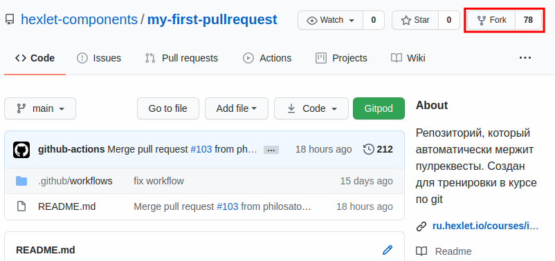
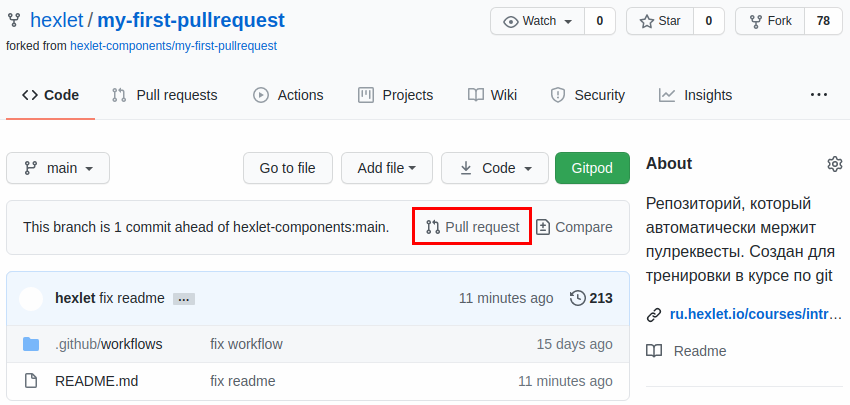

# Открытые проекты

Как и все программисты, каждый день мы пользуемся программным обеспечением с открытым исходным кодом. В этом уроке мы обсудим, что это такое. Вы узнаете, чем открытый код полезен программисту.

**Проекты с открытым исходным кодом** или **OpenSource** (*Open Source Software*, *OSS*) — это программное обеспечение с общедоступным кодом. Любой пользователь может увидеть код, а в большинстве случаев — даже повлиять на него.

К такому ПО относятся:

- Прикладные сервисы, как VSCode или Git
- Огромное число библиотек в нашем коде
- Практически все современные языки программирования

Современные проекты огромны:

- Linux (> 12 000 000 строк кода)
- Chromium (> 16 000 000 строк кода)

Та скорость, с которой разрабатываются такие крупные проекты, возможна благодаря программам и библиотекам с открытым исходным кодом.

Откуда вообще берутся опенсорс-проекты, и почему они так популярны? Почти всегда такой код появляется как побочный продукт разработки других проектов. Например, в процессе разработки Linux появилась необходимость в удобной программе для управления версиями — так появился Git.

Но почему его код был открыт? Ответ достаточно простой. Удачные проекты привлекают множество разработчиков, которые помогают им развиваться. Они пишут отчеты об ошибках, присылают исправления и даже становятся полноправными разработчиками. И все это бесплатно. Разработчики удовлетворяют свое эго и радуются тому, что создают нечто новое и вообще помогают этой Вселенной. Как побочный эффект, такие разработчики гораздо легче находят работу и имеют более прокачанные навыки кодирования, чем их коллеги, которые не работают с открытыми проектами.

Если вы вернетесь в прошлое и посмотрите, сколько людей раньше работало над опенсорс-проектами, то вы увидите огромный разрыв с современным положением дел.

Сложное включение в разработку, сложное принятие изменений — вот неполный перечень проблем, с которыми сталкивались участники опенсорс-движения. Раньше было нормой, что люди выступали с докладами на конференциях, где час описывали правила принятия людей и кода от них в проект.

Сейчас присоединиться к опенсорс-проекту можно за пару минут. Можно начать где-то участвовать, не нужно прилагать практически никаких усилий. Случилось это благодаря двум составляющим: Git и GitHub.

Один из важнейших механизмов GitHub — запрос на включение изменений. Коротко его называют **пулреквест** (*pull request*). Именно этот механизм позволяет легко и непринужденно вливаться в разработку любых проектов.

Допустим, работая с определенной библиотекой, мы заметили ошибку в коде или документации. Пройдемся по шагам, которые необходимо выполнить для исправления этой ошибки. Наша конечная цель — чтобы разработчики библиотеки приняли код.

## Клонирование

Первым шагом создаем копию репозитория в своем аккаунте. Делается это буквально одной кнопкой *Fork* на странице репозитория:

После этого действия в вашем аккаунте окажется репозиторий с таким же именем. GitHub знает, что это копия оригинального репозитория, и помечает его особым образом.

Дальше все как обычно. Мы клонируем репозиторий на компьютер и производим необходимые изменения. Хорошей практикой считается делать изменения в отдельной ветке, созданной от ветки main.

## Запрос на включение изменений кода

После того как мы залили изменения на GitHub, в его интерфейсе произойдут изменения. На странице склонированного репозитория появится кнопка *Pull request*:

Если ее нажать, то откроется страница, на которой можно указать название пулреквеста и его описание.

После отправки пулреквеста в оригинальном репозитории на странице *Pull requests* отобразится ваш запрос. Теперь остается ждать, когда разработчики библиотеки рассмотрят пулреквест. В итоге они:

- Либо примут реквест
- Либо отклонят его
- Либо зададут уточняющие вопросы и предложат доработать реквест

## Исправления прямо на GitHub

В более простых ситуациях, когда достаточно исправить текст или опечатку, GitHub позволяет сделать пулреквест прямо из своего интерфейса.

Для этого достаточно открыть любой файл проекта и нажать на иконку редактирования. После завершения редактирования GitHub сам предложит создать пулреквест с этим изменением.

### Дополнительные материалы

<video src="https://www.youtube.com/watch?v=pUT3mx1ZRUM" />
