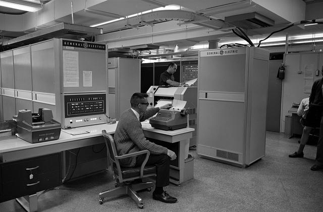
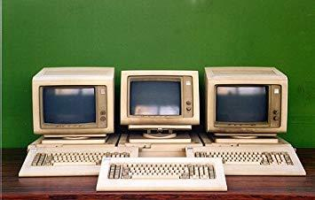
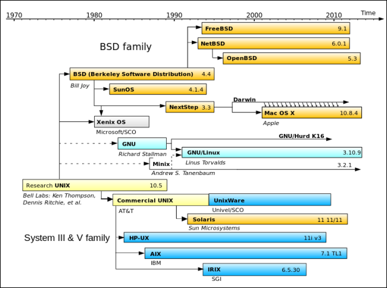
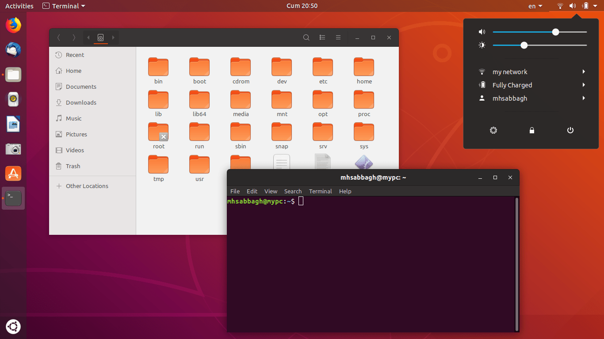

# Операционные системы

В этом уроке мы начнем изучать командную строку с истории ее появления.

## Как появилась командная строка

Все началось в 1970-х годах. В те времена не существовало ни привычной Windows, ни персональных компьютеров. Компьютерами называли **мейнфреймы** — большие машины, занимающие целые этажи зданий:

В то же время на свет появилась **Unix** — операционная система, написанная на языке Си и предназначенная для работы на мейнфреймах. Ключевая ее особенность — это многопользовательский режим. Дело в том, что тогда компьютеры были редкостью, поэтому у каждого мейнфрейма было множество пользователей одновременно.

Unix позволяла подключаться к мейнфрейму через **терминалы** — специальные устройства, которые служили двум задачам:

- Ввод информации (клавиатура)
- Вывод информации (монитор)

При этом вся обработка выполнялась на отдельном сервере. Сам терминал выглядел так:

Unix оказалась очень удачной операционной системой, но была платной и **закрытой**. Другими словами, никто не мог посмотреть ее исходный код.

Со временем на основе Unix создавались новые системы, которые теряли обратную совместимость. Другими словами, разработчикам приходилось писать отдельную программу под каждую операционную систему.

Такая ситуация усложняла жизнь всем, поэтому был принят стандарт **POSIX** (Portable Operating System Interface for UNIX). Сейчас это не один стандарт, а целое семейство стандартов. Оно описывает работу ключевых компонентов операционной системы и способов взаимодействия с ними из программ, написанных на Си.

## Операционная система Linux

В те же времена начали активно развиваться сети. Сначала появились прообразы интернета, а затем и сам интернет. Компьютеры становились меньше, а серверов — все больше. В 1991 году студент Линус Торвальдс решил написать собственную операционную систему, которая совместима со стандартом POSIX.

Благодаря интернету, Линус собрал целое сообщество разработчиков, которые довольно быстро создали рабочую операционную систему под названием **Linux** и выложили ее исходный код в открытый доступ. С тех пор популярность Linux для серверного окружения быстро росла.

Но сам Linux — это только ядро операционной системы, которое не получится использовать без сопутствующих программ.

Когда Линус начал свою разработку, уже существовал проект **GNU**, основанный Ричардом Столлманом. В рамках этого проекта уже были разработаны свободные программы, составляющие основной инструментарий разработчика программ на языке Си:

- Текстовый редактор **Emacs**
- Компилятор языка Си **gcc**
- Командная оболочка **bash**
- Библиотека важнейших функций для программ на Си **libc**

Все эти программы были написаны для операционных систем, похожих на Unix. Поэтому в них использовались стандартные для UNIX системные вызовы — POSIX. Благодаря этому, Linux сразу начал поставляться с утилитами — например, архиваторами или командной оболочкой bash, которую мы начнем изучать в этом курсе.

Удивительный факт для тех, кто знаком только с Windows — Linux не имеет своей графической оболочки. Именно поэтому Linux может выглядеть очень по-разному, ведь на него можно поставить множество разных графических оболочек:

Сейчас Linux не используется в чистом виде. Вместо этого конечные пользователи имеют дело с **дистрибутивами**. Дистрибутив включает в себя:

- Сам Linux
- GNU-программы
- Утилиты для установки и настройки Linux
- Поддержку регулярного обновления самого ядра и его окружения

Существует очень много дистрибутивов, но некоторые из них особо популярны. Одни делаются энтузиастами, за другими стоят большие компании. Самый популярный дистрибутив — это полностью бесплатная операционная система [Ubuntu](https://ubuntu.com):

Также популярны разновидности Ubuntu:

- Ubuntu Server, оптимизированный для работы на серверах
- Xubuntu, оптимизированная для маломощных компьютеров

В отличие от Unix-подобных операционных систем, Windows изначально создавалась для однопользовательского режима и никогда не пыталась быть совместимой с POSIX. Ей удалось захватить рынок персональных компьютеров, но на серверах она почти не встречается, несмотря на существование Windows Server.

Windows редко ставят на сервера, потому что она платная, и совсем не совместима с POSIX. При этом у Windows есть командная строка `cmd.exe`, но ее функциональность отличается от командной строки Linux, в ней используются другие команды. Опыт работы с ней не сильно поможет при работе в Linux-окружении, с которым все равно придется столкнуться.

Мы рекомендуем осваивать Linux и его командную строку через полное погружение. Для этого надо установить Ubuntu основной системой или [активировать](https://guides.hexlet.io/ru/ubuntu-linux-in-windows/?_gl=1*1nvdhnj*_ga*MTExOTQzMTcyNC4xNzAwNTc4NDA3*_ga_PM3R85EKHN*MTcwMTM0ODI2My44LjEuMTcwMTM0OTc0OC4wLjAuMA..*_ga_WWGZ6EVHEY*MTcwMTM0ODY5My4xMC4xLjE3MDEzNDk2ODguNjAuMC4w) ее внутри Windows.

Если вы пользуетесь macOS, то можно ничего не делать — эта операционная система основана на Unix и считается даже более POSIX-совместимой, чем Linux. У нее прекрасная командная строка и инструментарий для работы.

Далее в курсе все примеры работы с командной строкой мы будем показывать исключительно на POSIX-совместимых операционных системах.

### Самостоятельная работа

- Если у вас Windows, настройте окружение в соответствие с [гайдом](https://guides.hexlet.io/ru/ubuntu-linux-in-windows/?_gl=1*1nvdhnj*_ga*MTExOTQzMTcyNC4xNzAwNTc4NDA3*_ga_PM3R85EKHN*MTcwMTM0ODI2My44LjEuMTcwMTM0OTc0OC4wLjAuMA..*_ga_WWGZ6EVHEY*MTcwMTM0ODY5My4xMC4xLjE3MDEzNDk2ODguNjAuMC4w) на эту тему.
- Когда вы будете добавлять пароль учетной записи Ubuntu, вы не увидите никаких символов — даже привычных *\*\*. Не стоит переживать — эта особенность терминала Linux продиктована соображениями безопасности.

### Дополнительные материалы

1. [Установка Ubuntu основной системой](https://help.ubuntu.name/wiki/ubuntu_install)
2. [Установка Ubuntu на Windows](https://guides.hexlet.io/ru/ubuntu-linux-in-windows/?_gl=1*1p7sjdn*_ga*MTExOTQzMTcyNC4xNzAwNTc4NDA3*_ga_PM3R85EKHN*MTcwMTM0ODI2My44LjEuMTcwMTM0OTc0OC4wLjAuMA..*_ga_WWGZ6EVHEY*MTcwMTM0ODY5My4xMC4xLjE3MDEzNDk2ODguNjAuMC4w)
3. [Книги по операционным системам](https://ru.hexlet.io/pages/recommended-books)
4. [История Linux](https://www.youtube.com/watch?v=n1F_MfLRlX0&pp=ygUNcmV2b2x1dGlvbiBvcw%3D%3D)

### Вопросы для самопроверки

**Кто заложил идею создания Linux?**

- Линус Торвальдс
- Общество любителей пушистых котят
- Разработчики, которых не удовлетворял Windows

**Что такое «Проект GNU»?**

- Секретный военный проект, в рамках которого разработаны дистрибутивы Linux
- Открытый проект, в котором разработано множество программ, входящих в дистрибутивы Linux
- Устаревший текстовый редактор, в котором раньше разрабатывали открытые проекты

**Выберите верные утверждения:**

- Операционная система Ubuntu не считается Linux-дистрибутивом, потому что в ней нет ядра Linux
- Любая программа, написанная для Linux, будет без перебоев работать на Windows
- Невозможно использовать Linux на десктопе как офисную рабочую станцию без GNU-программ
- Дистрибутивы Linux в своей основе содержат ядро Linux и отличаются только дополнительными программами