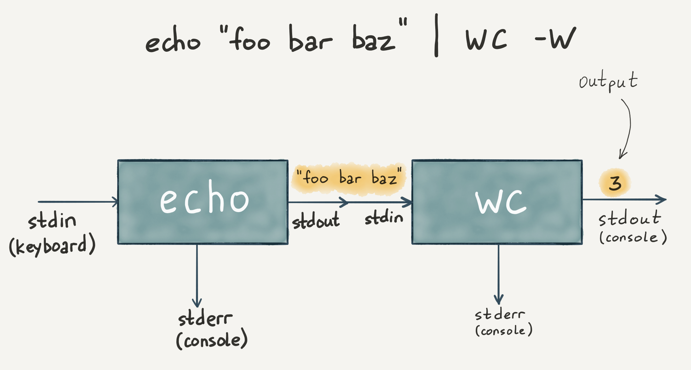

# Пайплайн

Вы уже знаете, что у одного процесса есть вход, а у другого — выход. При этом их можно подменять. Логично предположить, что их можно и соединить. Этот подход носит название **пайплайн** (от англ. *pipeline*). Именно пайплайнам мы уделим внимание в этом уроке.

Благодаря пайплайну можно соединять программы и протаскивать данные сквозь них. Получается цепочка функций, в которой каждое звено выступает в роли преобразователя или фильтра.

Когда мы учились грепать, то делали это по какому-то одному слову. Но часто возникает задача погрепать по нескольким словам. Не важно, как они расположены внутри строки, главное, что они встречаются там вместе.

Такую функциональность можно было бы сделать, усложнив саму программу `grep`. Но пайплайн позволяет добиться такого же поведения без необходимости писать сложную программу:

```bash
grep alias .bashrc | grep color

# enable color support of handy aliases
alias grep='grep --color=auto'
alias fgrep='fgrep --color=auto'
alias egrep='egrep --color=auto'
```

Обратите внимание на `|` — этот символ называется **пайп**. Он указывает, что командная оболочка должна взять поток STDOUT одного процесса и соединить его с потоком STDIN другого процесса.

Все утилиты, которые читают файлы, могут принимать данные через поток STDIN. Поскольку утилита `grep` принимает на вход и возвращает текст, то его можно комбинировать бесконечно:



Запись `grep alias .bashrc | grep color` можно изменить, используя перенаправление. Так она станет проще для модификации:

```bash
cat .bashrc | grep alias | grep color
```
В примере выше файл читается катом и отправляется в поток STDIN грепа.

Еще один пример:

[](https://asciinema.org/a/9Xb9BQi5GEWabm0bATlG2SOV7/iframe?preload=1&cols=120&rows=17)

```bash
cat source | grep Dog | uniq | sort
```

Посмотрим, как этот пример работает по шагам:

1. Читается файл source
2. Грепаются входные данные по подстроке `Dog`
3. Убираются дубли (в исходном файле две одинаковых строки `Dog`)
4. Сортируются входные данные и выводятся на экран

Пайплайн стал основой философии Unix, которая звучит так:

- Пишите программы, которые делают что-то одно и делают это хорошо
- Пишите программы, которые бы работали вместе
- Пишите программы, которые бы поддерживали текстовые потоки, поскольку это универсальный интерфейс
- Именно поэтому большинство утилит работают с сырым текстом — принимают его на вход и возвращают в поток STDOUT.

Такой подход позволяет получать сложное поведение из крайне простых составных блоков. Такая концепция называется **стандартные интерфейсы** и хорошо отражена в конструкторах Lego.

### Вопросы для самопроверки

**Зачем нужен пайплайн?**

- Чтобы записывать вывод - утилит в файл
- Чтобы читать данные из файла и передавать их в утилиты
- Чтобы создавать цепочки преобразований и применять разные утилиты последовательно

**Что должна делать утилита, чтобы поддерживать пайплайн?**

- Принимать данные через STDIN
- Выводить результат работы в STDOUT
- Записывать результат работы в файл
- Читать данные из файла

**Можно ли в рамках пайплайна соединить утилиту саму с собой?**

- Нет, в пайплайне можно объединять только разные программы
- Да, утилиту можно соединить саму с собой
- Да, но только если эта утилита встречается в начале и конце цепочки