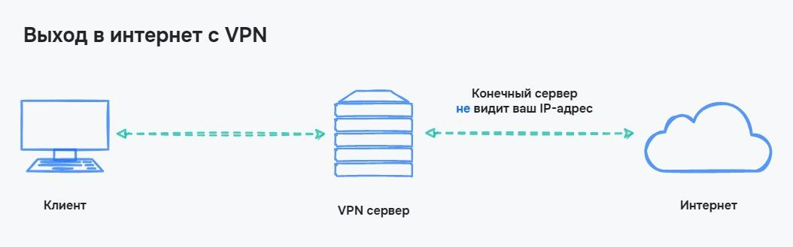
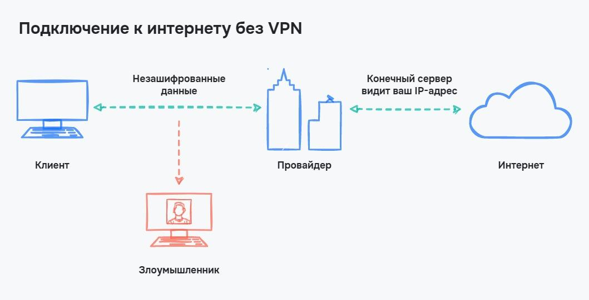
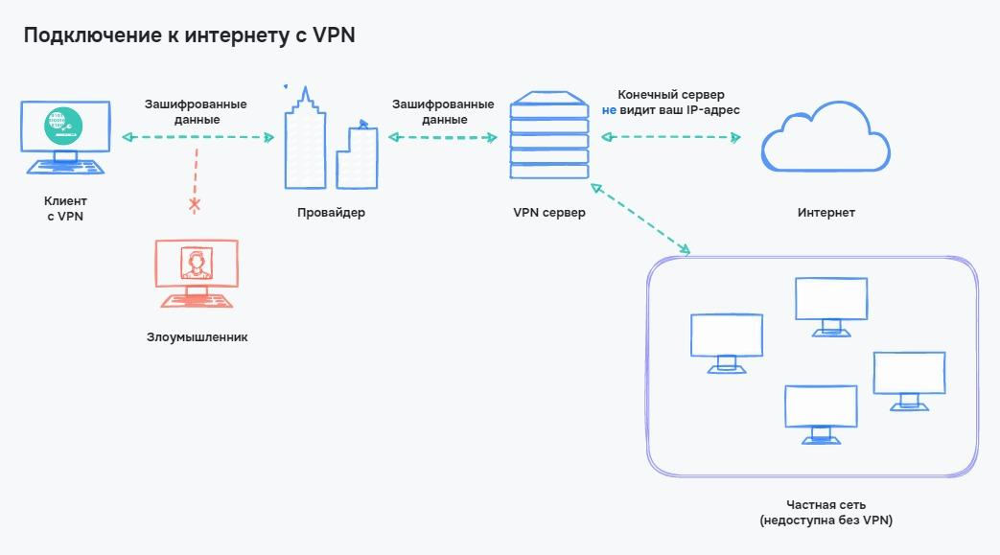
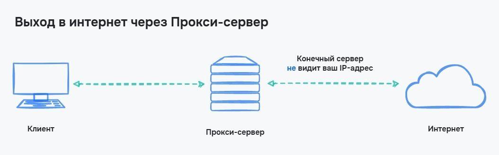
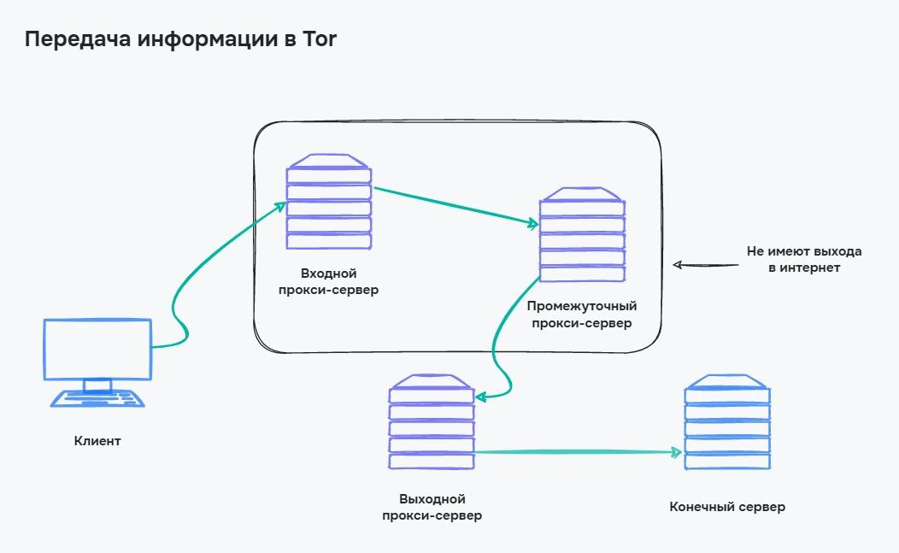
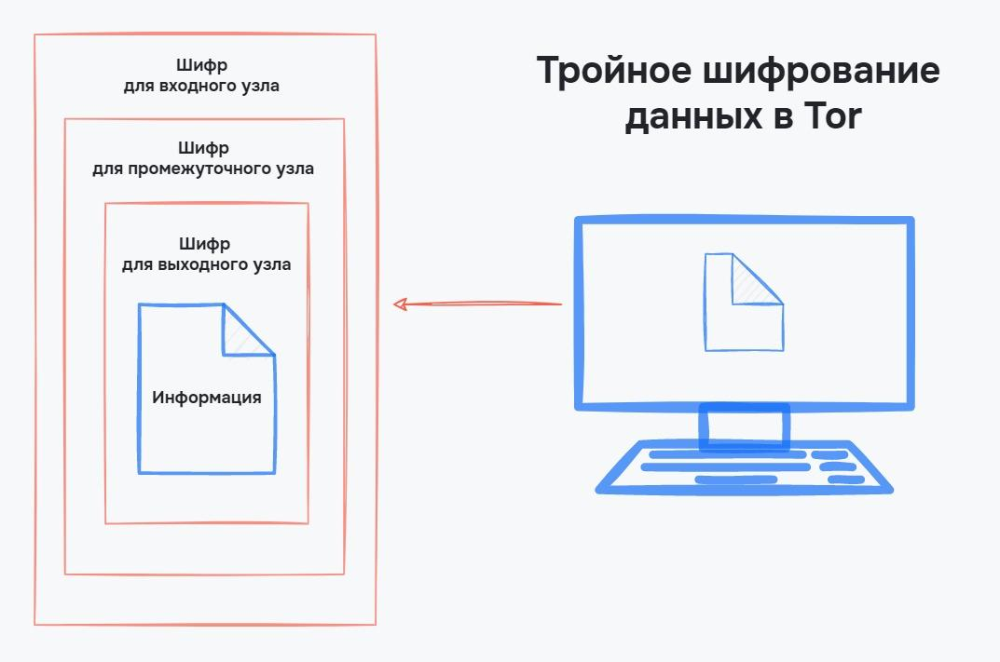

# Приватность и безопасность в интернете

Пользователи интернета оставляют множество цифровых следов: личная информация, данные о посещении сайтов, фотографии и адреса. Всё это может подтолкнуть мошенников к действиям. Поэтому не всегда хочется оставлять информацию о посещении тех или иных сайтов.

Риски, которые связаны с распространением личной информации, достаточно велики. Мошенники могут украсть нашу личность — выдать себя за нас и ввести в заблуждение друзей. Чтобы уменьшить свой цифровой след и риски мошенничества, используются методики приватности.

В этом уроке мы разберем, какие методы обеспечения приватности используются, и правда ли, что в интернете нет полной анонимности. Также узнаем о VPN, прокси и TOR.

## Бдительность

Все техники имеют значение при соблюдении бдительности. В уроке про HTTPS мы уже упоминали, что общественные Wi-Fi сети представляют угрозу из-за атаки Man-in-the-Middle. А важная информация обязательно должна передаваться через протокол HTTPS.

Это первый пункт обеспечения безопасности — следите за тем, где и куда вы передаете свои данные. Если не уверены в сервисе или соединении — не отправляйте данные.

Если вы хотите узнать, какой цифровой след уже оставили в интернете, то попробуйте использовать поисковые системы Google или Yandex. Если ввести свой псевдоним или номер телефона, то поисковик покажет, на каких сайтах находятся эти данные. Так можно найти и информацию, которую мы совсем не ожидаем увидеть.

## Приватный просмотр

У браузеров есть встроенная функция приватного просмотра или «Режим Инкогнито». В браузере Google Chrome для этого используется сочетание клавиш <shortcut>Ctrl + Shift + N</shortcut>.

В этом режиме браузер не сохраняет данные о переходах и куки. Все наши действия существуют до момента закрытия режима. Разработчики предупреждают, что в этом случае наши действия могут фиксироваться провайдерами, но для сайтов мы всегда новый пользователь, о котором он ничего не знает.

При этом в режиме инкогнито сохраняются все правила для активных и пассивных цифровых следов — сайты могут собирать информацию о браузере, получают IP-адрес, а все наши входы в социальные сети будут отслеживаться так же, как и в обычном режиме.

Инкогнито полезно, если мы не хотим сохранять историю браузера и куки сайта. Например, если нужно зайти на сайт с чужого компьютера. Но даже это не является гарантией безопасности — не стоит забывать про бдительность

## Сетевые методы приватности

Бдительность и режим инкогнито не обеспечивают приватность в интернете — мы используем тот же компьютер, с тем же IP-адресом.

Чтобы обеспечить безопасность и анонимность, используются сетевые методы, которые основаны на изменении сетевого подключения. К таким методам относятся:

- **VPN** — Virtual Private Network или виртуальная приватная сеть. Безопасность обеспечивается созданием приватной сети поверх интернета. В этом случае пересылаемые данные не отслеживаются в интернете, а могут дополнительно шифроваться
- **Прокси — сервер**, через который проходит информация в интернете. Мы посылаем информацию на сервис, она проходит через прокси-сервер и передается дальше. Так скрывается настоящий отправитель
- **Tor** — технология анонимного обмена информации. Информация пересылается через множество серверов и постоянно шифруется. Так образуется большая цепь серверов между клиентом и конечным сервером, на который и посылается информация

Разберем подробнее эти методы и технологии обеспечения приватности.

## VPN

Представьте секретную организацию, например, «Федерация любителей отдохнуть в пятницу». В этой организации проводятся анонимные опросы, составляются планы, выделяются внутренние бюджеты. Всё это корпоративная тайна, которая не должна попасть в чужие руки. В организации сотрудники работают из дома. Их приоритет — безопасная пересылка данных по интернету.

Можно шифровать информацию, использовать непопулярные сервисы или использовать одноразовую почту. Можно придумать разные способы, но все они имеют недостаток — данные находятся в интернете и их можно перехватить.

Чтобы решить такую проблему, была придумана технология VPN или частной виртуальной сети. При этом всё настраивается так, что на рабочие серверы можно попасть только через виртуальную сеть.

Сам по себе VPN — это сервер, к которому пользователи подключаются в частную сеть. Из этой сети и происходят запросы в интернет или ко внутренним ресурсам сети. Так как подключение к интернету происходит не от клиента, а от VPN сервера, то VPN используют для обхода блокировок сайтов или приложений в интернете:

Безопасность всей системы обеспечивается шифрованием еще до перехода данных к провайдеру. Значит, нет мест, где можно перехватить передаваемую информацию. Чтобы увидеть это, проиллюстрируем процесс подключения без VPN и с ним:

При использовании VPN конечный сервер, на который передаются данные, не видит ни наш IP-адрес, ни нашу геолокацию. Теперь понятно, что обозначают слова в аббревиатуре VPN:

- Virtual — виртуальная. На базе сервера VPN возможно объединить несколько компьютеров в единую сеть, как если бы создавалась обычная локальная сеть. Разница в способе подключения — компьютеры могут быть подключены откуда угодно и не требуется физически их объединять. Поэтому сеть и называется виртуальной
- Private — приватная. В созданную виртуальную сеть нельзя зайти без доступа, эта сеть невидна и из интернета. Поэтому сеть и называется приватной или частной
- Network — сеть. VPN объединяет компьютеры в единую систему, поэтому это сеть

Как и в любой системе, у VPN есть свои плюсы и минусы. Разберем их подробнее:

###Плюсы VPN

- Шифрование данных еще до момента передачи информации до провайдера
- Возможность использовать частные сети при удаленной работе
- VPN позволяет подключаться с любого устройства и из любой точки мира
- VPN обеспечивает достаточную приватность в интернете

### Минусы VPN {id="vpn_1"}

- Дополнительный сервер может замедлять скорость подключения. Минимальная скорость заметна при использовании бесплатных VPN серверов
- Неправильно настроенный сервер VPN может позволить мошенникам узнать наш IP-адрес
- Хорошие VPN-серверы стоят дорого

## Прокси-сервер

**Прокси-сервер** — сервер, который является промежуточным звеном между пользователем и интернетом. Как и при использовании VPN, клиент посылает данные не напрямую на конечный сервер, а через посредника.

Этот способ позволяет скрыть наш настоящий IP-адрес от конечного сервера и обойти многие блокировки провайдера:

Схема использования прокси-сервера немного похожа на использование VPN. Разница в том, что прокси — это просто еще один сервер, который помогает скрыть наш настоящий IP-адрес, но он не обеспечивает безопасность передаваемых данных.

При использовании VPN данные могут шифроваться на нашем компьютере и только после этого посылаться далее. При использовании прокси данные проходят без дополнительного шифрования, что оставляет возможность для их перехвата.

Существует два основных типа прокси-серверов:

- **Прозрачные**. Самый честный вид прокси-серверов, который посылает на конечный сервер информацию о том, кто настоящий отправитель данных. Такой тип серверов используются в государственных и учебных заведениях, чтобы дополнительно заблокировать нежелательный контент в учреждении
- **Анонимные**. Когда говорят о прокси, то чаще всего имеют в виду именно такой тип подключения. Анонимные прокси не раскрывают себя и клиента, который посылает информацию. Для сервера все выглядит так, что прокси-сервер и есть клиент

Анонимные прокси-серверы делятся еще на несколько групп в зависимости от того, как часто там меняются IP-адреса и какие дополнительные механизмы приватности используют.

У прокси-сервера тоже есть свои плюсы и минусы:

### Плюсы прокси-сервера
- Скрытие настоящего IP-адреса
- Обход ограничений провайдера

### Минусы прокси-сервера

Низкая скорость соединения при использовании бесплатных прокси-серверов
Возможна выдача «плохих» IP-адресов, которые забанены на различных ресурсах из-за нарушений правил

## Tor

Самый параноидальный способ приватности в интернете — использование **Tor**, что расшифровывается как The Onion Router или луковая маршрутизация.

Разберем, причем здесь лук и как Tor обеспечивает анонимность в интернете. Еще узнаем, почему из-за Tor возник теневой интернет или **Darknet**.

Основа луковой маршрутизации — использование нескольких прокси-серверов между клиентом и конечным сервером. Таких прокси-серверов три и сообщение шифруется трижды. В итоге каждый прокси-сервер может расшифровать только одну часть, в которой указано, куда пересылать сообщение дальше:

У каждого из прокси-серверов есть свое имя:

- **Входной прокси-сервер** — первый прокси, на который посылается информация. Он может расшифровать данные, в которых указан путь до промежуточного прокси-сервера. У сервера нет выхода в интернет
- **Промежуточный прокси-сервер** — как и входной этот прокси-сервер не имеет выхода в интернет и может передавать данные только внутри сети Tor. Сервер расшифровывает данные о расположении выходного прокси-сервера
- **Выходной прокси-сервер** — сервер, у которого есть выход в интернет. Адрес выходного узла будет известен конечному серверу, но из-за других прокси-серверов адрес пользователя остается неизвестным

Из-за того, что каждый прокси-сервер понемногу расшифровывает данные, технология называется луковым шифрованием. Процесс похож на постепенное снятие слоев с лука:

Внутри Tor сформировалась своя глобальная сеть, в которую нельзя попасть из интернета. Так как данные множественно шифруются, то отследить отправителя сообщения крайне трудно. Этим начали пользоваться мошенники, торговцы запрещенными предметами и все те, кто хочет скрыть свои цифровые следы. Так появился **DarkNet** — темный интернет.

### Плюсы Tor {id="tor_plus"}
- Скрытие клиентского IP-адреса
- Множественное шифрование данных
- Наличие сети Tor, у которой нет выхода в интернет

### Минусы Tor {id="tor_minus"}

- Медленная работа из-за трех прокси-серверов и расшифровки на каждом из них
- Провайдер может отследить, что вы используете Tor
- Выходные прокси-серверы известны и могут быть заблокированы конечным сервером

## Выводы

Приватность и уменьшение количества цифровых следов в интернете — забота самого пользователя. Чем меньше мы оставляем следов в интернете, тем меньше вероятность попасть в лапы мошенников.

В этом уроке мы разобрали базовые способы сохранения приватности в интернете. Повторим их:

- Будьте бдительны — это первый шаг к приватности. Не используйте подозрительные сайты и публичные точки Wi-Fi, если не уверены в них
- Используйте режим инкогнито. Это не защитит вас от кражи данных, но не позволит сайтам передавать и сохранять куки. Браузер в этом режиме не сохраняет историю посещений
- Для лучшей приватности используется VPN. При этом данные шифруются на компьютере клиента и не могут быть украдены в момент передачи до провайдера. VPN позволяет создавать частные сети, которые недоступны из глобальной сети. Этим пользуются компании при удаленной работе
- Если вы хотите только скрыть свой IP-адрес, то можно использовать прокси-серверы, которые выдадут вас за себя, что повысит вашу приватность в интернете
- Самый приватный способ — использование Tor. При его использовании данные множественно шифруются и проходят через три прокси-сервера

### Дополнительные материалы

1. [Что такое приватность данных?](https://www.kaspersky.ru/resource-center/threats/internet-and-individual-privacy-protection)
2. [Как избежать атаки с использованием социальной инженерии](https://www.kaspersky.ru/resource-center/threats/how-to-avoid-social-engineering-attacks)

### Вопросы для самопроверки

**Почему важна приватность в сети**

- Это повышает безопасность, в том числе защищает от мошенников
- Это помогает изучить новые технологии
- Так не вычислят по IP
- Это позволяет нарушать закон без последствий

**Как скрыть историю посещений сайтов и не сохранять куки**

- Использовать режим инкогнито
- Использовать VPN
- Использовать прокси-сервера
- Использовать Tor

**В чём общая особенность использования прокси, VPN и Tor**

- Скрытие реального IP адреса
- Шифрование данных
- Блокирование куки

**Какой способ приватности самый параноидальный**

- VPN
- Прокси-сервер
- Tor
- Режим инкогнито