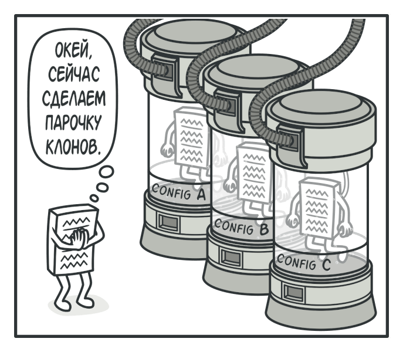
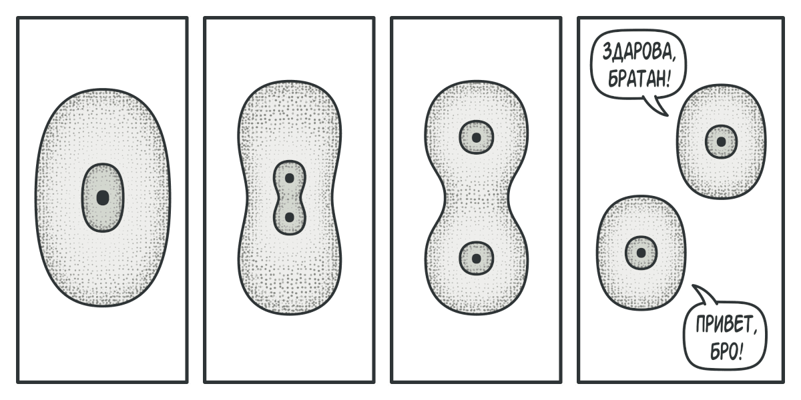
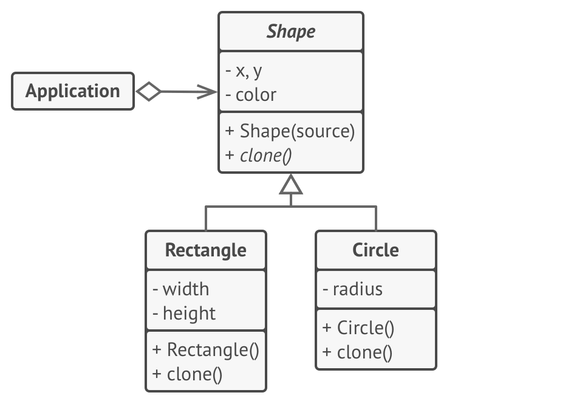

# Прототип

> Также известен как: Клон, Prototype

## Суть паттерна

**Прототип** — это порождающий паттерн проектирования, который позволяет копировать объекты, не вдаваясь в подробности их реализации.


## Проблема

У вас есть объект, который нужно скопировать. Как это сделать? Нужно создать пустой объект такого же класса, а затем поочерёдно скопировать значения всех полей из старого объекта в новый.

Прекрасно! Но есть нюанс. Не каждый объект удастся скопировать таким образом, ведь часть его состояния может быть приватной, а значит — недоступной для остального кода программы.


*Копирование «извне» не всегда возможно в реальности.*

Но есть и другая проблема. Копирующий код станет зависим от классов копируемых объектов. Ведь, чтобы перебрать все поля объекта, нужно привязаться к его классу. Из-за этого вы не сможете копировать объекты, зная только их интерфейсы, а не конкретные классы.

## Решение

Паттерн Прототип поручает создание копий самим копируемым объектам. Он вводит общий интерфейс для всех объектов, поддерживающих клонирование. Это позволяет копировать объекты, не привязываясь к их конкретным классам. Обычно такой интерфейс имеет всего один метод `clone`.

Реализация этого метода в разных классах очень схожа. Метод создаёт новый объект текущего класса и копирует в него значения всех полей собственного объекта. Так получится скопировать даже приватные поля, так как большинство языков программирования разрешает доступ к приватным полям любого объекта текущего класса.

Объект, который копируют, называется **прототипом** (откуда и название паттерна). Когда объекты программы содержат сотни полей и тысячи возможных конфигураций, прототипы могут служить своеобразной альтернативой созданию подклассов.



*Предварительно заготовленные прототипы могут стать заменой подклассам.*

В этом случае все возможные прототипы заготавливаются и настраиваются на этапе инициализации программы. Потом, когда программе нужен новый объект, она создаёт копию из приготовленного прототипа.

## Аналогия из жизни

В промышленном производстве прототипы создаются перед основной партией продуктов для проведения всевозможных испытаний. При этом прототип не участвует в последующем производстве, отыгрывая пассивную роль.



*Пример деления клетки.*

Прототип на производстве не делает копию самого себя, поэтому более близкий пример паттерна — деление клеток. После митозного деления клеток образуются две совершенно идентичные клетки. Оригинальная клетка отыгрывает роль прототипа, принимая активное участие в создании нового объекта.

## Структура

### Базовая реализация


1. **Интерфейс прототипов** описывает операции клонирования. В большинстве случаев — это единственный метод `clone`.
2. **Конкретный прототип** реализует операцию клонирования самого себя. Помимо банального копирования значений всех полей, здесь могут быть спрятаны различные сложности, о которых не нужно знать клиенту. Например, клонирование связанных объектов, распутывание рекурсивных зависимостей и прочее.
3. **Клиент** создаёт копию объекта, обращаясь к нему через общий интерфейс прототипов.

### Реализация с общим хранилищем прототипов


1. **Хранилище прототипов** облегчает доступ к часто используемым прототипам, храня набор предварительно созданных эталонных, готовых к копированию объектов. Простейшее хранилище может быть построено с помощью хеш-таблицы вида имя-прототипа → прототип. Но для удобства поиска прототипы можно маркировать и другими критериями, а не только условным именем.

## Псевдокод

В этом примере **Прототип** позволяет производить точные копии объектов геометрических фигур, не привязываясь к их классам.



*Пример клонирования иерархии геометрических фигур.*

Все фигуры реализуют интерфейс клонирования и предоставляют метод для воспроизводства самой себя. Подклассы используют метод клонирования родителя, а затем копируют собственные поля в получившийся объект.

```c
// Базовый прототип.
abstract class Shape is
    field X: int
    field Y: int
    field color: string

    // Обычный конструктор.
    constructor Shape() is
        // ...

    // Конструктор прототипа.
    constructor Shape(source: Shape) is
        this()
        this.X = source.X
        this.Y = source.Y
        this.color = source.color

    // Результатом операции клонирования всегда будет объект из
    // иерархии классов Shape.
    abstract method clone():Shape


// Конкретный прототип. Метод клонирования создаёт новый объект
// текущего класса, передавая в его конструктор ссылку на
// собственный объект. Благодаря этому операция клонирования
// получается атомарной — пока не выполнится конструктор, нового
// объекта ещё не существует. Но как только конструктор завершит
// работу, мы получим полностью готовый объект-клон, а не пустой
// объект, который нужно ещё заполнить.
class Rectangle extends Shape is
    field width: int
    field height: int

    constructor Rectangle(source: Rectangle) is
        // Вызов родительского конструктора нужен, чтобы
        // скопировать потенциальные приватные поля, объявленные
        // в родительском классе.
        super(source)
        this.width = source.width
        this.height = source.height

    method clone():Shape is
        return new Rectangle(this)


class Circle extends Shape is
    field radius: int

    constructor Circle(source: Circle) is
        super(source)
        this.radius = source.radius

    method clone():Shape is
        return new Circle(this)


// Где-то в клиентском коде.
class Application is
    field shapes: array of Shape

    constructor Application() is
        Circle circle = new Circle()
        circle.X = 10
        circle.Y = 10
        circle.radius = 20
        shapes.add(circle)

        Circle anotherCircle = circle.clone()
        shapes.add(anotherCircle)
        // anotherCircle будет содержать точную копию circle.

        Rectangle rectangle = new Rectangle()
        rectangle.width = 10
        rectangle.height = 20
        shapes.add(rectangle)

    method businessLogic() is
        // Плюс Прототипа в том, что вы можете клонировать набор
        // объектов, не зная их конкретные классы.
        Array shapesCopy = new Array of Shapes.

        // Например, мы не знаем, какие конкретно объекты
        // находятся внутри массива shapes, так как он объявлен
        // с типом Shape. Но благодаря полиморфизму, мы можем
        // клонировать все объекты «вслепую». Будет выполнен
        // метод clone того класса, которым является этот
        // объект.
        foreach (s in shapes) do
            shapesCopy.add(s.clone())

        // Переменная shapesCopy будет содержать точные копии
        // элементов массива shapes.
```

## Применимость

**Когда ваш код не должен зависеть от классов копируемых объектов.**

Такое часто бывает, если ваш код работает с объектами, поданными извне через какой-то общий интерфейс. Вы не можете привязаться к их классам, даже если бы хотели, поскольку их конкретные классы неизвестны.

Паттерн прототип предоставляет клиенту общий интерфейс для работы со всеми прототипами. Клиенту не нужно зависеть от всех классов копируемых объектов, а только от интерфейса клонирования.

---

**Когда вы имеете уйму подклассов, которые отличаются начальными значениями полей. Кто-то мог создать все эти классы, чтобы иметь возможность легко порождать объекты с определённой конфигурацией.**

Паттерн прототип предлагает использовать набор прототипов, вместо создания подклассов для описания популярных конфигураций объектов.

Таким образом, вместо порождения объектов из подклассов, вы будете копировать существующие объекты-прототипы, в которых уже настроено внутреннее состояние. Это позволит избежать взрывного роста количества классов в программе и уменьшить её сложность.

## Шаги реализации

1. Создайте интерфейс прототипов с единственным методом `clone`. Если у вас уже есть иерархия продуктов, метод клонирования можно объявить непосредственно в каждом из её классов.
2. Добавьте в классы будущих прототипов альтернативный конструктор, принимающий в качестве аргумента объект текущего класса. Этот конструктор должен скопировать из поданного объекта значения всех полей, объявленных в рамках текущего класса, а затем передать выполнение родительскому конструктору, чтобы тот позаботился о полях, объявленных в суперклассе. <br/>Если ваш язык программирования не поддерживает перегрузку методов, то вам не удастся создать несколько версий конструктора. В этом случае копирование значений можно проводить и в другом методе, специально созданном для этих целей. Конструктор удобнее тем, что позволяет клонировать объект за один вызов.

3. Метод клонирования обычно состоит всего из одной строки: вызова оператора new с конструктором прототипа. Все классы, поддерживающие клонирование, должны явно определить метод clone, чтобы использовать собственный класс с оператором new. В обратном случае результатом клонирования станет объект родительского класса.

4. Опционально, создайте центральное хранилище прототипов. В нём удобно хранить вариации объектов, возможно, даже одного класса, но по-разному настроенных. <br/>Вы можете разместить это хранилище либо в новом фабричном классе, либо в фабричном методе базового класса прототипов. Такой фабричный метод должен на основании входящих аргументов искать в хранилище прототипов подходящий экземпляр, а затем вызывать его метод клонирования и возвращать полученный объект. <br/>Наконец, нужно избавиться от прямых вызовов конструкторов объектов, заменив их вызовами фабричного метода хранилища прототипов.

## Преимущества и недостатки

**Преимущества**

- Позволяет клонировать объекты, не привязываясь к их конкретным классам.
- Меньше повторяющегося кода инициализации объектов.
- Ускоряет создание объектов.
- Альтернатива созданию подклассов для конструирования сложных объектов.

**Недостакти**

- Сложно клонировать составные объекты, имеющие ссылки на другие объекты.

## Примеры

### Python

- **Сложность**: 1/3
- **Популярность**: 2/3
- **Применимость**: Паттерн Прототип реализован в базовой библиотеке **Python** посредством модуля `copy`.
- **Признаки применения паттерна**: Прототип легко определяется в коде по наличию методов `clone`, `copy` и прочих.

Этот пример показывает структуру паттерна **Прототип**, а именно — из каких классов он состоит, какие роли эти классы выполняют и как они взаимодействуют друг с другом.

**main.py: Пример структуры паттерна**

```python
import copy


class SelfReferencingEntity:
    def __init__(self):
        self.parent = None

    def set_parent(self, parent):
        self.parent = parent


class SomeComponent:
    """
    Python provides its own interface of Prototype via `copy.copy` and
    `copy.deepcopy` functions. And any class that wants to implement custom
    implementations have to override `__copy__` and `__deepcopy__` member
    functions.
    """

    def __init__(self, some_int, some_list_of_objects, some_circular_ref):
        self.some_int = some_int
        self.some_list_of_objects = some_list_of_objects
        self.some_circular_ref = some_circular_ref

    def __copy__(self):
        """
        Create a shallow copy. This method will be called whenever someone calls
        `copy.copy` with this object and the returned value is returned as the
        new shallow copy.
        """

        # First, let's create copies of the nested objects.
        some_list_of_objects = copy.copy(self.some_list_of_objects)
        some_circular_ref = copy.copy(self.some_circular_ref)

        # Then, let's clone the object itself, using the prepared clones of the
        # nested objects.
        new = self.__class__(
            self.some_int, some_list_of_objects, some_circular_ref
        )
        new.__dict__.update(self.__dict__)

        return new

    def __deepcopy__(self, memo=None):
        """
        Create a deep copy. This method will be called whenever someone calls
        `copy.deepcopy` with this object and the returned value is returned as
        the new deep copy.

        What is the use of the argument `memo`? Memo is the dictionary that is
        used by the `deepcopy` library to prevent infinite recursive copies in
        instances of circular references. Pass it to all the `deepcopy` calls
        you make in the `__deepcopy__` implementation to prevent infinite
        recursions.
        """
        if memo is None:
            memo = {}

        # First, let's create copies of the nested objects.
        some_list_of_objects = copy.deepcopy(self.some_list_of_objects, memo)
        some_circular_ref = copy.deepcopy(self.some_circular_ref, memo)

        # Then, let's clone the object itself, using the prepared clones of the
        # nested objects.
        new = self.__class__(
            self.some_int, some_list_of_objects, some_circular_ref
        )
        new.__dict__ = copy.deepcopy(self.__dict__, memo)

        return new


if __name__ == "__main__":

    list_of_objects = [1, {1, 2, 3}, [1, 2, 3]]
    circular_ref = SelfReferencingEntity()
    component = SomeComponent(23, list_of_objects, circular_ref)
    circular_ref.set_parent(component)

    shallow_copied_component = copy.copy(component)

    # Let's change the list in shallow_copied_component and see if it changes in
    # component.
    shallow_copied_component.some_list_of_objects.append("another object")
    if component.some_list_of_objects[-1] == "another object":
        print(
            "Adding elements to `shallow_copied_component`'s "
            "some_list_of_objects adds it to `component`'s "
            "some_list_of_objects."
        )
    else:
        print(
            "Adding elements to `shallow_copied_component`'s "
            "some_list_of_objects doesn't add it to `component`'s "
            "some_list_of_objects."
        )

    # Let's change the set in the list of objects.
    component.some_list_of_objects[1].add(4)
    if 4 in shallow_copied_component.some_list_of_objects[1]:
        print(
            "Changing objects in the `component`'s some_list_of_objects "
            "changes that object in `shallow_copied_component`'s "
            "some_list_of_objects."
        )
    else:
        print(
            "Changing objects in the `component`'s some_list_of_objects "
            "doesn't change that object in `shallow_copied_component`'s "
            "some_list_of_objects."
        )

    deep_copied_component = copy.deepcopy(component)

    # Let's change the list in deep_copied_component and see if it changes in
    # component.
    deep_copied_component.some_list_of_objects.append("one more object")
    if component.some_list_of_objects[-1] == "one more object":
        print(
            "Adding elements to `deep_copied_component`'s "
            "some_list_of_objects adds it to `component`'s "
            "some_list_of_objects."
        )
    else:
        print(
            "Adding elements to `deep_copied_component`'s "
            "some_list_of_objects doesn't add it to `component`'s "
            "some_list_of_objects."
        )

    # Let's change the set in the list of objects.
    component.some_list_of_objects[1].add(10)
    if 10 in deep_copied_component.some_list_of_objects[1]:
        print(
            "Changing objects in the `component`'s some_list_of_objects "
            "changes that object in `deep_copied_component`'s "
            "some_list_of_objects."
        )
    else:
        print(
            "Changing objects in the `component`'s some_list_of_objects "
            "doesn't change that object in `deep_copied_component`'s "
            "some_list_of_objects."
        )

    print(
        f"id(deep_copied_component.some_circular_ref.parent): "
        f"{id(deep_copied_component.some_circular_ref.parent)}"
    )
    print(
        f"id(deep_copied_component.some_circular_ref.parent.some_circular_ref.parent): "
        f"{id(deep_copied_component.some_circular_ref.parent.some_circular_ref.parent)}"
    )
    print(
        "^^ This shows that deepcopied objects contain same reference, they "
        "are not cloned repeatedly."
    )
```

**Output.txt: Результат выполнения**

```bash
Adding elements to `shallow_copied_component`'s some_list_of_objects adds it to `component`'s some_list_of_objects.
Changing objects in the `component`'s some_list_of_objects changes that object in `shallow_copied_component`'s some_list_of_objects.
Adding elements to `deep_copied_component`'s some_list_of_objects doesn't add it to `component`'s some_list_of_objects.
Changing objects in the `component`'s some_list_of_objects doesn't change that object in `deep_copied_component`'s some_list_of_objects.
id(deep_copied_component.some_circular_ref.parent): 4429472784
id(deep_copied_component.some_circular_ref.parent.some_circular_ref.parent): 4429472784
^^ This shows that deepcopied objects contain same reference, they are not cloned repeatedly.
```

### PHP

- **Сложность**: 1/3
- **Популярность**: 2/3
- **Применимость**: Возможность клонирования объектов **встроена в PHP**. При помощи ключевого слова `clone` вы можете сделать точную копию объекта. Чтобы добавить поддержку клонирования в класс, необходимо реализовать метод `__clone`.
- **Признаки применения паттерна**: Прототип легко определяется в коде по наличию ключевого слова `clone` и реализаций метода `__clone`.

<tabs>
<tab title="Концептуальный пример">
<p>Этот пример показывает структуру паттерна <b>Прототип</b>, а именно — из каких классов он состоит, какие роли эти классы выполняют и как они взаимодействуют друг с другом.</p>
<p>После ознакомления со структурой, вам будет легче воспринимать второй пример, который рассматривает реальный случай использования паттерна в мире PHP.</p>
<code-block lang="php">
<![CDATA[
namespace RefactoringGuru\Prototype\Conceptual;

/**
* Пример класса, имеющего возможность клонирования. Мы посмотрим как происходит
* клонирование значений полей разных типов.
*/

class Prototype
{
    public $primitive;
    public $component;
    public $circularReference;
    
    /**
    * PHP имеет встроенную поддержку клонирования. Вы можете «клонировать»
    * объект без определения каких-либо специальных методов, при условии, что
    * его поля имеют примитивные типы. Поля, содержащие объекты, сохраняют свои
    * ссылки в клонированном объекте. Поэтому в некоторых случаях вам может
    * понадобиться клонировать также и вложенные объекты. Это можно сделать
    * специальным методом clone.
    */

    public function __clone()
    {
        $this->component = clone $this->component;
    
        // Клонирование объекта, который имеет вложенный объект с обратной
        // ссылкой, требует специального подхода. После завершения клонирования
        // вложенный объект должен указывать на клонированный объект, а не на
        // исходный объект.
        $this->circularReference = clone $this->circularReference;
        $this->circularReference->prototype = $this;
    }
}

class ComponentWithBackReference
{
    public $prototype;

    /**
     * Обратите внимание, что конструктор не будет выполнен во время
     * клонирования. Если у вас сложная логика внутри конструктора, вам может
     * потребоваться выполнить ее также и в методе clone.
     */
    public function __construct(Prototype $prototype)
    {
        $this->prototype = $prototype;
    }
}

/**
* Клиентский код.
*/ 

function clientCode()
{
    $p1 = new Prototype();
    $p1->primitive = 245;
    $p1->component = new \DateTime();
    $p1->circularReference = new ComponentWithBackReference($p1);
    
    $p2 = clone $p1;
    if ($p1->primitive === $p2->primitive) {
        echo "Primitive field values have been carried over to a clone. Yay!\n";
    } else {
        echo "Primitive field values have not been copied. Booo!\n";
    }
    if ($p1->component === $p2->component) {
        echo "Simple component has not been cloned. Booo!\n";
    } else {
        echo "Simple component has been cloned. Yay!\n";
    }
    
    if ($p1->circularReference === $p2->circularReference) {
        echo "Component with back reference has not been cloned. Booo!\n";
    } else {
        echo "Component with back reference has been cloned. Yay!\n";
    }
    
    if ($p1->circularReference->prototype === $p2->circularReference->prototype) {
        echo "Component with back reference is linked to original object. Booo!\n";
    } else {
        echo "Component with back reference is linked to the clone. Yay!\n";
    }
}

clientCode();

]]>
</code-block>
<p><b>Output.txt</b>: Результат выполнения</p>
<code-block lang="bash">
<![CDATA[
Primitive field values have been carried over to a clone. Yay!
Simple component has been cloned. Yay!
Component with back reference has been cloned. Yay!
Component with back reference is linked to the clone. Yay!

]]>
</code-block>
</tab>
<tab title="Пример из реальной жизни">
<p>Паттерн <b>Прототип</b> предоставляет удобный способ репликации существующих объектов вместо их восстановления и копирования всех полей напрямую. Прямое копирование не только связывает вас с классами клонируемых объектов, но и не позволяет копировать содержимое приватных полей. Паттерн Прототип позволяет выполнять клонирование в контексте клонированного класса, где доступ к приватным полям класса не ограничен.</p>
<p>В этом примере показано, как клонировать сложный объект Страницы, используя паттерн Прототип. Класс Страница имеет множество приватных полей, которые будут перенесены в клонированный объект благодаря паттерну Прототип.</p>
<p><b>index.php</b>: Пример из реальной жизни</p>
<code-block lang="php" validate="false" ignore-vars="true" noinject="true">
<![CDATA[
namespace RefactoringGuru\Prototype\RealWorld;

/**
* Прототип.
*/

class Page
{
    private $title;

    private $body;

    /**
    * @var Author
    */
    private $author;

    private $comments = [];

    /**
    * @var \DateTime
    */
    private $date;

    // +100 приватных полей.

    public function __construct(string $title, string $body, Author $author)
    {
        $this->title = $title;
        $this->body = $body;
        $this->author = $author;
        $this->author->addToPage($this);
        $this->date = new \DateTime();
    }

    public function addComment(string $comment): void
    {
        $this->comments[] = $comment;
    }

    /**
    * Вы можете контролировать, какие данные вы хотите перенести в
    * клонированный объект.
    *
    * Например, при клонировании страницы:
    * - Она получает новый заголовок «Копия ...».
    * - Автор страницы остаётся прежним. Поэтому мы оставляем ссылку на
    * существующий объект, добавляя клонированную страницу в список страниц
    * автора.
    * - Мы не переносим комментарии со старой страницы.
    * - Мы также прикрепляем к странице новый объект даты.
    */
    public function __clone()
    {
        $this->title = "Copy of " . $this->title;
        $this->author->addToPage($this);
        $this->comments = [];
        $this->date = new \DateTime();
    }
}

class Author
{
    private $name;

    /**
     * @var Page[]
     */
    private $pages = [];

    public function __construct(string $name)
    {
        $this->name = $name;
    }

    public function addToPage(Page $page): void
    {
        $this->pages[] = $page;
    }
}

/**
* Клиентский код.
*/
function clientCode()
{
    $author = new Author("John Smith");
    $page = new Page("Tip of the day", "Keep calm and carry on.", $author);

    // ...

    $page->addComment("Nice tip, thanks!");

    // ...

    $draft = clone $page;
    echo "Dump of the clone. Note that the author is now referencing two objects.\n\n";
    print_r($draft);
}

clientCode();

]]>
</code-block>
<p><b>Output.txt</b>: Результат выполнения</p>
<code-block lang="bash">
<![CDATA[
Dump of the clone. Note that the author is now referencing two objects.

RefactoringGuru\Prototype\RealWorld\Page Object
(
    [title:RefactoringGuru\Prototype\RealWorld\Page:private] => Copy of Tip of the day
    [body:RefactoringGuru\Prototype\RealWorld\Page:private] => Keep calm and carry on.
    [author:RefactoringGuru\Prototype\RealWorld\Page:private] => RefactoringGuru\Prototype\RealWorld\Author Object
    (
        [name:RefactoringGuru\Prototype\RealWorld\Author:private] => John Smith
        [pages:RefactoringGuru\Prototype\RealWorld\Author:private] => Array
        (
            [0] => RefactoringGuru\Prototype\RealWorld\Page Object
            (
                [title:RefactoringGuru\Prototype\RealWorld\Page:private] => Tip of the day
                [body:RefactoringGuru\Prototype\RealWorld\Page:private] => Keep calm and carry on.
                [author:RefactoringGuru\Prototype\RealWorld\Page:private] => RefactoringGuru\Prototype\RealWorld\Author Object
*RECURSION*
                [comments:RefactoringGuru\Prototype\RealWorld\Page:private] => Array
                (
                    [0] => Nice tip, thanks!
                )

                [date:RefactoringGuru\Prototype\RealWorld\Page:private] => DateTime Object
                (
                    [date] => 2018-06-04 14:50:39.306237
                    [timezone_type] => 3
                    [timezone] => UTC
                )

            )

            [1] => RefactoringGuru\Prototype\RealWorld\Page Object
*RECURSION*
        )
    )
    [comments:RefactoringGuru\Prototype\RealWorld\Page:private] => Array
    (
    )
    [date:RefactoringGuru\Prototype\RealWorld\Page:private] => DateTime Object
    (
        [date] => 2018-06-04 14:50:39.306272
        [timezone_type] => 3
        [timezone] => UTC
    )
)

]]>
</code-block>
</tab>
</tabs>