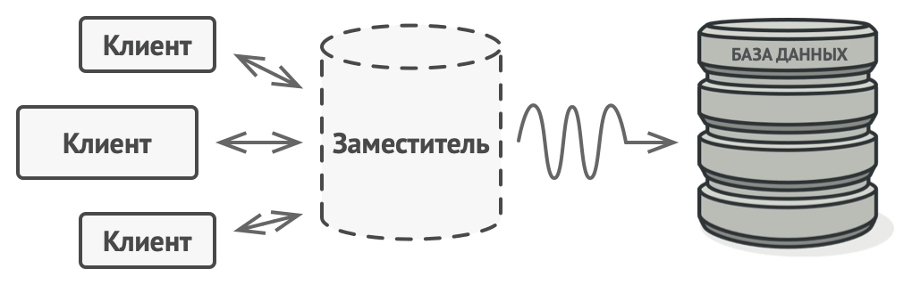

# Заместитель

> Также известен как: **Proxy**

## Суть паттерна

**Заместитель** — это структурный паттерн проектирования, который позволяет подставлять вместо реальных объектов специальные объекты-заменители. Эти объекты перехватывают вызовы к оригинальному объекту, позволяя сделать что-то до или после передачи вызова оригиналу.


## Проблема

Для чего вообще контролировать доступ к объектам? Рассмотрим такой пример: у вас есть внешний ресурсоёмкий объект, который нужен не все время, а изредка.



*Запросы к базе данных могут быть очень медленными.*

Мы могли бы создавать этот объект не в самом начале программы, а только тогда, когда он кому-то реально понадобится. Каждый клиент объекта получил бы некий код отложенной инициализации. Но, вероятно, это привело бы к множественному дублированию кода.

В идеале, этот код хотелось бы поместить прямо в служебный класс, но это не всегда возможно. Например, код класса может находиться в закрытой сторонней библиотеке.

## Решение

Паттерн Заместитель предлагает создать новый класс-дублёр, имеющий тот же интерфейс, что и оригинальный служебный объект. При получении запроса от клиента объект-заместитель сам бы создавал экземпляр служебного объекта и переадресовывал бы ему всю реальную работу.


*Заместитель «притворяется» базой данных, ускоряя работу за счёт ленивой инициализации и кеширования повторяющихся запросов.*

Но в чём же здесь польза? Вы могли бы поместить в класс заместителя какую-то промежуточную логику, которая выполнялась бы до (или после) вызовов этих же методов в настоящем объекте. А благодаря одинаковому интерфейсу, объект-заместитель можно передать в любой код, ожидающий сервисный объект.

## Аналогия из жизни


*Платёжной картой можно расплачиваться, как и наличными.*

Платёжная карточка — это заместитель пачки наличных. И карточка, и наличные имеют общий интерфейс — ими можно оплачивать товары. Для покупателя польза в том, что не надо таскать с собой тонны наличных, а владелец магазина рад, что ему не нужно делать дорогостоящую инкассацию наличности в банк — деньги поступают к нему на счёт напрямую.

## Структура


1. **Интерфейс сервиса** определяет общий интерфейс для сервиса и заместителя. Благодаря этому, объект заместителя можно использовать там, где ожидается объект сервиса.
2. **Сервис** содержит полезную бизнес-логику.
3. **Заместитель** хранит ссылку на объект сервиса. После того как заместитель заканчивает свою работу (например, инициализацию, логирование, защиту или другое), он передаёт вызовы вложенному сервису.<br/>Заместитель может сам отвечать за создание и удаление объекта сервиса.
4. **Клиент** работает с объектами через интерфейс сервиса. Благодаря этому, его можно «одурачить», подменив объект сервиса объектом заместителя.

## Псевдокод

В этом примере **Заместитель** помогает добавить в программу механизм ленивой инициализации и кеширования результатов работы библиотеки интеграции с YouTube.


*Пример кеширования результатов работы реального сервиса с помощью заместителя.*

Оригинальный объект начинал загрузку по сети, даже если пользователь запрашивал одно и то же видео. Заместитель же загружает видео только один раз, используя для этого служебный объект, но в остальных случаях возвращает закешированный файл.

```c
// Интерфейс удалённого сервиса.
interface ThirdPartyYouTubeLib is
    method listVideos()
    method getVideoInfo(id)
    method downloadVideo(id)

// Конкретная реализация сервиса. Методы этого класса
// запрашивают у YouTube различную информацию. Скорость запроса
// зависит не только от качества интернет-канала пользователя,
// но и от состояния самого YouTube. Значит, чем больше будет
// вызовов к сервису, тем менее отзывчивой станет программа.
class ThirdPartyYouTubeClass implements ThirdPartyYouTubeLib is
    method listVideos() is
        // Получить список видеороликов с помощью API YouTube.

    method getVideoInfo(id) is
        // Получить детальную информацию о каком-то видеоролике.

    method downloadVideo(id) is
        // Скачать видео с YouTube.

// С другой стороны, можно кешировать запросы к YouTube и не
// повторять их какое-то время, пока кеш не устареет. Но внести
// этот код напрямую в сервисный класс нельзя, так как он
// находится в сторонней библиотеке. Поэтому мы поместим логику
// кеширования в отдельный класс-обёртку. Он будет делегировать
// запросы к сервисному объекту, только если нужно
// непосредственно выслать запрос.
class CachedYouTubeClass implements ThirdPartyYouTubeLib is
    private field service: ThirdPartyYouTubeLib
    private field listCache, videoCache
    field needReset

    constructor CachedYouTubeClass(service: ThirdPartyYouTubeLib) is
        this.service = service

    method listVideos() is
        if (listCache == null || needReset)
            listCache = service.listVideos()
        return listCache

    method getVideoInfo(id) is
        if (videoCache == null || needReset)
            videoCache = service.getVideoInfo(id)
        return videoCache

    method downloadVideo(id) is
        if (!downloadExists(id) || needReset)
            service.downloadVideo(id)

// Класс GUI, который использует сервисный объект. Вместо
// реального сервиса, мы подсунем ему объект-заместитель. Клиент
// ничего не заметит, так как заместитель имеет тот же
// интерфейс, что и сервис.
class YouTubeManager is
    protected field service: ThirdPartyYouTubeLib

    constructor YouTubeManager(service: ThirdPartyYouTubeLib) is
        this.service = service

    method renderVideoPage(id) is
        info = service.getVideoInfo(id)
        // Отобразить страницу видеоролика.

    method renderListPanel() is
        list = service.listVideos()
        // Отобразить список превьюшек видеороликов.

    method reactOnUserInput() is
        renderVideoPage()
        renderListPanel()

// Конфигурационная часть приложения создаёт и передаёт клиентам
// объект заместителя.
class Application is
    method init() is
        YouTubeService = new ThirdPartyYouTubeClass()
        YouTubeProxy = new CachedYouTubeClass(YouTubeService)
        manager = new YouTubeManager(YouTubeProxy)
        manager.reactOnUserInput()
```

## Применимость

**Ленивая инициализация (виртуальный прокси). Когда у вас есть тяжёлый объект, грузящий данные из файловой системы или базы данных.**

Вместо того, чтобы грузить данные сразу после старта программы, можно сэкономить ресурсы и создать объект тогда, когда он действительно понадобится.

--- 

**Защита доступа (защищающий прокси). Когда в программе есть разные типы пользователей, и вам хочется защищать объект от неавторизованного доступа. Например, если ваши объекты — это важная часть операционной системы, а пользователи — сторонние программы (хорошие или вредоносные).**

Прокси может проверять доступ при каждом вызове и передавать выполнение служебному объекту, если доступ разрешён.

---

**Локальный запуск сервиса (удалённый прокси). Когда настоящий сервисный объект находится на удалённом сервере.**

В этом случае заместитель транслирует запросы клиента в вызовы по сети в протоколе, понятном удалённому сервису.

---

**Логирование запросов (логирующий прокси). Когда требуется хранить историю обращений к сервисному объекту.**

Заместитель может сохранять историю обращения клиента к сервисному объекту.

---

**Кеширование объектов («умная» ссылка). Когда нужно кешировать результаты запросов клиентов и управлять их жизненным циклом.**

Заместитель может подсчитывать количество ссылок на сервисный объект, которые были отданы клиенту и остаются активными. Когда все ссылки освобождаются, можно будет освободить и сам сервисный объект (например, закрыть подключение к базе данных).

Кроме того, Заместитель может отслеживать, не менял ли клиент сервисный объект. Это позволит использовать объекты повторно и здóрово экономить ресурсы, особенно если речь идёт о больших прожорливых сервисах.

## Шаги реализации

1. Определите интерфейс, который бы сделал заместитель и оригинальный объект взаимозаменяемыми.
2. Создайте класс заместителя. Он должен содержать ссылку на сервисный объект. Чаще всего, сервисный объект создаётся самим заместителем. В редких случаях заместитель получает готовый сервисный объект от клиента через конструктор.
3. Реализуйте методы заместителя в зависимости от его предназначения. В большинстве случаев, проделав какую-то полезную работу, методы заместителя должны передать запрос сервисному объекту.
4. Подумайте о введении фабрики, которая решала бы, какой из объектов создавать — заместитель или реальный сервисный объект. Но, с другой стороны, эта логика может быть помещена в создающий метод самого заместителя.
5. Подумайте, не реализовать ли вам ленивую инициализацию сервисного объекта при первом обращении клиента к методам заместителя.

## Преимущества и недостатки

**Преимущества**

- Позволяет контролировать сервисный объект незаметно для клиента.
- Может работать, даже если сервисный объект ещё не создан.
- Может контролировать жизненный цикл служебного объекта.

**Недостатки**

- Усложняет код программы из-за введения дополнительных классов.
- Увеличивает время отклика от сервиса.

## Примеры реализации паттерна

### Python

- **Сложность**: 2/3
- **Популярность**: 1/3
- **Применимость**: Паттерн Заместитель применяется в Python коде тогда, когда надо заменить настоящий объект его суррогатом, причём незаметно для клиентов настоящего объекта. Это позволит выполнить какие-то добавочные поведения до или после основного поведения настоящего объекта.
- **Признаки применения паттерна**: Класс заместителя чаще всего делегирует всю настоящую работу своему реальному объекту. Заместители часто сами следят за жизненным циклом своего реального объекта.

Этот пример показывает структуру паттерна `Заместитель`, а именно — из каких классов он состоит, какие роли эти классы выполняют и как они взаимодействуют друг с другом.

**main.py**: Пример структуры паттерна
```python
from abc import ABC, abstractmethod


class Subject(ABC):
    """
    Интерфейс Субъекта объявляет общие операции как для Реального
    Субъекта, так и для Заместителя. Пока клиент работает с Реальным
    Субъектом, используя этот интерфейс, вы сможете передать ему
    заместителя вместо реального субъекта.
    """

    @abstractmethod
    def request(self) -> None:
        pass


class RealSubject(Subject):
    """
    Реальный Субъект содержит некоторую базовую бизнес-логику. Как
    правило, Реальные Субъекты способны выполнять некоторую полезную
    работу, которая к тому же может быть очень медленной или точной –
    например, коррекция входных данных. Заместитель может решить эти
    задачи без каких-либо изменений в коде Реального Субъекта.
    """

    def request(self) -> None:
        print("RealSubject: Handling request.")


class Proxy(Subject):
    """
    Интерфейс Заместителя идентичен интерфейсу Реального Субъекта.
    """

    def __init__(self, real_subject: RealSubject) -> None:
        self._real_subject = real_subject

    def request(self) -> None:
        """
        Наиболее распространёнными областями применения паттерна
        Заместитель являются ленивая загрузка, кэширование, контроль
        доступа, ведение журнала и т.д. Заместитель может выполнить
        одну из этих задач, а затем, в зависимости от результата,
        передать выполнение одноимённому методу в связанном объекте
        класса Реального Субъекта.
        """

        if self.check_access():
            self._real_subject.request()
            self.log_access()

    def check_access(self) -> bool:
        print("Proxy: Checking access prior to firing a real "
            + "request.")
        return True

    def log_access(self) -> None:
        print("Proxy: Logging the time of request.", end="")


def client_code(subject: Subject) -> None:
    """
    Клиентский код должен работать со всеми объектами (как с
    реальными, так и заместителями) через интерфейс Субъекта, чтобы
    поддерживать как реальные субъекты, так и заместителей. В реальной
    жизни, однако, клиенты в основном работают с реальными субъектами
    напрямую. В этом случае, для более простой реализации паттерна,
    можно расширить заместителя из класса реального субъекта.
    """

    # ...

    subject.request()

    # ...


if __name__ == "__main__":
    print("Client: Executing the client code with a real subject:")
    real_subject = RealSubject()
    client_code(real_subject)

    print("")

    print("Client: Executing the same client code with a proxy:")
    proxy = Proxy(real_subject)
    client_code(proxy)
```

**Output.txt**: Результат выполнения

```text
Client: Executing the client code with a real subject:
RealSubject: Handling request.

Client: Executing the same client code with a proxy:
Proxy: Checking access prior to firing a real request.
RealSubject: Handling request.
Proxy: Logging the time of request.
```

### PHP

- **Сложность**: 2/3
- **Популярность**: 1/3
- **Применимость**: Паттерн Заместитель применяется в PHP коде тогда, когда надо заменить настоящий объект его суррогатом, причём незаметно для клиентов настоящего объекта. Это позволит выполнить какие-то добавочные поведения до или после основного поведения настоящего объекта.
- **Признаки применения паттерна**: Класс заместителя чаще всего делегирует всю настоящую работу своему реальному объекту. Заместители часто сами следят за жизненным циклом своего реального объекта.

<tabs>
<tab title="Концептуальный пример">
<h4 id="proxy-php-concept">Концептуальный пример</h4>
<p>Этот пример показывает структуру паттерна <b>Заместитель</b>, а именно — из каких классов он состоит, какие роли эти классы выполняют и как они взаимодействуют друг с другом.</p>
<p>После ознакомления со структурой, вам будет легче воспринимать второй пример, который рассматривает реальный случай использования паттерна в мире PHP.</p>
<p><b>index.php</b>: Пример структуры паттерна</p>
<code-block lang="php">
<![CDATA[
namespace RefactoringGuru\Proxy\Conceptual;

/**
* Интерфейс Субъекта объявляет общие операции как для Реального Субъекта, так и
* для Заместителя. Пока клиент работает с Реальным Субъектом, используя этот
* интерфейс, вы сможете передать ему заместителя вместо реального субъекта.
*/

interface Subject
{
    public function request(): void;
}

/**
* Реальный Субъект содержит некоторую базовую бизнес-логику. Как правило,
* Реальные Субъекты способны выполнять некоторую полезную работу, которая к
* тому же может быть очень медленной или точной – например, коррекция входных
* данных. Заместитель может решить эти задачи без каких-либо изменений в коде
* Реального Субъекта.
*/

class RealSubject implements Subject
{
    public function request(): void
    {
        echo "RealSubject: Handling request.\n";
    }
}

/**
* Интерфейс Заместителя идентичен интерфейсу Реального Субъекта.
*/

class Proxy implements Subject
{
    /**
    * @var RealSubject
    */
    private $realSubject;

    /**
    * Заместитель хранит ссылку на объект класса РеальныйСубъект. Клиент может
    * либо лениво загрузить его, либо передать Заместителю.
    */
    public function __construct(RealSubject $realSubject)
    {
        $this->realSubject = $realSubject;
    }

    /**
    * Наиболее распространёнными областями применения паттерна Заместитель
    * являются ленивая загрузка, кэширование, контроль доступа, ведение журнала
    * и т.д. Заместитель может выполнить одну из этих задач, а затем, в
    * зависимости от результата, передать выполнение одноимённому методу в
    * связанном объекте класса Реального Субъект.
    */
    public function request(): void
    {
        if ($this->checkAccess()) {
            $this->realSubject->request();
            $this->logAccess();
        }
    }

    private function checkAccess(): bool
    {
        // Некоторые реальные проверки должны проходить здесь.
        echo "Proxy: Checking access prior to firing a real request.\n";

        return true;
    }

    private function logAccess(): void
    {
        echo "Proxy: Logging the time of request.\n";
    }
}

/**
* Клиентский код должен работать со всеми объектами (как с реальными, так и
* заместителями) через интерфейс Субъекта, чтобы поддерживать как реальные
* субъекты, так и заместителей. В реальной жизни, однако, клиенты в основном
* работают с реальными субъектами напрямую. В этом случае, для более простой
* реализации паттерна, можно расширить заместителя из класса реального
* субъекта.
*/

function clientCode(Subject $subject)
{
    // ...

    $subject->request();

    // ...
}

echo "Client: Executing the client code with a real subject:\n";
$realSubject = new RealSubject();
clientCode($realSubject);

echo "\n";

echo "Client: Executing the same client code with a proxy:\n";
$proxy = new Proxy($realSubject);
clientCode($proxy);

]]>
</code-block>
<p><b>Output.txt</b>: Результат выполнения</p>
<code-block lang="text">
<![CDATA[
Client: Executing the client code with a real subject:
RealSubject: Handling request.

Client: Executing the same client code with a proxy:
Proxy: Checking access prior to firing a real request.
RealSubject: Handling request.
Proxy: Logging the time of request.

]]>
</code-block>
</tab>
<tab title="Пример из реальной жизни">
<h4 id="proxy-php-real">Пример из реальной жизни</h4>
<p><b>index.php</b>: Пример из реальной жизни</p>
<code-block lang="php">
<![CDATA[
namespace RefactoringGuru\Proxy\RealWorld;

/**
* Интерфейс Субъекта описывает интерфейс реального объекта.
*
* Дело в том, что у большинства приложений нет чётко определённого интерфейса.
* В этом случае лучше было бы расширить Заместителя за счёт существующего
* класса приложения. Если это неудобно, тогда первым шагом должно быть
* извлечение правильного интерфейса.
*/

interface Downloader
{
    public function download(string $url): string;
}

/**
* Реальный Субъект делает реальную работу, хотя и не самым эффективным
* способом. Когда клиент пытается загрузить тот же самый файл во второй раз,
* наш загрузчик именно это и делает, вместо того, чтобы извлечь результат из
* кэша.
*/

class SimpleDownloader implements Downloader
{
    public function download(string $url): string
    {
        echo "Downloading a file from the Internet.\n";
        $result = file_get_contents($url);
        echo "Downloaded bytes: " . strlen($result) . "\n";

        return $result;
    }
}

/**
* Класс Заместителя – это попытка сделать загрузку более эффективной. Он
* обёртывает реальный объект загрузчика и делегирует ему первые запросы на
* скачивание. Затем результат кэшируется, что позволяет последующим вызовам
* возвращать уже имеющийся файл вместо его повторной загрузки.
*/

class CachingDownloader implements Downloader
{
    /**
    * @var SimpleDownloader
    */
    private $downloader;

    /**
    * @var string[]
    */
    private $cache = [];

    public function __construct(SimpleDownloader $downloader)
    {
        $this->downloader = $downloader;
    }

    public function download(string $url): string
    {
        if (!isset($this->cache[$url])) {
            echo "CacheProxy MISS. ";
            $result = $this->downloader->download($url);
            $this->cache[$url] = $result;
        } else {
            echo "CacheProxy HIT. Retrieving result from cache.\n";
        }
        return $this->cache[$url];
    }
}

/**
* Клиентский код может выдать несколько похожих запросов на загрузку. В этом
* случае кэширующий заместитель экономит время и трафик, подавая результаты из
* кэша.
*
* Клиент не знает, что он работает с заместителем, потому что он работает с
* загрузчиками через абстрактный интерфейс.
*/

function clientCode(Downloader $subject)
{
    // ...
    $result = $subject->download("http://example.com/");
    // Повторяющиеся запросы на загрузку могут кэшироваться для увеличения
    // скорости.

    $result = $subject->download("http://example.com/");

    // ...
}

echo "Executing client code with real subject:\n";
$realSubject = new SimpleDownloader();
clientCode($realSubject);

echo "\n";

echo "Executing the same client code with a proxy:\n";
$proxy = new CachingDownloader($realSubject);
clientCode($proxy);

]]>
</code-block>
<p><b>Output.txt</b>: Результат выполнения</p>
<code-block lang="plain text">
<![CDATA[
Executing client code with real subject:
Downloading a file from the Internet.
Downloaded bytes: 1270
Downloading a file from the Internet.
Downloaded bytes: 1270

Executing the same client code with a proxy:
CacheProxy MISS. Downloading a file from the Internet.
Downloaded bytes: 1270
CacheProxy HIT. Retrieving result from cache.

]]>
</code-block>
</tab>
</tabs>