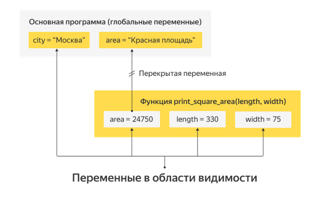
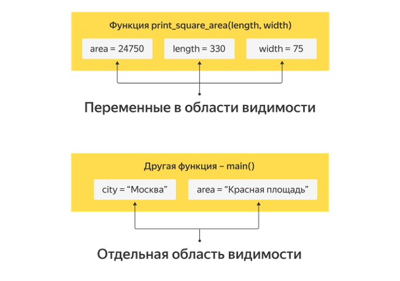

# Области видимости переменных

## Локальные и глобальные переменные

Разбиение программы на функции позволяет сильно упростить программу. С помощью них реализуется принцип модульности, обеспечивающий изоляцию частей программы. Так, программисту необходимо оперировать только небольшим набором переменных, а не всеми сразу.

Для того чтобы использовать только необходимые данные, придуманы области видимости, которые скрывают от одной части программы переменные, используемые в другой части программы. Хотя это делается автоматически, крайне важно понимать, как интерпретатор это делает, иначе неизбежны ошибки. А еще изредка вам будет нужно «обойти» эти ограничения и сделать переменную, доступную всем частям программы, и на такой случай вам придется познакомиться с глобальными переменными.

На прошлых занятиях мы уже неоднократно использовали аргументы функций. Пользоваться ими вроде бы просто, но за кажущейся простотой скрывается много тонкостей:

- С какими переменными может работать функция?
- Что если в двух функциях переменные называются одинаково?
- Может ли функция изменить значение аргумента?

Есть и много других вопросов. На этом занятии мы постараемся ответить на них.

Вернемся к уже рассмотренной на прошлом занятии функции, которая должна выводить на экран содержимое списка, печатая каждый элемент на своей строчке. Посмотрим на переданный аргумент функции.

```python
def print_array(array):
    for element in array:
        print(element)


print_array(['Hello', 'world'])
print_array([123, 456, 789])
```

Переменная array будет **локальной**. Она существует только во время выполнения (или «жизни», как иногда говорят) функции. Можно сказать, что имя аргумента функции — **временное имя** для переданного в функцию значения.

Мы создали список `['Hello', 'world'] `и передали его в функцию. Список существует независимо от того, есть у него имя или нет, но, если у объекта нет имени, мы не можем с ним работать. Поэтому у переданного списка временно появляется имя — в тот самый момент, когда функция начинает работу. Когда функция прекращает работу, оно исчезает.

В вышеописанной программе имя array не существует вне функции.

Что интересно, у каждого объекта в программе может быть несколько имен. Например, слегка модифицируем программу:

```python
def print_array(array):
    for element in array:
        print(element)


words = ['Hello', 'world']
print_array(words)
```

```bash
Hello
world
```

Теперь у списка есть имя `words`. Но в момент выполнения функции у этого списка существуют сразу два имени: `words` — имя из «**внешнего мира**», из **глобальной области видимости**, и `array` — **локальное имя**. В функции можно использовать любое из них, но внешнее — крайне не рекомендуется.

Давайте перепишем программу, используя внешнее имя, и разберемся, почему так делать не стоит:

```python
def print_array(array):
    for element in words:
        print(element)


words = ['Hello', 'world']
print_array(words)
```

```bash
Hello
world
```

Пока все работает аналогично предыдущему примеру. А теперь выполним такую команду:

```python
print_array(['abc', 'def', 'ghi'])
```

```bash
Hello
world
```

Мы рассчитывали, что будут распечатаны три строки: `abc`, `def` и `ghi`, но вместо этого снова распечатались `Hello` и `world`, которые находятся в списке words. Если ваша функция написана так, то, чтобы поменять ее поведение, придется не просто передать ей список, а перезаписать используемую переменную:

```python
words = ['abc', 'def', 'ghi']
```

Еще один минус: раньше вы могли прочитать три строки функции `print_array` и точно понять, как она будет работать. Теперь вам необходимо прочитать всю программу (а в большой программе могут быть тысячи строк), чтобы разобраться, как ведет себя эта функция, а все потому что она теперь не самодостаточна, а зависит от внешней переменной.

Все, что вы сейчас узнали об использовании внешних переменных в функции, необходимо в первую очередь для поиска ошибок. Если программа ведет себя странно, проверьте, не используете ли вы где-то внешние (глобальные) переменные.

Использовать в своих программах эту возможность языка стоит как можно реже.
К внешним переменным прибегать допустимо, если переменная — **константа**. Константы обычно пишутся большими буквами, чтобы не перепутать их с обычными переменными.

Давайте напишем функцию, которая по номеру печатает соответствующий цвет радуги:

```python
ENGLISH_RAINBOW_COLORS = [
    'red', 'orange', 'yellow', 'green', 'blue', 'indigo', 'violet'
]
RUSSIAN_RAINBOW_COLORS = [
    'красный', 'оранжевый', 'желтый', 'зеленый', 'голубой', 'синий',
    'фиолетовый'
]

def rainbow_color(index, russian_or_english):
    if russian_or_english == 'russian':
        print(RUSSIAN_RAINBOW_COLORS[index])
    elif russian_or_english == 'english':
        print(ENGLISH_RAINBOW_COLORS[index])
    else:
        print('Неверный язык')
        

rainbow_color(2, 'russian')
rainbow_color(2, 'english')
```

```bash
желтый
yellow
```

Эта функция будет работать нормально: предполагается, конечно, что в ходе работы программы никому не понадобится менять константы (на то они и константы).

Заметьте, что мы не передаем эти константы в функцию как аргументы, а просто пользуемся ими. Они есть в нашем распоряжении, потому что определены на самом верхнем уровне.

Однако, если константы надо использовать лишь в одной конкретной функции, лучше внести их в эту функцию. Тогда их точно никто не испортит.

## Области видимости

Давайте поговорим об области видимости переменных немного подробнее.
- Внутри функции видны все переменные этой функции (локальные переменные и аргументы функции).
- Внутри функции видны переменные, которые определены снаружи этой функции.
- Снаружи не видны никакие переменные, которые определены внутри функции.

Принцип такой же, как в **машине с тонированными стеклами**: изнутри видны все наружные объекты (и внутренние, конечно же), а вот снаружи посмотреть в машину не получается.

Но вот вопрос: что же произойдет, если имена переменных в функции и во внешней программе совпадут?

Оказывается, есть два варианта.

Первый вариант мы уже видели: ситуация, когда внутри функции используется внешняя переменная, и это ровно та же внешняя переменная, что была снаружи. В следующем примере — это переменная `PI`.

```python
def print_circle_length(radius):
    perimeter = 2 * PI * radius
    print('Длина окружности: ', perimeter)


PI = 3.14
print_circle_length(10)
```

```bash
Длина окружности:  62.800000000000004
```

Второй вариант — ситуация, когда внутри функции используется переменная с тем же именем, что и в основной программе, но перед использованием ей присваивается новое значение.

```python
area = 'Красная площадь'

def print_square_area(length, width):
    area = length * width
    print('Площадь площади: ', area)

print('Место встречи: ', area)
print_square_area(330, 75)
print('Повторяю, место встречи: ', area)
```

```bash
Место встречи:  Красная площадь
Площадь площади:  24750
Повторяю, место встречи:  Красная площадь
```

Если попытаться мысленно выполнить программу, кажется, что функция должна испортить внешнюю переменную `area`, записав в нее вместо строки «Красная площадь» число, равное площади прямоугольника со сторонами `length` и `area`. Но этого не происходит. Когда после выполнения функции мы повторяем печать, оказывается, что переменная area все так же содержит строку «Красная площадь», хотя внутри функции там точно было число.

Что же произошло?

Оказывается, area внутри функции и снаружи — это две совершенно разные переменные. Если внутри функции переменной что-то присваивается (в любом месте функции), интерпретатор не позволит вам работать с внешней переменной.

Вместо этого он создает новую переменную с тем же именем и присваивает значение уже ей. При этом к внешней переменной вы обратиться уже не можете: внутри функции она потеряла свое имя.

Как иногда говорят, внутренняя переменная с тем  же именем ее перекрыла, или затенила (на английском языке это называется **variable shadowing**).



Это сделано для того, чтобы обезопасить вас от ошибок. Если бы функция могла менять внешние переменные, в программе происходило бы много странных и непонятных вещей.

Например, представьте, что вы написали функцию, которая вычисляет площадь и записывает что-то в переменную area. При этом в основной программе переменной area у вас не было, поэтому все работало хорошо. Потом вы в какой-то момент ввели переменную `area` — теперь функция, которая работала хорошо и безопасно, стала менять значение area во внешней программе. Вам бы пришлось долго искать в программе ошибку, из-за которой вы встречаетесь на площади 24 750.

Именно поэтому области видимости так важны. Они позволяют изолировать небольшой кусочек программы, в котором ваши изменения на что-то влияют. Благодаря областям видимости не окажется так, что вы поменяли строку в одной функции, а сломалась другая.

Для того чтобы не вносить в программу лишние глобальные переменные, часто весь код с внешнего уровня программы (т. е. все, что не находится внутри функции) переносят в отдельную функцию `main`. После этого остается только вызвать ее. Все переменные, которые были глобальными, таким образом, становятся локальными для функции `main` и не загрязняют область видимости других функций.

```python
def print_square_area(length, width):
    area = length * width
    print('Площадь площади: ', area)


def main():
    area = 'Красная площадь'
    print('Место встречи: ', area)
    print_square_area(330, 75)
    print('Повторяю, место встречи: ', area)


main()
```

```bash
Место встречи:  Красная площадь
Площадь площади:  24750
Повторяю, место встречи:  Красная площадь
```

Снова посмотрим на визуализацию принципа выделения функции main:



## Использование глобальных переменных

Впрочем, если у вас есть глобальная переменная и вам зачем-то очень нужно повлиять на эту внешнюю переменную, это можно сделать.

>Для изменения глобальной переменной перед тем, как присваивать внутри функции этой переменной какое-то значение, нужно указать, что она глобальная, т. е. относится к внешней области видимости.

Например, напишем функцию, которая при вызове будет обновлять счетчик, считающий, сколько раз вызвана эта функция.

```python
ask_number = 0

def ask_again():
    global ask_number
    ask_number = ask_number + 1
    print('Ты спрашиваешь меня уже в ', ask_number, '-й раз', sep='')

ask_again()
ask_again()
ask_again()
```

```bash
Ты спрашиваешь меня уже в 1-й раз
Ты спрашиваешь меня уже в 2-й раз
Ты спрашиваешь меня уже в 3-й раз
```

Хотя переменной `ask_number` и присваивается значение, она является внешней переменной за счет строчки `global ask_number`.

Мы уже не раз говорили, но повторим еще раз: о глобальных переменных нужно помнить и знать, но использовать их в своих программах крайне не рекомендуется.

Менять внутри функции значение внешней переменной еще хуже, чем использовать внешние переменные, не изменяя их. Старайтесь писать функции, которые минимально зависят от всего, что происходит снаружи.

Но давайте теперь немного поэкспериментируем с нашей программой. Уберем строку, которая делала переменную глобальной. Когда мы запустим программу, интерпретатор выдаст ошибку:

```python
ask_number = 0


def ask_again():
ask_number = ask_number + 1
print('Ты спрашиваешь меня уже в ', ask_number, '-й раз', sep='')


ask_again()
ask_again()
ask_again()
```

```bash
UnboundLocalError
Traceback (most recent call last)
<ipython-input-15-1733b3dfd088> in <module>()
   7
   8
----> 9 ask_again()
  10 ask_again()
  11 ask_again()

<ipython-input-15-1733b3dfd088> in ask_again()
   3
   4 def ask_again():
----> 5  ask_number = ask_number + 1
   6  print('Ты спрашиваешь меня уже в ', ask_number, '-й раз',
      sep='')
   7
UnboundLocalError: local variable 'ask_number' referenced before
assignment
```

В переводе на русский язык это означает, что вы ссылаетесь на локальную переменную ask_number, прежде чем ей присвоено значение. Это происходит потому, что присваивание сделало переменную локальной.

Но в конструкции `ask_number = ask_number + 1` cначала выполняется правая часть, в которой мы пытаемся эту локальную переменную использовать.

Однако использовать ее пока нельзя, так как она к этому моменту еще не существует. Как вы должны помнить, локальные переменные создаются в момент присваивания и до этого использовать их нельзя.

Одна из немногих причин использовать глобальные переменные — возможность сохранить какие-то данные между вызовами функции. Функция не может ничего сохранить «на будущее» в локальных переменных, поскольку они исчезнут, после того как интерпретатор вернется из функции. Зато, если функция при первом вызове сохранит что-либо в глобальную переменную, при следующих вызовах эти данные будут доступны для чтения (и для изменения). Но не забудьте, что глобальная переменная может быть изменена не только из этой функции, но и в любом другом месте программы, так что вы должны внимательно следить за тем, чтобы значение вашей переменной не испортилось между вызовами функции.

Внимательный читатель мог заметить, что мы не рассмотрели еще один случай (точнее, даже два) использования переменных с одинаковыми именами.

Это случай, когда имя локальной переменной совпадает с именем аргумента функции, и случай, когда имя внешней переменной совпадает с именем аргумента.

**Первая программа:**

```python
def greet(name):
    print("Привет,", name)
    name = 'товарищ'
    print("Здравствуй,", name)


greet('Вася')
```

```bash
Привет, Вася
Здравствуй, товарищ
```

**Вторая программа:**

```python
name = 'Петя'

def greet(name):
    print("Привет,", name)


greet('Вася')
```

```bash
Привет, Вася
```

Работу обеих программ очень легко объяснить. Они выполняются именно так, потому что аргумент функции — по сути обыкновенная локальная переменная. В момент вызова функции происходит присваивание значения «Вася» этой локальной переменной. А дальше программист волен ее использовать и изменять, как ему вздумается.

Аргумент функции всегда является локальной переменной, а значит, будет иметь приоритет над внешней переменной с тем же именем.
