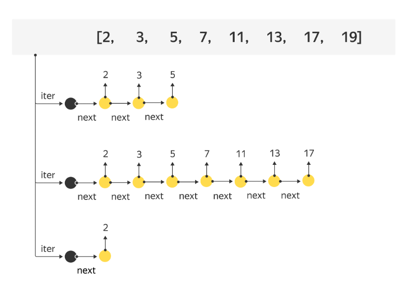
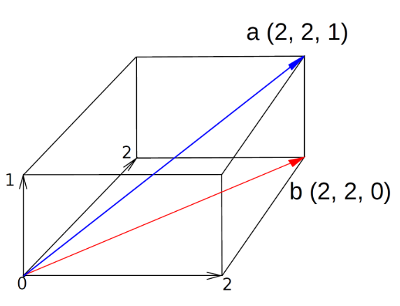
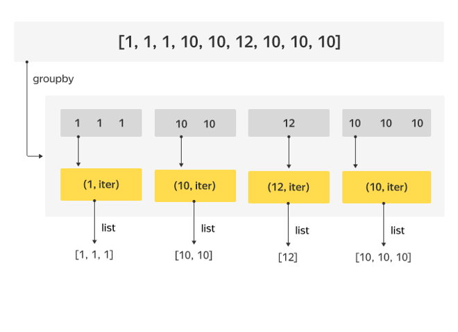

# Итераторы и коллекции

Если подходить более формально, существует два типа итерируемых объектов. Первые называются **итераторами**.

**Итератор** — специальный объект, который позволяет поочередно перебирать элементы. Его можно представить как стрелочку, которая указывает на какой-то элемент коллекции и постепенно двигается по ней.

Если итератор передать в функцию `next`, функция вернет в качестве результата следующий элемент. При этом сам итератор тоже «сдвинется» на следующий элемент. При следующем вызове функция `next` вернет очередной элемент, и «стрелочка» снова сдвинется.



Второй тип итерируемых объектов — **коллекции**. Они не итераторы сами по себе, но позволяют создать итератор.

Чтобы это сделать, достаточно вызвать функцию `iter` и передать ей список в качестве аргумента. Бывает и так, что объект — сам себе итератор (например, поток ввода `stdin`).

Так, список не является итератором, зато для одного и того же списка можно создать сколько угодно итераторов-стрелочек, каждая из которых будет перебирать элементы от первого до последнего.

Так как большинство функций, которые работают с итераторами, умеют работать и с коллекциями, слова «**итерируемый объект**» и «**итератор**» мы будем использовать как синонимы.

Цикл `for` применяется к объектам второго типа. Внутри интерпретатора Python цикл `for` делает следующее:
- По объекту создает итератор.
- Получает из итератора объекты по одному и каждый раз передает полученный объект в выполняемый блок кода

Благодаря этому в цикл `for` можно передать и список, и кортеж, и строку, и интервал `range`, и еще многие другие объекты, которые имеют свои итераторы. Впрочем, эти детали не так важны. Их полезно понимать, но пользоваться ими случается редко.

Итераторы позволяют очень разным объектам «притворяться одинаковыми». Казалось бы, между строками и интервалами нет ничего общего, однако их можно итерировать, а значит, любой из этих объектов можно использовать в цикле `for`, функциях `filter/map` и мн. др.

Как уже говорилось, итератор может использовать любой алгоритм выдачи значения. Элементарный итератор просто перебирает значения в списке с первого до последнего. Еще один итератор — `range` — перебирает числа с шагом 1.

Заметьте, что `range` не хранит весь набор чисел, которые будет перебирать. Он создает новое число только тогда, когда оно потребуется (а старые значения не хранит). Размер `range` и подобных итераторов не зависит от количества чисел, которые предполагается перебрать, ведь им нужно помнить только начало промежутка, его конец и текущий элемент. Это позволяет сделать итератор, который будет перебирать бесконечное число значений, не занимая много дополнительной памяти.

Например, итератор может перебирать все натуральные числа. Или все простые числа. Или перебирать элементы, количество которых заранее неизвестно. Если вы пробовали посчитать количество элементов, которые вернул `filter`, могли заметить, что вызов `len(filter(condition, collection))` не работает. Теперь понятно почему: `filter` возвращает не список, а итерируемый объект.

Функция `len` не работает с большей частью итерируемых объектов, ведь длина набора может быть очень большой или даже бесконечной. Для некоторых итераторов длину можно посчитать мгновенно, не перебирая элементы. Например, итератор `range` имеет заранее известное число объектов. Но для других итераторов невозможно посчитать длину, не проитерировав список полностью (например, невозможно узнать число четных элементов в списке, не проверив каждое число). 

Для итераторов, про которые заранее неизвестно, бесконечные они или нет, все еще хуже: функция `len` могла бы работать не просто долго, а вечно. От `len` такого не ожидаешь.
Если все-таки требуется получить все элементы, для этого есть уже встречавшаяся вам функция `list`. Она проходит по всем элементам итератора и собирает их в один список, который возвращает пользователю. Но `list` создаст промежуточный список. Есть более эффективный способ посчитать число элементов, возвращенных итератором, не создавая промежуточный список.

Как вы думаете, что вычисляет этот код?

```python
sum(1 for value in filter(lambda x: x % 2 == 0, range(50 * 10 ** 6)))
# => 25000000
```

Мы использовали списочное выражение как аргумент функции `sum`, но не заключали его в квадратные скобки. Мы не используем значение, которое вернул итератор, а просто добавляем единицу к числу элементов.

## Встроенные итераторы. Комбинирование итераторов

У итераторов есть замечательная особенность: их можно комбинировать. Это позволяет вместо огромных циклов с перемешанными этапами обработки писать небольшие блоки, которые стыкуются друг с другом. В заданиях прошлого урока вам уже приходилось комбинировать итераторы, возвращаемые функциями `filter` и `map`. В этот раз вы узнаете еще много способов комбинировать итераторы.

## Enumerate

Начнем с итератора `enumerate`. Он решает такую задачу: представьте, что вы перебираете элементы списка при помощи итератора, но при этом хотите знать не только элемент, но и его номер. Можно завести вспомогательную переменную и изменять ее в цикле, перебирающем элементы. Однако для лямбда-функций, передаваемых в функции высшего порядка, этот способ уже не работает.

`enumerate` вместо элементов исходного итератора возвращает кортежи, состоящие из номера элемента по порядку и самого элемента.

В следующем примере формируется список из подобных кортежей с использованием списочного выражения:

```python
arr = ['This', 'is', 'third', 'word']
print([pair for pair in enumerate(arr)])
```

```bash
[(0, 'This'), (1, 'is'), (2, 'third'), (3, 'word')]
```

Обратите внимание на следующий пример: аргумент со звездочкой может быть не только списком, но и итератором (как сделано в примере у функции `print`). Если перед итератором поставить звездочку, его элементы станут аргументами функции:

```python
arr = ['This', 'is', 'third', 'word']
print(*enumerate(arr))
```

```bash
(0, 'This') (1, 'is') (2, 'third') (3, 'word')
```

Давайте теперь найдем номера строк, имеющих лишь две буквы. Если бы мы запустили обычный `filter`, нашли бы только сами слова без номеров. enumerate же передаст нам еще и номера:

```python
filtered_values = filter(lambda index_value: len(index_value[1]) == 2,
    enumerate(arr))
print(*filtered_values)
```

```bash
(1, 'is')
```

Теперь достаточно преобразовать пары номер-элемент в номера. Это делается тривиально:

```python
map(lambda index_value: index_value[0], filter(
    lambda index_value: len(index_value[1]) == 2, enumerate(arr)))
```

Если у `enumerate` указать второй аргумент, отсчет начнется не с нуля, а с этого числа. Примеры можно посмотреть в документации.

Всегда стоит следить за тем, какие данные приходят в функцию преобразования и какие выходят. От порядка, в котором комбинируются функции, зависит результат.

Рассмотрим два варианта. Вам передается набор строк, которые вы должны пронумеровать и выбросить пустые строки. В одном случае пустые строки следует учитывать в нумерации, а в другом — пропускать.

**Вариант 1: сначала пронумеровали все строки, а потом отбросили пустые**

```python
lines = ['Занумеруем', '', '', 'строки']
results = filter(lambda indexed_line: indexed_line[1],
    enumerate(lines, 1))
print(*results)
```

```bash
(1, 'Занумеруем') (4, 'строки')
```

**Вариант 2: сначала отбросили пустые строки, а потом пронумеровали оставшиеся**

```python
lines = ['Занумеруем', '', '', 'строки']
results = enumerate(filter(lambda line: line, lines), 1)
print(*results)
```

```bash
(1, 'Занумеруем') (2, 'строки')
```

Разберем еще одну задачу. При разборе мы будем выписывать, какие данные и в какой форме получаются на каждом этапе.

Рассмотрим пример:

Какие по счету високосные годы, начиная с 1582 года до 2017, имели сумму цифр, равную 9? Високосный год — год, который делится на 4, но при этом не делится на 100 либо делится на 400.

Прежде чем писать программу, давайте разберемся, как можно было бы решить задачу, имея только лист бумаги и ручку.
- На первом этапе мы выпишем все годы от 1582 до 2017
- Затем выберем из них високосные
- Пронумеруем их
- Выберем те (уже пронумерованные), сумма цифр которых равна 9
- Оставим от нумерованных годов только нумерацию. Готово!

Теперь дословно запишем это в коде. Мы напишем отдельную функцию для вычисления суммы цифр, а все остальное запишем в форме комбинации итераторов.

```python
def sum_digits(number):
    sum = 0
    while number != 0:
        sum += number % 10
        number //= 10
    return sum

years_range = range(1582, 2018)
is_leap_year = lambda year: (year % 4 == 0 and year % 100 != 0 \
                             or year % 400 == 0)
leap_years = filter(is_leap_year, years_range)
indexed_years = enumerate(leap_years)
selected_indexed_years = filter(lambda index_and_year:
    sum_digits(index_and_year[1]) == 9, indexed_years)
year_indices = [index_and_year[0] for index_and_year in 
    selected_indexed_years]
print(year_indices)
```

```bash
[9, 105]
```

Выполните этот код, после каждого шага выводя получившееся значение. Если вам приходится выводить итератор, перед этим превратите его в список, чтобы иметь возможность изучить «содержимое» получившегося итератора.

После того как поймете и проследите каждый этап, можно немного упростить эти выражения. 

До какой степени объединять код, чтобы вам было удобно его читать, зависит от субъективных факторов. С одной стороны, очень длинная команда может с трудом восприниматься. С другой — когда в программе результат каждого этапа вычислений вынесен в отдельную переменную, тяжело следить уже за этими переменными.

Таким образом, исходную задачу можно очень компактно решить только средствами итераторов:

```python
leap_years = filter(lambda year: (year % 4 == 0 and year % 100 != 0 
    or year % 400 == 0), range(1582, 2018))

selected_indexed_years = filter(lambda index_and_year: sum(map(int,
    str(index_and_year[1]))) == 9, enumerate(leap_years))

print([index_and_year[0] for index_and_year in
    selected_indexed_years])
```

```bash
[9, 105]
```

## Совместные действия над коллекциями

В рассмотренных примерах мы обходились данными из одного источника. Но бывают вычисления, в которых приходится оперировать несколькими коллекциями значений.

Например, научимся вычислять скалярное произведение двух векторов.

Каждый вектор мы можем написать в виде набора (списка) координат. Для вектора на плоскости координат две, для вектора в пространстве — три. В математических вычислениях часто приходится работать с векторами в многомерном (N-мерном) пространстве, в котором вектор описывается набором из N чисел. Скалярное произведение двух векторов вычисляется как сумма произведений соответствующих координат. Например, в двухмерном пространстве вектора с координатами (a1, a2) и (b1, b2) дают скалярное произведение a1b1 + a2b2.



Один способ решить задачу — перебрать все N измерений и для каждого измерения посчитать произведение элемента из первого списка на элемент из второго списка. Затем просуммировать получившиеся координаты:

```python
# рассмотрим параллелепипед со сторонами 2 x 2 x 1
# и вычислим скалярное произведение между
# вектором длинной диагонали и короткой "двумерной" диагонали
# в квадратном основании
a = [2,2,1]
b = [2,2,0]
N = len(a) # или len(b), они должны быть равны
print(sum(map(lambda i: a[i] * b[i], range(N))))
```

```bash
8
```

Есть и другой способ, который вообще не использует индексы элементов. Давайте выпишем два списка рядом. Пусть элементы списков a и b сгруппированы в два вертикальных набора. Если мы теперь начнем «зачитывать» элементы по горизонтали, получим как раз N пар чисел — координаты пары векторов вдоль соответствующей оси. Для того чтобы так «перевернуть» порядок чтения, используется функция `zip`.

## Zip

Функция `zip(a, b)` создает объект-итератор, из которого при каждом шаге извлекается кортеж, состоящий из двух элементов: первый берется из списка `a`, второй — из `b`. Итератор останавливается, когда исчерпывается самая короткая последовательность.

```bash
a b zip(a, b)
--------------------
2 2  (2, 2)
2 2  (2, 2)
1 0  (1, 0)
```

Чтобы научиться работать с функцией `zip`, посчитаем с ее помощью скалярное произведение:

```python
print(sum(map(lambda coords: coords[0] * coords[1], zip(a, b))))
```

```bash
8
```

Функция `zip` вернула нам итератор, который возвращает кортежи из пар соответствующих координат. Чтобы убедиться в этом, распечатайте результат применения функции `zip` к двум спискам (не забудьте сделать из итератора список).

Функция `zip` может принимать несколько параметров. В этом случае итератор вернет сначала кортеж из первых элементов всех переданных коллекций, затем — из вторых элементов всех коллекций и т. д. Часто коллекции, которые вы хотите скомбинировать таким образом, сами находятся в отдельном списке (например, матрица — список коллекций, представляющих значения строки). Чтобы передать все строки матрицы в функцию `zip` как отдельные строки, можно воспользоваться уже известным вам оператором «`звездочка`». Проведите эксперимент и передайте в функцию `zip` матрицу, написав звездочку и опустив ее. Изучите, в чем заключаются отличия возвращаемых итератором `zip` элементов для этих случаев?

## Модуль itertools

Мы рассмотрели пока лишь мизерную часть возможностей Python, связанных с итераторами и их комбинированием. В стандартной библиотеке Python есть модуль `itertools`, содержащий 18 функций, которые мы еще не изучали. Сейчас рассматривать все доступные функции незачем (это может занять не одну неделю), поэтому покажем лишь некоторые возможности. Рекомендуем время от времени перечитывать список функций на странице [документации](https://docs.python.org/3/library/itertools.html).

Помимо встроенных функций, на этой странице описано множество рецептов их применения. Со временем вы увидите, что многие задачи можно удобно переписать, используя итераторы.

Для того чтобы работать с функциями из модуля `itertools`, вы должны в начале программы написать строку

```python
import itertools
```

Это позволит вызывать любую функцию из этого модуля, используя ее полное имя: 

```python
itertools.<имя функции>
```

### itertools.chain

Первым делом освоим сцепление нескольких итераторов. Мы берем несколько итераторов и делаем новый, который сначала перебирает все элементы из первого итератора, затем из второго, из третьего и т. д., пока не закончатся значения в последнем итераторе. Для этого служит функция `itertools.chain(iter_1, iter_2, ...)`.

Применим этот итератор, чтобы получить список всех дат года. Склеим этот итератор из итераторов по числам месяца, которые легко сделать методом `range`.

```python
month_lengths = [31, 28, 31, 30, 31, 30, 31, 31, 30, 31, 30, 31]
day_numbers = itertools.chain(
    *map(lambda length: range(1, length + 1), month_lengths)
)
```

### itertools.cycle, itertools.repeat

В некоторых ситуациях требуется «**зациклить**» один итератор. Сделаем итератор часовой стрелки, который после 23 возвращается к нулю и начинает отсчет заново. Для этой цели предназначен `itertools.cycle`. Если же вам нужно просто повторять какое-то значение несколько раз, можно использовать итератор `itertools.repeat`.

```python
hours = itertools.cycle(range(24))
 
# Используем repeat, чтобы на протяжении 31 дня января повторять,
# что это первый месяц года и т.д.

month_lengths = [31, 28, 31, 30, 31, 30, 31, 31, 30, 31, 30, 31]

month_numbers = itertools.chain(
    *map(
        lambda month_and_length: itertools.repeat(
            month_and_length[0], month_and_length[1]
        ),      
        enumerate(month_lengths, 1)
    )
)
```

Когда вы начинаете работать с бесконечными списками, возникает проблема: их работа никогда не завершается. Обычно это не то, чего мы добиваемся. Бесконечные списки часто используются как промежуточный этап работы. Для превращения бесконечного итератора в конечный существует функция `islice`, делающая «срез» итератора. Она принимает итератор и три параметра, определяющих начало, конец и шаг среза. Если в качестве конца среза указан None, срез имеет начало, но не ограничен с конца. Срезы, конечно, можно делать не только для бесконечных итераторов, но и для конечных. Посмотрите в документации синтаксис функции `islice` и пример написания функции `take` из списка [рецептов](https://docs.python.org/3/library/itertools.html#itertools-recipes), которая позволяет взять из итератора первые `n` элементов.

Есть большой класс итераторов, которые возвращают «комбинаторные» значения. Например, так работает итератор `itertools.product`. Результатом его работы является так называемое декартово произведение итераторов: для каждого значения первого итератора перебираются все значения второго. Наш итератор каждый час будет пробегать 60 минут, а затем зацикливать сутки:

```python
itertools.cycle(itertools.product(range(24), range(60)))
```

Попробуйте зациклить отдельно минуты и отдельно часы, прежде чем перемножать их. Что получается в итоге?

В этом случае программа зависнет. Это, скорее, баг: такое поведение не запланировано и его можно избежать. Однако мы должны понимать: работа с бесконечными итераторами удобна, но не безоблачна, а баги встречаются даже в языках программирования.

Декартово произведение — самый простой комбинаторный итератор. Разберем еще один: `itertools.combinations`. Он берет итератор и некоторое число `r`, а затем выдает набор всех возможных комбинаций из `r` элементов (пришедших из переданного итератора). Например, `itertools.combinations(range(10), 2)` переберет все возможные пары различных цифр. При этом кортежи с переставленными элементами не появляются в результатах. Например, мы получим элемент `(2, 7)`, но не получим элемент `(7, 2)`, так как это та же самая комбинация элементов итератора.

## Свертка итератора. Функция reduce

Функция reduce расположена не в модуле `itertools`, а в модуле `functools`. Значит, чтобы ею воспользоваться, необходимо в вашей программе написать `import functools`. То, что она не находится в `itertools`, — неслучайно, так как она не возвращает итератор. Напротив, она принимает итератор и, некоторым образом скомбинировав элементы, которые выдает этот итератор, возвращает одно единственное значение.

Итераторы сделаны «стыкующимися» так, что преобразования итераторов образуют длинные цепочки. А функция `reduce` обычно завершает цепочку итераторов и возвращает итоговый результат (если только вызов `reduce` не возвращает итерируемый ответ, что возможно, но отнюдь не обязательно).

Разберемся наконец, что такое свертка итератора.

**Свертка** — функция высшего порядка, которая принимает начальное значение, итератор и некоторую бинарную операцию, а возвращает результат многократного применения этой операции к элементам итератора. Операция применяется, а результат вычисления передается как аргумент в эту же самую операцию.

Функция reduce обновляет некоторую величину шаг за шагом, начиная с некоторого начального значения. Эта величина обновляется при получении каждого следующего элемента из итератора, когда элементы закончились, эта величина возвращается как результат работы функции.

Пусть наш итератор `iterator` возвращает элементы `a1, a2, a3, ..., an`. Передадим `reduce` в качестве операции функцию двух аргументов `func(result, element)`. В качестве начального значения возьмем `init`. Проследим за тем, как будет обновляться промежуточный результат:

```python
functools.reduce(func, iterator, init)
```

До получения элементов из итератора промежуточный результат result равен `init`. После того как reduce получил первый элемент, промежуточный результат становится равен:

```python
func(result, a1) = func(init, a1)
```

На следующем шаге:

```python
result = func(result, a2) = func(func(init, a1), a2)
```

В итоге после того как reduce получил последний элемент:
```python
result = func(result, an) = func(...(func(func(init, a1), a2), ...),
    an)
```

Проще всего показать работу этой функции на примере. Давайте передадим в качестве операции функцию, прибавляющую очередной элемент к результату. В качестве исходного значения передадим ноль.

```python
functools.reduce(lambda result, element: result + element, range(10),
    0)
```

```bash
45
```

Если вы попробуете проделать все вычисления, увидите, что мы просто посчитали сумму элементов итератора: начали с нуля и на каждом шаге прибавляли значение очередного элемента к результату. Оказывается, сумма — частный случай применения операции свертки.

Совершенно аналогично можно посчитать произведение элементов, передав в reduce функцию `lambda result, element: result * element` (а в качестве начального элемента возьмем 1).

Начальный элемент указывать необязательно. Если его не указать, начальным значением будет первое значение итератора, а применение операции начнется со второго элемента. Для функций суммы и произведения это будет работать как положено. Получается, что выражение `func(...(func(func(init, a1), a2), ...), an)` превращается в `func(func(...func(a1, a2), ...), an)`.

Сумма — не единственная свертка, которую вы уже знаете. Многие другие операции можно превратить в свертку. Например, метод `join`:

```python
values = ["картину", "корзину", "картонку"]
functools.reduce(lambda result, element: result + ", " + element,
    values)
```

```bash
картину, корзину, картонку
```

Функцию `map` можно переписать, используя `reduce`:

```python
values = ["картину", "корзину", "картонку"]
functools.reduce(lambda result, element: result + [element.upper()],
    values, [])
```

```bash
['КАРТИНУ', 'КОРЗИНУ', 'КАРТОНКУ']
```

Будьте внимательны! Мы не изменяем текущий список, а создаем новый с добавленным элементом. Мы могли бы менять существующий список, но необходимо, чтобы итоговым результатом работы нашей лямбда-функции стал итоговый массив. Если написать

```python
lambda result, element: result.append(element.upper())
```

такая функция изменит список, но вернет `None`. На следующий шаг `reduce` будет передан `None`, что не соответствует нашей задумке.

Аналогично можно написать функции `any` и `all`, если не касаться бесконечных итераторов.

Встроенные функции `any`/`all` отличаются от нашей версии тем, что они могут закончить работу до того, как просмотрят все элементы. Функция reduce же вынуждена просмотреть элементы итератора до конца (для бесконечных итераторов это совсем не подойдет).

Возьмем список, в котором часть элементов может помечена как отсутствующая (в списке элементы заменены на None), и попробуем с помощью `reduce` узнать, есть ли отсутствующие элементы в списке:

```python
values = ["картину", "корзину", "картонку", None]
# all(values) -- значит, что все элементы истинны, т.е. не None и
# не False
# Мы используем конструкцию not not element.
# Она равна False, когда element ложный (False или None),
# в других случаях она равна True

functools.reduce(lambda result, element: result and (not not element),
              values, True)
# => False
# any(values) -- значит, что хотя бы один элемент истинный
functools.reduce(lambda result, element: result or (not not element),
    values, False)
# => True

```

Конструкция `not not v` иногда используется, когда вам нужно преобразовать `v` к булеву значению.

Для всех приведенных примеров, конечно, лучше использовать специализированные функции, а не пытаться выразить их через `reduce`. Операция свертки хороша в первую очередь своей универсальностью, вы можете выразить с ее помощью огромное число различных вычислений.

Функцию `reduce` может быть действительно полезно использовать, когда функцию от списка значений можно записать как комбинацию более простых вызовов существующей функции пары значений. Например, если у вас есть функция, позволяющая найти пересечение двух множеств (в Python есть такая функция, см. [документацию](https://docs.python.org/3/library/stdtypes.html#set) типа [set](https://docs.python.org/3/tutorial/datastructures.html#sets)), с помощью `reduce` вы сможете пересечь сколько угодно множеств.

## Группировка элементов. Функция groupby

Еще одна функция, о которой мы будем говорить, `itertools.groupby`.

Функция `groupby` принимает итератор и группирует последовательные значения итератора, одинаковые по значению какого-либо признака. Возвращает она также итератор, который перебирает не отдельные элементы, а получившиеся группы элементов.

Это позволит нам решать задачи, которые работают не с единичным элементом, а с поднаборами коллекции. Например, мы можем взять список записей в телефонной книге и посчитать, каких имен в ней больше всего. Для этого нам будет достаточно сгруппировать все записи по имени и найти самую большую группу. Мы вскоре покажем, как решать эту задачу, но перед этим нам придется поговорить о том, что такое группа и почему группируются именно последовательные значения итератора.

Как мы уже много раз говорили, итераторы работают, последовательно перебирая элементы. Все функции, работающие с итераторами, с которыми вы имели дело, как только получают элемент, обрабатывают его и, если требуется, сразу передают полученное значение дальше. Например, когда вы работаете с функцией `map`, она берет из итератора одно значение и тут же «кладет» его в возвращаемый итератор. За счет этого функция, которая работает с результатом функции `map`, может не ждать, пока та обработает все элементы, она получает значения из `map` по мере их вычисления.

Это такой вариант потоковой обработкой данных: входящие данные (поток) обрабатываются набором последовательных преобразований, причем алгоритму обработки не требуется знать, что в потоке будет дальше. В идеальном случае необходимо знать лишь текущий элемент, в других же случаях достаточно знать текущий и предыдущие элементы.

Давайте теперь рассмотрим другой крайний случай — функцию `sorted`. Эта функция может получать значения из итератора, но возвращает все равно список. Почему? Дело в том, что возвращать итератор из функции `sorted` было бы совершенно бессмысленно: мы не можем выдать ни одного значения, пока не будут прочитаны все значения итератора. Представьте, что вы хотите отсортировать список, который уже отсортирован в обратном порядке. Значит, первый элемент, который должен попасть в результат, во входящем наборе значений находится в самом конце.

Таким образом, потоковая обработка элементов без длительной задержки невозможна. Кроме того, для сортировки набора значений из потока требуется их все запомнить, что в общем случае занимает памяти как минимум столько, сколько данных было в потоке. Как вы понимаете, операция сортировки «**дорого**» обходится программе, но это неизбежно.

Группировка значений в потоке занимает промежуточную нишу. Если вы хотите из некоторого произвольного множества получить все значения, которые относятся к группе (для простоты будем считать, что группа содержит одинаковые значения), вам придется прочитать все элементы до единого. Но зачастую во входящем потоке данных элементы расположены неслучайно, а заранее отсортированы. В таком случае элементы группы идут подряд, и, чтобы их получить, достаточно взять элементы от начала группы до ее конца. Раз так, мы можем сделать итератор, который перебирает группы и выдает их по одной. Мы можем выдать группу элементов как только прочитали ее до конца, т. е. в тот момент, когда началась другая группа.

На этом месте можно было бы остановиться, но проблема заключается в том, что группа может быть сколь угодно большой и, таким образом, итератор может застопориться. В то же время мы не можем выдать группу, пока не прочитали ее целиком.

Чтобы разрешить эту проблему, мы прибегнем к следующему трюку: будем перебирать элементы потока.

В момент, когда в потоке начинается новая группа, мы передаем группу в результирующий итератор. Но, так как мы не можем передать группу, которая еще только началась, вместо ее элементов мы передадим итератор. Этот итератор будет перебирать элементы, пока не кончится одна группа, после чего вы получите новый итератор на следующую группу. Так работает `groupby`: он создает итератор, состоящий из итераторов.

Если быть точнее, `groupby` выдает поток кортежей, каждый кортеж состоит из значения, которое характеризует группу (соответствует всем элементам) в группе и итератора, проходящего по самим элементам группы.

Во многих задачах, связанных с комбинированием итераторов, удобно использовать консоль, чтобы проверять результат промежуточных шагов. В случае с groupby настоятельно рекомендуем пошагово проделывать манипуляции и изучать получившийся результат.

Непосредственная работа с внутренними итераторами может оказаться очень неинтуитивной. Например, легко принять его за список. При первом прочтении он будет вести практически аналогично, но на втором прочтении окажется пустым, что может стать большой неожиданностью.

```python
values = [1, 1, 1, 10, 10, 12, 10, 10, 10]
 
# Список кортежей (значение элементов группы, итератор группы)
print(list(itertools.groupby(values) ))
# => [(1, <itertools._grouper object at 0x...>),
# (10, <itertools._grouper object at 0x...>),
# (12, <itertools._grouper object at 0x...>),
# (10, <itertools._grouper object at 0x...>)]
 
# Выведем элементы каждого из внутренних итераторов
print([list(group[1]) for group in itertools.groupby(values)])
# => [[1, 1, 1], [10, 10], [12], [10, 10, 10]]
```



Поскольку мы передали несортированный список, у нас получились две отдельные группы десяток. Группой является множество одинаковых и притом смежных элементов. Если бы мы хотели получить группы, в которые включены все соответствующие элементы, нам бы пришлось сначала отсортировать список:

```python
print([list(group[1]) for group in itertools.groupby(sorted(values))])
```

```bash
[[1, 1, 1], [10, 10, 10, 10, 10], [12]]
```

Конечно, нам редко требуется группировать абсолютно одинаковые элементы, обычно мы группируем элементы по какому-либо признаку. Функцию, которая вычисляет по элементу значение группирующего признака, мы передаем в качестве необязательного аргумента в функцию `groupby`.

Давайте вернемся к примеру, с которого начинали. Пусть у нас есть список записей в телефонной книге и мы хотим найти самое частое имя. Значит, первым делом мы должны сгруппировать записи по имени, а затем посчитать размер групп. Записи будем представлять кортежами (имя, фамилия, телефон).

```python
address_book = [
    ('Андрей', 'Веселов', '235780'),
    ('Александр', 'Копылов', '122112'),
    ('Андрей', 'Тихий', '998877')
]
 
# Итак, отсортируем список по интересующему нас признаку
# и сгруппируем по нему.
# Признак - имя - является нулевым элементом записи.
# Так как он понадобится нам дважды, запишем его в переменную
key_func = lambda record: record[0]
groups = itertools.groupby(sorted(address_book, key=key_func),
    key_func)

# Найдем среди групп максимальную по длине группы.
# group[0] - это имя, а group[1] - это итератор
# по всем записям с таким именем
# sum(1 for element in iterator), как мы говорили в прошлом уроке -
# число элементов итератора

name, group_iterator = max(
    groups,
    key=lambda group: sum(1 for record in group[1])
)
print(name) # => 'Андрей'
 
# Но будьте осторожны! Мы присвоили значение group_iterator только для
# того, чтобы более наглядно показать значения в итоговом кортеже.
# После того, как max перебрал все элементы, group_iterator остался
# пустым:

print(list(group_iterator)) # => []
```

