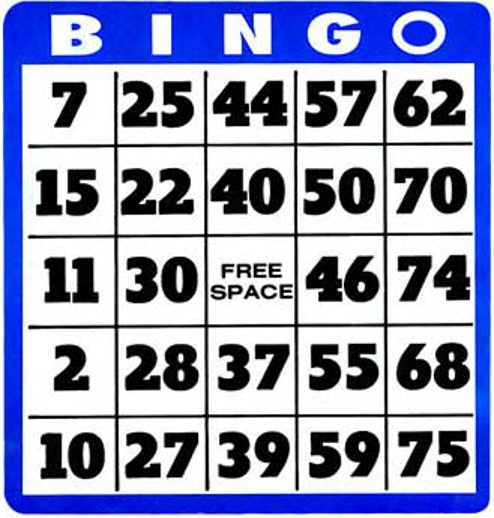

# Задачи

## Задача 1 {id="22_1"}



Напишите функцию `make_bingo()`, которая возвращает кортеж кортежей с карточкой для игры бинго.

Это карточка 5x5 с пустой центральной клеткой (она заполняется автоматически, пусть там будет 0).

В остальных клетках — числа от 1 до 75.

Все числа должны быть разными.

### Формат ввода

```python
res = make_bingo()
```

### Формат вывода

Функция возвращает кортеж кортежей — карточку для игры. Например,

```python
((25, 33, 69, 58, 59),  
(73, 49, 50, 27,  6),  
(29,  3,  0, 53, 10),  
(45, 37, 28, 74, 54),  
(1,   5, 23, 60, 70))
```

## Задача 2 {id="22_2"}

Вам даётся список учеников.
Напишите программу для игры в «тайного друга».
Она должна случайным образом назначить каждому ученику тайного друга, который будет незаметно делать для этого ученика что-то хорошее.

Обратите внимание, что нельзя быть тайным другом самому себе и нельзя быть тайным другом для нескольких учеников.

###Формат ввода

Имена и фамилии, по одной на каждой строке.

```bash
Иван Иванов  
Саша Самойлов  
Юля Северная
```

### Формат вывода
На каждой строчке имя и фамилия ученика и имя и фамилия его тайного друга, разделённые дефисом.

```bash
Иван Иванов - Юля Северная  
Юля Северная - Саша Самойлов  
Саша Самойлов - Иван Иванов
```


## Задача 3 {id="22_3"}

Требуется по запросу выдавать `N` различных паролей длиной `M` символов, состоящих из строчных и прописных латинских букв и цифр, кроме тех, которые легко перепутать между собой: «l» (L маленькое), «I» (i большое), «1» (цифра), «o» и «O» (большая и маленькая буквы) и «0» (цифра).

Решение должно содержать две функции: вспомогательную `generate_password(m)`, возвращающую случайный пароль длиной m символов, и основную `main(n, m)`, возвращающую список из n различных паролей, каждый длиной m символов.

Будем считать, что параметры n и m всегда таковы, что требуемые пароли возможно сгенерировать.

## Формат ввода

Пример вызова ваших функций для тестирования:

```python
print("Случайный пароль из 7 символов:", generate_password(7))  
print("10 случайных паролей длиной 15 символов:")  
print(*main(10, 15), sep="\n")
```

### Формат вывода

Пример результатов:

```bash
Случайный пароль из 7 символов: fJv6cWX  
10 случайных паролей длиной 15 символов:  
FRkRUfn7FZmUCZH  
rBaLXLkxagbgXjp  
hPBDSD6eyxA2CjD  
rUQSjd4sE28teWQ  
mZwMxeGPfcim2yH  
wF2mPU8y5mw5E3b  
bjFS5wzfMPHj5cs  
nwwYAY9gdJyRkHG  
ts7mH3nCDeJY6Ns  
dDCdGXcE8PXaMhb
```

> Возможно, вам пригодятся константы `string.ascii_letters` и `string.digits` из модуля [string](https://docs.python.org/3/library/string.html).


## Задача 4 {id="22_4"}

Дори любит своих друзей и очень любит праздновать их дни рождения. Проблема в том, что она постоянно все забывает, и чтобы помнить, постоянно твердит сколько дней осталось до ближайшего дня рождения друга.

Давайте поможем Дори перенести все дни рождения на календарь с помощью программы, которая переводит количество дней до дня рождения друга в конкретные день и месяц.

### Формат ввода

Одно число - количество дней, оставшихся до дня рождения друга

### Формат вывода

Два числа - день и месяц дня рождения друга.

> Используйте библиотеку `datetime`. В примерах системная дата **01.09.2019**

### Пример 1 {id="22_4_1"}

**Ввод**

```bash
121
```

**Вывод**
```bash
31 12
```

### Пример 2 {id="22_4_2"}

**Ввод**

```bash
343
```

**Вывод**
```bash
9 8
```

## Задача 5 {id="22_5"}

Существует предположение о существовании трех биологических ритмов человека: физического, эмоционального и интеллектуального.

Согласно этому предположению, человек как часть природы представляется связанным с разными небесными телами, которые его окружают: звездами, Солнцем, Луной и, конечно же, Землей.

Считается, что физический биоритм формируется за счет магнитного поля Земли с длительностью периода примерно 23 дня, эмоциональный зависит от лунных циклов и вращения Луны вокруг Земли с периодом примерно 28 суток, интеллектуальный с периодом 33 дня зависит от вращения Земли по своей орбите вокруг Солнца. Пусковым механизмом для всех трех биоритмов является рождение человека.

Графики биоритмов представляют собой синусоиды. Значение биоритма в любой день для каждого человека можно рассчитать по формуле:

```bash
B = sin((2 ∗ pi ∗ T)∕P) ∗ 100%,
```

где `P` - период биоритма в сутках, `T` - количество дней, прошедших с рождения человека до момента расчета.

Напишите программу, которая производит расчет биоритмов по введенным датам.

### Формат ввода

Строка, содержащая день, месяц и год рождения человека.
Строка, содержащая день, месяц и год даты расчета биоритма.
Обе даты вводятся в формате ДД.ММ.ГГГГ

### Формат вывода

Значение биоритмов физического, эмоционального, интеллектуального, округленные до сотых. Каждое значение с новой строки.

> Гарантируется, что во входных данных вторая дата позднее, чем первая.

### Пример 1 {id="22_5_1"}

**Ввод**

```bash
28.07.1988
16.03.2009
```

**Вывод**
```bash
-81.7
78.18
75.57
```

### Пример 2 {id="22_5_2"}

**Ввод**

```bash
01.01.2010
31.12.2019
```

**Вывод**
```bash
-99.77
62.35
-75.57
```
