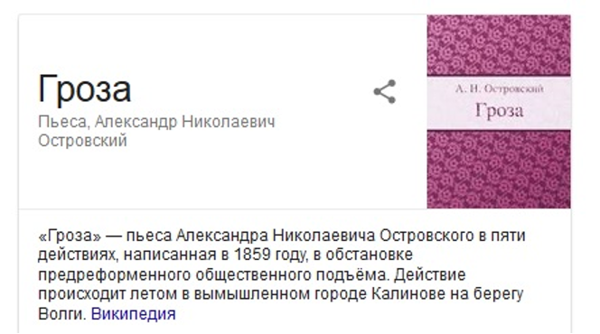
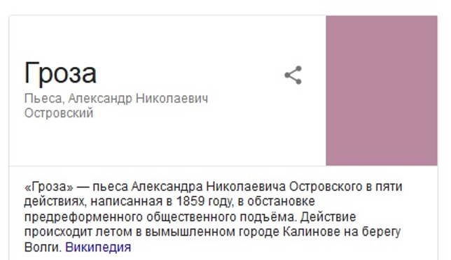
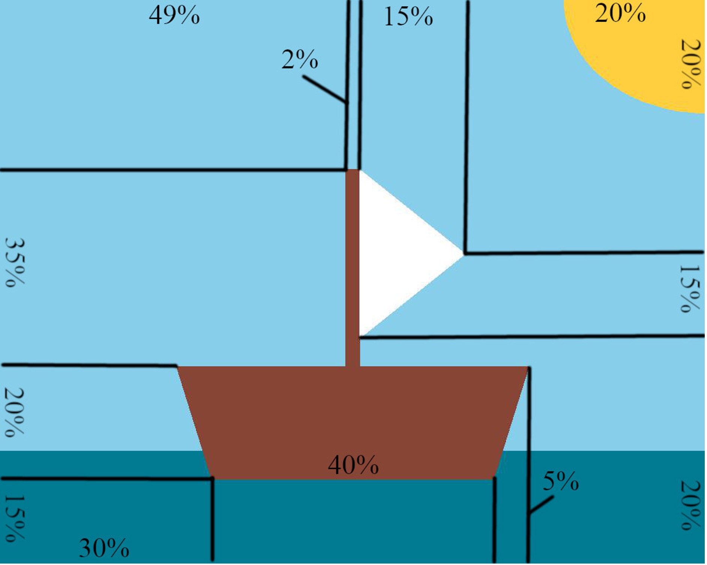
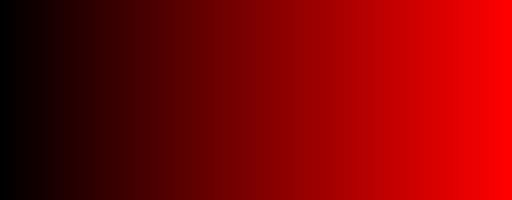
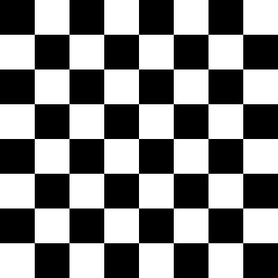
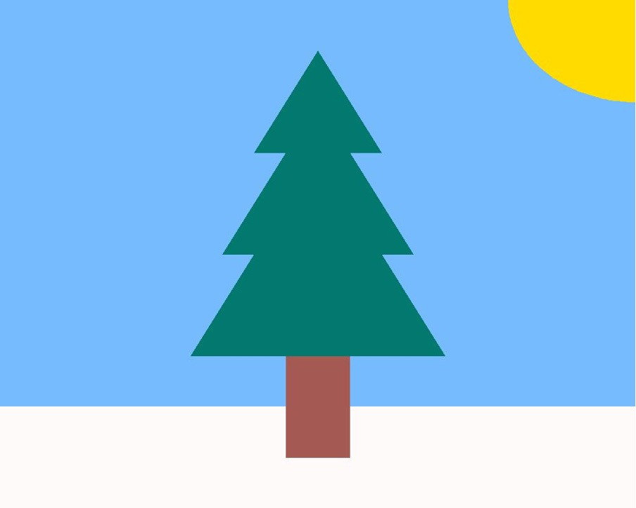
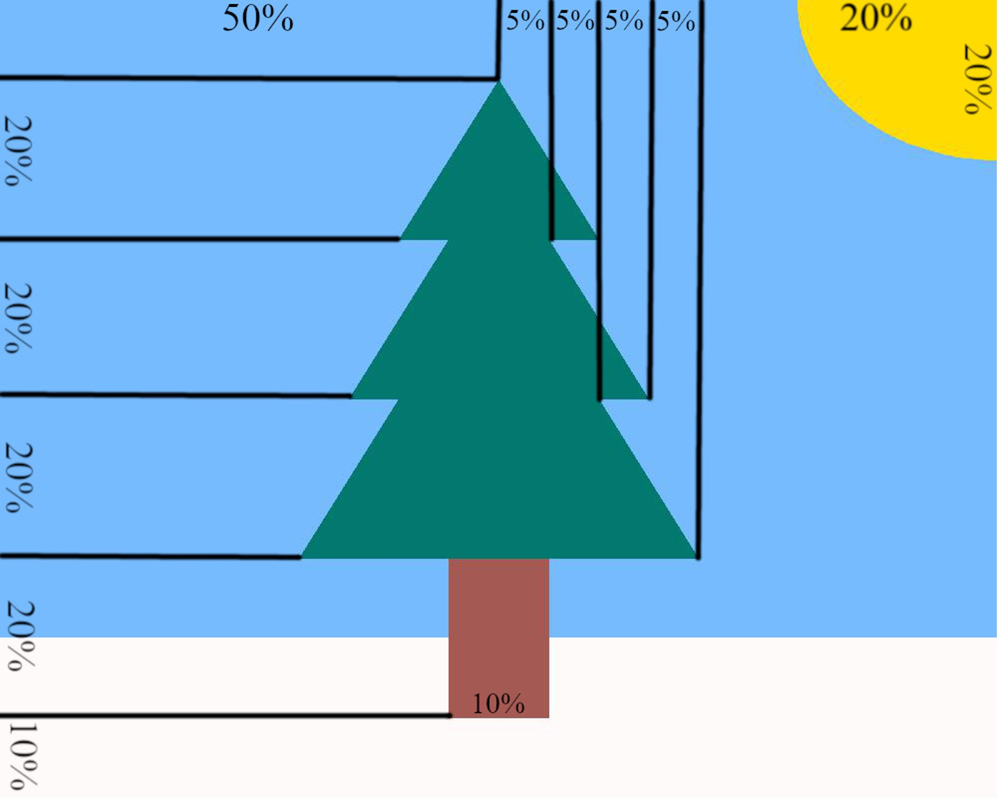

# Задачи

## Задача 1 {id="23_1"}

Считается, что противоположные цвета С1 и С2, заданные как RGB и (255-R)(255-G)(255-B), хорошо гармонируют друг с другом. R, G и B — это интенсивность, соответственно, красной, синей и зеленой составляющих цвета.

Напишите программу, которая получает на вход цвет в виде трех вводимых через пробел его составляющих в нотации RGB, и выдаёт в ответ цвет, противоположный введенному.

### Пример {id="23_1_1"}

**Ввод**

```bash
244 11 120
```

**Вывод**
```bash
11 244 135
```

## Задача 2 {id="23_2"}

В работе программ и веб-сервисов иногда случается, что нужная картинка не загружается. В этом случае они показывают вместо неё блок, залитый «усреднённым» цветом нужной картинки.

Например, из изображения:



Получается вот такое:



Мы решим упрощенную задачу: используя библиотеку PIL, реализуйте алгоритм, который вычисляет среднее значение каждой составляющей R, G, B и выводит эти значения на экран через пробел.

### Формат ввода


### Формат вывода

```bash
96 94 86
```

> При вычислении среднего значения используйте **целочисленное** деление.

## Задача 3 {id="23_3"}

Время рисовать! Давайте с помощью функций библиотеки `PIL` нарисуем лодку с парусом.
Напишите функцию picture(`file_name`, `width`, `height`, `sky_color`, `ocean_color`, `boat_color`, `sail_color`, `sun_color`):

- Параметр `file_name` задаёт имя файла будущей картинки (Все имена файлов имеют расширение .bmp).
- Параметры `width`, `height` задают ширину и высоту в пикселях и всегда кратны 100.
- Параметр `sky_color` задаёт цвет неба в форме кортежа из трёх целых чисел. Задайте значение по умолчанию `#87CEEB`.
- Параметр `ocean_color` задаёт цвет океана в форме кортежа из трёх целых чисел. Задайте значение по умолчанию `#017B92`.
- Параметр `boat_color` задаёт цвет лодки в форме кортежа из трёх целых чисел. Задайте значение по умолчанию `#874535`.
- Параметр `sail_color` задаёт цвет паруса в форме кортежа из трёх целых чисел. Задайте значение по умолчанию `#FFFFFF`.
- Параметр sun_color задаёт цвет солнца в форме кортежа из трёх целых чисел. Задайте значение по умолчанию `#FFCF40`.

**Параметры функции должны быть названы именно так, как указано в сигнатуре функции в условии**

При вызове функции `picture(’test.bmp’, 1000, 800)` должно быть получено такое изображение:


На следующем изображении показаны пропорции элементов по отношению к размеру изображения (горизонтальные размеры написаны горизонтально, а вертикальные — вертикально):



## Задача 4 {id="23_4"}

Напишите функцию `gradient(color)`, создающую графический файл с плавным переходом цвета. Файл должен содержать прямоугольник длиной 512 пикселей (по 2 пикселя на каждый оттенок) и высотой 200 пикселей.

В функцию передается обозначение цвета, градиент которого надо построить. Варианты цветов: R, G и B. Обозначение может быть введено в любом регистре.

### Формат ввода

```python
gradient(’R’)
```

### Формат вывода

Файл `res.png`:



### Примечания

Для того чтобы создать новое изображение необходимо воспользоваться функцией `Image.new()`:

```python
new_color = (0, 0, 0)  
new_image = Image.new("RGB", (size_x, size_y), new_color)
```

Для рисования на изображении используется объект `Draw` из библиотеки `ImageDraw`. У этого объекта есть много инструментов для создания графических примитивов: прямых, кривых, точек, прямоугольников, дуг и т.д.

Следующий пример создает новое черное изображение размером 100 на 200 и нарисует на нем линию красного цвета, толщиной в 1 пиксель из левого верхнего в правый нижний угол.

```python
``# создание изображения
new_image = Image.new("RGB", (100, 200), (0, 0, 0))
# на изображении создаем рисунок для рисования
draw = ImageDraw.Draw(new_image)
# рисуем линию
draw.line((0, 0, 100, 200), fill=(255, 0, 0), width=1)
# сохраним изображением в файл формата PNG
new_image.save(’line.png’, "PNG")
```

Подробно про библиотеку `ImageDraw` можно почитать [тут](https://pillow.readthedocs.io/en/stable/reference/ImageDraw.html#functions).

## Задача 5 {id="23_5"}

Напишите функцию `board(num, size)`, создающую графический файл в формате PNG с изображением квадратного чёрно-белого клетчатого поля.

В функцию поступают два целых числа — количество клеток n и размер клетки в пикселях s.
(в примере создаётся доска 8x8 клеток, размер каждой клетки — 50x50 пикселей).

Левая верхняя клетка должна быть чёрной.

### Формат ввода

```python
board(8, 50)
```

### Формат вывода

Графический файл res.png:



### Примечания

Чтобы создать новое изображение, необходимо воспользоваться функцией `Image.new()`:

```python
new_color = (0, 0, 0)  
newImage = Image.new("RGB", (size_x, size_y), new_color)
```

Для рисования прямоугольников воспользуйтесь функцией `rectangle()` из `ImageDraw`. Напомним, что подробная информация [тут](https://pillow.readthedocs.io/en/stable/reference/ImageDraw.html#functions).

## Задача 6 {id="23_6"}

И снова время рисовать! Новый год прошел достаточно давно, поэтому хочется опять вернуть новогоднее настроение. Давайте с использованием библиотеки PIL нарисуем ёлочку.

Напишите функцию `picture(file_name, width, height, sky_color, snow_color, trunk_color, needls_color, sun_color)`:

- Параметр `file_name` задаёт имя файла будущей картинки (Все имена файлов имеют расширение .bmp).
- Параметры `width`, `height` задают ширину и высоту в пикселях и всегда кратны 100.
- Параметр `sky_color` задаёт цвет неба в форме кортежа из трёх целых чисел. Задайте значение по умолчанию `#75BBFD`
- Параметр `snow_color` задаёт цвет снега в форме кортежа из трёх целых чисел. Задайте значение по умолчанию `#FFFAFA`
- Параметр `trunk_color` задаёт цвет ствола в форме кортежа из трёх целых чисел. Задайте значение по умолчанию `#A45A52`
- Параметр `needls_color` задаёт цвет хвои в форме кортежа из трёх целых чисел. Задайте значение по умолчанию `#01796F`
- Параметр `sun_color` задаёт цвет солнца в форме кортежа из трёх целых чисел. Задайте значение по умолчанию `#FFDB00`

**Параметры функции должны быть названы именно так, как указано в сигнатуре функции в условии**

При вызове функции `picture(’test.bmp’, 1000, 800)` должно быть получено такое изображение:



На следующем изображении показаны пропорции элементов по отношению к размеру изображения (горизонтальные размеры написаны горизонтально, а вертикальные — вертикально):


