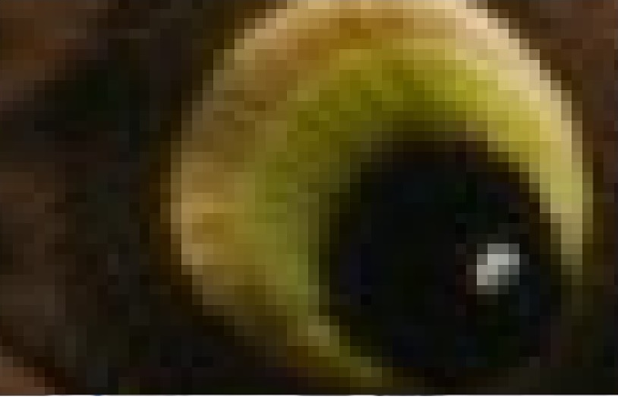
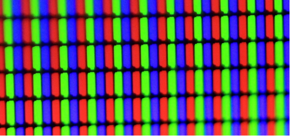
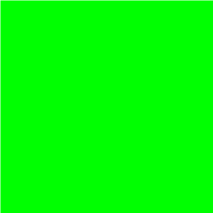
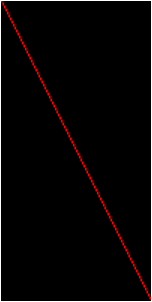
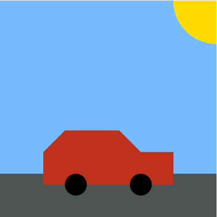

# Библиотеки Python.  Часть 2. Работа с графическими файлами 

## Аннотация

В [предыдущем уроке](python_library_1.md), посвященном модулям в Python, мы упоминали PyPI — кладезь библиотек для задач из разных областей. Обработка изображений — одна из таких областей, причем довольно обширная. С ней мы сегодня и познакомимся — у такого выбора есть целых три причины.

## Обработка изображений

**Во-первых**, люди, увлекающиеся фотографией, едва ли не самое многочисленное полупрофессиональное сообщество в мире. Его популярности очень способствует распространение смартфонов и сервисов по работе с фотографиями, таких как **Instagram** и **Pinterest**.

**Во-вторых**, работа с видео сводится к работе с отдельными изображениями. Это относится и к профессиональным техникам наложения фильтров, и даже к работе с хромакеем, без которой не обходится практически ни один современный фильм.

**В-третьих**, модель представления изображения в памяти компьютера довольно проста. Почти всегда это многомерный массив целых чисел. Даже на начальном этапе изучения программирования эта область интересна как для обучения, так и для применения на практике.

## Растровые изображения

Мы будем работать с растровыми изображениями, представляющими собой массив (таблицу) пикселей разных цветов.

Для работы с векторными изображениями существуют другие библиотеки, например **gizeh**.

Давайте посмотрим вот на это изображение.

Если мы приблизим его, увидим пиксели — минимальные единицы изображения, для которых можно определить цвет. Давайте увеличим глаз совы (кстати, ее зовут Рианна).


Итак, изображение можно моделировать списком списков (двумерной таблицей, в которой лежат цвета). Осталось только подумать, как именно кодировать цвета.



Опыт работы со строками, где каждому символу соответствует свой код, должен подсказывать вам, что и с изображениями должно быть так же. Мы можем пронумеровать некоторое количество цветов и указывать их номера в нашем списке списков. Совокупность выбранных цветов будет называться палитрой.

В итоге нам нужен способ преобразования цветов в целые числа. Мы воспользуемся В итоге нам нужен способ преобразования цветов в целые числа. Мы воспользуемся одной из самых популярных моделей представления цвета — **RGB (Red, Green, Blue)**.

В модели RGB каждый из цветов представляется совокупностью трех компонентов: красного, синего и зеленого. Значение каждого компонента лежит в диапазоне от 0 (минимум) до 255 (максимум), занимая 1 байт в памяти.

На самом деле модели хранения этих байтов в памяти Python и файле с картинкой бывают очень сложными — например, со сжатием. Однако мы будем работать с исходными, «чистыми» данными.

Итак, каждый цвет — совокупность трех целых чисел (в Python ее можно представить кортежем или списком). Кстати, сумма этих трех чисел говорит о яркости пикселя: чем сумма больше, тем пиксель кажется ярче. На самом деле и тут все сложнее, чем кажется: яркость каждого компонента для глаза неодинакова, однако примем это упрощение.

Например, (0, 0, 0) — черный цвет. Его яркость минимальна, оттенков нет.
- (255, 255, 255) — белый, максимальная яркость
- (255, 0, 255) — очень насыщенный пурпурный (красный + синий)
- (255, 255, 0) — ярко-желтый (красный + зеленый)
- (100, 100, 100) — серый

Красный, зеленый и синий выбраны в качестве основных цветов из-за особенностей цветовой чувствительности рецепторов нашего глаза. Кстати, если мы сильно увеличим матрицу смартфона или монитора, который светит чистым белым светом, увидим что-то вроде этого:

Да-да, это (255, 255, 255).



Итак, для нас изображение — список списков, элементами которого будут кортежи цвета.

Кстати, легко заметить, что в нашей модели всего `256×256×256 = 16777216` разных цветов. Этого вполне достаточно, чтобы человеческий глаз не замечал дискретности (конечного числа оттенков) цветовой модели.

## PIL. Установка библиотек

Для работы с изображениями мы будем использовать библиотеку **PIL (Python image library)**, а точнее, ее модификацию под названием **Pillow**.

## Установка пакетов

Для установки пакетов в Python служит специальная утилита командной строки `pip`, которая является еще и модулем.

Чтобы установить пакет, нужно выполнить команду `pip install <Имя модуля>`. Пакет будет скачан с PyPI и установлен, вы увидите примерно следующее:

```bash
c:\Python34\Scripts>pip install pillow
Collecting pillow
Downloading Pillow-4.0.0-cp34-cp34m-win32.whl (1.2MB)
100% |################################| 1.2MB 485kB/s
Collecting olefile (from pillow)
Downloading olefile-0.44.zip (74kB)
100% |################################| 81kB 1.7MB/s
Installing collected packages: olefile, pillow
Running setup.py install for olefile ... done
Successfully installed olefile-0.44 pillow-4.0.0
```

Кроме опции `install` в `pip`, доступны команды:

```bash
Usage:
pip [options]

Commands:
install            Install packages.
download           Download packages.
uninstall          Uninstall packages.
freeze             Output installed packages in requirements format.
list               List installed packages.
show               Show information about installed packages.
check              Verify installed packages have compatible dependencies.
search             Search PyPI for packages.
wheel              Build wheels from your requirements.
hash               Compute hashes of package archives.
completion         A helper command used for command completion.
help               Show help for commands.
```

**Pillow** — не чисто питоновская библиотека, она написана частично на языке С. Поэтому для некоторых версий Python может потребоваться компиляция кода доступным в системе С-компилятором, потому что pip сможет скачать только исходные коды библиотеки. Если такого компилятора нет (такое обычно бывает в windows-системах), стоит поискать скомпилированные версии в Интернете (готовые к установке файлы имеют расширение .whl). Например, множество популярных библиотек можно найти на странице сайта лаборатории флуоресцентной динамики Калифорнийского университета.

Кроме того, чтобы не задумываться о сложностях при установке библиотек, можно установить дистрибутив [Anaconda](https://www.anaconda.com/distribution/). В нем есть все необходимые библиотеки Python. И не только они.

## Модельный пример

Рассмотрим пример работы с изображением, в котором мы:

1. Пройдем по каждому пикселю в изображении.
2. Получим для него значение цвета в RGB-нотации.
3. Присвоим этому пикселю новое значение цвета (поменяем составляющие).
4. В конце сохраним получившееся изображение с новым именем.

Начальное изображение в этом примере никак не меняется, но от него можно отталкиваться в дальнейшей работе.

Итак, приступим.

Для работы нам потребуется файл с изображением — Рианна.jpg, который нужно сохранить в тот же каталог, где будут лежать программы по его обработке.

```python
from PIL import Image

im = Image.open("Рианна.jpg")
pixels = im.load() # список с пикселями
x, y = im.size # ширина (x) и высота (y) изображения

for i in range(x):  
    for j in range(y):
        r, g, b = pixels[i, j]
        pixels[i, j] = g, b, r

im.save("Рианна2.jpg")
```

Для работы с изображением нам нужен объект `Image`, который находится в библиотеке `PIL` (пишется большими буквами).

Мы открываем изображение с диска функцией `open`. В функции open в скобках указывается или абсолютный путь к файлу, или просто имя файла, если файл размещен в том же каталоге, что и сама программа.

Потом получаем список пикселей этого изображения, используя функцию `load`. Ее применяем к объекту, загруженному в переменную im. После применения функции получаем двумерный список, где для каждого пикселя хранится кортеж — цвет пикселя в палитре RGB.

> Обратите внимание: `pixels` устроен так, что индексация в нем идет кортежами, поэтому здесь запись `pixels[i, j]`, а не `pixels[i][j]`, что, возможно, было бы удобнее и привычнее. Это особенность библиотеки: создателям показалось, что так будет архитектурно уместнее.

С помощью атрибута `size` объекта im мы можем получить размер изображения, который хранится в виде кортежа: сначала ширину, потом высоту изображения в пикселях, что соответствует размерности `pixels`.

Далее переберем все элементы `pixels` (двумя циклами `for`) и для каждого элемента получим значение трех компонентов цвета. Запишем в массив `pixels` эти значения, но изменив порядок значений.

Для получения трех компонентов цвета каждого пикселя мы используем множественное присваивание, поэтому пишем

```python
r, g, b = pixels[i, j]
```

вместо

```python
pixel = pixels[i, j]
r = pixel[0]
g = pixel[1]
b = pixel[2]
```

Множественное присваивание позволяет писать более простой и лаконичный код. Именно так мы поступили и в случае с вычислением `x` и `у`.

Затем при помощи функции save сохраняем измененный список пикселей в файл изображения с именем Рианна2.jpg.

В данном случае появляется новая картинка в том же месте, где находилась начальная. Начальное изображение осталось без изменений, а новое получено из начального изменением значений цветовых компонентов для каждого пикселя.

## Создание изображений и рисование

С помощью библиотеки `PIL` мы можем не только изменять существующие изображения, но и создавать новые.

Для этого используется функция `Image.new`, которая принимает тип палитры (мы договорились использовать RGB), кортеж с размером нового изображения и цвет, которым будет залито это изображение. В данном примере создается изображение 500 на 500 пикселей, залитое зеленым:

```python
from PIL import Image

im = Image.new("RGB", (500, 500), (0, 255, 0))
print(im.size)
# Просто посмотрим, изображение какого размера у нас получилось
im.save("5.jpg")
```



Создавать однотонные изображения не особенно интересно, поэтому давайте посмотрим, какие возможности дает библиотека `PIL`, если нам хочется что-то нарисовать. Для этого нам надо обратить внимание на объект Draw из модуля `PIL.ImageDraw`. У этого объекта есть много инструментов для создания графических примитивов: прямых, кривых, точек, прямоугольников, дуг и т. д.

```python
from PIL import Image, ImageDraw

# создание изображения
new_image = Image.new("RGB", (100, 200), (0, 0, 0))
# на изображении создаем рисунок для рисования
draw = ImageDraw.Draw(new_image)
# рисуем линию
draw.line((0, 0, 100, 200), fill=(255, 0, 0), width=1)
# сохраним изображением в файл формата PNG
new_image.save('6.png', "PNG")
```

Этот пример создает новое черное изображение размером 100 на 200 и нарисует на нем линию красного цвета толщиной в 1 пиксель из левого верхнего в правый нижний угол. Вот получившееся изображение:



Для рисования нам надо передать наше открытое изображение в `ImageDraw.Draw`, а результат сохранить в переменную. Потом можно использовать у полученного объекта различные функции по рисованию примитивов, при этом результаты будут сразу применены к нашему открытому изображению.

Функция `line` нужна для рисования линий. Она принимает кортеж с координатами начала и конца отрезка и дополнительные параметры — цвет заливки и толщину линий. Можно передавать более 2 точек, тогда точки будут соединены последовательно — и мы получим некоторую ломаную линию.

Давайте рассмотрим еще один пример, который рисует вот такую картинку:



У нас есть функция `picture`, которая принимает на вход параметры картинки: ее размер и цвета. Такая организация кода удобна, если вам надо сделать несколько типовых изображений с небольшой разницей между друг другом. Обратите внимание: цвета можно задавать не только кортежем из 3 целых чисел, но и строкой с шестнадцатеричным представлением цвета. Коды цветов можно легко найти в Интернете по запросу «Барабан цветов».

Сначала мы создаем создаем изображение. Если не укажем цвет заливки, все пиксели получившегося изображения будут черными.

```python
im = Image.new("RGB", (width, height))
```

С помощью функции `rectangle`, которая рисует прямоугольники, нарисуем небо и дорогу. Функция принимает на вход координату левого верхнего угла прямоугольника и координату правого нижнего угла и цвет заливки.

```python
drawer.rectangle(((0, 0), (width, int(height * 0.8))), sky_color)
drawer.rectangle(((0, int(height * 0.8)), (width, height)), asphalt_color)
```

С помощью функции `ellipse` рисуем солнце. Функция принимает на вход координаты верхнего левого и правого нижнего угла прямоугольника, внутри которого будет вписан эллипс и цвет заливки. Для получения круга описанный прямоугольник должен быть квадратом. Обратите внимание: часть солнца находится за пределами изображения. При этом при рисовании никакой ошибки не возникнет — часть рисунка за пределами изображения просто пропадет.

```python
drawer.ellipse((
    (int(0.8 * width), -int(0.2 * height)),
    (int(1.2 * width), int(0.2 * height))),
    sun_color)
```

При рисовании корпуса автомобиля у нас появляется многоугольный элемент. Отдельной функции для рисования объекта именно такой формы в `PIL`, конечно, нет. Но можно использовать функцию `polygon`, которая принимает на вход неограниченное количество координат точек, которые соединяет между собой. Последняя точка соединяется с первой, а получившееся замкнутое пространство заливается цветом. С помощью нее можно рисовать любые многоугольники.

```python
drawer.polygon(((int(0.2 * width), int(height * 0.85)),
                 (int(0.2 * width), int(height * 0.7)),
                 (int(0.3 * width), int(height * 0.6)),
                 (int(0.55 * width), int(height * 0.6)),
                 (int(0.65 * width), int(height * 0.7)),
                 (int(0.8 * width), int(height * 0.7)),
                 (int(0.8 * width), int(height * 0.85))),
                car_color)
```

Затем с помощью уже известной нам функции `ellipse` дорисовываем колеса.

После сохраняем изображение. Обратите внимание: в функции `save` есть дополнительный опциональный аргумент, который указывает формат сохранения файла. Если формат не указан, `PIL` делает предположение исходя из расширения имени файла, который указан первым аргументом.

Весь код

```python
from PIL import Image, ImageDraw


def picture(file_name, width, height, sky_color='#75BBFD',
            asphalt_color='#4E5452', car_color='#bF311A',
            wheels_color='#000000', sun_color='#FFDB00'):
    im = Image.new("RGB", (width, height))
    drawer = ImageDraw.Draw(im)

    drawer.rectangle(((0, 0), (width, int(height * 0.8))), sky_color)
    drawer.rectangle(((0, int(height * 0.8)), (width, height)),
                     asphalt_color)
    drawer.ellipse((
     (int(0.8 * width), -int(0.2 * height)),
     (int(1.2 * width), int(0.2 * height))),
                   sun_color)

    drawer.polygon(((int(0.2 * width), int(height * 0.85)),
                    (int(0.2 * width), int(height * 0.7)),
                    (int(0.3 * width), int(height * 0.6)),
                    (int(0.55 * width), int(height * 0.6)),
                    (int(0.65 * width), int(height * 0.7)),
                    (int(0.8 * width), int(height * 0.7)),
                    (int(0.8 * width), int(height * 0.85))),
                   car_color)
    for i in range(2):
        drawer.ellipse(((int(0.3 * width) + int(0.3 * width) * i,
                         int(0.8 * height)),
                        (int(0.4 * width) + int(0.3 * width) * i,
                         int(0.9 * height))),
                       wheels_color)
    im.save(file_name)


picture('test.jpg', 1000, 1000)
```

В модуле `ImageDraw` есть еще ряд функций для рисования, а у рассмотренных функций есть интересные дополнительные параметры. Почитайте о них подробнее в документации. Вообще, [документация](https://pillow.readthedocs.io/en/stable/) — основной источник знаний. Если вы хотите использовать стороннюю библиотеку, старайтесь заглядывать туда почаще.


