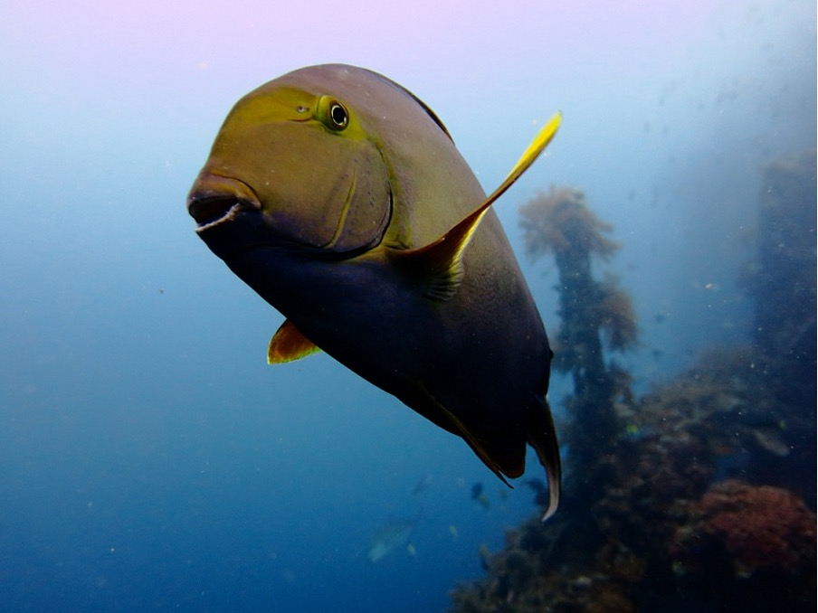
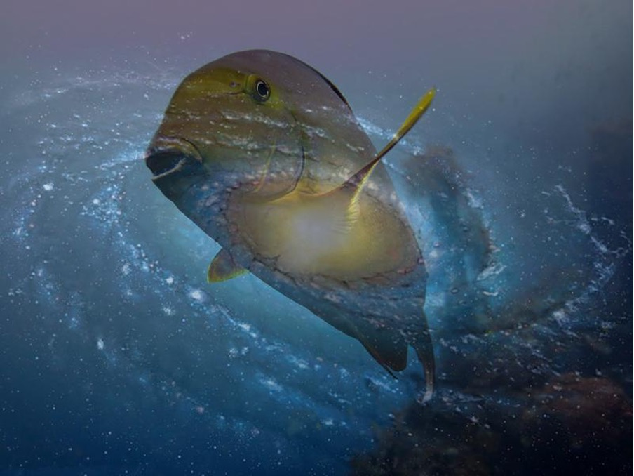
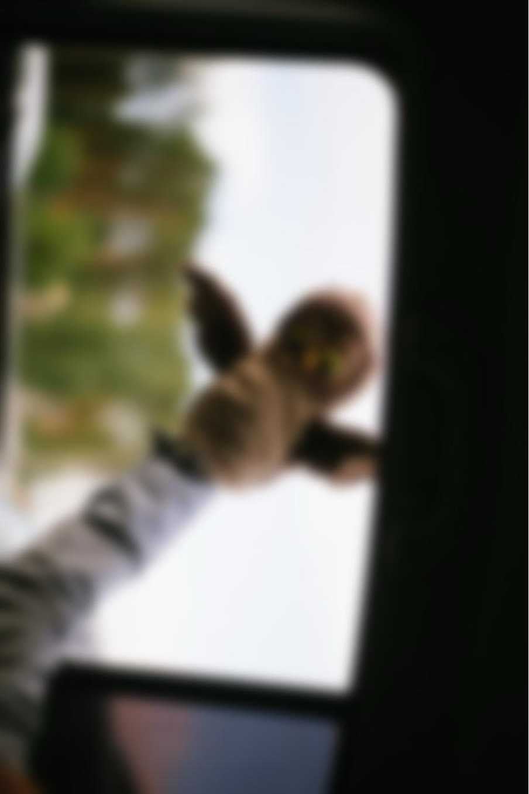

# Задачи

## Задача 1 {id="24_1"}

Напишите функцию `twist_image(input_file_name, output_file_name)`, которая будет менять местами левую и правую половины изображения.

Параметр `input_file_name` задаёт имя исходного файла, а `output_file_name` — имя файла, куда следует сохранить результат.

При передаче данного изображения:


должно получиться:


## Задача 2 {id="24_2"}

Два изображения можно совместить так, что одно из них будет как бы «полупрозрачным». Для этого значения цветовых компонент каждого совмещаемого пикселя обоих изображений нужно попарно суммировать с определёнными весовыми коэффициентами.

Например, если итоговый цвет (в нотации RGB) вычислять по формуле:

```bash
R = 0.8 * R1 + 0.2 * R2  
G = 0.8 * G1 + 0.2 * G2  
B = 0.8 * B1 + 0.2 * B2
```  

то получится, что первое изображение будет иметь 20 процентов прозрачности.

Продемонстрируем эффект прозрачности:






Напишите функцию `transparency(filename1, filename2)`, которая, используя `PIL`, смешивает изображения в пропорции 50/50.

### Формат ввода

Тестирующая система вызовет вашу функцию, передав в неё имена файлов с изображениями:

```python
transparency("image1.jpg", "image2.jpg")
```  

### Формат вывода

Результат смешивания изображений сохраните в файл с именем res.jpg в той же папке, где находится ваша программа.

### Примечания

Результат вычисления каждой компоненты нового пикселя необходимо приводить к целому числу с помощью функции `int`.

Например, так:
```python
r = int(0.2 * r1 + 0.8 * r2)
```

## Задача 3 {id="24_3"}

Мы очень любим мультфильм «Чип и Дейл». А вы?

Давайте попробуем написать функцию `chip_and_dale(number)`, которая сможет монозвуковой файл с любой речью переделать так, чтобы казалось, что слова произносит герой любимого нами мультфильма Чип.

Для этого надо ускорить воспроизведение.

В функцию передаётся натуральное число i из диапазона [2..5].

Необходимо прочитать файл `in.wav`, оставить каждый i-ый фрейм и сохранить результат в файле `out.wav`

В качестве образца по работе со звуковым файлом возьмите
<resource src="../assets/media/wave.wav">тут</resource>

## Задача 4 {id="24_4"}

Напишите функцию `motion_blur(n)` которая:
1. открывает изображение image.jpg
2. поворачивает его на 270 градусов против часовой стрелки без использования циклов (только встроенными средствами PIL)
3. обрабатывает полученное изображение с помощью размытия Гаусса (GaussianBlur) с параметром n
4. сохраняет результат в файле res.jpg

### Формат ввода

Изображение image.jpg в текущей папке


вызов функции:

```python
motion_blur(10)
```

### Формат вывода

Изображение res.jpg в текущей папке



## Задача 5 {id="24_5"}

Напишите функцию `break_the_silence()`, которая будет убирать тишину из 
<resource src="../assets/media/wave.wav">файла</resource>
и сохранять полученный результат в файле `out.wav`

Обратите внимание, что даже если мы не слышим звука в аудио-файле и не видим колебания звукового спектра на спектрограмме, это не значит, что в файле находится абсолютная тишина.

В реальности во фреймах участка музыкального файла будут небольшие колебания в диапазоне [-5; 5]. Именно такие фреймы ваша функция и должна считать содержащими только тишину.

## Задача 6 {id="24_6"}

Напишите функцию `make_preview(size, n_colors)` которая:

1. открывает изображение image.jpg
2. уменьшает его до размера size
3. уменьшает число цветов в изображении до `n_colors` (такая процедура называется квантование или `quantize`)
4. сохраняет результат в файле res.bmp

### Формат ввода

Изображение image.jpg в текущей папке.


вызов функции:

```python
make_preview((400, 200), 64)
```  

### Формат вывода


### Примечания

Обратите внимание, что результат сохраняется в формате **bmp**.


