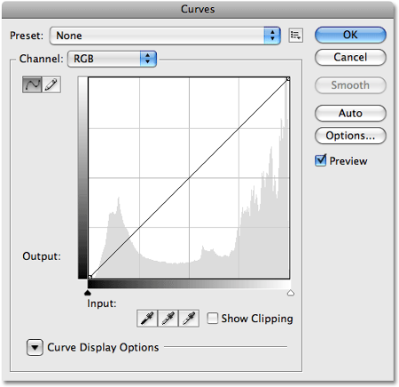

# Библиотеки Python. Часть 3. Работа с графическими файлами и звуком

## Фильтры

Когда-то Instagram превратился из заурядной социальной сети в очень популярный феномен именно из-за удачной реализации встроенных фильтров. Фильтры можно было накладывать на фотографии, которые после этого обычно становились красивыми, похожими на профессиональные.

Фильтры очень широко применяются в киноиндустрии. Сравните цветовую гамму молодежных комедий или современных блокбастеров, например, с классическим «Шерлоком Холмсом».

Иначе говоря, фильтры невероятно востребованы — начиная от самых простых и заканчивая работами с привлечением искусственного интеллекта: например, в проекте **Prisma**.

Фильтр можно воспринимать как любое преобразование заданного изображения.

Чтобы добиться лучшего эффекта, их можно накладывать последовательно.

В библиотеке `PIL` реализовано много встроенных фильтров и инструментов (вырезание, изменение размеров и т. д.). Фактически это такой программируемый мини-Photoshop, но мы попытаемся поработать с фильтрами самостоятельно, чтобы поучиться восприятию цветовой палитры и алгоритмизации.

Для начала попробуем превратить изображение в черно-белое.

### Черно-белое

Черно-белое изображение содержит только информацию о яркости, но не о цветах. У таких изображений все три компоненты имеют одинаковое значение, поэтому мы можем просто «размазать» суммарную яркость пикселя поровну по трем компонентам.

```python
for i in range(x):  
    for j in range(y):
        r, g, b = pixels[i, j]
        bw = (r + g + b) // 3
        pixels[i, j] = bw, bw, bw
```


Можно сказать, что мы слили содержимое контейнеров R, G, B в одну емкость, а затем разлили обратно, но уже поровну в каждый контейнер. Суммарная яркость пикселя осталась прежней, но информация о цвете не сохранилась. Фотография же стала более «задумчивой».
Попробуем поменять местами зеленый и синий каналы:

###  Смена цветов

```python
for i in range(x):  
    for j in range(y):
        r, g, b = pixels[i, j]
        pixels[i, j] = r, b, g
```


### Негатив

Давайте подумаем над тем, как получить негатив. Если в позитиве белое изображение (255), в негативе должно быть черное (0) и наоборот. То есть для значения х негативом будет 255 — x.

```python
for i in range(x):  
    for j in range(y):
        r, g, b = pixels[i, j]
        pixels[i, j] = 255 - r, 255 - g, 255 - b
```


Как видим, в негативе можно рассмотреть некоторые детали, которые не видны в позитиве.

### Кривые

Во многих редакторах, включая Photoshop, есть инструмент «Кривые» (Curves).

Он позволяет задать функцию, меняющую яркость всего пикселя или отдельной компоненты в зависимости от исходной яркости. Изначально эта функция представляет собой прямую y = x.

В Python можно написать функцию, которая работает как инструмент Curves. Например, мы можем высветлить темные участки в изображении, не трогая светлые. Это очень частая операция: например, когда на снимке светлое небо и очень темное здание, потому что фотоаппарат подстроился под яркость неба.



«Высветлить» означает увеличить значения всех цветовых компонентов на какой-то коэффициент. Важно помнить, что эти значения не могут быть больше 255.

```python
def curve(pixel):
    r, g, b = pixel
    brightness = r + g + b
    if brightness < 60:
        k = 60 / brightness
        return (
            min(255, int(r * k ** 2)),
            min(255, int(g * k ** 2)),
            min(255, int(b * k ** 2))
        )
    else:
        return r, g, b


for i in range(x):
    for j in range(y):
        pixels[i, j] = curve(pixels[i, j])
```


## Готовые функции

Как мы уже говорили раньше, в PIL есть большое число встроенных инструментов для изменения изображений. Продолжим эксперименты над нашим изображением совы.

Например, мы можем изменить размер изображения с помощью функции `resize`, в которую кортежем передается новый размер изображения. Обратите внимание: все подобные функции не изменяют исходное изображение, а возвращают его измененную копию.

```python
from PIL import Image
 
im = Image.open("2.jpg")
im2 = im.resize((100, 100))
im2.save('6.jpg')
```


С помощью функции `crop` вырезать прямоугольный кусочек из изображения. В функцию передаются координаты верхнего левого и правого нижнего угла вырезаемого прямоугольника одним кортежем.

```python
from PIL import Image
 
im = Image.open("2.jpg")
im2 = im.crop((200, 200, 500, 500))
im2.save('7.jpg')
```


Функция `quantize` используется для сокращения цветов в палитре изображения и используется для создания миниатюр для предпросмотра. Принимает на вход число меньшее 256 — количество цветов. Обратите внимание: эта функция также преобразовывает изображение в формат `bmp`.

```python
from PIL import Image
 
im = Image.open("2.jpg")
im2 = im.quantize(16)
im2.save('8.bmp')
```


В задачах прошлого урока вы пробовали вращать и отражать изображения, манипулируя пикселями напрямую, однако PIL содержит уже готовые реализации данных алгоритмов. Повороты и отражения изображения можно выполнить с помощью функции `transpose`, в которую передается тип преобразования. Это может быть отражение слева направо, или сверху вниз, или повороты на 90, 180 или 270 градусов.

```python
from PIL import Image
 
im = Image.open("2.jpg")
im2 = im.transpose(Image.FLIP_LEFT_RIGHT).transpose(Image.ROTATE_90)
# Image.FLIP_LEFT_RIGHT, 
# Image.FLIP_TOP_BOTTOM, 
# Image.ROTATE_90, 
# Image.ROTATE_180, 
# Image.ROTATE_270
im2.save('9.jpg')
```


Благодаря тому, что преобразование возвращает измененное изображение, можно создавать цепочки преобразований.

Библиотека PIL содержит в себе много любопытного: например, в модуле `ImageOps` есть встроенные реализации превращения изображения в негатив (функция `invert`) и в черно-белое изображение (функция `grayscale`), а в модуле `ImageFilter` находятся встроенные интересные фильтры изображений, один из которых мы рассмотрим. Этот фильтр называется размытие Гаусса и принимает на вход радиус размытия.

```python
from PIL import Image, ImageFilter
 
im = Image.open("2.jpg")
im2 = im.filter(ImageFilter.GaussianBlur(radius=5))
im2.save('10.jpg')
```


## Модуль wave

Фильтры можно накладывать не только на изображения, но и на звуковые файлы. Для манипуляции с «сырыми», необработанными аудиоданными предназначен модуль wave. В ОС Windows такие данные хранятся в файлах с расширением .wav.

«Сырые» аудиоданные представляют собой зависимость амплитуды звукового сигнала от времени. Посмотрите на график этой зависимости. Вы часто видели его в фильмах, репортажах журналистов и т. д.

Вдоль оси абсцисс откладывается время, вдоль оси ординат — амплитуда (интенсивность, громкость) звукового сигнала.

Этот график строится по точкам, причем вместо пар (t, y) хранятся только значения y, а ось абсцисс задана частотой дискретизации (количеством отсчетов в секунду) — как правило, она составляет 44 100 Гц. Такой частоты достаточно, чтобы человек мог прослушать оцифрованный звук и не заметить его отличия от реального.


Получается, что представление звукового файла для программиста очень простое. Это список целых чисел (положительных и отрицательных) — значений амплитуды звукового сигнала.

В следующем примере мы рассмотрим основные этапы работы со звуковым файлом.
Наша программа будет разворачивать звуковой файл в обратную сторону, то есть проигрывать музыкальное произведение задом наперед.

Файл для примера можно скачать <resource src="../assets/media/wave.wav">тут</resource>

```python
import wave
import struct
 
source = wave.open("in.wav", mode="rb")
dest = wave.open("out.wav", mode="wb")

dest.setparams(source.getparams())
# найдем количество фреймов
frames_count = source.getnframes() 
 
data = struct.unpack("<" + str(frames_count) + "h",
    source.readframes(frames_count))
 
# собственно, основная строка программы - переворот списка
newdata = data[::-1] 
 
newframes = struct.pack("<" + str(len(newdata)) + "h", *newdata) 
 
# записываем содержимое в преобразованный файл.
dest.writeframes(newframes) 
source.close()
dest.close()
```

Мы открываем два файла: исходный `source` и формируемый `dest`.

Одно значение амплитуды в терминах библиотеки wave называется фреймом.

Наибольшую трудность здесь представляют строки с использованием встроенного модуля `struct`. Пока договоримся, что функции этого модуля могут на лету распаковывать и запаковывать данные разной природы.

Модуль `struct` позволяет паковать и извлекать несколько значений в бинарные структуры. Это чем-то похоже на структуры в С. В примере со звуковыми волнами значение y хранится как знаковое двухбайтное число. Поэтому извлечение выглядит так странно.

Интересно, что палиндромы в аудиофайлах сохраняют свою «палиндромность» (например, «А роза упала на лапу Азора»).

Что еще можно сделать?

- Если мы уберем, например, каждый второй фрейм, ускорим воспроизведение вдвое. При этом частота тоже вырастет в два раза (и вы услышите голоса Чипа и Дейла). Кстати, на телевидении и радио часто ускоряют видео и аудио на 5-10%: это незаметно для уха, но позволяет разместить больше рекламы в эфире
- Если мы увеличим все фреймы в какое-то количество раз, сделаем произведение громче, а если уменьшим — тише.
- Копируя каждый фрейм два раза, мы замедлим воспроизведение и понизим частоту

Если вы заинтересовались обработкой аудиофайлов, обратите свое внимание на библиотеки `pydub` и `librosa`.
