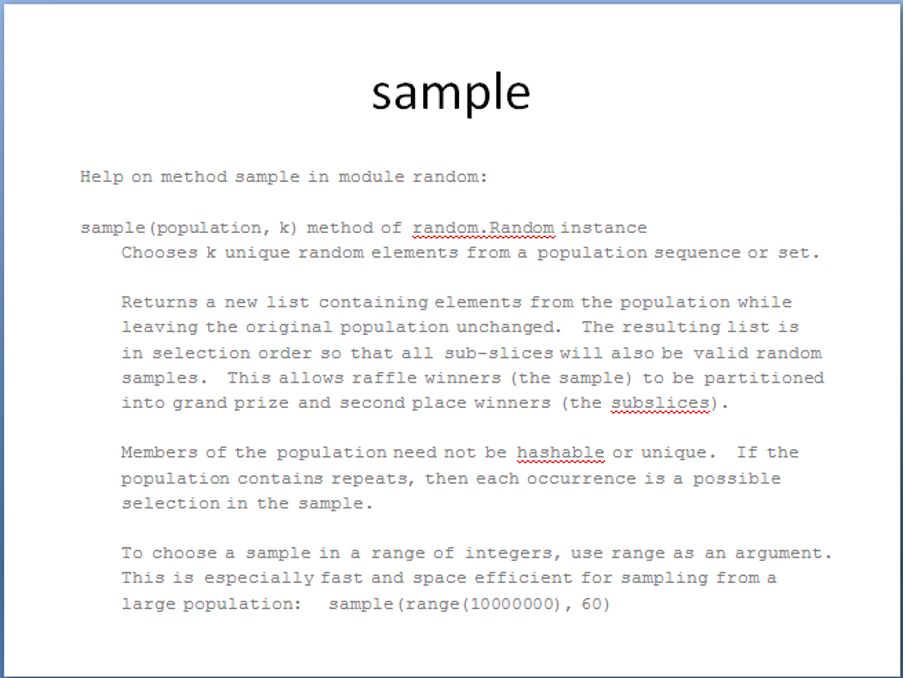
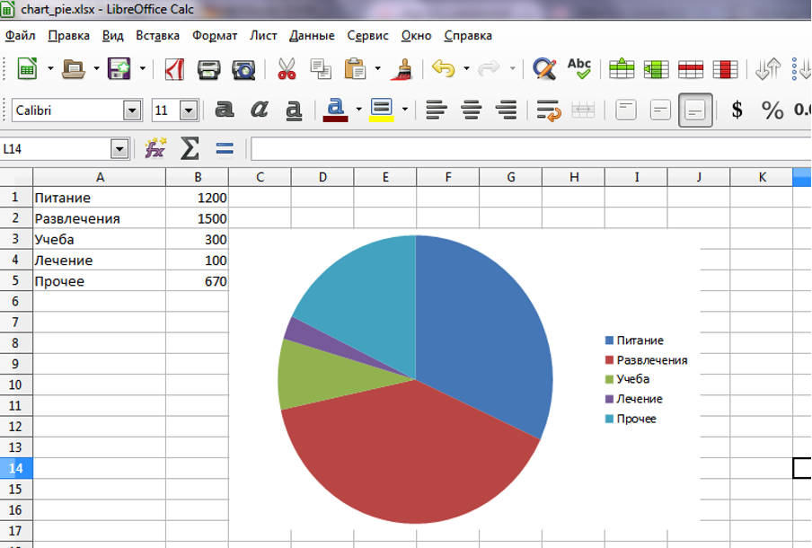

# Задачи

## Задача 1 {id="26_1"}

Ваш классный руководитель попросил помочь ему в подготовке мероприятия к празднику 8 марта.

Вам нужно подготовить приглашения для ваших одноклассниц в документе Word, для каждой – на отдельной странице.

На вход вашей программы подаются данные: место проведения, время мероприятия, а затем ФИО приглашенных девочек (количество строк заранее неизвестно).

### Формат ввода

```bash
В нашем актовом зале  
В 12:30  
Кругляк Елена Степановна  
Иванова Марина Владимировна  
...  
Лескова Анастасия Федоровна
```

## Задача 2 {id="26_2"}

Сформируйте презентацию PowerPoint в формате pptx, в которой рассказывается о некоторых методах модуля `random` (не менее 5).

Каждый метод должен быть размещен на отдельном слайде.

Информацию о методах нужно раздобыть с помощью функций `help` и `dir`.
Формат вывода

Презентация res.pptx в папке с программой. Каждый слайд состоит из заголовка и текста. 

Текст набран шрифтом Courier New.



## Задача 3 {id="26_3"}

Напишите функцию `create_training_sheet`, которая с использованием библиотеки `docxtpl` генерирует учебную ведомость.

Функция должна принимать на вход:
1. строку `class_name` - номер класса, 
2. строку `subject_name` - название предмета, 
3. строку `tpl_name` - имя шаблона документа, по умолчанию "tpl.docx"
4. неограниченное количество кортежей строк, которые содержат ФИО ученика в нулевом элементе и оценку за год для этого ученика.

Функция должна генерировать документ по шаблону `tpl_name` и сохранять его под именем "res.docx".

В качестве параметра шаблон принимает:
1. строку `class_name` - номер класса, 
2. строку `subject_name` - название предмета, 
3. список словарей `marks` - где каждый словарь содержит ключи `num`, `fio` и `mark` которые содержат номер ученика по алфавиту, ФИО ученика и его оценку за год соответственно.

Ученики должны быть упорядочены по алфавиту.

### Формат ввода

```python
create_training_sheet("3И", "Математика", "tpl.docx",  
    ("Петров Петр", "5"),  
    ("Иванов Иван", "5"),  
    ("Сергеев Сергей", "3"),  
    ("Никитин Никита", "4")
)
```

Пример шаблона <resource src="../assets/docs/tpl.docx">tpl.docx</resource>

### Формат вывода

Пример результата <resource src="../assets/docs/res.docx">res.docx</resource>

## Задача 4 {id="26_4"}

Сформируйте документ Excel, в котором по поданным на вход данным строится круговая диаграмма.

### Формат ввода

Несколько строчек, в каждой — название параметра и его числовое значение (целое число), разделённые пробелом.

```bash
Питание 1200  
Развлечения 1500  
Учеба 300  
Лечение 100  
Прочее 670
```

### Формат вывода

Файл res.xlsx в папке с программой. Данные должны быть размещены в колонках A и B. Диаграмма – в колонке C3.



## Задача 5 {id="26_5"}

Константин уезжает на каникулы к бабушке в деревню, Интернет там не работает. Однако в свободное время он хотел почитать документацию на некоторые библиотеки Python. Проблема в том, что документация к библиотекам написана в формате [Markdown](https://ru.wikipedia.org/wiki/Markdown) и в обычном офисном пакете не открывается нормально.

Помогите Константину и напишите функцию `markdown_to_docx(text)`, которая принимает текст, содержащий на первой строке название документа, а потом – несколько строк с содержимым документа в формате Markdown, создаёт документ и сохраняет его в файле res.docx.

В этот раз нам немного повезло, и документация может содержать только следующие элементы:
- заголовки уровней 1-6;
- одноуровневые (то есть не содержащие вложенных) нумерованные и ненумерованные списки;
- абзацы обычного, наклонного, жирного и наклонно-жирного текста. Стиль распространяется на весь абзац. Вложенного оформления не бывает.

На пустые строки Markdown создаются пустые строки в документе.

### Формат ввода

Строка с названием документа, а затем его содержание на нескольких строках в формате Markdown в параметре `text`.

### Формат вывода

Сохранённый на диске в директории с программой файл res.docx со сконвертированным содержимым.

## Задача 6 {id="26_6"}

Константин снова уезжает на каникулы и хочет взять с собой документацию. Только в этот раз структура документации значительно сложнее, и поэтому необходимо модифицировать конвертер, который вы написали в задаче «Простая документация в дорогу».

Помогите Константину и напишите новый конвертер, который принимает на вход название документа, а потом несколько строк с содержимым документа в формате Markdown. Ваш конвертер должен создавать документ Word и сохранять его в файле <название документа>.docx.

Помимо элементов, с которыми уже умеет работать предыдущая программа, она должна также корректно обрабатывать: обычный, наклонный, жирный и наклонно-жирный текст внутри обычных абзацев, нумерованных и ненумерованных списков. Обратите внимание, что внутри жирного текста может быть кусочек наклонного текста, и тогда он должен быть написан наклонно-жирным стилем (такое верно и для жирного текста внутри наклонного).

На пустые строки Markdown создаются пустые строки в документе только в том случае, если эта строка не первая после строки с текстом.

### Формат ввода

Строка с названием документа, а затем его содержимое на нескольких строках в формате Markdown.

### Формат вывода

Сохранённый на диске в директории с программой файл <название документа>.docx со сконвертированным содержимым.

## Задача 7 {id="26_7"}

Напишите функцию `export_check(text)`, которая принимает на вход текст, где каждая строка состоит из:
1. названия товара (строка)
2. цены за единицу товара (вещественное число)
3. количества единиц товара (целое число)

(Значения внутри строки разделены символом табуляции).

Ваша программа должна обработать полученные данные и создать документ Excel res.xlsx, в котором будут следующие столбцы:
- «Товар», «Цена за единицу товара», «Количество товара», «Общая стоимость товара» (названия столбцов выводить не надо)
- В столбце «Общая стоимость товара» должна содержаться формула, которая рассчитывает общую стоимость товара как произведение цены и количества товара (с использованием простого перемножения ячеек)
- Последней строкой должно идти «Итого», c пустыми значениями в столбцах «Цена за единицу товара» и «Количество товара».
- В столбце «Общая стоимость товара» должна содержаться формула, которая считает общую сумму покупок. (с использованием функции Excel СУММ)

### Формат ввода

Текст из нескольких строк в параметре `text`.

### Формат вывода

Документ res.xlsx с преобразованными данными.

