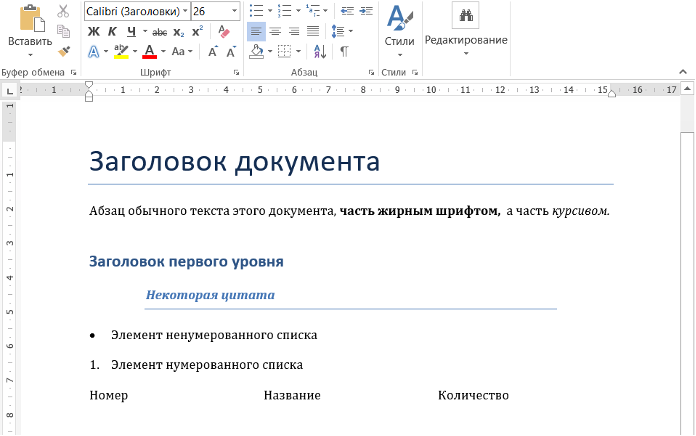
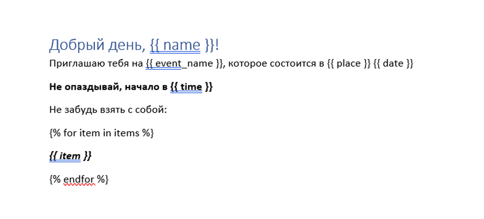
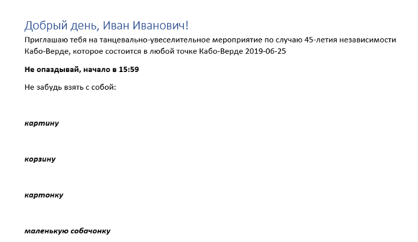
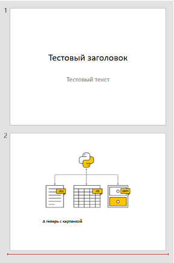
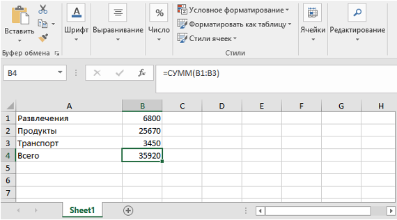
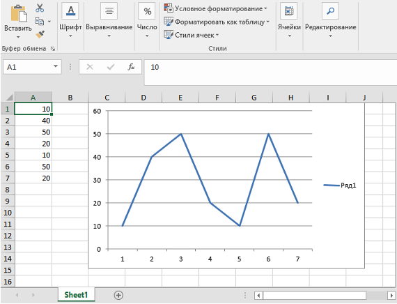

# Библиотеки Python.  Часть 5. Документы 

## Аннотация

Сегодня мы поговорим о библиотеках по работе с документами (текстами, презентациями, таблицами). Эти библиотеки можно использовать для автоматизации документооборота. Например, можно формировать документы: макеты презентаций, налоговую отчетность, открытки с поздравлениями.

## Работа с документами

Довольно часто при разработке возникает необходимость программно создать какой-то документ или внести изменения в уже существующий. Работая с текстами разной направленности из кода, нужно принять во внимание, что тексты иногда хранятся в более сложных форматах, чем .txt. Они могут содержать встроенное форматирование, быть разделенными на страницы, перемежаться медиаконтентом (графиками, рисунками).

Python умеет работать со многими такими документами. Давайте посмотрим, что можно сделать, чтобы создавать документы в формате Word, Excel или PowerPoint прямо из Python.

Стоит отметить, что форматы `.docx`, `.xlsx` и `.pptx` открытые, что позволяет разработчикам довольно просто писать библиотеки для работы с ними. Для каждого офисного формата есть несколько библиотек с разным функционалом, и мы рассмотрим лишь некоторые из них.

### Создание текстового документа

Давайте воспользуемся модулем `python-docx` для создания docx-документа. Он, как и остальные приведенные в данном уроке библиотеки, не входит в состав стандартной библиотеки и требует отдельной установки через `pip`.

```bash
pip install python-docx
```

После установки давайте рассмотрим вот такой пример:

```python
from docx import Document
from docx.shared import Inches

document = Document()

document.add_heading('Заголовок документа', 0)
document.add_paragraph('Абзац без форматирования')

# тут у нас будет более сложный абзац
p = document.add_paragraph('Часть абзаца обычным текстом, ')
p.add_run('часть жирным шрифтом, ').bold = True
p.add_run(' а часть ')
p.add_run('курсивом.').italic = True

document.add_heading('Заголовок первого уровня', level=1)
document.add_paragraph('Некоторая цитата', style='Intense Quote')

document.add_paragraph('Элемент ненумерованного списка', 
                       style='List Bullet')
document.add_paragraph('Элемент нумерованного списка', 
                       style='List Number')

table = document.add_table(rows=1, cols=3)
hdr_cells = table.rows[0].cells
hdr_cells[0].text = 'Номер'
hdr_cells[1].text = 'Название'
hdr_cells[2].text = 'Количество'

document.save('test.docx')
```

Ключевой элемент этой библиотеки — объект `Document`. Для создания нового документа формата .docx надо записать результат вызова `Document` в переменную. Этого достаточно для создания абсолютно пустого документа в памяти. Чтобы наполнить его содержимым, необходимо вызывать у получившегося объекта различные методы, например:

- `add_heading` — для создания заголовков разного уровня. При этом уровень 0 — заголовок документа
- `add_paragraph` — для создания абзацев. С помощью параметра `style` можно управлять стилем абзаца и превращать его элемент маркированного или нумерованного списка

Метод `add_paragraph` объекта-документа возвращает новый абзац, у которого есть свои методы вроде `add_run`, который дописывает текст с форматированием или без него в конец абзаца.

Метод `add_table` создает в документе таблицу размером `col` столбцов и `row` строк. Если мы присвоим результат вызова этой функции переменной, сможем заполнить такую таблицу данными.

Метод `save` сохраняет документ под указанным именем.



С помощью `python-docx` можно не только создавать новые документы, но и открывать уже существующие. Для этого при создании документа надо в качестве параметра передать путь к файлу или просто его имя, если он находится в каталоге с программой.

Таким образом, мы можем получить абзацы или другие элементы документа, пройтись по ним и получить либо изменить какую-то информацию:

```python
from docx import Document

document = Document('test.docx')
for par in document.paragraphs:
    print(par.text)

for table in document.tables:
    print(table.rows[0].cells[0].text)
```

```bash
Заголовок документа
Абзац без форматирования
Часть абзаца обычным текстом, часть жирным шрифтом,  а часть курсивом.
Заголовок первого уровня
Некоторая цитата
Элемент ненумерованного списка
Элемент нумерованного списка
Номер
```

Как мы увидим дальше, работа с подобными модулями примерно одинакова. Все элементы управления и форматирования:
- Списки
- Абзацы
- Таблицы
- Ячейки

есть в наличии в том или ином виде, их можно изменять и комбинировать.

### Работа с документом как с шаблоном

Очень распространенным вариантом использования является не создание документа с нуля, а заполнение данными уже готового шаблона. Для этого можно использовать библиотеку `docxtpl`.

```bash
pip install docxtpl
```

Например, у нас есть вот такой шаблон приглашения на мероприятие:



C помощью двойных фигурных скобок выделены места в документе, куда мы можем подставить свои данные по имени. Кроме того, шаблоны поддерживают специальный синтаксис для циклов, условий и других конструкций. Внутри `docxtpl` лежит мощный и простой в использовании движок шаблонов `jinja2`. 

```python
from docxtpl import DocxTemplate
import datetime as dt

doc = DocxTemplate("tpl.docx")
context = {
    'name': 'Иван Иванович',
    'event_name': "танцевально-увеселительное мероприятие по случаю
    45-летия независимости Кабо-Верде",
    'place': "любой точке Кабо-Верде",
    'date': dt.date.today(),
    'time': dt.datetime.now().strftime("%H:%M"),
    'items': ["картину",
              'корзину',
              "картонку",
              "маленькую собачонку"]
}
doc.render(context)
doc.save("res.docx")
```

При работе с этой библиотекой нам надо воспользоваться классом `DocxTemplate`, при создании экземпляра которого необходимо передать имя нашего документа, который содержит шаблон. После чего нужно создать словарь и заполнить его информацией для вставки в документ. Значения из нашего словаря будут подставляться в шаблон по ключу. Метод `render` как раз и отвечает за такое заполнение. Метод `save` сохраняет документ под переданным именем.

В итоге у нас получится вот такой документ:



## Создание презентаций

Для работы с презентациями формата .`pptx` в Python есть библиотека `python-pptx`.

```bash
pip install python-pptx
```

Принцип ее работы во многом схож с библиотекой `python-docx`, но здесь ключевым элементом, с которым идет работа, выступает не `Document`, а `Presentation`.
Напишем следующий код:

```python
from pptx import Presentation
# создаем новую презентацию
prs = Presentation()
# получаем схему расположения элементов для заголовочного слайда
title_slide_layout = prs.slide_layouts[0]
# создаем заголовочный слайд
slide = prs.slides.add_slide(title_slide_layout)
# создаем у слайда заголовок и текст
title = slide.shapes.title
print("Контейнер для текста:", slide.placeholders[1])
subtitle = slide.placeholders[1]
title.text = "Тестовый заголовок"
subtitle.text = "Тестовый текст"
# создаем новый слайд со схемой для добавления изображений
slide = prs.slides.add_slide(prs.slide_layouts[8])
slide.shapes.title.text = "А теперь с картинкой"
# добавляем изображение
print("Контейнер для изображения:", slide.placeholders[1])
placeholder = slide.placeholders[1]
placeholder.insert_picture('1jpg.jpg')
# сохраняем презентацию
prs.save('test.pptx')
```

```bash
Контейнер для текста: <pptx.shapes.placeholder.SlidePlaceholder object
at 0x05DCF3B0>
Контейнер для изображения: <pptx.shapes.placeholder.PicturePlaceholder
object at 0x014324D0>
```

Обратиться к слайдам презентации можно через атрибут `slides` презентации. В свою очередь у `slides` есть метод `add_slide`, который добавляет новый слайд в презентацию. Данный метод принимает на вход схему нового слайда. Подробнее о схемах слайдов смотрите в документации. Но, например, нулевая схема предназначена для создания заголовочного слайда, а восьмая — для слайда с изображением.

На слайде, в зависимости от схемы, по которой он создан, могут быть разные контейнеры для содержимого, которые называются `placeholders`. Бывают контейнеры для текста, изображения, таблицы или графика. У текстового контейнера `SlidePlaceholder` есть свойство text, которое задает текст.
У контейнера для изображения `PicturePlaceholder` есть метод `insert_picture`, который добавляет переданное изображение на слайд.

Метод `save` презентации сохраняет презентацию под переданным именем.
Вот такая презентация у нас получится в итоге:



Как и в случае с документами, мы можем открыть уже существующую презентацию и получить или изменить какие-либо данные.

```python
from pptx import Presentation

prs = Presentation('test.pptx')
slide = prs.slides[0]
print(slide.placeholders[0].text)
```

```bash
Тестовый заголовок
```

## Создание таблиц Excel

Для работы с файлами формата `.xlsx` есть несколько библиотек, одна из них — `xlswriter`, предназначенная только для создания xlsx-файлов.

```bash
pip install xlsxwriter
```

Принцип работы с этой библиотекой очень схож с рассмотренными ранее, но с небольшими оговорками. Уже при создании документа нам необходимо передавать имя, под которым этот документ будет сохранен в конце.

```python
import xlsxwriter
  
workbook = xlsxwriter.Workbook('Суммы.xlsx')
worksheet = workbook.add_worksheet()
 
data = [
    ('Развлечения', 6800),
    ('Продукты', 25670),
    ('Транспорт', 3450)
]
for row, (item, price) in enumerate(data):
    worksheet.write(row, 0, item)
    worksheet.write(row, 1, price)
row += 1
worksheet.write(row, 0, 'Всего')
worksheet.write(row, 1, '=SUM(B1:B3)')
 
workbook.close()
```

Потом с помощью метода `add_worksheet` надо добавить страницу в документ. У добавленной страницы можно вызывать метод `write`, который записывает в определенную строку и колонку переданные данные.



С помощью метода `add_chart` можно создать диаграмму, указав ее тип и данные для построения. После чего построенную диаграмму можно добавить на страницу с помощью метода `insert_chart` с указанием ячейки вставки и самой диаграммы.

```python
import xlsxwriter
 
workbook = xlsxwriter.Workbook('диаграммы.xlsx')
worksheet = workbook.add_worksheet()
# Данные
data = [10, 40, 50, 20, 10, 50, 20]
worksheet.write_column('A1', data)
# Тип диаграммы
chart = workbook.add_chart({'type': 'line'})
# Строим по нашим данным
chart.add_series({'values': '=Sheet1!A1:A7'})
 
worksheet.insert_chart('C1', chart)
workbook.close()

```


Для чтения информации из xlsx-файлов часто используется библиотека `xlrd`, а с помощью `openpyxl` можно как создавать, так и читать и редактировать файлы формата .xlsx. Рассмотрите примеры использования этих библиотек самостоятельно.

