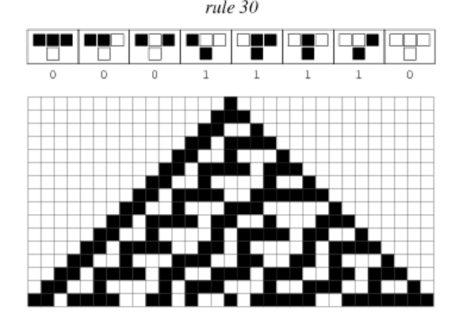

# Задачи

## Задача 1 {id="27_1"}

Представьте, что вы пишете компьютерную игру «Шахматы».

Вам надо смоделировать шахматную доску, которая представляет собой numpy-матрицу. Чёрная клетка представляется нулём, а белая — единицей. Если смотреть на доску сверху, то левая верхняя клетка — белая.

Вы уже практически реализовали задачу, ведь вы знаете, что у шахматной доски 8 столбцов и 8 строк, но заказчик вдруг изменил требования и заявил, что в его игре доска может быть произвольного размера, но всегда квадратной, например, 50х50.

Напишите функцию z, в которую поступает размер доски и которая возвращает требуемый массив `numpy`. Тип элементов массива должен быть `np.int8`.

### Формат ввода

```python
print(make_field(5))
```

### Формат вывода

Полученный массив

## Задача 2 {id="27_2"}

Змейка «ползёт» по матрице по чётным строкам слева направо, а по нечётным – справа налево, заполняя матрицу последовательно натуральными числами.

Напишите функцию `snake(rows, cols)`, которая заполняет матрицу указанным образом и возвращает её.

### Формат ввода

```python
snake(5, 7)
```  

### Формат вывода

Полученная матрица

## Задача 3 {id="27_3"}

Честно говоря, чаще приходится сортировать матрицы по строкам, но в этой задаче вам надо будет упорядочивать столбцы матрицы.

Напишите функцию `super_sort(rows, cols)`, в которую поступают размеры матрицы. Вам необходимо:
1. заполнить матрицу А случайными целыми числами из диапазона [1..100]
2. сделать копию этой матрицы в матрицу B
3. упорядочить чётные столбцы матрицы B по возрастанию, а нечётные — по убыванию

Верните кортеж, состоящий из матриц А и B.

### Формат ввода

```python
super_sort(3, 5)
```

## Задача 4 {id="27_4"}

По ссылке можно <resource src="../assets/docs/ABBREV.csv">скачать файл</resource>. Это – текстовый файл в кодировке UTF-8, в котором записана таблица данных, а данные в строчках разделены символом «точка-с-запятой».

Файл создан департаментом сельского хозяйства США и в нём указаны продукты и содержание в них некоторых витаминов, минералов, а также калорийность на единицу массы.

Для чтения данных из этого файла в объект `numpy.ndarray` воспользуйтесь методом `genfromtxt()` из библиотеки `numpy`.

```python
table = np.genfromtxt(’ABBREV.csv’, delimiter=’;’, dtype=None,
    names=True, encoding="utf8")
```

Вычислите и выведите на отдельных строчках названия самого-самого продукта по различным критериям.
- Cамый калорийный. Если их несколько, то выведите тот, у кого название в словаре стоит позже всех других.
- Самый полезный по содержанию сахара. Если их много, то выведите тот, у кого название в словаре стоит на первом месте.
- Самый протеино-накачанный. Если имеется несколько вариантов, то снова выведите младший в словаре по названию.
- Самый богатый витамином С. Такой продукт точно один.

### Формат вывода

Названия продуктов по одному на каждой строке.

### Примечания

Помните, что «самый-самый» – это не обязательно максимальная характеристика.
Поиск продуктов необходимо выполнять только c использованием средств библиотеки numpy.

## Задача 5 {id="27_5"}

На шахматной доске размером n×n необходимо расставить n ферзей таким образом, чтобы ни один из них не атаковал другого.

Напишите для этого функцию `queens(size)`, где `size` – это размер доски `(size > 2)`.

### Формат ввода

```python
queens(5)
```

### Формат вывода

Все решения в порядке возрастания.
Например, для доски 8×8 решение выглядит так:

```bash
15863724  
...  
84136275
```

Каждая цифра указывает вертикальную координату одного ферзя (по условию задачи два ферзя не могут находиться на одной вертикали). Первая цифра относится к горизонтали А, вторая – к B и т.д. Например, решение

```bash
15863724
```

нужно интерпретировать так: ферзи на клетках (A;1), (B;5), (C;8), ..., (H;4) – первый символ – координата по горизонтали, второй – по вертикали.


## Задача 6 {id="27_6"}



На рисунке показано несколько поколений одномерного клеточного автомата. У каждой клетки только два соседа — слева и справа, а поле представляет собой бесконечную полосу клеток (правый сосед последней клетки – это первая клетка, а левый сосед первой клетки – последняя). Эволюция идёт сверху вниз: первое поколение приведено в верхней строчке, второе — во второй сверху и т.д.

Правило эволюции дано в верхней части рисунка. Цвет каждой ячейки текущего поколения определяется сочетанием цветов трёх соседних ячеек предыдущего поколения, расположенных над ней: непосредственно сверху и по диагоналям (сверху-слева и сверху-справа).

Всего возможны восемь разных «триплетов», порождающих в следующем поколении либо закрашенную ячейку (1), либо пустую (0). Это дает 256 возможных правил эволюции. В этой задаче используется правило номер 30.

Используя библиотеку numpy, напишите функцию `generation(line)`, которая вычисляет и возвращает десятое поколение клеточного автомата по правилу 30.

### Формат ввода

```python
print(generatio(
    "10010001011111000001011110010110111011011011111101"
    +"11110000000000000011000001011001100011111101001001"
))
```

## Задача 7 {id="27_7"}

Используя numpy, без питоновских циклов сконвертируйте цветное изображение в чёрно-белое по формуле:

`C = 0.2989 * R + 0.5870 * G + 0.1140 * B`

Считается, что вычисленный таким образом цвет лучше всего подходит для человеческого глаза, поскольку яркость каждой компоненты глаз воспринимает по-разному.

Напишите функцию `bw_convert()`, в которой проведите все необходимые операции.

### Формат ввода

В папке с вашим решением должен лежать файл image.jpg c исходной картинкой.

### Формат вывода

Результат сохраните в файл res.jpg в текущей папке.

### Примечания

Не забудьте, что значение каждой составляющей цвета — целое число, поэтому результат необходимо округлить.

Для этого воспользуйтесь методом `round()` из библиотеки `numpy`.

Несмотря на то, что можно создать изображение только с одной серой компонентой цвета, которое будет выглядеть корректно, да еще и занимать меньше места на компьютере, мы с вами договорились, что будем использовать формат изображения RGB, не забывайте про это.
