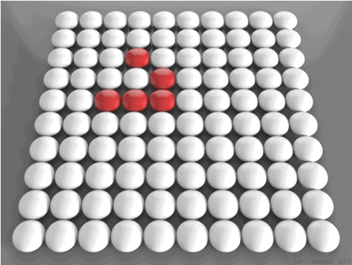

# Библиотеки Python. Часть 6. Numpy 

## Вычислительные возможности Python. Numpy

Как мы уже говорили, Python — язык для быстрой разработки. Однако чистый Python не предназначен для написания быстрых программ. Это интерпретируемый язык, поэтому программы на Python выполняются медленнее аналогов на C, C++ или Fortran. С другой стороны, математики, физики, биологи и инженеры часто применяют Python для решения вычислительных задач.

Нет ли тут противоречия? Как интерпретируемый язык может быть эффективен в вычислительной математике?

Оказывается, все дело в библиотеках. Python отлично подходит на роль промежуточной среды, оболочки, «клея» между библиотеками, написанными на разных языках.

В этом уроке мы поговорим о наиболее фундаментальной библиотеке для работы с вычислительной математикой — `Numpy`.

Многие другие пакеты для работы с данными и вычислениями используют базовые объекты этой библиотеки. В числе таких пакетов `OpenCV` — открытая библиотека для работы с распознаванием образов — и `Pandas` — библиотека, ориентированная на анализ данных.

## Измерение скорости

Замеры времени (а в более общем случае, профилирование) — не такая простая процедура, как может показаться. Обычно проще всего замерить астрономическое время между началом и концом выполнения задачи, усредняя результаты нескольких опытов. Однако почти все ОС многозадачны, поэтому процессор (и его вычислительные ядра) редко отдаются одной задаче в единоличное пользование. Как следствие, в измерениях лучше использовать именно процессорное время. Механизмы замера времени сами вмешиваются в процесс и немного влияют на результат — как и в любом физическом эксперименте.

В Python для замера времени работы кода служит библиотека `timeit`.

Вы можете познакомиться с возможностями модуля в соответствующем разделе [документации](https://docs.python.org/3/library/timeit.html).

Например, мы можем замерить три разных способа заполнить список из миллиона квадратных корней.

```python
import timeit

print(timeit.timeit("[sqrt(x) for x in range(1000000)]",
                 "from math import sqrt", number=1))

print(timeit.timeit("for i in range(1000000): a.append(sqrt(i))",
                 "from math import sqrt; a=[]", number=1))

print(timeit.timeit("list(map(sqrt, range(1000000)))",
                 "from math import sqrt; a=[]", number=1))
```

```bash
0.18135334600083297
0.21764946899929782
0.1530561779945856
```

Как видим, в этой версии интерпретатора (3.7) предпочтительно использовать `map`.

> В версии интерпретатора 3.12 были произведены оптимизации

Самый медленный способ — это, конечно же, динамическое расширение существующего списка (`append`). Причем, чем больше список — тем медленнее он меняет свой размер. Это вызвано необходимостью иногда переносить данные из одного места списка в другое.

Несмотря на относительную быстроту (0,15 секунд на извлечение 1 000 000 квадратных корней), скорость можно увеличить еще примерно в 10 раз. Давайте посмотрим как.

## Массивы в Numpy

Основной объект в Numpy — **многомерный массив**.

Массивы — одна из базовых структур данных, которая позволяет моделировать многие объекты, относящиеся как к науке, так и к обычной жизни: список покупок, результаты наблюдения температуры, матрицы и векторы, изображения, видео и т. д.
Напомним, что в чистом Python нет типа данных с именем массив, и нам приходится моделировать его с помощью списков.

Другое дело — Numpy. За тип массива здесь отвечает объект `array`.

Как же создать массив?

Во-первых, массив можно сделать из обычного списка:

```python
import numpy as np
np.array([1, 4, 10, 34])
array([ 1, 4, 10, 34])
```

Или из диапазона:

```python
np.array(range(10))
array([0, 1, 2, 3, 4, 5, 6, 7, 8, 9])
```

А можно сделать и из итератора с помощью функции `fromiter()`:

```python
np.fromiter(map(int, ["1", "2", "3", "4"]), dtype=np.int8)

array([1, 2, 3, 4], dtype=int8)
```

В Numpy элементы одного массива должны быть однородны (одного типа). Это самое важное идеологическое отличие массивов от списков, в которых можно хранить объекты разной природы.

```python
np.array([11, 234.5, "hello"])

array(['11', '234.5', 'hello'], dtype='<U32')
```

Numpy создаст массив из юникод-строк длиной 32. За тип элементов в большинстве случаев отвечает параметр `dtype(data type)`. Обратите внимание на тип данных элементов массива.

Посмотрите так же на использование параметра `dtype`:

```python
a = np.array([1, 3, 8])
a # => array([1, 3, 8])

a.dtype
# => dtype('int64')

type(a[0])
# => numpy.int64

a = np.array([1, 3, 8], dtype=np.float64)
type(a[0])
# => numpy.float64
```

Указание типов и работа с ними нужны, поскольку языки, на которых написана эта библиотека, строго типизованы. Вдобавок это увеличивает скорость обработки данных.

## Размерность массива

Размерность массива можно в любой момент изменить операцией `reshape()`.

Узнать размерность можно атрибутом `shape`.

Вообще говоря, размерность — всего лишь «синтаксический сахар». В памяти все может храниться как одномерный массив с пересчетом координат элемента. Таким образом, операция `reshape()` — просто изменение коэффициентов в алгоритме, а не перераспределение и копирование данных.

```python
a = np.arange(100)
print(a.shape)
```

```bash
(100,)
```

```python
print(a.reshape(10, 10))
```

```bash
array([
    [ 0,  1,  2,  3,  4,  5,  6,  7,  8,  9],
    [10, 11, 12, 13, 14, 15, 16, 17, 18, 19],
    [20, 21, 22, 23, 24, 25, 26, 27, 28, 29],
    [30, 31, 32, 33, 34, 35, 36, 37, 38, 39],
    [40, 41, 42, 43, 44, 45, 46, 47, 48, 49],
    [50, 51, 52, 53, 54, 55, 56, 57, 58, 59],
    [60, 61, 62, 63, 64, 65, 66, 67, 68, 69],
    [70, 71, 72, 73, 74, 75, 76, 77, 78, 79],
    [80, 81, 82, 83, 84, 85, 86, 87, 88, 89],
    [90, 91, 92, 93, 94, 95, 96, 97, 98, 99]
])
```

```python
print(a.reshape(5, 20))
```

```bash
array([
[ 0,  1,  2,  3,  4,  5,  6,  7,  8,  9, 10, 11, 12, 13, 14, 15, 16,
    17, 18, 19],
[20, 21, 22, 23, 24, 25, 26, 27, 28, 29, 30, 31, 32, 33, 34, 35, 36,
    37, 38, 39],
[40, 41, 42, 43, 44, 45, 46, 47, 48, 49, 50, 51, 52, 53, 54, 55, 56,
    57, 58, 59],
[60, 61, 62, 63, 64, 65, 66, 67, 68, 69, 70, 71, 72, 73, 74, 75, 76,
    77, 78, 79],
[80, 81, 82, 83, 84, 85, 86, 87, 88, 89, 90, 91, 92, 93, 94, 95, 96,
    97, 98, 99]
])
```

```python
print(a.reshape(5, 5, 4))
```

```bash
array([
[
  [ 0,  1,  2,  3],
  [ 4,  5,  6,  7],
  [ 8,  9, 10, 11],
  [12, 13, 14, 15],
  [16, 17, 18, 19]
],
[
  [20, 21, 22, 23],
  [24, 25, 26, 27],
  [28, 29, 30, 31],
  [32, 33, 34, 35],
  [36, 37, 38, 39]
],
[
  [40, 41, 42, 43],
  [44, 45, 46, 47],
  [48, 49, 50, 51],
  [52, 53, 54, 55],
  [56, 57, 58, 59]
],
[
  [60, 61, 62, 63],
  [64, 65, 66, 67],
  [68, 69, 70, 71],
  [72, 73, 74, 75],
  [76, 77, 78, 79]
],
[
  [80, 81, 82, 83],
  [84, 85, 86, 87],
  [88, 89, 90, 91],
  [92, 93, 94, 95],
  [96, 97, 98, 99]]])
```

Например, фильм можно представить в виде 4-мерного массива кадров. Кадр — картинка, то есть трехмерный массив. Его можно представить и как двумерный массив пикселей, где каждый пиксель — одномерный массив из трех элементов: R, G, B.

Самое главное — при использовании функции `reshape()` произведение ее параметров должно быть равно количеству элементов в массиве.

Иначе мы получим ошибку:

```python
a.reshape(2, 3, 4)
```

```bash
ValueError              Traceback (most recent call last)
 <ipython-input-31-a907d0800243> in <module>()
 ----> 1 a.reshape(2, 3, 4)
ValueError: cannot reshape array of size 100 into shape (2, 3, 4)
```

## Индексация в массивах

Давайте рассмотрим массив 10×10, созданный ранее.

```python
a = a.reshape(10,10)
print(a)
```
```bash
array([
[ 0,  1,  2,  3,  4,  5,  6,  7,  8,  9],
[10, 11, 12, 13, 14, 15, 16, 17, 18, 19],
[20, 21, 22, 23, 24, 25, 26, 27, 28, 29],
[30, 31, 32, 33, 34, 35, 36, 37, 38, 39],
[40, 41, 42, 43, 44, 45, 46, 47, 48, 49],
[50, 51, 52, 53, 54, 55, 56, 57, 58, 59],
[60, 61, 62, 63, 64, 65, 66, 67, 68, 69],
[70, 71, 72, 73, 74, 75, 76, 77, 78, 79],
[80, 81, 82, 83, 84, 85, 86, 87, 88, 89],
[90, 91, 92, 93, 94, 95, 96, 97, 98, 99]
])
```

В нем работает привычная индексация.

```python
a[1][2] # => 12
a[2][1] # => 21
a[5] # => array([50, 51, 52, 53, 54, 55, 56, 57, 58, 59])
```

По аналогии со списками мы можем применять срезы:
```python
a[3:5, 1:6]
# => array([[31, 32, 33, 34, 35], [41, 42, 43, 44, 45]])

a[:, 2:4]
# => array([[ 2,  3],
#        [12, 13],
#        [22, 23],
#        [32, 33],
#        [42, 43],
#        [52, 53],
#        [62, 63],
#        [72, 73],
#        [82, 83],
#        [92, 93]])
```

Кроме того, доступ можно организовать через списки с индексами:

```python
a[[1], [4, 4, 7, 8]] # => array([14, 14, 17, 18])
```

Но самой удобной альтернативой обычному способу является тот, в котором в качестве «адреса» элемента используется кортеж координат:

```python
a[(7, 9)] # =>  79
```

Скобки, конечно же, можно опустить:
```python
a[7, 9] # => 79
```

## Массовые операции

В них вся суть. Ускорение, по сравнению с чистым Python, достигается за счет замены цикла обработки в Python вызовом одной функции, внутри которой находится скомпилированный машинный цикл. Чтобы упростить код и ускорить его выполнение, нужно убрать весь поток логики с «пробеганием» по массивам, заменив его вызовами базовых агрегатных функций или операторов.

Инициализация:

```python
# заполняем единицами
np.ones(10)
```

```bash
array([ 1.,  1.,  1.,  1.,  1.,  1.,  1.,  1.,  1.,  1.])
```

```python
# заполняем единицами целого типа
np.ones(10, dtype=np.int32)
```

```bash
array([1, 1, 1, 1, 1, 1, 1, 1, 1, 1], dtype=int32)
```

```python
# заполняем нулями и сразу указываем форму
np.zeros(30).reshape(5, 6)
```

```bash
array([
    [ 0.,  0.,  0.,  0.,  0.,  0.],
    [ 0.,  0.,  0.,  0.,  0.,  0.],
    [ 0.,  0.,  0.,  0.,  0.,  0.],
    [ 0.,  0.,  0.,  0.,  0.,  0.],
    [ 0.,  0.,  0.,  0.,  0.,  0.]
])
```

```python
# заполняем случайными целыми из диапазона [1..10]
# и сразу указываем форму
np.random.randint(1, 10, (5, 5))
```

```bash
array([
    [3, 1, 1, 5, 4],
    [5, 4, 8, 6, 3],
    [6, 9, 9, 3, 4],
    [7, 4, 2, 1, 9],
    [3, 5, 4, 2, 2]
])
```

```python
# заполняем случайными вещественными числами из диапазона [0..1)

np.random.random(10)
```

```bash
array([0.96373978, 0.73252097, 0.32213768, 0.81560531,0.31843467,
0.51289493, 0.99791928, 0.5999641 , 0.15257882, 0.16074567])
```

```python
# формируем массив из строки чисел, указывая разделитель
np.fromstring("1, 3, 4, 5, 120", sep=",")
```

```bash
array([1., 3., 4., 5., 120.])
```

```python
# каждый элемент массива вычисляется по функции
np.fromfunction(lambda x, y: x * 5 + y, (3, 5), dtype=np.int8)
```

```bash
array([
    [0, 1, 2, 3, 4],
    [5, 6, 7, 8, 9],
    [10, 11, 12, 13, 14]
], dtype=int8)
```


Работают основные операции арифметики, сравнения, причем на всем массиве целиком. И это здорово!

```python
a = np.random.randint(1, 5, 10)
b = np.random.randint(1, 5, 10)
print(a)
print(b)
```

```bash
[1 3 1 1 3 4 2 3 3 3]
[4 1 1 3 1 4 4 4 1 1]
```

```python
print(a > b) 
# => [False True False False True False False False True True]
print(a + b)  # => [5 4 2 4 4 8 6 7 4 4]
print(a * b)  # => [ 4  3  1  3  3 16  8 12  3  3]
print(a ** 2)  # => [ 1  9  1  1  9 16  4  9  9  9]
print(a[a > b])  # => [3 3 3 3]
print(a.sum())  # => 24
```

Тригонометрические операции тоже работают, только надо использовать их версии из библиотеки numpy, а не из `math`:

```python
print(np.sin(a))
```

```bash
[0.84147098 0.14112001 0.84147098 0.84147098 0.14112001 -0.7568025
0.90929743 0.14112001 0.14112001 0.14112001]
```

Вспомним начало этого урока, когда мы говорили о скорости работы.

Решим ту же задачу по вычислению 1 000 000 корней с помощью Numpy и посмотрим, какого ускорения мы добились:

```python
timeit.timeit("np.sqrt(np.arange(1000000))", "import numpy as np",
    number=1)
```

```bash
0.014551434993336443
```

## Немного о матрицах

Numpy позволяет очень эффективно работать с двумерными и вообще n-мерными массивами.

```python
# Заполним матрицу "последовательно" по строкам
a = np.arange(1, 21).reshape(4, 5)
```

```bash
array([
    [ 1,  2,  3,  4,  5],
    [ 6,  7,  8,  9, 10],
    [11, 12, 13, 14, 15],
    [16, 17, 18, 19, 20]
])
```

```python
# Транспонируем матрицу (строки станут столбцами, а столбцы —
# строками)
b = a.transpose()
```

```bash
array([
    [ 1,  6, 11, 16],
    [ 2,  7, 12, 17],
    [ 3,  8, 13, 18],
    [ 4,  9, 14, 19],
    [ 5, 10, 15, 20]
])
```

```python
# Повернем матрицу вправо и влево
b = np.rot90(a)
c = np.rot90(a, -1)
print(b)
```

```bash
[[ 5 10 15 20]
[ 4  9 14 19]
[ 3  8 13 18]
[ 2  7 12 17]
[ 1  6 11 16]]
```

```python
print(c)
```

```bash
[[16 11  6  1]
[17 12  7  2]
[18 13  8  3]
[19 14  9  4]
[20 15 10  5]]
```

## Сортировки

Библиотека Numpy предлагает свои функции по сортировке. Давайте посмотрим, как они работают:

```python
# заполним матрицу случайными целыми числами
a = np.random.randint(20, size=(5, 4))
```

```bash
array([
    [ 2, 12,  0,  7],
    [12,  1, 11, 18],
    [ 6,  1,  4, 10],
    [ 0,  9,  5,  3],
    [18, 12, 12,  5]
])
```

```python
# отсортируем матрицу по умолчанию
print(np.sort(a))
```

```bash
[
    [ 0  2  7 12]
    [ 1 11 12 18]
    [ 1  4  6 10]
    [ 0  3  5  9]
    [ 5 12 12 18]
]
```

В этом случае сортировка происходит по последнему измерению. Обходя матрицу, мы сначала выбираем строку, а потом идем по этой строке, поэтому последнее измерение в данном случае — это строка. В результате мы отсортировали независимо каждую строку.

```python
# а теперь укажем конкретное измерение
print(np.sort(a, axis=0))
```

```bash
[
    [ 0  1  0  3]
    [ 2  1  4  5]
    [ 6  9  5  7]
    [12 12 11 10]
    [18 12 12 18]
]
```

Матрица отсортирована по столбцам.

Но самое интересное в том, что если в качестве значения параметра axis указать `None`, то матрица перед сортировкой будет линеаризована, то есть превращена в одномерный массив.

```python
print(np.sort(a, axis=None))
```

```bash
[ 0  0  1  1  2  3  4  5  5  6  7  9 10 11 12 12 12 12 18 18]
```

Обратите внимание: подобное поведение характерно не только для функции `sort()`, но и для многих других функций: `min()`, `sum()` и т. д.

Но об этом вы можете почитать самостоятельно на странице с [документацией](https://docs.scipy.org/doc/numpy/genindex.html).

## Вспомним PIL

Работая с библиотекой PIL, тоже можно использовать средства Numpy.
Например, если мы хотим сделать изображение темнее оригинала, можем просто поделить его составляющие, например, на 10:

```python
from PIL import Image
import numpy as np

# получим массив numpy из картинки, которую откроем из файла.
image = np.asarray(Image.open('images/Риана.jpg'))
# поделим все элементы массива на 10, приведем к типу uint8 (один байт
# без знака) преобразуем в изображение и сохраним в файл
Image.fromarray(np.uint8(image // 10)).save('r2.jpg')
```


## Игра «Жизнь»

Несколько десятилетий назад Джон Конуэй придумал один из самых известных клеточных автоматов, который назвал игрой «Жизнь». Простота правил сочетается в ней с богатством результатов. Многие компьютерные инженеры хоть раз обращались к программированию и исследованию этой игры, которая послужила интересной моделью для многих отраслей науки.

Клеточный автомат — модель однородного пространства с некоторыми клетками. Каждая клетка может находиться в одном из нескольких состояний и иметь некоторое количество соседей. Задаются правила перехода из одного состояния в другое в зависимости от текущего состояния клетки и ее соседей.

Пространство «Жизни» — бесконечное поле клеток.

Каждая клетка имеет 8 соседей (сверху, снизу, справа, слева и по диагонали). Клетка может иметь два состояния — живое (на клетке стоит фишка) и мертвое (фишки нет).

Правила изменения следующие:

- Если клетка была живой, она выживет, если у нее 2 или 3 соседа. Если соседей 4, 5, 6, 7 или 8, она умирает от перенаселенности, а если 0 или 1 — от одиночества
- Новая клетка рождается в поле, у которого есть ровно 3 соседа

Время в этой игре дискретно и считается поколениями. Все начинается с начальной расстановки фишек (0 поколение), в дальнейшем рассматривается эволюция клеточного пространства в 1, 2, 3 и т. д. поколении. Процессы смерти и рождения происходят одновременно, после чего строится следующее поколение.

Давайте попробуем написать игру «Жизнь», используя библиотеку Numpy. Пусть у нас будет поле 10×10, в центр которого поместим конструкцию, известную как глайдер. Мы скоро выясним, почему она так называется.

```python
import numpy as np

population = np.array([
    [0, 0, 0, 0, 0, 0, 0, 0, 0, 0],
    [0, 0, 0, 0, 0, 0, 0, 0, 0, 0],
    [0, 0, 0, 0, 0, 0, 0, 0, 0, 0],
    [0, 0, 0, 0, 1, 0, 0, 0, 0, 0],
    [0, 0, 0, 0, 0, 1, 0, 0, 0, 0],
    [0, 0, 0, 1, 1, 1, 0, 0, 0, 0],
    [0, 0, 0, 0, 0, 0, 0, 0, 0, 0],
    [0, 0, 0, 0, 0, 0, 0, 0, 0, 0],
    [0, 0, 0, 0, 0, 0, 0, 0, 0, 0],
    [0, 0, 0, 0, 0, 0, 0, 0, 0, 0]
], dtype=np.uint8)
```

Поле имеет тип `uint8`, чтобы оно занимало меньше памяти. Каждый его элемент занимает ровно 1 байт (8 бит) и является целым беззнаковым (unsigned) числом в диапазоне от 0 до 255.

Живые клетки обозначаются единицей, а мертвые — нулем. Нужно решить, что делать на границах поля. Мы не можем обеспечить бесконечность в обоих направлениях, поэтому замкнем поле само на себя. Если выйти за нижнюю границу, окажемся наверху, а если за правую — появимся слева, и наоборот. Получается что-то вроде бублика. Такая фигура называется тор.

Для начала познакомимся с операцией `roll`, доступной для массивов. Она сдвигает исходный массив вдоль одного из измерений (в данном случае — строки или столбца).

```python
np.roll(population, 2, 0)
```

```bash
array([
    [0, 0, 0, 0, 0, 0, 0, 0, 0, 0],
    [0, 0, 0, 0, 0, 0, 0, 0, 0, 0],
    [0, 0, 0, 0, 0, 0, 0, 0, 0, 0],
    [0, 0, 0, 0, 0, 0, 0, 0, 0, 0],
    [0, 0, 0, 0, 0, 0, 0, 0, 0, 0],
    [0, 0, 0, 0, 1, 0, 0, 0, 0, 0],
    [0, 0, 0, 0, 0, 1, 0, 0, 0, 0],
    [0, 0, 0, 1, 1, 1, 0, 0, 0, 0],
    [0, 0, 0, 0, 0, 0, 0, 0, 0, 0],
    [0, 0, 0, 0, 0, 0, 0, 0, 0, 0]
], dtype=uint8)
```

```python
np.roll(population, 2, 1)
```

```bash
array([
    [0, 0, 0, 0, 0, 0, 0, 0, 0, 0],
    [0, 0, 0, 0, 0, 0, 0, 0, 0, 0],
    [0, 0, 0, 0, 0, 0, 0, 0, 0, 0],
    [0, 0, 0, 0, 0, 0, 1, 0, 0, 0],
    [0, 0, 0, 0, 0, 0, 0, 1, 0, 0],
    [0, 0, 0, 0, 0, 1, 1, 1, 0, 0],
    [0, 0, 0, 0, 0, 0, 0, 0, 0, 0],
    [0, 0, 0, 0, 0, 0, 0, 0, 0, 0],
    [0, 0, 0, 0, 0, 0, 0, 0, 0, 0],
    [0, 0, 0, 0, 0, 0, 0, 0, 0, 0]
], dtype=uint8)
```

Мы можем посчитать количество соседей у каждой клетки, просто сделав 8 копий со сдвигом массива и просуммировав их.

```python
neighbors = sum([
    np.roll(np.roll(population, -1, 1), 1, 0),
    np.roll(np.roll(population, 1, 1), -1, 0),
    np.roll(np.roll(population, 1, 1), 1, 0),
    np.roll(np.roll(population, -1, 1), -1, 0),
    np.roll(population, 1, 1),
    np.roll(population, -1, 1),
    np.roll(population, 1, 0),
    np.roll(population, -1, 0)
])
```

Таким образом, матрица количества соседей выглядит так:
```bash
array([
    [0, 0, 0, 0, 0, 0, 0, 0, 0, 0],
    [0, 0, 0, 0, 0, 0, 0, 0, 0, 0],
    [0, 0, 0, 1, 1, 1, 0, 0, 0, 0],
    [0, 0, 0, 1, 1, 2, 1, 0, 0, 0],
    [0, 0, 1, 3, 5, 3, 2, 0, 0, 0],
    [0, 0, 1, 1, 3, 2, 2, 0, 0, 0],
    [0, 0, 1, 2, 3, 2, 1, 0, 0, 0],
    [0, 0, 0, 0, 0, 0, 0, 0, 0, 0],
    [0, 0, 0, 0, 0, 0, 0, 0, 0, 0],
    [0, 0, 0, 0, 0, 0, 0, 0, 0, 0]
], dtype=uint8)
```
Теперь нужно получить новую популяцию.

Выполним на матрице следующую операцию: «если у клетки 3 соседа, то в следующем поколении на этом месте будет клетка; а если 2 — клетка будет при условии, что она была „жива“ в текущем поколении».

Для этого воспользуемся операторами **|** (или) и &**** (и).

```python
# выделим клетки, у которых ровно три соседа
neighbors == 3
```

```bash
array([
[False, False, False, False, False, False, False, False, False,False],
[False, False, False, False, False, False, False, False, False,False],
[False, False, False, False, False, False, False, False, False,False],
[False, False, False, False, False, False, False, False, False,False],
[False, False, False,  True, False,  True, False, False, False,False],
[False, False, False, False,  True, False, False, False, False,False],
[False, False, False, False,  True, False, False, False, False,False],
[False, False, False, False, False, False, False, False, False,False],
[False, False, False, False, False, False, False, False, False,False],
[False, False, False, False, False, False, False, False, False,False]
], dtype=bool)
```

```python
# а теперь те, в которых была жизнь и имеется ровно два соседа
population & (neighbors == 2)
```

```bash
array([
[0, 0, 0, 0, 0, 0, 0, 0, 0, 0],
[0, 0, 0, 0, 0, 0, 0, 0, 0, 0],
[0, 0, 0, 0, 0, 0, 0, 0, 0, 0],
[0, 0, 0, 0, 0, 0, 0, 0, 0, 0],
[0, 0, 0, 0, 0, 0, 0, 0, 0, 0],
[0, 0, 0, 0, 0, 1, 0, 0, 0, 0],
[0, 0, 0, 0, 0, 0, 0, 0, 0, 0],
[0, 0, 0, 0, 0, 0, 0, 0, 0, 0],
[0, 0, 0, 0, 0, 0, 0, 0, 0, 0],
[0, 0, 0, 0, 0, 0, 0, 0, 0, 0]
], dtype=uint8)
```

```python
# и объединим их
population = (neighbors == 3) | (population & (neighbors == 2))
```

```bash
array([
    [0, 0, 0, 0, 0, 0, 0, 0, 0, 0],
    [0, 0, 0, 0, 0, 0, 0, 0, 0, 0],
    [0, 0, 0, 0, 0, 0, 0, 0, 0, 0],
    [0, 0, 0, 0, 0, 0, 0, 0, 0, 0],
    [0, 0, 0, 1, 0, 1, 0, 0, 0, 0],
    [0, 0, 0, 0, 1, 1, 0, 0, 0, 0],
    [0, 0, 0, 0, 1, 0, 0, 0, 0, 0],
    [0, 0, 0, 0, 0, 0, 0, 0, 0, 0],
    [0, 0, 0, 0, 0, 0, 0, 0, 0, 0],
    [0, 0, 0, 0, 0, 0, 0, 0, 0, 0]
], dtype=uint8)
```

Объединить матрицы с логическими и целочисленными элементами можно, поскольку они в данном случае могут быть сведены друг к другу: 0 — `False`, 1 — `True`.

Проследим эволюцию глайдера на протяжении четырех поколений. Для этого создадим функцию `next_population()`.

```python
def next_population(population):
    neighbors = sum([
        np.roll(np.roll(population, -1, 1), 1, 0),
        np.roll(np.roll(population, 1, 1), -1, 0),
        np.roll(np.roll(population, 1, 1), 1, 0),
        np.roll(np.roll(population, -1, 1), -1, 0),
        np.roll(population, 1, 1),
        np.roll(population, -1, 1),
        np.roll(population, 1, 0),
        np.roll(population, -1, 0)
    ])
    return (neighbors == 3) | (population & (neighbors == 2))
```

```python
population = np.array([
    [0, 0, 0, 0, 0, 0, 0, 0, 0, 0],
    [0, 0, 0, 0, 0, 0, 0, 0, 0, 0],
    [0, 0, 0, 0, 0, 0, 0, 0, 0, 0],
    [0, 0, 0, 0, 1, 0, 0, 0, 0, 0],
    [0, 0, 0, 0, 0, 1, 0, 0, 0, 0],
    [0, 0, 0, 1, 1, 1, 0, 0, 0, 0],
    [0, 0, 0, 0, 0, 0, 0, 0, 0, 0],
    [0, 0, 0, 0, 0, 0, 0, 0, 0, 0],
    [0, 0, 0, 0, 0, 0, 0, 0, 0, 0],
    [0, 0, 0, 0, 0, 0, 0, 0, 0, 0]
], dtype=np.uint8)

for _ in range(4):
    print(population, '\n')
    population = next_population(population)
```

```bash
[
    [0 0 0 0 0 0 0 0 0 0]
    [0 0 0 0 0 0 0 0 0 0]
    [0 0 0 0 0 0 0 0 0 0]
    [0 0 0 0 1 0 0 0 0 0]
    [0 0 0 0 0 1 0 0 0 0]
    [0 0 0 1 1 1 0 0 0 0]
    [0 0 0 0 0 0 0 0 0 0]
    [0 0 0 0 0 0 0 0 0 0]
    [0 0 0 0 0 0 0 0 0 0]
    [0 0 0 0 0 0 0 0 0 0]
]

[
    [0 0 0 0 0 0 0 0 0 0]
    [0 0 0 0 0 0 0 0 0 0]
    [0 0 0 0 0 0 0 0 0 0]
    [0 0 0 0 0 0 0 0 0 0]
    [0 0 0 1 0 1 0 0 0 0]
    [0 0 0 0 1 1 0 0 0 0]
    [0 0 0 0 1 0 0 0 0 0]
    [0 0 0 0 0 0 0 0 0 0]
    [0 0 0 0 0 0 0 0 0 0]
    [0 0 0 0 0 0 0 0 0 0]
]

[
    [0 0 0 0 0 0 0 0 0 0]
    [0 0 0 0 0 0 0 0 0 0]
    [0 0 0 0 0 0 0 0 0 0]
    [0 0 0 0 0 0 0 0 0 0]
    [0 0 0 0 0 1 0 0 0 0]
    [0 0 0 1 0 1 0 0 0 0]
    [0 0 0 0 1 1 0 0 0 0]
    [0 0 0 0 0 0 0 0 0 0]
    [0 0 0 0 0 0 0 0 0 0]
    [0 0 0 0 0 0 0 0 0 0]
]

[
    [0 0 0 0 0 0 0 0 0 0]
    [0 0 0 0 0 0 0 0 0 0]
    [0 0 0 0 0 0 0 0 0 0]
    [0 0 0 0 0 0 0 0 0 0]
    [0 0 0 0 1 0 0 0 0 0]
    [0 0 0 0 0 1 1 0 0 0]
    [0 0 0 0 1 1 0 0 0 0]
    [0 0 0 0 0 0 0 0 0 0]
    [0 0 0 0 0 0 0 0 0 0]
    [0 0 0 0 0 0 0 0 0 0]
]

```

С визуализацией у нас не очень здорово, но видно, что глайдер «летит»: каждые четыре поколения он сдвигается вниз и вправо. Иными словами, он движется в правый нижний угол.

Почему глайдер не исчезает с поля, а странным образом сначала разбивается на части, а потом материализуется в левом верхнем углу?

Это связано с тем, что фактически мы строим нашу «жизнь» не на плоскости, а на торе. Поэтому, «улетая» вправо, клетка прилетает слева, улетая вверх, прилетает снизу, а углы нашего поля — это одна и та же ячейка.



