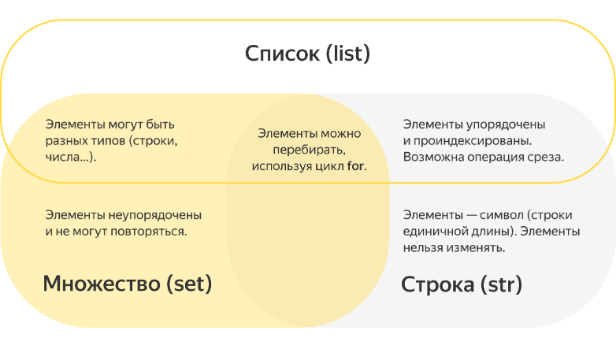

# Знакомства со списками

Мы уже знаем тип данных, который называется множество и является коллекцией (контейнером), то есть позволяет хранить несколько элементов данных, и тип, который тоже обладает свойствами коллекции и называется строка. Сегодня мы познакомимся с еще одним типом-коллекцией, который называется **список** (_list_). Никогда не создавайте переменные с таким именем!

Имеет смысл еще раз задать вопрос учащимся, что будет, если все-таки создать переменную с именем `list` (повторение — мать учения :) ). И при необходимости пояснить, что в этом случае функция `list` нам больше не будет доступна, т. к. мы заменили ее своей переменной.

Списки являются очень гибкой структурой данных и широко используются в программах. Давайте рассмотрим основные свойства списка в сравнении с теми коллекциями, которые мы уже знаем:

- Список хранит несколько элементов под одним именем (как и множество)
- Элементы списка могут повторяться (в отличие от множества)
- Элементы списка упорядочены и проиндексированы, доступна операция среза (как в строке)
- Элементы списка можно изменять (в отличие от строки)
- Элементами списка могут быть значения любого типа: целые и действительные числа, строки и даже другие списки



## Создание списков

Чтобы работать со списком, нужно его создать. Для этого используется операция присваивания.
Чтобы задать готовый список, нужно справа от знака присваивания в квадратных скобках перечислить его элементы через запятую. Здесь создается список из первых пяти простых чисел, который помещается в переменную `primes` («простые числа»):

```python
primes = [2, 3, 5, 7, 11]
print(primes)  # выводим на экран список целиком
```

Для того чтобы создать пустой список, можно воспользоваться конструкцией `[]` или функцией `list`.

```python
empt1 = [] # это пустой список
empt2 = list()  # и это тоже пустой список
```

Теперь вспомним один из рассмотренных нами ранее способов создания cтроки из заданного количества повторяющихся подстрок. Такую строку можно легко составить путем умножения на число:

```python
print("'$' * 5 -->", '$' * 5)
# '$' * 5 --> $$$$$
print("'-|' * 4 + '-' -->", '-|' * 4 + '-')
# '-|' * 4 + '-' --> -|-|-|-|-
```

Аналогично поступают и со списками:

```python
print([2, 3] * 4)
# [2, 3, 2, 3, 2, 3, 2, 3]
```

Для генерации списков и строк, состоящих строго из повторяющихся элементов (например, список из заданного количества нулей), умножение на число — самый короткий и красивый метод.

```python
my_list = [0] * 4
```

## Индексация в списках

Для генерации списков и строк, состоящих строго из повторяющихся элементов (например, список из заданного количества нулей), умножение на число — самый короткий и красивый метод.

```python
my_list = [0] * 4
```

Чтобы получить отдельный элемент списка, нужно записать после него (или имени переменой, связанной с данным списком) в квадратных скобках номер (индекс) нужного элемента. Индекс отсчитывается с нуля, как в строках. Так же, как и в строках, для нумерации с конца разрешены отрицательные индексы.

Таким образом, мы умеем использовать квадратные скобки в Python уже для трех вещей: задания нового списка (тогда внутри этих скобок перечисляются его элементы), получения элемента списка или строки по индексу (тогда в скобках указывается индекс) и получения среза строки.

```python
print('Сумма первых двух простых чисел:', primes[0] + primes[1])
print('Последнее из простых чисел в нашем списке:', primes[-1])
```

Как и в строках, попытка обратиться к элементу с несуществующим индексом вызовет ошибку:

```python
print(primes[5]) # ошибка: index out of range
```

## Добавление элемента в список

Добавление элемента в конец списка делается при помощи метода `append` (этот метод аналогичен методу `add`, используемому для добавления элементов в множество):

```python
primes.append(13)
primes.append(15)  # ой, ошиблись — 15 составное число!
```

Обратите внимание: для того чтобы воспользоваться методом `append`, нужно, чтобы список был создан (при этом он может быть пустым).

Попытка применить метод `append` к несуществующему списку приведет к ошибке. Заметьте: два вызова метода append в следующем примере добавляют элемент к двум разным спискам.

```python
odd_numbers = [1, 3, 5, 7, 9, 11, 13, 15, 17]
primes.append(19)
odd_numbers.append(19)
```

## Расширение списка

Кроме того, вы можете расширить имеющийся список любым итерабельным (перечисляемым) объектом с помощью метода `extend`:

```python
my_list = [1, 2, 3]
another_list = [4, 5, 6]
my_list.extend(another_list)
print(my_list)  # [1, 2, 3, 4, 5, 6]
```

### Расширение списка строкой

Имейте в виду, что строка является итерируемой, поэтому, если вы расширите список строкой, вы добавите каждый символ, когда будете перебирать строку (что может быть не так, как вы хотите):

```python
my_list = [1, 2, 3]
another_list = "привет"
my_list.extend(another_list)
print(my_list) # [1, 2, 3, 'п', 'р', 'и', 'в', 'е', 'т']
```

### Расширение списка множеством

Множество также является итерируемым типом, поэтому если расширить список множеством, то элементы множества добавятся в конец списка, но в произвольном порядке:

```python
my_list = [1, 2, 3]
another_set = {'п', 'р', 'и', 'в', 'е', 'т'}
my_list.extend(another_set)
print(my_list) # [1, 2, 3, 'в', 'и', 'р', 'т', 'е', 'п']
```

## Изменение элемента списка

В отличие от отдельных символов в строках, элемент списка можно поместить слева от "**=**" в операторе присваивания и тем самым изменить этот элемент:

```python
primes[6] = 17  # Исправляем ошибку:
#  седьмое (нумерация элементов списка - с нуля!)
#  простое число - не 15, а 17.
```

Тем не менее многие вещи, которые можно делать со строками, можно делать и со списками:

```python
print(len(primes))  # выводим длину списка
primes += [23, 29]  # списки можно складывать, как и строки
print(primes)  # выведет [2, 3, 5, 7, 11, 13, 17, 19, 23, 29]
if 1 in primes:  # можно проверять, содержится ли в списке элемент
    print('Мы считаем единицу простым числом.')
else:
    print('Мы, как и всё остальное человечество, не считаем 1 '
        + 'простым числом.')
```

## Перебор элементов списка

Во время выполнения программы текущее количество элементов списка всегда известно. Поэтому, если нужно что-то сделать с каждым элементом списка (например, напечатать его на экране), можно перебрать элементы с помощью цикла `for`. При этом, как и для строк, возможны два варианта перебора — перебор индексов и перебор самих элементов.

```python
for i in range(len(primes)):
    # выведем по очереди все элементы списка...
    print('Простое число номер', i + 1, '-', primes[i])
for p in primes:
    print('Квадрат числа', p, '-', p ** 2)  # и их квадраты
```

Заметьте, что при использовании конструкции `for i in range(len(имя_списка))` индексы перебираются в цикле очень удобно: от 0 включительно до длины списка не включительно. Таким образом, можно перебрать все элементы списка.

Цикл `for` нередко используется и для формирования списка, если мы заранее знаем, сколько элементов в нем должно быть:

```python
n = 10
a = []
print('Введите', n, 'значений:')
for i in range(n):
	a.append(input())
print('Получился список строк:', a)
```

## Срезы списков

Как и для строк, для списков определена операция взятия среза:

```python
months = [
    'январь', 'февраль', 'март',
    'апрель', 'май', 'июнь', 'июль',
    'август', 'сентябрь', 'октябрь',
    'ноябрь', 'декабрь'
]
spring = months[2:5]  # spring == ['март', 'апрель', 'май']
for month in spring:
    print(month)
```

## Использование срезов

Срезы можно использовать и для присваивания новых значений элементам списка. Например, если мы решим перевести на английский названия летних месяцев, это можно сделать с помощью среза:

```python
months[5:8] = ['June', 'July', 'August']
```

Теперь список `months` будет выглядеть так:

```python
[
    'январь', 'февраль', 'март',
    'апрель', 'май', 'June', 'July',
    'August', 'сентябрь', 'октябрь',
    'ноябрь', 'декабрь'
]
```

## Удаление элементов

С помощью функции `del` можно удалять элементы списка.

```python
a = [1, 2, 3, 4, 5, 6]
del a[2]
print(a)  # [1, 2, 4, 5, 6]
```

Элемент под указанным индексом удаляется, а список перестраивается.

Функция `del` работает и со срезами: например, так можно удалить все элементы на четных позициях исходного списка:

```python
a = [1, 2, 3, 4, 5, 6]
del a[::2]
print(a)  # [2, 4, 6]
```

## Списки и массивы

Во многих языках программирования (да и в самом Python, в недрах стандартной библиотеки) имеется другой тип данных с похожими свойствами — массив. Поэтому списки иногда называют массивами, хоть это и не совсем правильно.
