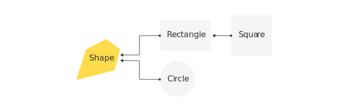

# Наследование

На прошлых уроках мы познакомились с основами объектно-ориентированного программирования. Научились определять классы и создавать объекты. Узнали о том, что хорошо продуманный набор методов (иначе говоря, **интерфейс**) позволяет добиться **инкапсуляции** (т. е. скрытия информации о внутреннем устройстве объекта) и **полиморфизма** (т. е. возможности писать код, работающий одинаково с разными классами).

Часто бывает так, что классы в программе имеют не только общий интерфейс, но и похожую реализацию. Для примера рассмотрим
несколько классов, представляющих геометрические фигуры: круг(`Circle`) и прямоугольник (`Rectangle`). Пусть интерфейс этих классов пока
состоит из единственного метода `area()`, возвращающего площадь фигуры.

```python
from math import pi
             
class Circle:
    def __init__(self, radius):
        self.r = radius

            
    def area(self):
        return pi * self.r ** 2

 
class Rectangle:
    def __init__(self, a, b):
        self.a = a
        self.b = b

            
    def area(self):
        return self.a * self.b
```

Допустим, теперь нам нужно реализовать класс для квадрата (`Square`). Конечно, мы можем сделать это непосредственно:

```python
class Square:
    def __init__(self, a):
	    self.a = a
	
    def area(self):
    	return self.a * self.a
```

Но мы знаем, что квадрат — частный случай прямоугольника, у которого ширина равна высоте. Чем нам это может помочь?

Представьте, что мы хотим добавить в интерфейс наших классов еще один метод `perimeter()` для вычисления периметра. Сейчас нам нужно добавить его во все три класса, но это лишняя работа — ведь периметр квадрата вычисляется так же, как и периметр прямоугольника. А любая лишняя работа не только отнимает время у программиста, но и увеличивает вероятность допустить ошибку. Конечно, вы вряд ли ошибетесь в написании метода `perimeter()` для квадрата (ведь это займет одну строку), но в реальности методы классов могут занимать десятки, иногда даже сотни строк, а логика работы этих методов гораздо сложнее.

Резюмируем наши наблюдения:
-Класс `Square` является частным случаем класса `Rectangle`
- Если бы имелся способ явно запрограммировать это отношение, код получился более коротким и, что важно, согласованным ли периметр прямоугольника вычисляется правильно,	периметр квадрата автоматически вычисляется правильно)

Такой способ, конечно, существует, он называется **«наследование»**.

**Наследование** — механизм, позволяющий запрограммировать отношение вида «класс B является частным случаем класса A». В этом случае класс `A` также называется **базовым** классом, а `B` — **производным** классом.

Наследование является способом переиспользования кода между классами без необходимости нарушения инкапсуляции. Это достигается за счет того, что производный класс может пользоваться атрибутами и методами базового класса (иными словами, производный класс наследует атрибуты и методы базового класса).

Наследование — важная концепция объектно-ориентированного программирования наряду с инкапсуляцией и полиморфизмом.

## Иерархия классов

Используя отношение «частный случай», можно строить иерархии классов. Добавим к нашим классам еще один, представляющий произвольную геометрическую фигуру (`Shape`):

```python
class Shape:
    pass
```
Тогда иерархия классов будет выглядеть так:



Чтобы наследовать класс `B` от класса `A` (то есть запрограммировать отношение «класс `B` является частным случаем класса `A`»), нужно написать так:

```python
class A:
    pass


class B(A):
    pass
```

## Механизм наследования

**Вопрос**: Что происходит, когда класс `B` наследуется от класса `A` (т. е. когда мы пишем class `B(A)`)?

**Ответ**: Меняется процедура поиска методов и атрибутов в классе `B`.

Мы знаем, что у «простого» объекта (который ни от кого не наследуется, а вернее, наследуется от `object`) нельзя вызвать несуществующий метод или прочитать несуществующий атрибут:

```python
class C:
    def foo(self):
        print('foo')
 
 
c = C()
c.foo()  # ok
c.bar()  # error
```

```bash
foo				
------------------------------------------------------------------
AttributeError Traceback (most recent call last)
    <ipython-input-4-de63cbd4e47c> in <module>()
        6 c = C()
        7 c.foo()  # ok
        ----> 8 c.bar()  # not ok
        
    AttributeError: 'C' object has no attribute 'bar'
```

Если класс наследован от другого класса, проверка существования метода (или атрибута) осуществляется так:

- Сперва метод ищется в исходном (производном) классе
- Если его там нет, он ищется в базовом классе 
- Предыдущие шаги повторяются до тех пор, пока метод не будет найден или пока процедура не дойдет до класса, который ни от кого не наследуется

А это означает, что производному классу доступны не только собственные методы, но и методы базового класса. В этом случае говорят, что производный класс наследует методы базового класса.

```python
class BaseC:
    def bar(self):
        print('bar')
 
 
class C(BaseC):
    def foo(self):
        print('foo')


c = C()  
c.foo()  # ok -- этот метод есть в производном классе
c.bar()  # ok -- этот метод есть в базовом классе
c.baz()  # error -- этого метода нет ни в производном, ни в базовом классе
```

Как видим, в производные классы можно не только добавлять новые методы, но и пользоваться методами базового класса. В этом и состоит польза наследования методов: оно позволяет обойтись без дублирования кода и при этом не нарушает инкапсуляцию.

## Наследование на примере геометрических фигур

Рассмотрим механизм наследования подробнее на примере нашей иерархии геометрических фигур.

Для начала исследуем, как производные классы могут пользоваться методами базового класса. Для этого реализуем в классе `Shape` метод `describe`, который будет печатать название собственного класса:

```python
class Shape:
    def describe(self):
        # Атрибут __class__ содержит класс или тип объекта self
        # Атрибут __name__ содержит строку в которой написано название класса или типа
        print("Класс: {}".format(self.__class__.__name__))
```
Отнаследуем от `Shape` классы `Circle` и `Rectangle` и убедимся, что метод `describe` работает и для них тоже:

```python
from math import pi
 
class Circle(Shape):
    def __init__(self, radius):
        self.r = radius


    def area(self):
        return pi * self.r ** 2

 
class Rectangle(Shape):
    def __init__(self, a, b):
        self.a = a
        self.b = b


    def area(self):
        return self.a * self.b


shape = Shape()
shape.describe()
 
circle = Circle(1)
circle.describe()
 
rectangle = Rectangle(1, 2)
rectangle.describe()
```

```bash
Класс: Shape
Класс: Circle
Класс: Rectangle
```

Теперь рассмотрим, как добавить в производный класс новый метод, которого нет в базовом классе.

Добавим в класс `Circle` метод square, который решает знаменитую задачу квадратуры круга: возвращает квадрат (в нашем случае — объект `Rectangle` с равными сторонами), который по площади равен площади исходного круга.

Математики много столетий бились над задачей квадратуры круга и в итоге доказали, что такое построение нельзя выполнить с помощью циркуля и линейки.

Зато это можно сделать с помощью Python:

```python
class Circle(Shape):
    def __init__(self, radius):
        self.r = radius


    def area(self):
        return pi * self.r ** 2

 
    def square(self):
        side = pi ** 0.5 * self.r
        return Rectangle(side, side)


circle = Circle(1)
square = circle.square()
 
print("Площадь круга:    {}".format(circle.area()))
print("Площадь квадрата: {}".format(square.area()))
print("Радиус круга: {}".format(circle.r))
print("Длина стороны квадрата: {}".format(square.a))
```