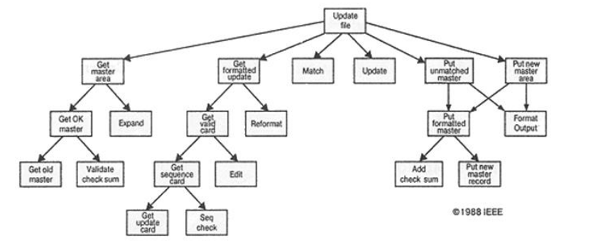
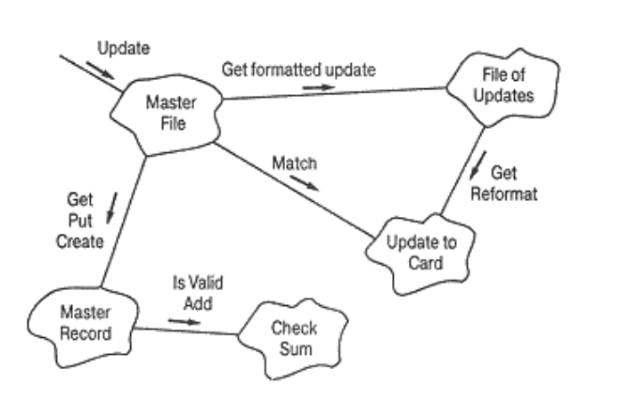
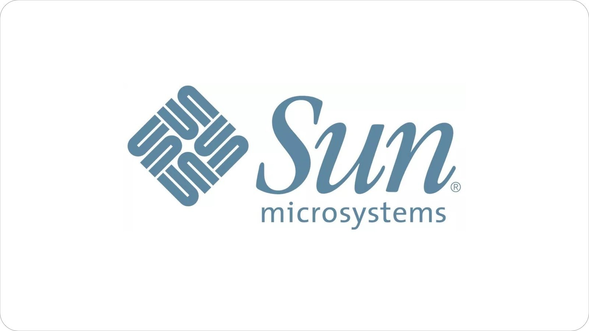

# Введение

## Сложность разработки программного обеспечения

Мы окружены сложными системами:
- персональный компьютер;
- любое дерево, цветок, животное;
- любая материя –от атома до звезд и галактик;
- общественные институты –корпорации и сообщества

Большинство сложных систем обладает **иерархической** структурой. Но не все ПО – сложное. Существует класс приложений которые проектируются, разрабатывается и используются одним и тем же человеком. Но они имеют ограниченную область применения. Вопросы сложности появляются при разработке корпоративного ПО, промышленного программирования.

Сложность ПО вызывается четырьмя основными причинами:
- сложностью реальной предметной области, из которой исходит заказ на разработку;
- трудностью управления проектированием;
- необходимостью обеспечить достаточную гибкость программы;
- сложность описания поведения больших дискретных систем.

## Неструктурированное программирование

До середины 1960-х гг. преимущественно использовалась **неструктурированная**, “**стихийная**” технология
программирования. Структура первых простейших программ состояла собственно из программы, написанной на машинном языке (в двоичных или шестнадцатеричных кодах) и обрабатываемых ею данных.

Появление **машинно-ориентированных языков (ассемблеров)** позволило программиста вместо кодов использовать мнемонические обозначения кодов операций и символические имена данных. Программы стали “**читаемыми**”.

Появление языков программирования высокого уровня (**FORTRAN**, **ALGOL**) позволило снизить уровень детализации операций. Большим достижением этих языков стала возможность использования **подпрограмм**. Появилась возможность совместной разработки ПО несколькими программистами.

Были созданы большие библиотеки различных подпрограмм. Теперь структура программы состояла из основной программы, области глобальных данных и набора подпрограмм. Недостаток такой структуры - возрастание вероятности искажения части глобальных данных какой-либо подпрограммой при увеличении количества подпрограмм. Для сокращения таких ошибок было предложено размещать в подпрограммах локальные данные.

Проблемы неструктурированного, “**стихийного**” программирования - метод программирования **“снизу-вверх”**, т.е. сначала разрабатывались простые подпрограммы, а затем строилась сложная программа путем их сборки.

При сборке программы появлялось большое количество ошибок согласования, а при их исправлении появлялись новые ошибки. Процесс тестирования и отладки занимал 80% времени разработки ПО. Стоимость аппаратных средств снижалась, а стоимость разработки ПО все время росла из-за того, что создавались все более мощные и сложные прикладные программы при отставании технологии их разработки.

Было разработано много языков, но лишь некоторые из них получили тогда широкое применение (FORTRAN, ALGOL, COBOL). Продолжающийся рост стоимости больших программных продуктов в 1960-х гг. и их ненадежность привели к большим исследовательским работам в области создания технологий программирования.

## Процедурное и модульное программирование

В результате исследовательских работ 1960-1970-х гг. была разработана технология процедурного (или структурного, модульного) программирования, внесшая ясность в написание программ, простоту тестирования и отладки, легкость модификации. По сравнению со стихийным программированием технология процедурного программирования - это дисциплинированный подход к написанию программ.

Процедурное программирование основано на модели построения программы как иерархии процедур, что и дало название данной технологии.

Для изучения процедурного программирования в 1971 г. **Н. Виртом** был создан язык программирования Pascal, нашедший большое применение в университетах. На протяжении 1970-х гг. создавался язык **C** на базе концепции предшествующих двух языков - **BCPL** и **В**, разработанных для написания компиляторов и операционных систем.

Язык **С** получил широкую популярность в результате его использования в разработке операционной системы UNIX. В конце 1970-х гг. был создан “классический” язык **С** Б. Кернигана и Д. Ритчи. На этом языке были написаны фактически все новые операционные системы и системные программные продукты.

### Основные приемы процедурного программирования

**Метод декомпозиции** (нисходящего проектирования), т.е. разделение программы на процедуры простейшей структуры и представление программы в виде иерархии процедур;

**Пример алгоритмической декомпозиции**

**Пример объектно-ориентированной декомпозиции**

**Метод модульной организации**, т.е. группировка процедур и обрабатываемых ими данных в модули, которые программируются и компилируются отдельно. Преимущества данного метода заключаются в параллельной работе программистов, удобстве программирования, возможности создания библиотек;

**Метод структурного программирования** процедур, который заключается в следующем:

- разделение процедур на вложенные блоки, что позволяет локализовать переменные и операторы их обработки, структурировать процедуру;
- использование операторов ветвления и циклов, осуществляющих передачу управления только сверху - вниз, что приводит к ясности алгоритма, к облегчению программирования и сопровождения программ; операторы безусловной передачи управления `goto` использовать не рекомендуется;
- форматирование текста процедуры, т.е. использование отступов для отображения вложенности блоков, применение идентификаторов, несущих смысл, и использование комментариев, что приводит к повышению читаемости программ и к облегчению их сопровождения.

Наиболее известными процедурными языками программирования являются PL1, ALGOL-68, Pascal, С, С++.

## Объектно-ориентированное программирование

Применение информационных систем в экономике и управлении привело к появлению больших по объему программ. Область применения программного обеспечения постоянно расширялась, процессы управления, подлежащие автоматизации, усложнялись.

Структурный подход к программированию не позволял адекватно моделировать сложную предметную область. Проблема сложности программного обеспечения решалась путем дробления программы на отдельные процедуры и уменьшения их размера для удобства работы и повышения читабельности программы.

При таком подходе трудно описать реальные объекты предметной области во всем их многообразии, их поведение и взаимосвязи между ними. Все вышесказанное привело к появлению нового, объектно-ориентированного, подхода к программированию (ООП).

В начале 1980-х гг. **Б. Страуструп** разработал язык **С++**, ставший первым промышленно используемым языком, использующим объектно-ориентированный подхода к программированию. Язык **С++** был построен на базе двух языков- **С** и **Simula 67**, языка программного моделирования, разработанного в Европе.

К этому моменту имелись и другие объектно-ориентированные языки, наиболее известным из которых был **Smalltalk**, являющийся чистым объектно-ориентированным языком. Однако ни один из них не нашел такого широкого применения, как **С++**.

В 1991 г. нидерландским программистом **Гвидо ван Россумом** был разработан язык программирования **Python**, включающий в себя как процедурные, так и объектно-ориентированные возможности.

В 1995 г. фирмой **Sun Microsystems** был разработан на основе языков **С** и **С++** новый язык **Jаvа**, используемый для создания интерактивных Wеb-страниц и в разработке приложений на базе Internet и Intranet, а также для реализации ПО устройств, взаимодействующих по сети. Объектный подход к программированию использован в новых версиях языков программирования **Pascal**, **С++**, **Modula**, **Java**

## Ключевым понятием ООП является понятие объекта

Объекты являются **программными компонентами**, моделирующими элементы реального мира. Каждый объект характеризуется своим **состоянием** и **поведением**. Состояние объекта определяется совокупностью его **свойств (атрибутов)** и их **текущими значениями**.

Поведение определяет взаимодействие объекта с другими объектами: то, как он воздействует на другие объекты, и как другие объекты воздействуют на него. Поведение объекта обычно приводит к изменению состояния его и других объектов: изменяются значения их свойств. Действия, которые могут выполняться объектом,
называются **методами**.

Однотипные объекты объединяются в **классы**.

**Класс**- это совокупность объектов, имеющих одинаковые свойства и методы.

## Основные принципы ООП

### Абстракция

**Абстракция** в ООП позволяет составить из данных и алгоритмов обработки этих данных объекты, отвлекаясь от несущественных (на некотором уровне) с точки зрения составленной информационной модели деталей.

Таким образом, программа подвергается **декомпозиции** на части "дозированной" сложности. Отдельный объект, даже вместе с совокупностью его связей с другими объектами, человеком воспринимается легче (именно так он привык оперировать в реальном мире), чем что-то неструктурированное и монотонное.

Перед тем как начать написание даже самой простенькой объектно-ориентированной программы, необходимо провести анализ предметной области, для того чтобы выявить в ней классы объектов.

При выделении объектов необходимо абстрагироваться (отвлечься) от большинства присущих им свойств и сконцентрироваться на свойствах, значимых для задачи.

Выделяемые объекты необязательно должны походить на физические объекты - ведь это абстракции, за которыми скрываются процессы, взаимодействия, отношения.

Удачная декомпозиция стоит многого. От нее зависят не только количественные характеристики кода (быстродействие, занимаемая память), но и трудоемкость дальнейшего развития и сопровождения.

При отсутствии соответствующего опыта лучше не загадывать будущих путей развития программы, а делать ее как можно проще, под конкретную задачу.

Даже если просто перечислить все существительные, встретившиеся в описании задачи (явно или неявно), получится неплохой список кандидатов в классы.

При процедурном подходе тоже используется декомпозиция, но при объектно-ориентированном подходе производится декомпозиция не самого алгоритма на более мелкие части, а предметной области на классы объектов.

### Инкапсуляция

**Инкапсуляция** означает, что каждый объект полностью описывается совокупностью своих свойств и методов. Инкапсуляция позволяет скрыть внутреннюю организацию объекта, не влияющую на его внешнее поведение.

Таким образом, инкапсуляция позволяет в максимальной степени изолировать объект от внешнего окружения. Основной единицей инкапсуляции в ООП является класс. Класс описывает данные, определяющие состояние объекта, и функции, определяющие поведение объекта. Инкапсуляция обеспечивает сокрытие элементов-данных и элементов-функций (в классе с управлением доступом к ним).

Кроме того, инкапсуляция дает возможность определения правил доступа к элементам объекта класса. Атрибуты доступа **private**, **protected**, **public** объявляют элементы класса соответственно закрытыми, защищенными и открытыми для доступа.

Инкапсуляция упрощает создание и сопровождение больших программ, так как инкапсулированные в объекте функции обмениваются с программой сравнительно небольшими объемами данных. В результате замена или модификация данных и методов, инкапсулированных в объект, как правило, не влечет за собой существенной модификации всей программы в целом.

### Наследование

**Наследование** позволяет создавать новые классы на основе существующих. При этом производный класс наследует данные и функции базового класса. Кроме того, производный класс может добавлять новые данные, а также дополнять или модифицировать функции базового класса.

Принцип наследования придает ООП значительную гибкость. При работе с объектами обычно подбирается объект, наиболее близкий по своим свойствам для решения конкретной задачи, и на его основе создаются потомки, обладающие дополнительными свойствами и методами.

### Полиморфизм

**Полиморфизм** означает способность объектов (экземпляров) классов, связанных наследованием, реагировать различным образом на одно и то же сообщение (вызов функции класса).
Различают несколько видов полиморфизма:
- общий полиморфизм (перегрузка операций, преобразование типов, перегрузка функций);
- чистый полиморфизм (виртуальные функции, абстрактные классы);
- аметрический полиморфизм.

**Перегрузка операций** - это переопределение действий операций применительно к объектам конкретных классов. Преобразование типов данных при совместном их использовании тоже является одним из методов полиморфизма.
**Перегрузка функции** - это использование одинакового имени для функций, выполняющих похожие действия, но с разными типами данных, и объявленных в одной области действия.
**Виртуальная функция** - это элемент-функция базового класса в иерархии наследования, переопределенная в производных классах и вызываемая в зависимости от класса объекта, адресуемого через указатель или ссылку на базовый класс.
**Параметрический полиморфизм** - это механизм использования обобщенного определения функции или класса (шаблона) для автоматической генерации новых функций или классов для различных типов данных.

Преимущества полиморфизма проявляются в следующем:
- облегчение программирования сложных систем за счет возможности называть похожие (различающиеся только типами своих параметров) действия одним именем;
- обеспечение виртуальными функциями чистого полиморфизма, т.е. возможности использовать один и тот же оператор для вызова множества функций. При этом конкретная функция определяется по типу вызываемого объекта;
- механизм виртуальных функций - это возможность написания простых функций общего назначения для иерархии классов;
- обеспечение компактности программ и расширяемости иерархии классов за счет использования виртуальных функций;
- автоматическая генерация по обобщенному шаблону новых функций или классов для различных типов данных, реализуемая механизмом параметрического полиморфизма
- возможность более адекватного моделирования предметной области и, соответственно, программирования в понятиях, максимально приближенных к предметной области;
- многократное использование написанного кода;
- сокращение времени разработки и отладки программ.

## Недостатки ООП

- Значительная глубина абстракции может привести к созданию “многослойных” приложений, где выполнение объектом требуемого действия сводится к множеству обращений к объектам более низкого уровня, что сказывается на производительности системы.
- Инкапсуляция снижает скорость доступа к данным. Запрет на прямой доступ к полям класса извне приводит к необходимости создания и использования методов доступа, что ведет к дополнительным расходам.
- Код, относящийся к классам-потомкам может находиться не только в этих классах, но и в их классах-предках. Это приводит к снижению скорости трансляции и выполнения программы.
- Обеспечение полиморфизма приводит к необходимости связывать методы, вызываемые программой не на этапе компиляции, а в процессе исполнения программы, на что тратится дополнительное время.

### Дополнительные материалы
- [Роберт Мартин. Чистый код](https://disk.yandex.ru/i/bNCJ2Obgcqn8tQ).
- [Роберт Мартин. Чистая архитектура](https://disk.yandex.ru/i/s7utSfn-lCgfXg).
